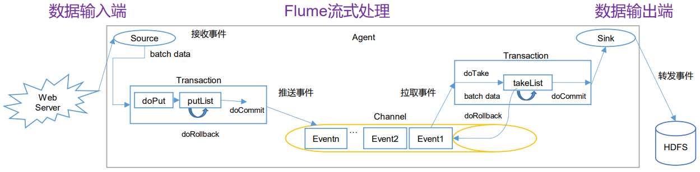
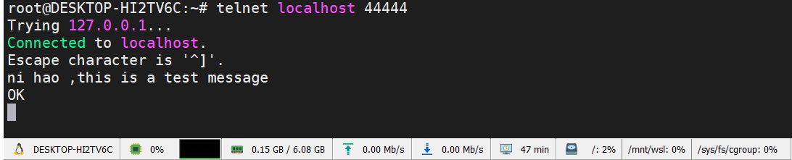
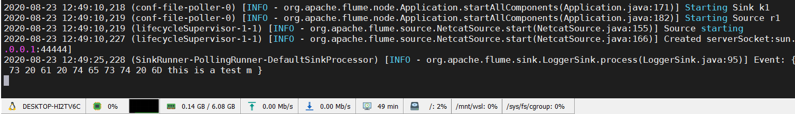

::: tip

Flume 是一个分布式、可靠、和高可用的海量日志聚合的系统，支持在系统中定制各类数据发送方，通过**监控整个文件目录或者某一个特定文件，用于收集数据**；同时Flume也 提供数据写到各种数据接受方(可定制)的能力，**用于转发数据**。Flume 的易用性在于通过读取配置文件，可以自动收集日志文件，在大数据处理及各种复杂的情况下，flume 经常被用来作为数据处理的工具。

:::

<!-- more -->

## 工作流程



<!-- more -->

## 安装启动

1. 命令或下载压缩包安装；

2. 添加环境变量：

   复制一份`conf/flume.env.sh.template`取消`.template`后缀，在里面添加系统`JAVA_HOME`环境变量；

   在系统环境变量里添加`${FLUME_HOME}=flume安装目录`，再把bin目录添加到`$FLUME_HOME/bin:$PATH`;

3. 刷新环境变量，输入`flume-ng version`能看到版本号相关信息即安装成功；

4. flume启动命令解析

```shell
# 完整命令
nohup flume-ng agent --name agent --conf $FLUME_HOME/conf --conf-file $FLUME_HOME/conf/kafka.properties -Dflume.root.logger=INFO,console &

# 分布解析
flume-ng agent
--name a1         					 				 # 配置文件中设置的a1  a1.sources = r1
-conf $FLUME_HOME/conf   							 # 配置文件的路径
--confi-file $FLUME_HOME/conf/demo.properties		 # 指定配置文件
-Dflume.root.logger=INFO,console					 # 指令启动后控制台输入日志，后台启动可以不加此命令
```

## 参数配置详解

### 核心概念

| Flume组件   | 介绍                                                         | 理解               |
| ----------- | ------------------------------------------------------------ | ------------------ |
| **source**  | 采集日志数据，将采集到的日志数据传输给channel                | 数据来源的地方     |
| **channel** | 一个队列，存储source传递过来的数据                           | 数据传输的管道     |
| **sink**    | 从channel中获取数据，将数据输出到目标位置（HDFS、HBase、Source） | 数据要传送到那里去 |
| **Event**   | 传输数据的单元，Flume中采集数据并传输的最小单位              | 数据传输的单位     |

### Sources

Flume中常用的Source有**NetCat，Avro，Exec，Spooling Directory，Taildir**，也可以根据业务场景的需要自定义Source,具体介绍如下。

| Sources                | 使用场景                                                     |
| ---------------------- | ------------------------------------------------------------ |
| **NetCat**             | NetCat Source可以使用TCP和UDP两种协议方式，使用方法基本相同，通过**监听指定的IP和端口来传输数据**，它会将监听到的每一行数据转化成一个Event写入到Channel中。（必须参数以@标示，下类同） |
| **Avro**               | 不同主机上的Agent通过网络传输数据可使用的Source，一般是接受Avro client的数据，或和是上一级Agent的Avro Sink成对存在。 |
| **Exec**               | Exec source通过执行给定的Unix命令的传输结果数据，如cat，tail -F等，实时性比较高，但是一旦Agent进程出现问题，可能会导致数据的丢失。 |
| **Spooling Directory** | 通过监控一个文件夹将新增文件内容转换成Event传输数据，特点是不会丢失数据，使用Spooling Directory Source需要注意的两点是: <br />1)不能对被监控的文件夹下的新增的文件做出任何更改<br />2）新增到监控文件夹的文件名称必须是唯一的。由于是对整个新增文件的监控，<br />Spooling Directory Source的实时性相对较低，不过可以采用对文件高粒度分割达到近似实时。 |
| **Taildir**            | 可以实时的监控指定一个或多个文件中的新增内容，由于该方式将数据的偏移量保存在一个指定的json文件中，即使在Agent挂掉或被kill也不会有数据的丢失，需要注意的是，该Source不能在Windows上使用。 |

::: details NetCat Source 参数详情

| Property Name   | Default        | Description                           |
| --------------- | -------------- | ------------------------------------- |
| channels@       | –              |                                       |
| type@           | –              | 类型指定为：netcat                    |
| bind@           | –              | 绑定机器名或IP地址                    |
| port@           | –              | 端口号                                |
| max-line-length | 512            | 一行的最大字节数                      |
| ack-every-event | true           | 对成功接受的Event返回OK               |
| selector.type   | replicating    | 选择器类型replicating or multiplexing |
| selector.*      | 选择器相关参数 |                                       |
| interceptors    | –              | 拦截器列表，多个以空格分隔            |
| interceptors.*  | 拦截器相关参数 |                                       |

:::

::: details Avro Srource 参数详情

| Property Name    | Default | Description                                               |
| ---------------- | ------- | --------------------------------------------------------- |
| channels@        | –       |                                                           |
| type@            | –       | 类型指定为：avro                                          |
| bind@            | –       | 监听的主机名或IP地址                                      |
| port@            | –       | 端口号                                                    |
| threads          | –       | 传输可使用的最大线程数                                    |
| selector.type    |         |                                                           |
| selector.*       |         |                                                           |
| interceptors     | –       | 拦截器列表                                                |
| interceptors.*   |         |                                                           |
| compression-type | none    | 可设置为“none” 或 “deflate”. 压缩类型需要和AvroSource匹配 |

:::

::: details Exc Source 参数详情

| Property Name   | Default     | Description                           |
| --------------- | ----------- | ------------------------------------- |
| channels@       | –           |                                       |
| type@           | –           | 类型指定为：exec                      |
| command@        | –           | 需要去执行的命令                      |
| shell           | –           | 运行命令的shell脚本文件               |
| restartThrottle | 10000       | 尝试重启的超时时间                    |
| restart         | false       | 如果命令执行失败，是否重启            |
| logStdErr       | false       | 是否记录错误日志                      |
| batchSize       | 20          | 批次写入channel的最大日志数量         |
| batchTimeout    | 3000        | 批次写入数据的最大等待时间（毫秒）    |
| selector.type   | replicating | 选择器类型replicating or multiplexing |
| selector.*      |             | 选择器其他参数                        |
| interceptors    | –           | 拦截器列表，多个空格分隔              |
| interceptors.*  |             |                                       |

:::

::: details Spooling Directory Source 参数详情

| Property Name     | Default     | Description                                                  |
| ----------------- | ----------- | ------------------------------------------------------------ |
| channels@         | –           |                                                              |
| type@             | –           | 类型指定：spooldir.                                          |
| spoolDir@         | –           | 被监控的文件夹目录                                           |
| fileSuffix        | .COMPLETED  | 完成数据传输的文件后缀标志                                   |
| deletePolicy      | never       | 删除已经完成数据传输的文件时间：never or immediate           |
| fileHeader        | false       | 是否在header中添加文件的完整路径信息                         |
| fileHeaderKey     | file        | 如果header中添加文件的完整路径信息时key的名称                |
| basenameHeader    | false       | 是否在header中添加文件的基本名称信息                         |
| basenameHeaderKey | basename    | 如果header中添加文件的基本名称信息时key的名称                |
| includePattern    | ^.*$        | 使用正则来匹配新增文件需要被传输数据的文件                   |
| ignorePattern     | ^$          | 使用正则来忽略新增的文件                                     |
| trackerDir        | .flumespool | 存储元数据信息目录                                           |
| consumeOrder      | oldest      | 文件消费顺序：oldest, youngest and random.                   |
| maxBackoff        | 4000        | 如果channel容量不足，尝试写入的超时时间，如果仍然不能写入，则会抛出ChannelException |
| batchSize         | 100         | 批次处理粒度                                                 |
| inputCharset      | UTF-8       | 输入码表格式                                                 |
| decodeErrorPolicy | FAIL        | 遇到不可解码字符后的处理方式：FAIL，REPLACE，IGNORE          |
| selector.type     | replicating | 选择器类型：replicating or multiplexing                      |
| selector.*        |             | 选择器其他参数                                               |
| interceptors      | –           | 拦截器列表，空格分隔                                         |
| interceptors.*    |             |                                                              |

:::

::: details Taildir  Source 参数详情

| Property Name    | Default                        | Description                                         |
| ---------------- | ------------------------------ | --------------------------------------------------- |
| channels@        | –                              |                                                     |
| type@            | –                              | 指定类型：TAILDIR.                                  |
| filegroups@      | –                              | 文件组的名称，多个空格分隔                          |
| filegroups.@     | –                              | 被监控文件的绝对路径                                |
| positionFile     | ~/.flume/taildir_position.json | 存储数据偏移量路径                                  |
| headers..        | –                              | Header key的名称                                    |
| byteOffsetHeader | false                          | 是否添加字节偏移量到key为‘byteoffset’值中           |
| skipToEnd        | false                          | 当偏移量不能写入到文件时是否跳到文件结尾            |
| idleTimeout      | 120000                         | 关闭没有新增内容的文件超时时间（毫秒）              |
| writePosInterval | 3000                           | 在positionfile 写入每一个文件lastposition的时间间隔 |
| batchSize        | 100                            | 批次处理行数                                        |
| fileHeader       | false                          | 是否添加header存储文件绝对路径                      |
| fileHeaderKey    | file                           | fileHeader启用时，使用的key                         |

:::

### Channels

官网提供的Channel有多种类型可供选择，这里介绍**Memory Channel**和**File Channel**。

::: details Memory Channel 参数详解

Memory Channel是使用内存来存储Event，使用内存的意味着数据传输速率会很快，但是当Agent挂掉后，存储在Channel中的数据将会丢失。

| Property Name                | Default         | Description                                            |
| ---------------------------- | --------------- | ------------------------------------------------------ |
| type@                        | –               | 类型指定为：memory                                     |
| capacity                     | 100             | 存储在channel中的最大容量                              |
| transactionCapacity          | 100             | 从一个source中去或者给一个sink，每个事务中最大的事件数 |
| keep-alive                   | 3               | 对于添加或者删除一个事件的超时的秒钟                   |
| byteCapacityBufferPercentage | 20              | 定义缓存百分比                                         |
| byteCapacity                 | see description | Channel中允许存储的最大字节总数                        |

:::

::: details File Channel 参数详解

File Channel使用磁盘来存储Event，速率相对于Memory Channel较慢，但数据不会丢失。

|                      |                                  |                                                     |
| -------------------- | -------------------------------- | --------------------------------------------------- |
| Property Name        | Default                          | Description                                         |
| type@                | –                                | 类型指定：file.                                     |
| checkpointDir        | ~/.flume/file-channel/checkpoint | checkpoint目录                                      |
| useDualCheckpoints   | false                            | 备份checkpoint，为True，backupCheckpointDir必须设置 |
| backupCheckpointDir  | –                                | 备份checkpoint目录                                  |
| dataDirs             | ~/.flume/file-channel/data       | 数据存储所在的目录设置                              |
| transactionCapacity  | 10000                            | Event存储最大值                                     |
| checkpointInterval   | 30000                            | checkpoint间隔时间                                  |
| maxFileSize          | 2146435071                       | 单一日志最大设置字节数                              |
| minimumRequiredSpace | 524288000                        | 最小的请求闲置空间（以字节为单位）                  |
| capacity             | 1000000                          | Channel最大容量                                     |
| keep-alive           | 3                                | 一个存放操作的等待时间值（秒）                      |
| use-log-replay-v1    | false                            | Expert: 使用老的回复逻辑                            |
| use-fast-replay      | false                            | Expert: 回复不需要队列                              |
| checkpointOnClose    | true                             |                                                     |

:::

### Sinks

Flume常用Sinks有**Log Sink，HDFS Sink，Avro Sink，Kafka Sink**，当然也可以自定义Sink。

::: details Log Sink

**Logger Sink**：以INFO 级别的日志记录到log日志中，这种方式通常用于测试。

| Property Name | Default | Description                    |
| ------------- | ------- | ------------------------------ |
| channel@      | –       |                                |
| type＠        | –       | 类型指定：logger               |
| maxBytesToLog | 16      | 能够记录的最大Event Body字节数 |

:::

::: details HDFS Sink

**HDFS Sink**：Sink数据到HDFS，目前支持text 和 sequence files两种文件格式，支持压缩，并可以对数据进行分区，分桶存储。

|                        |              |                                                              |
| ---------------------- | ------------ | ------------------------------------------------------------ |
| Name                   | Default      | Description                                                  |
| channel@               | –            |                                                              |
| type@                  | –            | 指定类型：hdfs                                               |
| hdfs.path@             | –            | HDFS的路径 hdfs://namenode/flume/webdata/                    |
| hdfs.filePrefix        | FlumeData    | 保存数据文件的前缀名                                         |
| hdfs.fileSuffix        | –            | 保存数据文件的后缀名                                         |
| hdfs.inUsePrefix       | –            | 临时写入的文件前缀名                                         |
| hdfs.inUseSuffix       | .tmp         | 临时写入的文件后缀名                                         |
| hdfs.rollInterval      | 30           | 间隔多长将临时文件滚动成最终目标文件，单位：秒， 如果设置成0，则表示不根据时间来滚动文件 |
| hdfs.rollSize          | 1024         | 当临时文件达到多少（单位：bytes）时，滚动成目标文件， 如果设置成0，则表示不根据临时文件大小来滚动文件 |
| hdfs.rollCount         | 10           | 当 events 数据达到该数量时候，将临时文件滚动成目标文件，如果设置成0，则表示不根据events数据来滚动文件 |
| hdfs.idleTimeout       | 0            | 当目前被打开的临时文件在该参数指定的时间（秒）内， 没有任何数据写入，则将该临时文件关闭并重命名成目标文件 |
| hdfs.batchSize         | 100          | 每个批次刷新到 HDFS 上的 events 数量                         |
| hdfs.codeC             | –            | 文件压缩格式，包括：gzip, bzip2, lzo, lzop, snappy           |
| hdfs.fileType          | SequenceFile | 文件格式，包括：SequenceFile, DataStream,CompressedStre， 当使用DataStream时候，文件不会被压缩，不需要设置hdfs.codeC; 当使用CompressedStream时候，必须设置一个正确的hdfs.codeC值； |
| hdfs.maxOpenFiles      | 5000         | 最大允许打开的HDFS文件数，当打开的文件数达到该值，最早打开的文件将会被关闭 |
| hdfs.minBlockReplicas  | –            | HDFS副本数，写入 HDFS 文件块的最小副本数。 该参数会影响文件的滚动配置，一般将该参数配置成1，才可以按照配置正确滚动文件 |
| hdfs.writeFormat       | Writable     | 写 sequence 文件的格式。包含：Text, Writable（默认）         |
| hdfs.callTimeout       | 10000        | 执行HDFS操作的超时时间（单位：毫秒）                         |
| hdfs.threadsPoolSize   | 10           | hdfs sink 启动的操作HDFS的线程数                             |
| hdfs.rollTimerPoolSize | 1            | hdfs sink 启动的根据时间滚动文件的线程数                     |
| hdfs.kerberosPrincipal | –            | HDFS安全认证kerberos配置                                     |
| hdfs.kerberosKeytab    | –            | HDFS安全认证kerberos配置                                     |
| hdfs.proxyUser         |              | 代理用户                                                     |
| hdfs.round             | false        | 是否启用时间上的”舍弃”                                       |
| hdfs.roundValue        | 1            | 时间上进行“舍弃”的值                                         |
| hdfs.roundUnit         | second       | 时间上进行”舍弃”的单位，包含：second,minute,hour             |
| hdfs.timeZone          | Local Time   | 时区。                                                       |
| hdfs.useLocalTimeStamp | false        | 是否使用当地时间                                             |
| hdfs.closeTries 0      | Number       | hdfs sink 关闭文件的尝试次数；如果设置为1，当一次关闭文件失败后，hdfs sink将不会再次尝试关闭文件， 这个未关闭的文件将会一直留在那，并且是打开状态； 设置为0，当一次关闭失败后，hdfs sink会继续尝试下一次关闭，直到成功 |
| hdfs.retryInterval     | 180          | hdfs sink 尝试关闭文件的时间间隔， 如果设置为0，表示不尝试，相当于于将hdfs.closeTries设置成1 |
| serializer             | TEXT         | 序列化类型                                                   |
| serializer.*           |              |                                                              |

:::

::: details Avro Sink

| Property Name         | Default      | Description                                    |
| --------------------- | ------------ | ---------------------------------------------- |
| channel@              | –            |                                                |
| type@                 | –            | 指定类型：avro.                                |
| hostname@             | –            | 主机名或IP                                     |
| port@                 | –            | 端口号                                         |
| batch-size            | 100          | 批次处理Event数                                |
| connect-timeout 20000 | 连接超时时间 |                                                |
| request-timeout       | 20000        | 请求超时时间                                   |
| compression-type      | none         | 压缩类型，“none” or “deflate”.                 |
| compression-level     | 6            | 压缩级别，0表示不压缩，1-9数字越大，压缩比越高 |
| ssl                   | false        | 使用ssl加密                                    |

:::

::: details kafka Sink

传输数据到Kafka中，需要注意的是Flume版本和Kafka版本的兼容性

| Property Name           | Default             | Description                                         |
| ----------------------- | ------------------- | --------------------------------------------------- |
| type                    | –                   | 指定类型：**org.apache.flume.sink.kafka.KafkaSink** |
| kafka.bootstrap.servers | –                   | kafka服务地址   **localhost:9092**                  |
| kafka.topic             | default-flume-topic | kafka Topic                                         |
| flumeBatchSize          | 100                 | 批次写入kafka Event数                               |

:::


## 测试：

### 1. 监控444444端口

复制一份`flume-conf.propertise.template`改名为`demo.propertise`

修改文件内容为：

```properties
# example.conf: A single-node Flume configuration

# Name the components on this agent
a1.sources = r1
a1.sinks = k1
a1.channels = c1

# Describe/configure the source
a1.sources.r1.type = netcat
a1.sources.r1.bind = localhost
a1.sources.r1.port = 44444

# Describe the sink
a1.sinks.k1.type = logger

# Use a channel which buffers events in memory
a1.channels.c1.type = memory
a1.channels.c1.capacity = 1000
a1.channels.c1.transactionCapacity = 100

# Bind the source and sink to the channel
a1.sources.r1.channels = c1
a1.sinks.k1.channel = c1
```

命令行输入一下文本，用于监听44444端口的信息，格式可以看之前的指令介绍

```shell
flume-ng agent --name a1 --conf $FLUME_HOME/conf --conf-file $FLUME_HOME/conf/demo.properties -Dflume.root.logger=INFO,console
```

新开一个终端窗口，telnet localhost 44444端口，输入信息，即可在之前的控制台看到监控到的打印信息





### 2. 监控日志文本

只需要conf配置文件中的配置改一下即可，参考前面的 **source**配置，修改以下几行：

```properties
a1.sources.s1.type=exec
# 获取数据来源的地方设为日志
a1.sources.s1.command=tail -F /opt/app/applog/kafka.log
a1.sources.s1.channels=c1
```

用之前的启动命令，如果是新建立的一个配置文件，启动命令对应修改即可。启动后在`kafka.log`中输入数据，控制台会做出相应的打印。

### 3. flume+kafka

主要模拟流程，flume获取`kafka.log`s数据，发送到kafka

新建一个`kafkap.properties`文件，内容如下：主要是修改了`sink`的相关配置，将数据传送到kafka去

```properties
agent.sources = s1
agent.channels = c1
agent.sinks = k1

# sources
agent.sources.s1.type=exec
agent.sources.s1.command=tail -F /opt/app/applog/kafka.log
agent.sources.s1.channels=c1

# channels
agent.channels.c1.type=memory
agent.channels.c1.capacity=10000
agent.channels.c1.transactionCapacity=100

# sinks
agent.sinks.k1.type= org.apache.flume.sink.kafka.KafkaSink
agent.sinks.k1.brokerList=127.0.0.1:9092
agent.sinks.k1.topic=kafkatest
agent.sinks.k1.serializer.class=kafka.serializer.StringEncoder
agent.sinks.k1.channel=c1
```

* 启动`zookeeper`，jps后台进程显示为`QuorumPeerMain`即成功

> nohup bin/zookeeper-server-start.sh config/zk.properties &

* 启动`kafka`，jps后台进程显示为`kafka`及成功

> nohup bin/kafka-server-start.sh config/kafka1.properties & 

* 创建一个topic为`kafkatest`的消费者

> bin/kafka-console-consumer.sh --bootstrap-server localhost:9092 --topic kafkatest --from-beginning

* 启动`flume`

> flume-ng agent --name agent --conf $FLUME_HOME/conf --conf-file $FLUME_HOME/conf/kafka.properties

在`kafka.log`文件中写入输入，即可看到`kafkatest`终端的消费

### 4. flume+kafka+spark+inflxdb+grafana

> 启动zookeeper
>
> 启动kafka
>
> 启动flume
>
> 启动sparkt
>
> 提交spark作业
>
> grafana配置inflxdb
>
> 监控面板从influxdb中获取数据实时显示