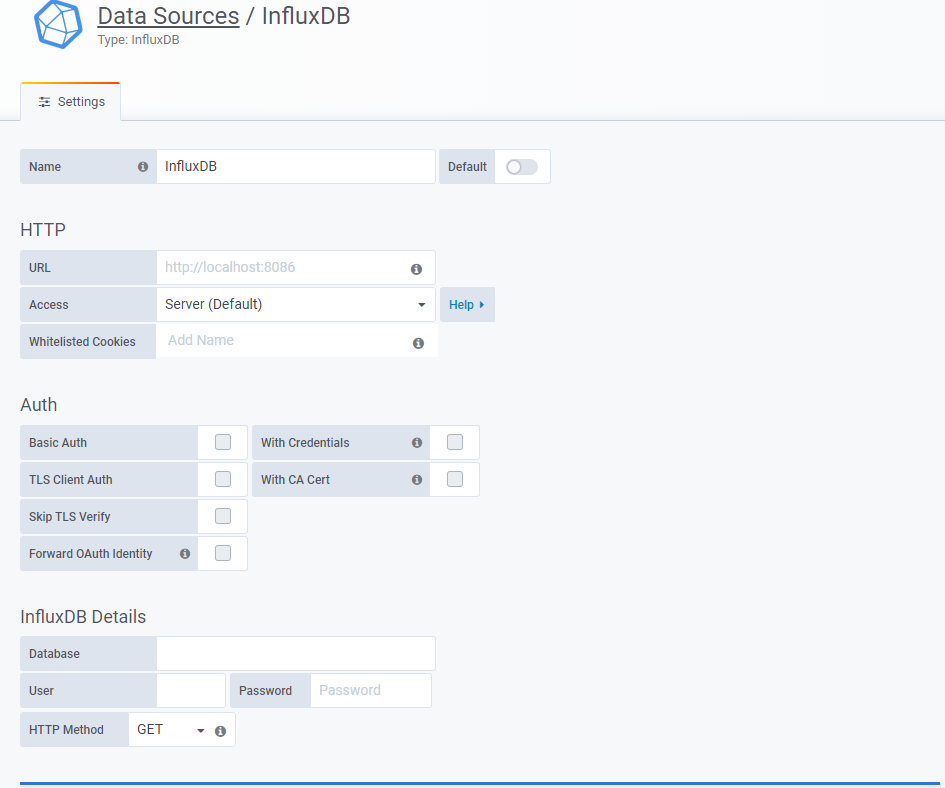
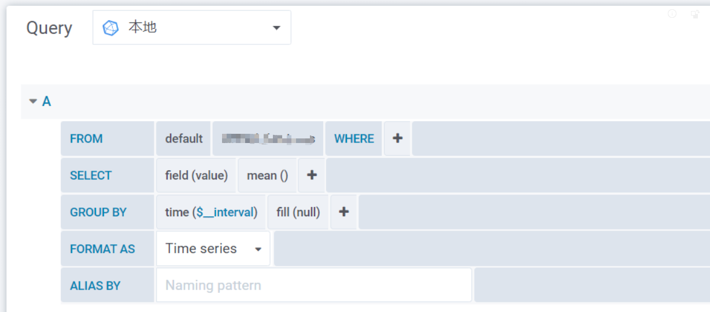
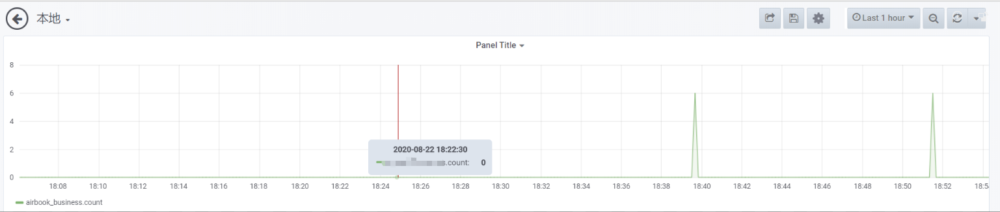

::: tip

Grafana是一个跨平台的开源的度量分析和可视化工具，可以通过将采集的数据查询然后可视化的展示，并及时通知。结合插件，可以快速灵活的展示数据，支持多数据源，混合展示，通知报警等特点。

:::

<!-- more -->

## 安装启动

* [下载安装](https://grafana.com/grafana/download)

* [官方文档](https://grafana.com/docs/grafana/latest/installation/rpm/)

* yum，apt等方式安装，直接`sudo service grafana-server start`启动

* 压缩包安装，添加`安装目录/bin`进环境变量，以配置文件方式启动，默认端口3000

  `nohup grafana-server -homepath="/opt/app/lab/grafana-6.3.2" &`

## 使用

**特点：**

* 展示方式：快速灵活的客户端图表，面板插件有许多不同方式的可视化指标和日志，官方库中具有丰富的仪表盘插件，比如热图、折线图、图表等多种展示方式；

* 数据源：Graphite，InfluxDB，OpenTSDB，Prometheus，Elasticsearch，CloudWatch和KairosDB等；

* 通知提醒：以可视方式定义最重要指标的警报规则，Grafana将不断计算并发送通知，在数据达到阈值时通过Slack、PagerDuty等获得通知；

* 混合展示：在同一图表中混合使用不同的数据源，可以基于每个查询指定数据源，甚至自定义数据源；

* 注释：使用来自不同数据源的丰富事件注释图表，将鼠标悬停在事件上会显示完整的事件元数据和标记；

* 过滤器：Ad-hoc过滤器允许动态创建新的键/值过滤器，这些过滤器会自动应用于使用该数据源的所有查询。

**简单使用：**

* 启动服务，浏览器登陆，默认`localhost:3000`，端口配置可改，默认用户名密码`admin`；

## grafana+inflexDB

在设置中，添加数据源，选择数据库，进行基本的配置即可，



#### Dashboard（面板配置）



#### 主要配置项说明

| 配置项           | 的说明                             |
| :--------------- | :--------------------------------- |
| DataSource       | 选择Grafana已配置的数据源          |
| FROM-Default     | 默认Schema，保持不变即可           |
| FROM-measurement | 对应的InfluxDB的表名               |
| WHERE            | WHERE条件，根据自己需求选择        |
| SELECT-Field     | 对应选的字段，可根据需求增减       |
| SELECT-mean()    | 选择的字段对应的InfluxDB的函数     |
| GroupBY-time()   | 根据时间分组                       |
| GROUPBY-fill()   | 当不存在数据时，以null为默认值填充 |

也可以直接点击后侧的编辑按钮，编写SQL语句即可

往数据库插入数据即可看到变化




## 密码修改

通过`shell`指令全局找`grafana.db`的位置，然后使用`sqlites` 修改密码，`sqlites`命令无法使用的话，根据提示先安装

```shell
# 找grafana.db文件位置
find / -name "grafana.db"

# 查看数据库中包含的表
.tables

# 查询用户表
select * from user;

# 重置admin用户的默认密码为admin
update user set password = '59acf18b94d7eb0694c61e60ce44c110c7a683ac6a8f09580d626f90f4a242000746579358d77dd9e570e83fa24faa88a8a6', salt = 'F3FAxVm33R' where login = 'admin';

#退出sqlite3
.exit
```

