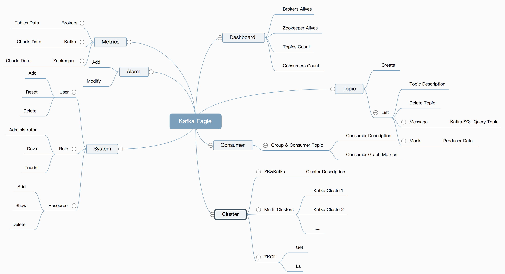

::: tip
 Kafka Eagle简单使用

:::

<!-- more -->

## Kafka Eagle 整体概览图



## 安装启动

* [下载安装](http://download.smartloli.org/)

* [官方文档](http://www.kafka-eagle.org/articles/docs/quickstart/dashboard.html)

* 配置环境变量

* 修改默认配置文件

  ::: details 默认配置文件修改  安装目录/conf

  ```properties
  ######################################
  # 配置多个Kafka集群所对应的Zookeeper
  ######################################
  kafka.eagle.zk.cluster.alias=cluster1,cluster2
  cluster1.zk.list=dn1:2181,dn2:2181,dn3:2181
  cluster2.zk.list=tdn1:2181,tdn2:2181,tdn3:2181
  
  ######################################
  # 设置Zookeeper线程数
  ######################################
  kafka.zk.limit.size=25
  
  ######################################
  # 设置Kafka Eagle浏览器访问端口
  ######################################
  kafka.eagle.webui.port=8048
  
  ######################################
  # 如果你的offsets存储在Kafka中，这里就配置
  # 属性值为kafka，如果是在Zookeeper中，可以
  # 注释该属性。一般情况下，Offsets的也和你消
  # 费者API有关系，如果你使用的Kafka版本为0.10.x
  # 以后的版本，但是，你的消费API使用的是0.8.2.x
  # 时的API，此时消费者依然是在Zookeeper中
  ######################################
  cluster1.kafka.eagle.offset.storage=kafka####################################### 如果你的集群一个是新版本（0.10.x以上），# 一个是老版本（0.8或0.9），可以这样设置，# 如果都是新版本，那么可以将值都设置成kafka######################################cluster2.kafka.eagle.offset.storage=zookeeper
  
  ######################################
  # 是否启动监控图表，默认是不启动的
  ######################################
  kafka.eagle.metrics.charts=false
  
  ######################################
  # 在使用Kafka SQL查询主题时，如果遇到错误，
  # 可以尝试开启这个属性，默认情况下，不开启
  ######################################
  kafka.eagle.sql.fix.error=false
  
  ######################################
  # 邮件服务器设置，用来告警
  ######################################
  kafka.eagle.mail.enable=false
  kafka.eagle.mail.sa=
  kafka.eagle.mail.username=
  kafka.eagle.mail.password=
  kafka.eagle.mail.server.host=
  kafka.eagle.mail.server.port=
  
  ######################################
  # 设置告警用户，多个用户以英文逗号分隔
  ######################################
  kafka.eagle.alert.users=smartloli.org@gmail.com
  
  
  ######################################
  # 超级管理员删除主题的Token
  ######################################
  kafka.eagle.topic.token=keadmin
  
  ######################################
  # 如果启动Kafka SASL协议，开启该属性
  ######################################
  kafka.eagle.sasl.enable=false
  kafka.eagle.sasl.protocol=SASL_PLAINTEXT
  kafka.eagle.sasl.mechanism=PLAIN
  
  ######################################
  # Kafka Eagle默认存储在Sqlite中，如果要使用
  # MySQL可以替换驱动、用户名、密码、连接地址
  # 我下载的新版本默认的使用sqllite不起作用，使用的是mysql
  ######################################
  #kafka.eagle.driver=com.mysql.jdbc.Driver
  #kafka.eagle.url=jdbc:mysql://127.0.0.1:3306/ke?useUnicode=true&characterEncoding=UTF-8&zeroDateTimeBehavior=convertToNull
  #kafka.eagle.username=root
  #kafka.eagle.password=123456
  
  kafka.eagle.driver=org.sqlite.JDBC
  kafka.eagle.url=jdbc:sqlite:/Users/dengjie/workspace/kafka-egale/db/ke.db
  kafka.eagle.username=root
  kafka.eagle.password=root
  ```

    :::

* mysql安装，启动并创建名为`ke`的数据库，导入数据库，新版本的`kafka eagle`已经没有`sql文本了`

  ::: details  导入sql文本

  > use ke
  >
  > source  sql文本路径，导入sql即可

  ```sql
  /*
   Navicat MySQL Data Transfer
  
   Source Server         : local
   Source Server Version : 50616
   Source Host           : localhost
   Source Database       : ke
  
   Target Server Version : 50616
   File Encoding         : utf-8
  
   Date: 06/23/2017 17:02:12 PM
  */
  
  SET NAMES utf8;
  SET FOREIGN_KEY_CHECKS = 0;
  
  -- ----------------------------
  --  Table structure for `ke_p_role`
  -- ----------------------------
  DROP TABLE IF EXISTS `ke_p_role`;
  CREATE TABLE `ke_p_role` (
    `id` tinyint(4) NOT NULL AUTO_INCREMENT,
    `name` varchar(64) CHARACTER SET utf8 NOT NULL COMMENT 'role name',
    `seq` tinyint(4) NOT NULL COMMENT 'rank',
    `description` varchar(128) CHARACTER SET utf8 NOT NULL COMMENT 'role describe',
    PRIMARY KEY (`id`)
  ) ENGINE=InnoDB AUTO_INCREMENT=4 DEFAULT CHARSET=utf8mb4;
  
  -- ----------------------------
  --  Records of `ke_p_role`
  -- ----------------------------
  BEGIN;
  INSERT INTO `ke_p_role` VALUES ('1', 'Administrator', '1', 'Have all permissions'), ('2', 'Devs', '2', 'Own add or delete'), ('3', 'Tourist', '3', 'Only viewer');
  COMMIT;
  
  -- ----------------------------
  --  Table structure for `ke_resources`
  -- ----------------------------
  DROP TABLE IF EXISTS `ke_resources`;
  CREATE TABLE `ke_resources` (
    `resource_id` int(11) NOT NULL AUTO_INCREMENT,
    `name` varchar(255) CHARACTER SET utf8 NOT NULL COMMENT 'resource name',
    `url` varchar(255) NOT NULL,
    `parent_id` int(11) NOT NULL,
    PRIMARY KEY (`resource_id`)
  ) ENGINE=InnoDB AUTO_INCREMENT=17 DEFAULT CHARSET=utf8mb4;
  
  -- ----------------------------
  --  Records of `ke_resources`
  -- ----------------------------
  BEGIN;
  INSERT INTO `ke_resources` VALUES ('1', 'System', '/system', '-1'), ('2', 'User', '/system/user', '1'), ('3', 'Role', '/system/role', '1'), ('4', 'Resource', '/system/resource', '1'), ('5', 'Notice', '/system/notice', '1'), ('6', 'Topic', '/topic', '-1'), ('7', 'Message', '/topic/message', '6'), ('8', 'Create', '/topic/create', '6'), ('9', 'Alarm', '/alarm', '-1'), ('10', 'Add', '/alarm/add', '9'), ('11', 'Modify', '/alarm/modify', '9'), ('12', 'Cluster', '/cluster', '-1'), ('13', 'ZkCli', '/cluster/zkcli', '12'), ('14', 'UserDelete', '/system/user/delete', '1'), ('15', 'UserModify', '/system/user/modify', '1'), ('16', 'Mock', '/topic/mock', '6');
  COMMIT;
  
  -- ----------------------------
  --  Table structure for `ke_role_resource`
  -- ----------------------------
  DROP TABLE IF EXISTS `ke_role_resource`;
  CREATE TABLE `ke_role_resource` (
    `id` int(11) NOT NULL AUTO_INCREMENT,
    `role_id` int(11) NOT NULL,
    `resource_id` int(11) NOT NULL,
    PRIMARY KEY (`id`)
  ) ENGINE=InnoDB AUTO_INCREMENT=19 DEFAULT CHARSET=utf8mb4;
  
  -- ----------------------------
  --  Records of `ke_role_resource`
  -- ----------------------------
  BEGIN;
  INSERT INTO `ke_role_resource` VALUES ('1', '1', '1'), ('2', '1', '2'), ('3', '1', '3'), ('4', '1', '4'), ('5', '1', '5'), ('6', '1', '7'), ('7', '1', '8'), ('8', '1', '10'), ('9', '1', '11'), ('10', '1', '13'), ('11', '2', '7'), ('12', '2', '8'), ('13', '2', '13'), ('14', '2', '10'), ('15', '2', '11'), ('16', '1', '14'), ('17', '1', '15'), ('18', '1', '16');
  COMMIT;
  
  -- ----------------------------
  --  Table structure for `ke_trend`
  -- ----------------------------
  DROP TABLE IF EXISTS `ke_trend`;
  CREATE TABLE `ke_trend` (
    `cluster` varchar(64) NOT NULL,
    `key` varchar(64) NOT NULL,
    `value` varchar(64) NOT NULL,
    `hour` varchar(2) NOT NULL,
    `tm` varchar(16) NOT NULL
  ) ENGINE=InnoDB DEFAULT CHARSET=utf8mb4;
  
  -- ----------------------------
  --  Table structure for `ke_user_role`
  -- ----------------------------
  DROP TABLE IF EXISTS `ke_user_role`;
  CREATE TABLE `ke_user_role` (
    `id` int(11) NOT NULL AUTO_INCREMENT,
    `user_id` int(11) NOT NULL,
    `role_id` tinyint(4) NOT NULL,
    PRIMARY KEY (`id`)
  ) ENGINE=InnoDB AUTO_INCREMENT=2 DEFAULT CHARSET=utf8mb4;
  
  -- ----------------------------
  --  Records of `ke_user_role`
  -- ----------------------------
  BEGIN;
  INSERT INTO `ke_user_role` VALUES ('1', '1', '1');
  COMMIT;
  
  -- ----------------------------
  --  Table structure for `ke_users`
  -- ----------------------------
  DROP TABLE IF EXISTS `ke_users`;
  CREATE TABLE `ke_users` (
    `id` int(11) NOT NULL AUTO_INCREMENT,
    `rtxno` int(11) NOT NULL,
    `username` varchar(64) NOT NULL,
    `password` varchar(128) NOT NULL,
    `email` varchar(64) NOT NULL,
    `realname` varchar(128) NOT NULL,
    PRIMARY KEY (`id`)
  ) ENGINE=InnoDB AUTO_INCREMENT=2 DEFAULT CHARSET=utf8mb4;
  
  -- ----------------------------
  --  Records of `ke_users`
  -- ----------------------------
  BEGIN;
  INSERT INTO `ke_users` VALUES ('1', '1000', 'admin', '123456', 'admin@email.com', 'Administrator');
  COMMIT;
  
  SET FOREIGN_KEY_CHECKS = 1;
  ```
  
  :::
  
* 启动

  > ke.sh {start|stop|restart|status|stats|find|gc|jdk|version|sdate}

## 注意：

1. 启动各种报错，可以去安装目录下的log日志查看，主要是两方面：

   一方面可能是zookeeper没启动起来，或者配置错误；

   >KafkaZKPoolUtils.main - ERROR - Error initializing zookeeper, msg is java.lang.NullPointerException

   另外一方面就是连接mysql报错的各种报错，主要检查mysql配置，root是否允许远程登陆，是否是免密登陆，如果是kafka Eagle使用密码登陆也会报错

   > MySqlStoragePlugin.Thread-8 - ERROR - Create mysql connection has error address[127.0.0.1:3306],username[root],password[XXX],msg is Access denied for user 'root'@'localhost'