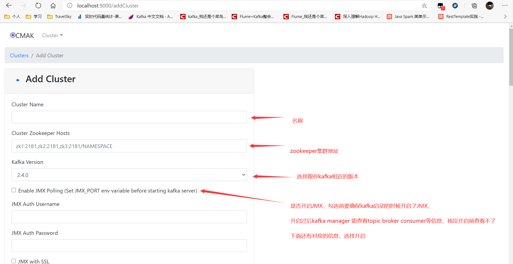
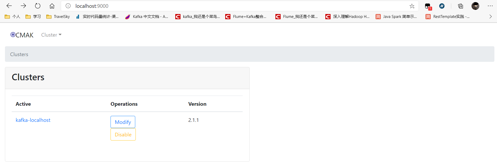
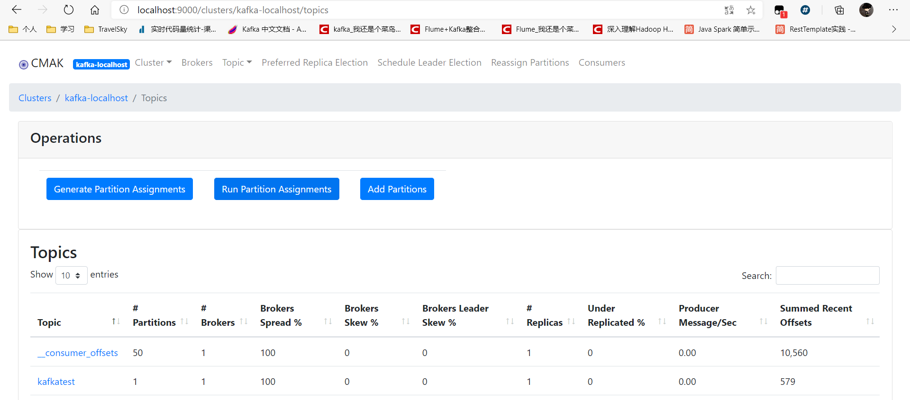

::: tip
KafkaManager简单使用

:::

<!-- more -->

## 安装启动

* [下载安装](https://github.com/yahoo/CMAK/releases)

* 修改默认配置，路径是`安装路径/conf/application.conf`，修改一下内容：

  ```properties
  kafka-manager.zkhosts="127.0.0.1:2181"     # zookeeper地址（输错了也能启动，暂时不知道为啥）
  cmak.zkhosts="127.0.0.1:2181"              # zookeeper集群地址
  ```

* 启动zookeeper、kafka

* 启动命令，指定配置文件，指定java环境，用的jdk8，启动报错，百度说是需要jdk11。默认9000端口，可以在启动的时候修改

  > nohup bin/cmak -Dconfig.file=conf/application.conf -java-home /usr/lib/jvm/java-11-openjdk-amd64 &
  >
  > 可以追加  -Dhttp.port=9000，修改为其他端口，不添加默认为9000

* [面板指令详细参考](https://blog.csdn.net/u011089412/article/details/87895652)


## 添加节点

1. 添加节点



2. 成功显示



3. 详细面板




## 添加节点踩坑

1. 添加节点报错：
> Yikes! KeeperErrorCode = Unimplemented for /kafka-manager/mutex Try again.

原因是zookpeer版本太低，升级版本即可，详细看zookeeper章节

2. 启动报错

> java.io.IOException: No snapshot found, but there are log entries. Something i

这个错是在启动zk是恢复数据报错的，因为之前的data全是我3.4.8版本的数据，现在启动3.5.5恢复这个数据就报错了

删除 zookeeper 配置里面保存data和log文件下的数据，

3. 节点已经存在

> Yikes! requirement failed: Cluster already exists

之前创建都没有成功，不知道为什么报错，但是换了名字，就可以，同时可以看到之前节点名称


## 注意

kafka开启JMX后，原有指令查看、创建topic、生产者、消费者都会报错，感觉后续操作都转移到`kafka manager`web ui 界面来处理了

> Error: Exception thrown by the agent : java.rmi.server.ExportException: Port already in use: 9988; nested exception is: