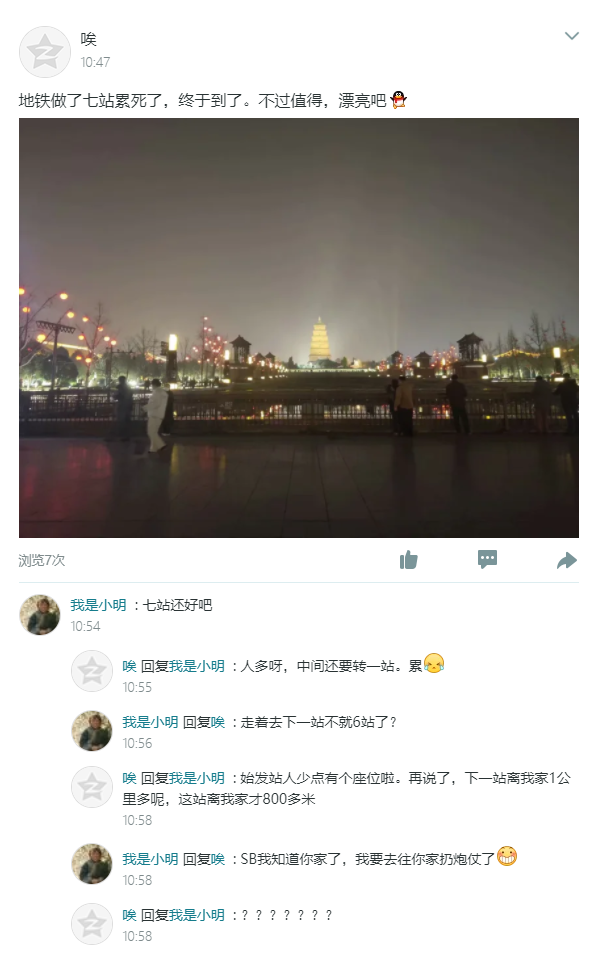
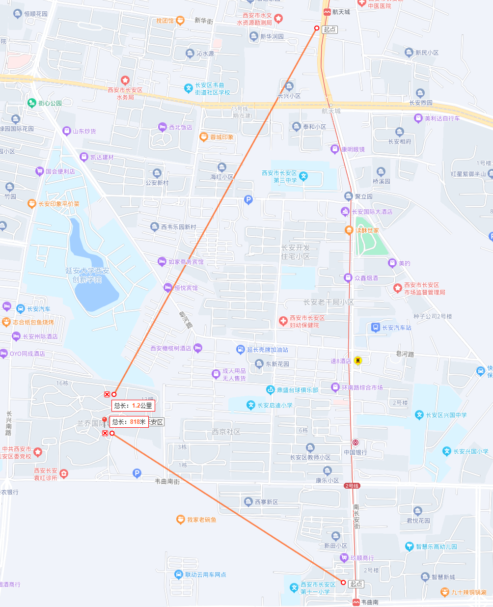
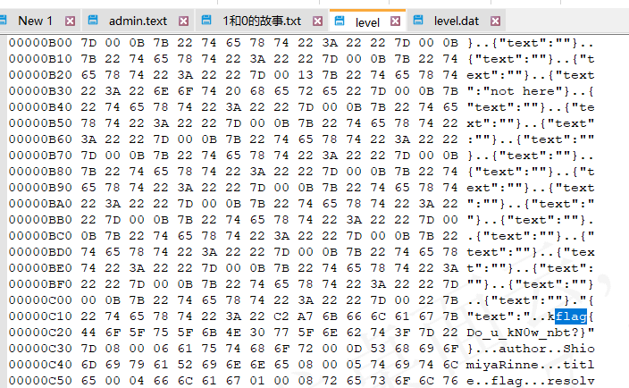
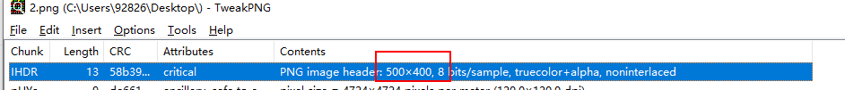
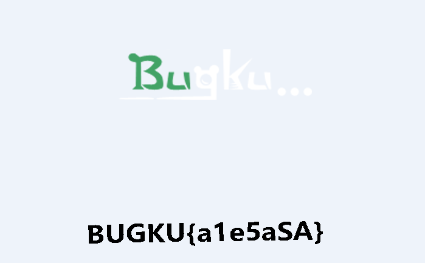
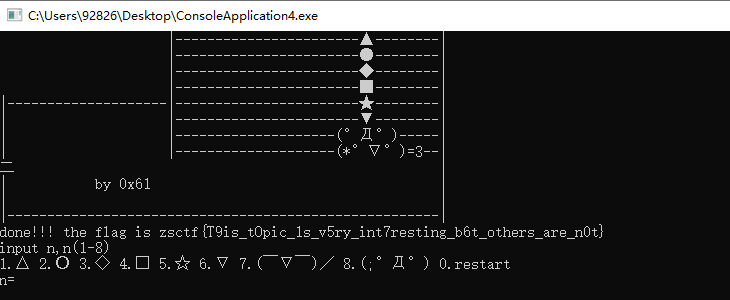
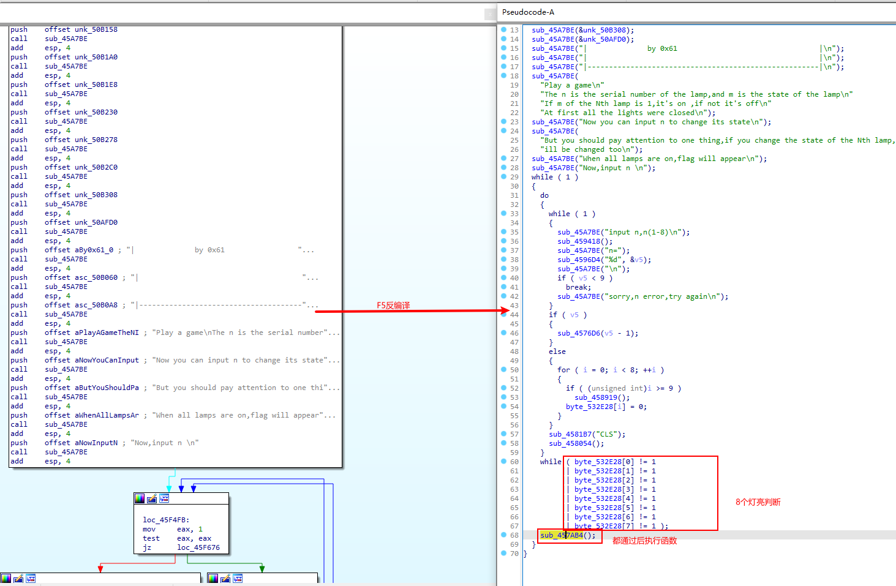
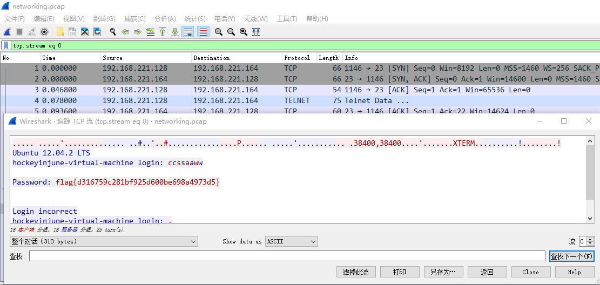

::: tip

CTF MISC（杂项）WriteUp

:::

题目来源： [题目 - Bugku CTF](https://ctf.bugku.com/challenges/index/gid/1/tid/4.html)

## 签到题

::: details 签到题 详情查看

解题：没啥，送分，扫描微信回复flag即可

:::

## 社工-进阶收集

::: details 社工-进阶收集 详情查看

提　　示: flag{小美小区名字拼音}

描　　述: 小明当年为了追求小美想尽办法获得小美的地址。直到有一天小美发了一条说说，小明觉得希望来了。 (实战改编题，难度降低了。)

	

解题：图片是西安大雁塔北广场，走着去下一站不久6站，也就说，前面6站是不用换成的，最后一战是换成到的 大雁塔 站，且还提到始发站，打开地图，满足位置的只有地铁2号线；以始发站 韦曲南 800m半径、第二站 航天城 1000m半径画圆，上下排除几十米误差，交叉点即为小美家地址



:::

## 1和0的故事

::: details 1和0的故事 详情查看

解题：下载文件，得到如下text

```
0000000001110010000000000
0000000000011110100000000
0000000001110001000000000
0000000010111100000000000
0000000010101010000000000
0000000001100010100000000
0000000010101010100000000
0000000001000001100000000
1100011101110110100011000
0001000010110010010010100
0100111101000011101110011
0011110100101011001001001
1000001001100001001101000
1111000111111011100101000
1011011111001101111110111
1000110110010010101101100
1000111100111111111110111
0000000010110001100010100
0000000010010100101010001
0000000010101010100011001
0000000000100111111110010
0000000000011001011110111
0000000001001100100100001
0000000011000011011011001
0000000011010000101110101
```

看样子大概想到是长宽相等的正方形，优先想是否是二维码，二维码 左上、右上、左下有定位符，看数字，基本都是0，大概率就是二维码了；

可以往上找工具，或者直接在excel中按单元格录入数据，然后 将1置成黑色，0置成白色，注意，定位符按平时扫描儿的二维码置底色即可，最终扫描二维码可以得到flag

:::

## easy_nbt

::: details easy_nbt 详情查看

解题：根据题目 easy_nbt，下载文件得到并解压，得到 New World 文件夹，文件内容看不懂啥意思，直接打开，也找不到相关信息；百度 nbt 搜到了是游戏 我的世界 里面的一种文件格式，也是直接解压的，尝试从外层目录 level.dat文件开始解压，

解压得到 level文件，用文本文件根据提示以二进制方式打开，搜索flag可得结果



:::

## 隐写

::: details 隐写 详情查看

下载得到 2.png 图片

工具：[TweakPNG (entropymine.com)](http://entropymine.com/jason/tweakpng/)

解题：图片来一般解题先改长宽高，使用 `TweakPNG`工具打开图片，看到下面的参数，将`500x400`，修改成`500x500`，改大一点也没关系，保存后重新打开图片即可看到答案






:::

## 眼见非实

::: details 眼见非实 详情查看

下载文件，得到 `眼见非实.docx`，直接打开，看不懂，notepad-- 以二进制打开，参考下面，可以知道 PK 开头，或二进制 `50 4B 03 04`的文件为 zip 格式文件，

[各种文件类型及文件头标识大全（十六进制） - 知乎 (zhihu.com)](https://zhuanlan.zhihu.com/p/571208394)

修改文件后缀为 zip 后解压，得到一些文件夹目录，根据提示答案就是 flag{}

支持文件夹文本内容的搜索软件，或者挨个搜索一下每个文件，就能查看 flag

:::

## 这是一张单纯的图片

::: details 这是一张单纯的图片 详情查看

下载文件，得到 `file.jgp`，

解题：图片打开，没啥特别的，nodepad-- 打开，发现最末尾有串可疑字符，提取拼接后 `\&#107;\&#101;\&#121;\&#123;\&#121;\&#111;\&#117;\&#32;\&#97;\&#114;\&#101;\&#32;\&#114;\&#105;\&#103;\&#104;\&#116;\&#125;`，

斜杠是我多加的，否则在 md文档中自动转义了；

使用在线工具 [在线Unicode编码转换-Unicode和ASCII在线互转-中文转Unicode工具 (jsons.cn)](http://www.jsons.cn/unicode)，ASSII转Unicode，即可查看 flag

另外，参考别人思路，notepad-- 打开看到这 assii 字符后，直接修改后缀为 .html，当网页打开可以自动转移，和我拷贝到 typora md文本编辑器直接转义显示出flag一样的道理

:::

## 游戏过关

::: details 游戏过关 详细查看

文件下载，得到`ConsoleApplication4.exe`，双击为控制台窗口小游戏，根据提示

```
玩个游戏
n是灯的序号，m是灯的状态
如果第 N 个灯的 m 为 1，则打开，否则关闭
一开始所有的灯都关着
现在你可以输入 n 来改变它的状态
但是你要注意一件事，如果你改变第 N 个灯的状态，第 (N-1) 和 (N+1) 的状态也会改变
当所有灯都亮起时，会出现标志
现在，输入 n
输入 n,n(1-8)
```

根据提示直接开始完，瞎鼓捣一下，居然就出结果了....



还是IDA查看一下



双击函数进去，在双击出现函数，得到如下：

```c
int sub_45E940()
{
  int v0; // eax
  int v1; // edx
  int v3; // [esp-4h] [ebp-168h]
  int i; // [esp+D0h] [ebp-94h]
  char v5[22]; // [esp+DCh] [ebp-88h] BYREF
  char v6[32]; // [esp+F2h] [ebp-72h] BYREF
  char v7[4]; // [esp+112h] [ebp-52h] BYREF
  char v8[64]; // [esp+120h] [ebp-44h]
  int v9; // [esp+160h] [ebp-4h]
  int savedregs; // [esp+164h] [ebp+0h] BYREF

  sub_45A7BE("done!!! the flag is ");
  v8[0] = 18;
  v8[1] = 64;
  v8[2] = 98;
  v8[3] = 5;
  v8[4] = 2;
  v8[5] = 4;
  v8[6] = 6;
  v8[7] = 3;
  v8[8] = 6;
  v8[9] = 48;
  v8[10] = 49;
  v8[11] = 65;
  v8[12] = 32;
  v8[13] = 12;
  v8[14] = 48;
  v8[15] = 65;
  v8[16] = 31;
  v8[17] = 78;
  v8[18] = 62;
  v8[19] = 32;
  v8[20] = 49;
  v8[21] = 32;
  v8[22] = 1;
  v8[23] = 57;
  v8[24] = 96;
  v8[25] = 3;
  v8[26] = 21;
  v8[27] = 9;
  v8[28] = 4;
  v8[29] = 62;
  v8[30] = 3;
  v8[31] = 5;
  v8[32] = 4;
  v8[33] = 1;
  v8[34] = 2;
  v8[35] = 3;
  v8[36] = 44;
  v8[37] = 65;
  v8[38] = 78;
  v8[39] = 32;
  v8[40] = 16;
  v8[41] = 97;
  v8[42] = 54;
  v8[43] = 16;
  v8[44] = 44;
  v8[45] = 52;
  v8[46] = 32;
  v8[47] = 64;
  v8[48] = 89;
  v8[49] = 45;
  v8[50] = 32;
  v8[51] = 65;
  v8[52] = 15;
  v8[53] = 34;
  v8[54] = 18;
  v8[55] = 16;
  v8[56] = 0;
  qmemcpy(v5, "{ ", 2);
  v5[2] = 18;
  v5[3] = 98;
  v5[4] = 119;
  v5[5] = 108;
  v5[6] = 65;
  v5[7] = 41;
  v5[8] = 124;
  v5[9] = 80;
  v5[10] = 125;
  v5[11] = 38;
  v5[12] = 124;
  v5[13] = 111;
  v5[14] = 74;
  v5[15] = 49;
  v5[16] = 83;
  v5[17] = 108;
  v5[18] = 94;
  v5[19] = 108;
  v5[20] = 84;
  v5[21] = 6;
  qmemcpy(v6, "`S,yhn _uec{", 12);
  v6[12] = 127;
  v6[13] = 119;
  v6[14] = 96;
  v6[15] = 48;
  v6[16] = 107;
  v6[17] = 71;
  v6[18] = 92;
  v6[19] = 29;
  v6[20] = 81;
  v6[21] = 107;
  v6[22] = 90;
  v6[23] = 85;
  v6[24] = 64;
  v6[25] = 12;
  v6[26] = 43;
  v6[27] = 76;
  v6[28] = 86;
  v6[29] = 13;
  v6[30] = 114;
  v6[31] = 1;
  strcpy(v7, "u~");
  for ( i = 0; i < 56; ++i )
  {
    # 参考别人理解，是 V5 和 V8两个数组求与，然后在和 0x13u 求与
    v5[i] ^= v8[i];
    v5[i] ^= 0x13u;
  }
  v0 = sub_45A7BE("%s\n");
  v3 = v1;
  sub_459AE9(&savedregs, &dword_45EC04, v0);
  return sub_458801((unsigned int)&savedregs ^ v9, v3);
}
```

借用网上大佬的python代码

```python
# py 3
# coding:utf-8
 
array1 = [18,64,98,5,2,4,6,3,6,48,49,65,32,12,48,65,31,78,62,32,49,32,1,57,96,3,21,9,4,62,3,5,4,1,2,3,44,65,78,32,16,97,54,16,44,52,32,64,89,45,32,65,15,34,18,16,0]
#第一个数组
 
array2 = [123,32,18,98,119,108,65,41,124,80,125,38,124,111,74,49,83,108,94,108,84,6,96,83,44,121,104,110,32,95,117,101,99,123,127,119,96,48,107,71,92,29,81,107,90,85,64,12,43,76,86,13,114,1,117,126,0]
#第二个数组
 
flag = ''
for i in range(len(array1)):
    flag+= chr(array1[i] ^ array2[i] ^ 0x13 )
    #两个数组求与，然后每一位与0x13求与
    
print (flag)
```

:::

## 啊哒

::: details 啊哒 详情查看

下载文件得：ada.jpg

解题：邮件查看属性，发现有 `照相机型号：73646E6973635F32303138`，看起来是16进制字符串， 尝试转其他进制，看结果应该不是这思路

网上搜索了下，16进制转ASCII字符串，参考下列工具，得到结果`sdnisc_2018`，看这返回结果，感觉是这个没错

估计是个密码啥的，尝试修改文件后缀为 `.zip`，打开发现有文件`flag.text`，输入上面密码即可得 flag

工具：[十六进制到ASCII | 十六进制到文本字符串转换器 (rapidtables.org)](https://www.rapidtables.org/zh-CN/convert/number/hex-to-ascii.html#:~:text=在输入文本框中粘贴十六进制字节码。,选择字符编码类型。 按下转换按钮。)

:::

## telnet

::: details telnet 详情查看

下载文件得：`networking.pcap`

解题：notepad-- 文件直接打开，提示二级制或者文本方式打开，两种格式，打开后，全文搜索 flag直接看到结果

学习：.pcap 文件：[(89条消息) pcap文件详解_meteor^_^的博客-CSDN博客](https://blog.csdn.net/ytx2014214081/article/details/80112277)

工具：[Wireshark · Download](https://www.wireshark.org/download.html)，这个地址下载快一点：[Wireshark v3.6.1 绿色版.zip - 蓝奏云 (lanzoul.com)](https://l13144.lanzoul.com/its9lzbk38h)

运行程序，打开`networking.pcap`文件，邮件追踪流，TCP就可以直接看到 flag



:::