::: tip

CTF Reverse（逆向）WriteUp

:::

题目来源： [题目 - Bugku CTF](https://ctf.bugku.com/challenges/index/gid/1/tid/7.html)

## 入门逆向

::: details 入门逆向 详情查看

工具：IDA

下载链接：[Download center (hex-rays.com)](https://www.hex-rays.com/download-center/)

解题：

下载文件 baby.exe

使用 IDA 工具默认方式打开，main 文件即可直接查看答案

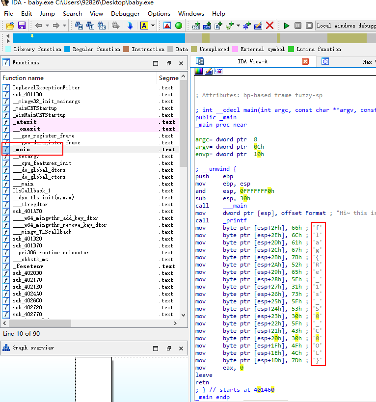

:::

## Easy_Re

::: details Easy_Re 详情查看

工具：IDA

下载链接：[Download center (hex-rays.com)](https://www.hex-rays.com/download-center/)

解题：

下载文件 re1.exe

使用 IDA 工具默认方式打开，查看 Hex View-1，ALT+T 搜索`CTF`即可看到答案

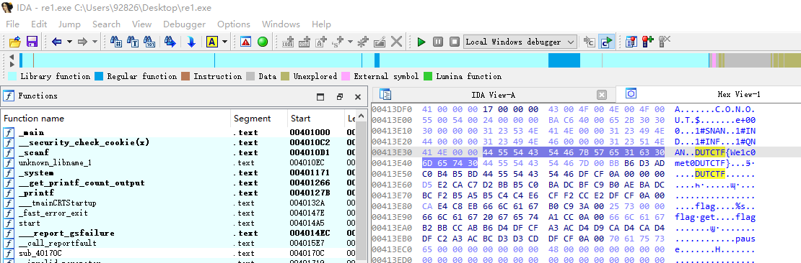

:::

## 逆向入门

::: details 逆向入门 详情查看

解题：

下载文件 admin.exe

修改后缀为 text，文本编辑器打开可以看到 `data:image/png:base64`，选在在线base64转图片，即可看到转出的二维码，扫描二维码即可看到答案

网址：[图片在线转换base64编码-在线base64编码转换成图片工具 (jsons.cn)](http://www.jsons.cn/img2base64/)

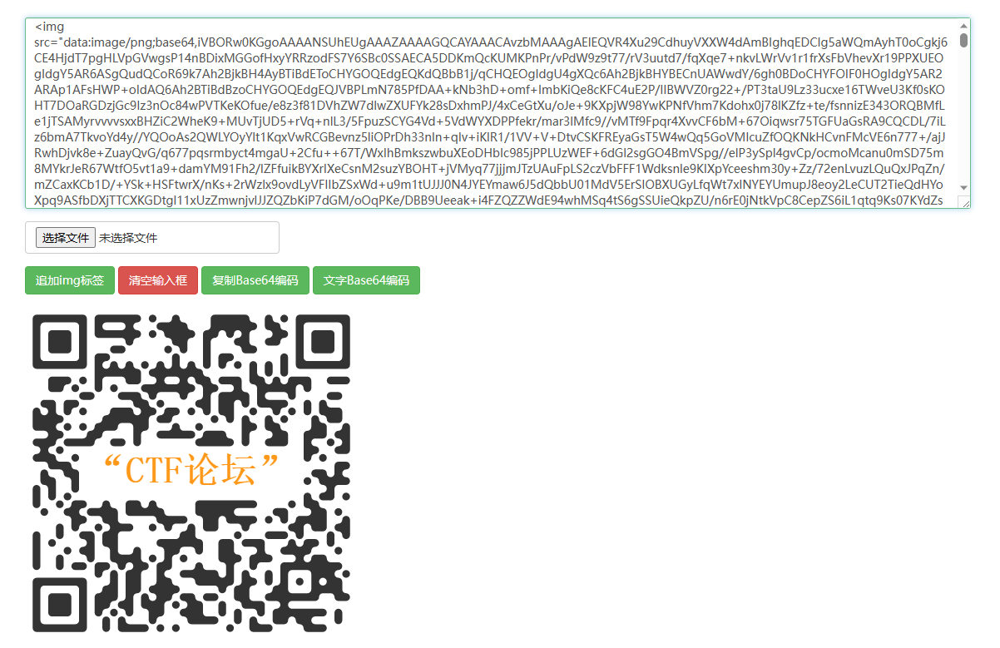

:::

## Easy_vb

::: details Easy_vb 详情查看

工具：IDA 下载链接：[Download center (hex-rays.com)](https://www.hex-rays.com/download-center/)

解题：

下载得到文件 `easy_vb.exe`

可以先切换`Hex View-1`模式查看有没有特殊的字符，`ALT+T`尝试搜索关键字`flag`，`ctf`等，直接搜索到了答案

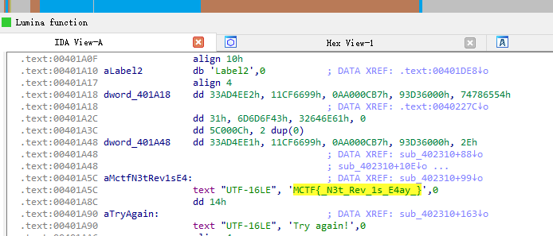

提交答案报错，根据提示，答案为 flag{xxxx}，修改 MCTF 为 flag ，尝试提交，正确

::: 

## signin

::: details signin 详情查看

提　　示: 君远至此，辛苦至甚。 窃谓欲状，亦合依例，并赐此题。

描　　述: 来源：第七届山东省大学生网络安全技能大赛

下载文件得：`sign_in.zip`，解压缩得`sign_in_apk`，

工具：[Releases · charles2gan/GDA-android-reversing-Tool (github.com)](https://github.com/charles2gan/GDA-android-reversing-Tool/releases)

解题：看到解压后是APK文件，及为安卓逆向，寻找对应工具，如上GDA，

查看源码，如下，找到一个 getFlag 函数，大致找到 getFlag() 函数返回值，再逆向就可以了

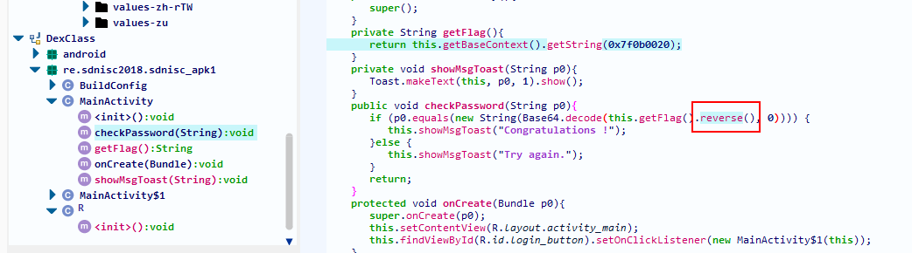

后续不知道怎么查看，看评论区，"大致说可以再R中搜索对应的编号，安卓为创建的固定值添加的一个标识ID方便重复引用。所以要去找这个写好的固定值究竟在哪里，R里写了tosring在strings里，所以去该xml文件里查"

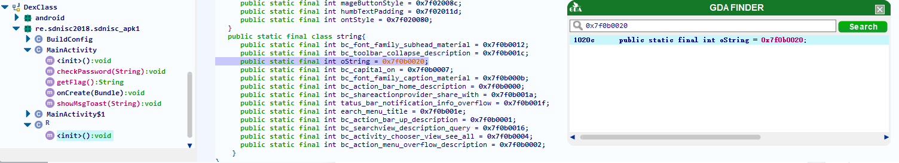

这里是找到了对应的 16进制编号位置，但是不明白为啥要去 strings.xml 文件中查找，而且这文件有很多，只是正好我找第一个找到了而已

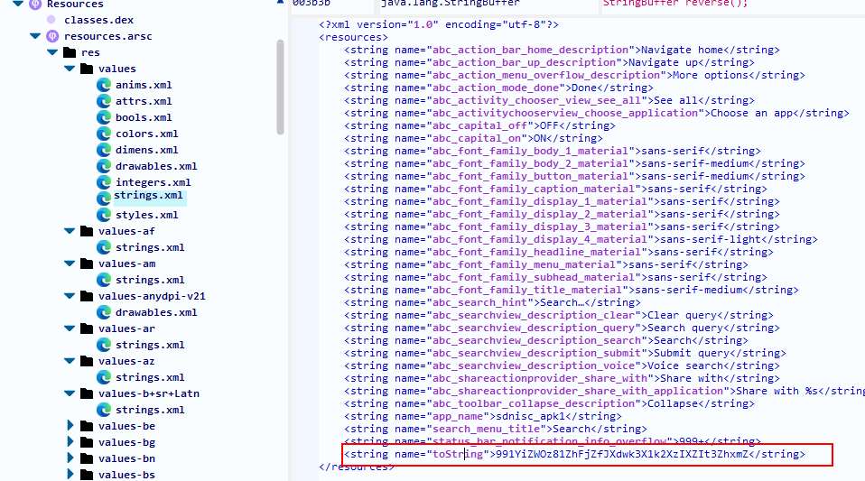


到这里就找到了这一串看起来特殊的值了，根据前面 getFlag下面的 reverse 提示，将这串字符逆序输出，再Base64解码即可得到答案

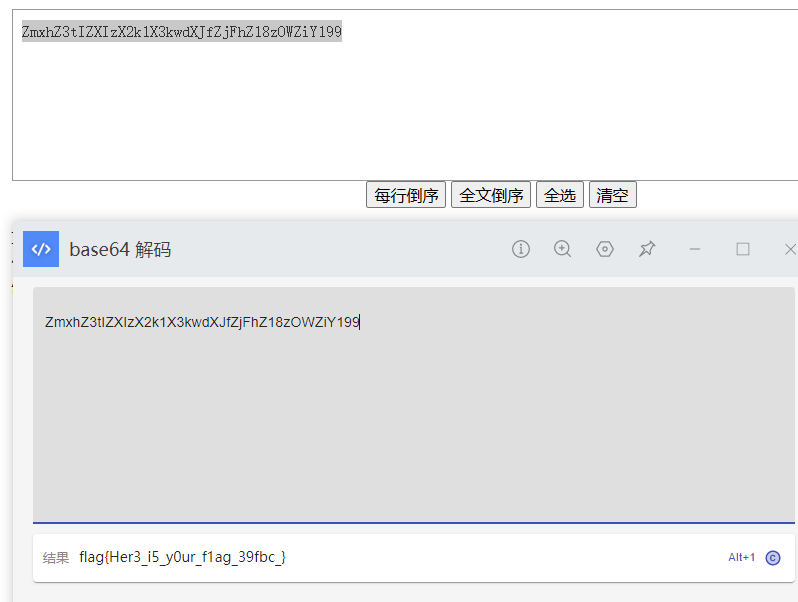

:::

## 特殊的Base64

::: details 特殊的Base64 详情查看

下载文件：解压得`特殊的Base64.exe`文件

解题：

先IDA打开，`alt+t`搜索 flag 相关信息，可以看到如下信息

```shell
.rdata:0000000000489008 aMtyqm7wjodkrnl db 'mTyqm7wjODkrNLcWl0eqO8K8gc1BPk1GNLgUpI==',0
.rdata:0000000000489008                                         ; DATA XREF: main+36↑o
.rdata:0000000000489031 ; const char Str[]
.rdata:0000000000489031 Str             db 'Please input your flag!!!!',0
.rdata:0000000000489031                                         ; DATA XREF: main+51↑o
.rdata:000000000048904C ; const char aTheFlagIsRight[]
.rdata:000000000048904C aTheFlagIsRight db 'The flag is right!!!!!!!!!',0
.rdata:000000000048904C                                         ; DATA XREF: main+C6↑o
.rdata:0000000000489067 ; const char aThisIsAWrongFl[]
.rdata:0000000000489067 aThisIsAWrongFl db 'This is a wrong flag!!!!!!!!',0
.rdata:0000000000489067                                         ; DATA XREF: main:loc_40161A↑o
.rdata:0000000000489084 unk_489084      db    0                 ; DATA XREF: base64Encode(std::string)+29↑o
.rdata:0000000000489085 asc_489085      db '==',0               ; DATA XREF: base64Encode(std::string)+2AA↑o
.rdata:0000000000489088 asc_489088      db '=',0                ; DATA XREF: base64Encode(std::string)+3DE↑o
.rdata:000000000048908A                 align 10h
.rdata:0000000000489090 aAabbccddeeffgg db 'AaBbCcDdEeFfGgHhIiJjKkLlMmNnOoPpQqRrSsTtUuVvWwXxYyZz0987654321/+',0
.rdata:0000000000489090                                         ; DATA XREF: __static_initialization_and_destruction_0(int,int)+4E↑o
```

可以看到一串可以的 Base64编码串，`mTyqm7wjODkrNLcWl0eqO8K8gc1BPk1GNLgUpI==`，直接使用在线工具进行Base64解码，返回信息明显是错误的，

下面看到另外一串可以的字符`AaBbCcDdEeFfGgHhIiJjKkLlMmNnOoPpQqRrSsTtUuVvWwXxYyZz0987654321/+`，看起来像是字典，密码表之类的，百度了 及 查看评论区，了解到 Base64 有个基本的密码表：`ABCDEFGHIJKLMNOPQRSTUVWXYZabcdefghijklmnopqrstuvwxyz0123456789+/`，看起来和反编译查看到的，长度一致，只是顺序不同，也就说是说，这道题采用了自己的 Base64编码表，而不是常规的，

按顺序，也就是 A对应A，a对应B，B对应C的编码表，前者是题目本身，后者是标准Base64编码表顺序，

百度到python有对应的包可以直接使用

```python
import base64
import string

# 用户使用自定义Base64编码表加密的字符串
base64String = "mTyqm7wjODkrNLcWl0eqO8K8gc1BPk1GNLgUpI=="

# 用户自定义Base64编码顺序
userStr = "AaBbCcDdEeFfGgHhIiJjKkLlMmNnOoPpQqRrSsTtUuVvWwXxYyZz0987654321/+"
# 标准Base64编码顺序
baseStr = "ABCDEFGHIJKLMNOPQRSTUVWXYZabcdefghijklmnopqrstuvwxyz0123456789+/"

#利用密码表还原成正常base64编码后的字符串
newBase64Code=str1.translate(base64String.maketrans(userStr,baseStr))

#base64解码
print(base64.b64decode(newBase64Code).decode())
```

执行可得结果

```shell
92826@DESKTOP-HI2TV6C MINGW64 ~/Desktop
$ py 特殊Base64.py
flag{Special_Base64_By_Lich}
```

:::

## love

::: details love 详情查看

下载文件，解压得 `reverse_3.exe`

解题：

IDA默认模式打开，查看main函数，`alt+t`搜索 flag，然后f5 反编译得下面图

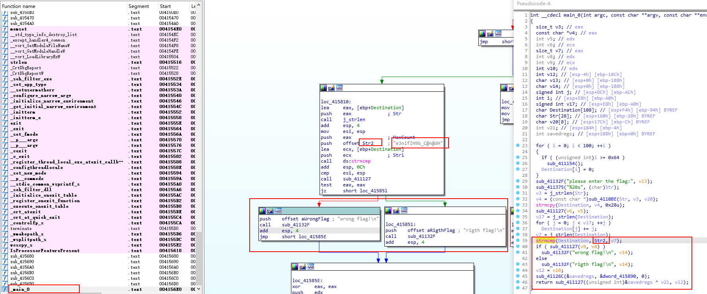

直接查看 sub_411127(v9 , v8)函数，只看到了 v8, v9的定义，没看到那里有变更赋值操作；

不知道是不是软件版本不一致导致，网上别人反编译出来的结果如下

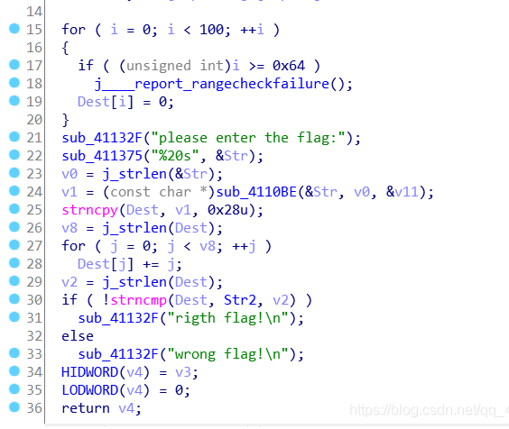

看别人这个就比较清晰了，满足if中的判断，就能得到正确的flag

百度了了一下，strncmp() 函数：C 库函数 **int strncmp(const char \*str1, const char \*str2, size_t n)** 把 **str1** 和 **str2** 进行比较，最多比较前 **n** 个字节。

那就是比较 Dest 和 Str2 的长度一致，strlen() 函数就是 Dest 字符串长度，Str2 双击进去可以查看，或者前面的截图可以看到，如下`e3nifIH9b_C@n@dH`

Str2等同于Dest，原来 for循环是 Dest[j] += j;我们反过来即可

```c
#include<stdio.h>
#include<string.h>

# strlen就是字符串长度，在线编译不知道为啥不对，直接写死16
int main()
{
    char Dest[20]="e3nifIH9b_C@n@dH";
    // int len=strlen(str);
    for(int i=0;i<16;i++)
        Dest[i]-=i;
    for(int i=0;i<16;i++)
        printf("%c",Dest[i]);
}

// 返回 e2lfbDB2ZV95b3V9
```

直接标准 Base64解码 得`{i_l0ve_you}`，根据提示，拼接上 flag 即可

:::

## NoString

::: details NoString 详情查看 

下载文件解压得：`NoString.exe`

解题：IDA打开，F5查看反编译代码，如下：

```c
int wmain()
{
  signed int v0; // ecx
  signed int i; // eax
  signed int v2; // ecx
  signed int j; // eax
  int k; // eax
  int v5; // eax
  signed int v6; // ecx
  signed int m; // eax
  signed int v8; // ecx
  signed int n; // eax
  char v11; // [esp+0h] [ebp-18h] BYREF
  __int128 v12; // [esp+1h] [ebp-17h]
  __int16 v13; // [esp+11h] [ebp-7h]

  v0 = strlen(Format);
  for ( i = 0; i < v0; ++i )
    Format[i] ^= 9u;
  printf("yelhzl)`gy|})|)oehnl3");
  v11 = 0;
  v13 = 0;
  v12 = 0i64;
  v2 = strlen(a80z);
  for ( j = 0; j < v2; ++j )
    a80z[j] ^= 9u;
  scanf(a80z, &v11);
  for ( k = 0; k < 19; ++k )
    *(&v11 + k) ^= 9u;
  v5 = strcmp(&v11, aOehnl3rHfCcgpt);
  if ( v5 )
    v5 = v5 < 0 ? -1 : 1;
  if ( v5 )
  {
    v6 = strlen(aLF);
    for ( m = 0; m < v6; ++m )
      aLF[m] ^= 9u;
    printf("l{{f{");
  }
  else
  {
    v8 = strlen(aNa);
    for ( n = 0; n < v8; ++n )
      aNa[n] ^= 9u;
    printf("{`na}");
  }
  printf("\r\n");
  system("pause");
  return 0;
}
```

直接运行`NoString.exe`， 随意输入字符串，返回错误，程序停止，提示如下：

```shell
please input u flage:flag
error
请按任意键继续. . .
```

结果运行情况和反编译代码，最下面`system("pause")`，那估计上面 if else 语句就说明某个是正确的，某个是错误

两个语句，判定条件是V5，详细如下

```c
char v11;

// scanf 输入
scanf(a80z, &v11);
for ( k = 0; k < 19; ++k )
    *(&v11 + k) ^= 9u;


// strcmp 是判断两个字符串是否相等
v5 = strcmp(&v11, aOehnl3rHfCcgpt);

if ( v5 )
  {
    printf("l{{f{");
  }
  else
  {
    printf("{`na}");
  }
```

 `aOehnl3rHfCcgpt`变量可以在IDA中双击即可，进去可以看到值为 `oehnl3r=<?=hF@CCGPt`，v11，是用户输入字符，然后再循环和9做异或运算，然后再和固定字符串做比较，

那么现在直接用固定字符串和9做异或运算应该就能出结果，python示例如下：

```
flagStr = 'oehnl3r=<?=hF@CCGPt'

flag = ''

for s in flagStr:
  flag += chr(ord(s) ^ 9)
print(flag)

// rightStr 来源于 aNa IDA中双击即可看到
rightStr = '{`na}'
right = ''
for r in rightStr:
  right += chr(ord(r) ^ 9)
print(right)

// errorStr 来源于 aLF IDA中双击即可看到
errorStr = 'l{{f{'
error = ''
for e in errorStr:
  error += chr(ord(e) ^ 9)
print(error)
```

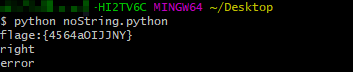

冒号和字母e是多余的，根据提示还是 flag{xxx}格式提交即可

:::

## mobile1(gctf)

::: details mobile1(gctf) 详情查看

下载文件解压得：`gctf_mobile1.apk`

工具：IDA

解题：使用IDA打开 apk程序，一般先看main函数，或者全局搜索flag，能看到在 `MainActivity`文件中包含 flag，详细代码如下:

```java
package com.example.crackme.MainActivity;
import android.app.Activity;
import android.widget.EditText;
import java.lang.String;
import android.widget.Button;
import java.security.MessageDigest;
import java.lang.StringBuilder;
import java.security.NoSuchAlgorithmException;
import java.lang.Integer;
import android.os.Bundle;
import android.view.View;
import com.example.crackme.MainActivity$1;
import android.view.View$OnClickListener;
import android.view.Menu;
import android.view.MenuInflater;

public class MainActivity extends Activity	// class@000785 from classes.dex
{
    private Button btn_register;
    private EditText edit_sn;
    String edit_userName;

    public void MainActivity(){
       super();
    }
    static EditText access$000(MainActivity x0){
       return x0.edit_sn;
    }
    static boolean access$100(MainActivity x0,String x1,String x2){
       return x0.checkSN(x1, x2);
    }
    static Button access$200(MainActivity x0){
       return x0.btn_register;
    }
    // 重点在这个方法
    // getinstance：静态函数，用来实例化和初始化。
	// update：处理数据
	// reset：重置摘要
	// digest：明文变为密文
    // userName 来自 下面 onCreate函数的变量定义
    private boolean checkSN(String userName,String sn){
       boolean b;
       try{
          b = false;
          if (userName == null || (userName.length() && (sn != null && sn.length() == 22))) {
             MessageDigest digest = MessageDigest.getInstance("MD5");
             digest.reset();
             digest.update(userName.getBytes());
             byte[] bytes = digest.digest();
             String hexstr = MainActivity.toHexString(bytes, "");
             StringBuilder sb = "";
             for (int i = 0; i < hexstr.length(); i = i + 2) {
                sb = sb.append(hexstr.charAt(i));
             }
             String userSN = sb;
             userSN = "flag{"+userSN+"}";
             if (userSN.equalsIgnoreCase(sn)) {
                b = true;
             }
          }
       }catch(java.security.NoSuchAlgorithmException e2){
          e2.printStackTrace();
       }
       return b;
    }
    private static String toHexString(byte[] bytes,String separator){
       StringBuilder hexString = "";
       byte[] arr$ = bytes;
       int len$ = arr$.length;
       for (int i$ = 0; i$ < len$; i$++) {
          byte b = arr$[i$];
          int i = b & 0x00ff;
          String hex = Integer.toHexString(i);
          if (hex.length() == 1) {
             hexString = hexString.append('0');
          }
          StringBuilder hexString1 = hexString.append(hex);
          hexString1 = hexString1.append(separator);
       }
       return hexString;
    }
    public void onCreate(Bundle savedInstanceState){
       super.onCreate(savedInstanceState);
       this.setContentView(R.layout.activity_main);
       this.setTitle(R.string.unregister);
      
       this.edit_userName = "Tenshine";
       this.edit_sn = this.findViewById(0x7f0c0051);
       this.btn_register = this.findViewById(0x7f0c0052);
       this.btn_register.setOnClickListener(new MainActivity$1(this));
    }
    public boolean onCreateOptionsMenu(Menu menu){
       this.getMenuInflater().inflate(R.menu.activity_main, menu);
       return true;
    }
}
```

重点flag在 checkSN 方法，代码中的几个方法意思百度了下，注释到上面的代码里面了，下面一个for循环，看提示就是取值  i = 0, i+2位的数，也就是 md5的基数位（索引从0开始的）

```python
import hashlib 
import string
def encrypt_md5(str):
	md=hashlib.md5()
	md.update(str.encode(encoding='utf-8'))
	return md.hexdigest()
userName="Tenshine"
md5Str=encrypt_md5(userName)
print(md5Str)	

for i in range (len(md5Str)):
	if i%2==0:
		print(md5Str[i],end='')
        
// b9c77224ff234f27ac6badf83b855c76
// bc72f242a6af3857  
```

最终结果：`flag{bc72f242a6af3857}`

:::

## mobile2(gctf)

::: details mobile2(gctf) 详情查看

下载文件解压得：file 文件夹（压缩包报毒）

解题：打开文件夹目录，拖入vsCode，挨个看了下，没看出啥来，重新开最外层的文件`AndroidManifest.xml`

直接二进制、或者文本方式打开，搜索 `flag`没找到，搜索`f`就能看到了，

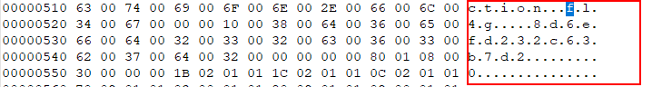

:::

## HelloSmali2

::: details HelloSmali2 详情查看

下载文件解压得：`文件夹 HelloSmali2`，文件如下

```
f45775643c-46846-5990-b3793-32e8ecd15f0d.smali
XMan.java
```

.smali文件打开看不懂，先不用管，先看java文件

```java
/**
 * Created by xuanyonghao on 2017/7/16.
 */
public class XMan {
    public static void main(String[] args) {
        String v6 = "+/abcdefghijklmnopqrstuvwxyzABCDEFGHIJKLMNOPQRSTUVWXYZ0123456789";
        String s = "xsZDluYYreJDyrpDpucZCo";
        StringBuilder sb = new StringBuilder();
        for (int i = 0; i < s.length(); i++) {
            int tmp = v6.indexOf(s.charAt(i));
            String ss = Integer.toBinaryString(tmp);
            if (ss.length() == 5) {
                ss = "0" + ss;
            } else if (ss.length() == 4) {
                ss = "00" + ss;
            } else if (ss.length() == 3) {
                ss = "000" + ss;
            } else if (ss.length() == 2) {
                ss = "0000" + ss;
            } else if (ss.length() == 1) {
                ss = "00000" + ss;
            } else if (ss.length() == 0) {
                ss = "000000" + ss;
            }
            sb.append(ss);
        }
        String x = sb.toString() + "0000";
        StringBuilder stringBuilder = new StringBuilder();
        for (int i = 0; i < x.length(); i += 8) {
            String tmp = x.substring(i, i + 8);
            byte b = (byte) Integer.parseInt(tmp, 2);
            stringBuilder.append((char) b);
        }
        System.out.println(stringBuilder.toString());
    }
}
```

发现就是java main函数，尝试直接执行一下看看结果提示

```shell
javac XMan.java
java XMan
```

结果：eM_5m4Li_i4_Ea5y

根据提示，试着输入 XMAN{eM_5m4Li_i4_Ea5y}

NM，真过了....

:::

