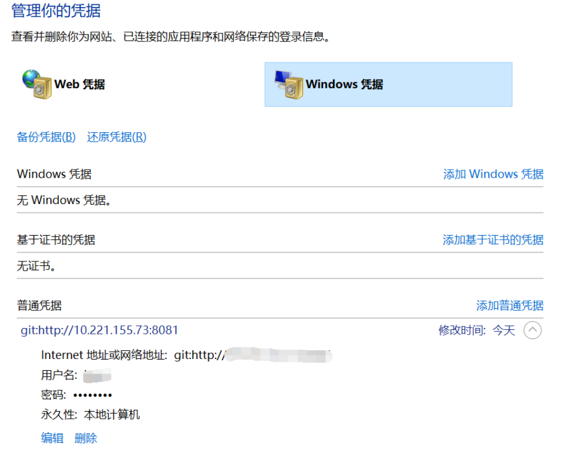

::: tip

Git 是一个开源的分布式版本控制系统，用于敏捷高效地处理任何或小或大的项目。Git版本管理工具的常规使用，常用命令汇总，[详细汇总](https://www.cnblogs.com/junwu/p/6004663.html)

:::

<!-- more -->

## Git常用指令

### 1. Git 工作流程图


### 2. Git 常规配置

```shell
# git 版本
git --version 

# git 升级
git update-git-for-windows

# 克隆项目
git clone [url]

# 显示当前git的配置
git config --list

# 设置提交代码的个人信息，global为全局配置，可选
git config --global user.name "you name"
git config --global user.email "you email"

# linux 删除，添加git凭证
git config credential.helper store
git config --global --unset credential.helper
```

### 3. 提交并推送

```shell
# 添加文件到暂存区，-A参数代表所有，也可以指定具体文件信息
git add -A

# 提交暂存区到仓库区
git commit -m "Information describing the content of this submission"

# 推送到远端仓库
git push

# 拉取最新代码
git pull
```

### 4. 分支

```sh
# 查看所有分支，白色为本地分支，红色为远端分支，r参数代表远端分支
git -branch -a | -r

# 创建分支
git branch your_branch_name

# 推送分支到远端
git push --set-upstream origin your_local_branch

# 删除本地分支
git branch -D your_branch_name

# 删除远端分支
git push origin --delete your_remote_branch_name

# 切换分支
git checkout your_branch_name
```

### 5. Tag

```sh
# 查看tag信息
git tag

# 创建tag
git tag your_tag_name

# 推送tag到远端
git push origin your_local_tag

# 删除本地tag
git tag -d tag_name

# 删除远端tag
git push origin :refs/tags/tag_name

# 批量删除本地、远端tag，本地执行git tag，将要删除的tag单独复制出来，在IDEA或者sublime中批量修改，在前面添加git tag -d
git tag -d tag_name1
git tag -d tag_name2

# 批量删除远端tag同理，将修改过的指令统一复制到命令行执行即可，远端的批量删除，复制过去某些tag内容丢失，暂不知道为啥
git push origin :refs/tags/tag_name1
git push origin :refs/tags/tag_name2

# 再上一个tag上创建分支，适用于临时的简单修改
git branch Branch_name pre_tag_name
```

### 6. 查看信息

```shell
# 当前状态，分支，未提交文件信息等
git status

# 显示当前分支的历史版本，--stat参数显示commit历史，以及每次commit发生变更的问题
git log --stat

# 回退到指定版本，hard后面跟随的参数是每次提交后产生的随机哈希值，可以git log查看	
git reset --hard hash_code

# 查看Branch log后退出，直接按q即可
```

### 7. 同步提交

```shell
# 适用整体同步用merge,部分代码同步可以用cherry-pick，先获取到 部分提交内容f的commitHash; 
    a - b - c - d   Master
         \
           e - f - g Feature
# 切换到Master，将f提交部分内容同步到Master，支持多个commitHash一起提交，最后再推送到远端
$ git cherry-pick <HashA> <HashB>
$ git push
```

### 8. 其他

```shell
// 修改.ignore 是其生效
git rm -r --cached .
```


### 问题：

#### 1. git clone 报错 warning: Clone succeeded, but checkout failed."

解决：

```shell
git config --system core.longpaths true
```

#### 2. git push github 或者 git update 更新报错`SSL_connect: SSL_ERROR_SYSCALL in connection to github.com:443`

原因：

```
因为Git的Http代理的问题，Git支持三种协议：git://、ssh://和http://，本来push的时候应该走ssh隧道的，但是因为设置了http代理，所以就走了http的代理，于是就提交不了了。 
找到原因了，那就取消http代理吧：
```

解决：

```shell
git config --global --unset http.proxy
```

#### 3. git pull 报错：`SSL certificate problem: unable to get local issuer certificate`

原因：

这个是由于Git默认开启了SSL验证，关闭即可；

解决：

```shell
git config --global http.sslVerify false
```


#### 4. Git修改凭证

事例：使用`Tortoigit`提交文件时，因为没有权限，输入的凭证错误，导致提交失败，后续添加权限后，重复提交仍然失败。

原因：没有清除之前错误的Git凭证

解决：到 `控制面板-用户帐户-凭据管理器`目录下修改凭证的`用户名`和`密码`

