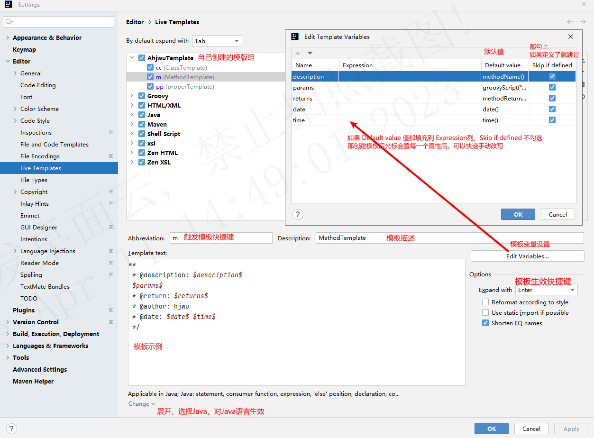

# 创建类、接口、枚举时自动注释模板


设置路径：Settings -> Editor -> File and Code Templates


* Class


```java
#if (${PACKAGE_NAME} && ${PACKAGE_NAME} != "")package ${PACKAGE_NAME};#end
#parse("File Header.java")
/**
 * Class Name: ${NAME}
 * Class Description: ${NAME}
 *
 * @author: hjwu
 * @date: ${DATE} ${TIME}
 */
public class ${NAME} {
}
```


* Interface


```java
#if (${PACKAGE_NAME} && ${PACKAGE_NAME} != "")package ${PACKAGE_NAME};#end
#parse("File Header.java")
/**
 * Interface Name: ${NAME}
 * Interface Description: ${NAME}
 *
 * @author: hjwu
 * @date: ${DATE} ${TIME}
 */
public interface ${NAME} {
}
```


* Enum


```java
#if (${PACKAGE_NAME} && ${PACKAGE_NAME} != "")package ${PACKAGE_NAME};#end
#parse("File Header.java")
/**
 * Enum Name: ${NAME}
 * Enum Description: ${NAME}
 *
 * @author: hjwu
 * @date: ${DATE} ${TIME}
 */
public enum ${NAME} {
}
```


# 手动添加类、方法注释


设置路径：Settings -> Editor -> Live Templates


可以手动为自己添加一个模板组，示例 AhjwuTemplate





* Class


```
**
 * Class Name: $description$
 * Class Description: $description$
 *
 * @author: hjwu
 * @date: $date$ $time$
 */
```


```java
description     className()
date            date()
time            time()
```


* Method


```java
**
 * Method Description: $description$
 *
 $params$
 * @return: $returns$
 * @author: hjwu
 * @date: $date$ $time$
 */
```


```java
description     methodName()
params          groovyScript("def result = '';def params = \"${_1}\".replaceAll('[\\\\[|\\\\]|\\\\s]', '').split(',').toList();for(i = 0; i < params.size(); i++) {if(params[i] != '')result+='* @param: ' + params[i] + ((i < params.size() - 1) ? '\\r\\n ' : ' ')}; return result == '' ? null : result", methodParameters())
return          methodReturnType()
author          根据自己名字来
date            date()
time            time()
```


* 常规的属性类，可用可不用，用于添加一个默认的类型，减小重复率


```java
**
 * Description: $description$
 */
```

```java
description     className()
```

