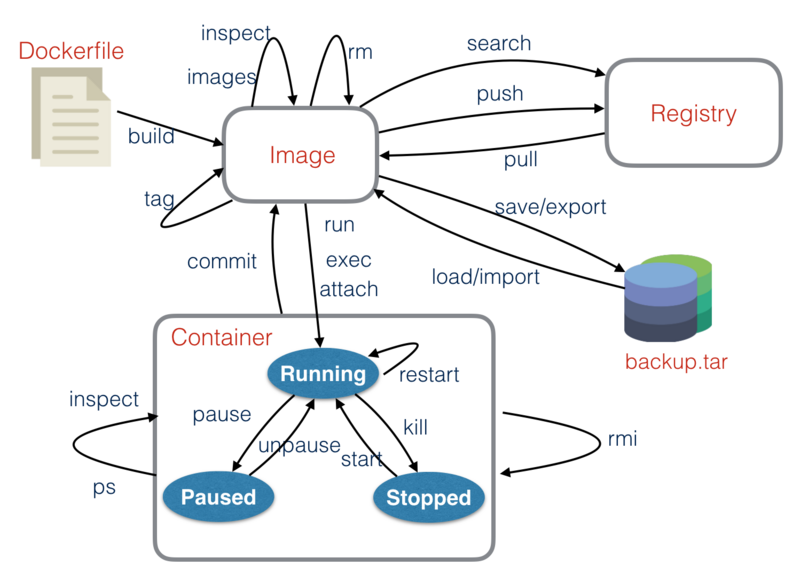

::: tip

**Docker 属于 Linux 容器的一种封装，提供简单易用的容器使用接口**。它是目前最流行的 Linux 容器解决方案。Docker 轻巧快速。它为基于虚拟机管理程序的虚拟机提供了可行、经济、高效的替代方案，因此您可以利用更多的计算能力来实现业务目标。Docker 非常适合于高密度环境以及中小型部署，而您可以用更少的资源做更多的事情。

:::

<!-- more -->

## 概要

**相关链接：**

[Docker 官网](https://www.docker.com/)

[Github Docker 源码](https://github.com/docker/docker-ce)

[Docker官网命令文档](https://docs.docker.com/engine/reference/commandline/cli/?spm=5176.8351553.0.0.4f441991dVcHxY)

[Docker中文文档](http://www.dockerinfo.net/document)

[阿里云镜像容器](https://cr.console.aliyun.com/cn-hangzhou/instances)

### Docker架构


### 安装

Docker 是一个开源的商业产品，有两个版本：社区版（Community Edition，缩写为 CE）和企业版（Enterprise Edition，缩写为 EE）。企业版包含了一些收费服务，个人开发者一般用不到，一般安装社区版，[参考](https://www.runoob.com/docker/centos-docker-install.html)

```shell
# 官方安装脚本自动安装
curl -fsSL https://get.docker.com | bash -s docker --mirror Aliyun

# 手动安装，如已经安装需要卸载旧版本
sudo yum remove docker \
                  docker-client \
                  docker-client-latest \
                  docker-common \
                  docker-latest \
                  docker-latest-logrotate \
                  docker-logrotate \
                  docker-engine

# 设置仓库
sudo yum install -y yum-utils \
  device-mapper-persistent-data \
  lvm2
  
# 添加源地址
sudo yum-config-manager \
    --add-repo \
    http://mirrors.aliyun.com/docker-ce/linux/centos/docker-ce.repo

# 安装 Docker Engine-Community
sudo yum install docker-ce docker-ce-cli containerd.io

# 启动 Docker
sudo systemctl start docker
```

::: details ubuntu安装docker

```shell
前提是先执行apt-get update  apt-get upgrade

如果还出现这个问题 依次执行下面的步骤：

#添加docker源、
sudo echo "deb https://download.docker.com/linux/ubuntu zesty edge" > /etc/apt/sources.list.d/docker.list

#支持解析https
apt-get install -y apt-transport-https ca-certificates curl software-properties-common

#添加GPG密钥
curl -fsSL https://download.docker.com/linux/ubuntu/gpg | sudo apt-key add -

#设置存储库位置
add-apt-repository "deb [arch=amd64] https://download.docker.com/linux/ubuntu $(lsb_release -cs) stable"

#执行安装命令
apt-get install -y docker-ce

如果还是不行 就再跑一次update然后执行安装命令。我的环境就是这么装起来的。
```

:::

### 查看docker信息

| 指令               | 说明                                  | 参数 | 示例 |
| ------------------ | ------------------------------------- | ---- | ---- |
| **docker info**    | 查看docker 系统信息，包括镜像和容器数 |      |      |
| **docker version** | 查看docker的版本信息                  |      |      |

## Docker指令



### 生命周期管理

| 指令               | 说明             | 参数                                                         | 示例                                                 |
| ------------------ | ---------------- | ------------------------------------------------------------ | ---------------------------------------------------- |
| **docker run**     | 创建容器并运行   |                                                              | `docker run --name killer-nginx -p 8900:80 -d nginx` |
| **docker start**   | 启动容器         | 容器id或容器名称                                             | `Docker start nginx`                                 |
| **docker stop**    | 停止容器         | 容器id或容器名称                                             | `Docker stop nginx`                                  |
| **docker restart** | 重启容器         | 容器id或容器名称                                             | `docker restart nginx`                               |
| **docker kill**    | 杀掉运行中的容器 | 容器id或容器名称                                             | `docker kill nginx`                                  |
| **docker rm**      | 删除容器         | `-f `：强制删除一个运行中的容器<br/>` -l `：移除容器间的网络连接，而非容器本身<br/>`-v `：删除与容器关联的卷 | `docker rm nginx`                                    |
| **docker exec**    | 进入容器执行命令 | `-d `：分离模式: 在后台运行<br/>`-i `：即使没有附加也保持STDIN 打开<br/>`-t `：分配一个伪终端 | `docker exec -it centos /bin/bash`                   |

::: details docker run options 参数说明

| 参数              | 说明                                                         | 示例                                   |
| ----------------- | ------------------------------------------------------------ | -------------------------------------- |
| **-a**            | 指定标准输入输出内容类型，可选 **STDIN**/**STDOUT**/**STDERR** 三项 | **-a stdin**                           |
| **-d**            | 后台运行容器，并返回容器ID                                   |                                        |
| **-i**            | 以交互模式运行容器，通常与 -t 同时使用                       |                                        |
| **-P**            | 随机端口映射，容器内部端口**随机**映射到主机的端口           |                                        |
| **-p**            | 指定端口映射，格式为：主机(宿主)端口:容器端口****            | **-p 3306:3306**                       |
| **-t**            | 为容器重新分配一个伪输入终端，通常与 -i 同时使用             |                                        |
| **--name**        | 为容器指定一个名称                                           | **--name mysql**                       |
| **--dns**         | 指定容器使用的DNS服务器，默认和宿主一致                      | **--dns 8.8.8.8**                      |
| **-h**            | 指定容器的hostname                                           |                                        |
| **-e**            | 设置环境变量                                                 | **-e username="ritchie":**             |
| **--env-file=[]** | 从指定文件读入环境变量                                       |                                        |
| **--cpuset**      | 绑定容器到指定CPU运行                                        | **--cpuset="0-2" or --cpuset="0,1,2"** |
| **-m**            | 设置容器使用内存最大值                                       |                                        |
| **--net**         | 指定容器的网络连接类型，支持 **bridge**/**host**/**none**/**container**: 四种类型 | **--net="bridge"**                     |
| **--link=[]**     | 添加链接到另一个容器                                         |                                        |
| **--expose=[]**   | 开放一个端口或一组端口                                       |                                        |
| **-v**            | 绑定一个卷                                                   |                                        |

:::

### 容器管理

#### 常用指令

| 指令            | 说明                     | 参数                                                         | 示例                           |
| --------------- | ------------------------ | ------------------------------------------------------------ | ------------------------------ |
| **docker ps**   | 列出容器                 | `-a`：所有容器                                               | `docker ps -a`                 |
| **docker port** | 列出指定的容器的端口映射 |                                                              | `docker port mysql`            |
| **docker logs** | 获取容器的日志           | `-f `：跟踪日志输出<br/>`--since`：显示某个开始时间的所有日志<br/>`-t`：显示时间戳<br/>`--tail `：仅列出最新N条容器日志 | `docker logs --tail=10 mysql ` |

::: details docker ps 显示进程信息

| CONTAINER ID | IMAGE      | COMMAND              | CREATED        | STATUS   | PORTS                                     | NAMES              |
| ------------ | ---------- | -------------------- | -------------- | -------- | ----------------------------------------- | ------------------ |
| 容器id       | 使用的镜像 | 启动容器时运行的命令 | 容器的创建时间 | 容器状态 | 容器的端口信息和使用的连接类型（tcp\udp） | 自动分配的容器名称 |

:::

#### 批量操作容器

```shell
docker 启动所有的容器
docker start $(docker ps -a | awk '{ print $1}' | tail -n +2)

docker 关闭所有的容器
docker stop $(docker ps -a | awk '{ print $1}' | tail -n +2)

docker 删除所有的容器
docker rm $(docker ps -a | awk '{ print $1}' | tail -n +2)

docker 删除所有的镜像
docker rmi $(docker images | awk '{print $3}' |tail -n +2)
```

### 镜像管理

#### 常用指令

| 指令                    | 说明                                                         | 示例                  |
| ----------------------- | ------------------------------------------------------------ | --------------------- |
| **docker login/logout** | 登陆到一个Docker镜像仓库，如果未指定镜像仓库地址，默认为官方仓库 | `docker login`        |
| **docker pull**         | 从镜像仓库中拉取或者更新指定镜像                             | `docker pull mysql`   |
| **docker push**         | 将本地的镜像上传到镜像仓库,要先登陆到镜像仓库                | `docker push mysql`   |
| **docker search**       | 搜索镜像                                                     | `docker search mysql` |

#### 远程仓库

| 指令                                                         | 说明                 |
| ------------------------------------------------------------ | -------------------- |
| **docker login --username=hjwu_enzo registry.cn-hangzhou.aliyuncs.com** | 登陆到阿里云镜像仓库 |
| **docker pull registry.cn-hangzhou.aliyuncs.com/aliyun-docker-rep/nginx:[镜像版本号]** | 从resgistry拉取镜像  |
| **docker tag [ImageId] registry.cn-hangzhou.aliyuncs.com/aliyun-docker-rep/nginx:[镜像版本号]** |                      |
| **docker push registry.cn-hangzhou.aliyuncs.com/aliyun-docker-rep/nginx:[镜像版本号]** | 将进项推送到registry |

#### 本地镜像管理

| 指令              | 说明                                                         | 参数                                                         | 示例                     |
| ----------------- | ------------------------------------------------------------ | ------------------------------------------------------------ | ------------------------ |
| **docker images** | 列出本地镜像                                                 | `-a`：列出本地所有的镜像；<br/>`--digests`：显示镜像的摘要信息；<br/>`-f`：显示满足条件的镜像；<br/>`--format` ：指定返回值的模板文件；<br/>`--no-trunc `：显示完整的镜像信息；<br/>`-q` ：只显示镜像ID | `docker images -a`       |
| **docker rmi**    | 删除本地一个或多少镜像                                       | `-f `：强制删除                                              | `docker rmi images_name` |
| **docker tag**    | 标记本地镜像，将其归入某一仓库                               |                                                              |                          |
| **docker build**  | 用于根据 `Dockerfile` 创建镜像                               | `-f `：指定要使用的Dockerfile路径；                          |                          |
| **docker save**   | 将镜像导出为文件                                             | `-o`：输出到的文件                                           |                          |
| **docker load**   | 将文件导入为镜像                                             |                                                              |                          |
| **docker export** | 将容器导出为文件，**会保存该镜像操作的历史记录**，文件较大   |                                                              |                          |
| **docker import** | 将文件导入为镜像，**会丢失所有元数据和历史记录**，仅保留容器当时的状态 |                                                              |                          |

### 容器间通信

* 通过容器ip访问（不推荐）

  容器重启后，ip会变动，查看还得进入容器内查看（其他方式暂时不知道）

* 通过宿主机ip访问

  容器启动后对外暴露一个端口，通过 宿主机ip : 容器暴露对外的端口 完成访问，

* 通过link建立连接（官方不推荐使用）

  容器启动的时候带参数 `--link container_name: container_alias_name(可选)`，是的 源容器可以和被链接的容器相互通信，并且被链接的容器可以获得源容器的一些数据，比如环境变量

  ```shell
  # 源容器：mysql
  docker run -itd --name test-mysql -e MYSQL_ROOT_PASSWORD=root mysql:5.7
  #被链接容器 centos
  docker run -itd --name test-centos --link test-mysql:mysql  centos /bin/bash
  #进入test-centos
  docker exec -it test-centos /bin/bash
  # 通过 连接名 或者别名 连接mysql
  [root@23423423234]# mysql -h test-mysql -uroot -p 
  [root@23423423234]# mysql -h mysql -uroot -p 
  
  # centos 能ping通 mysql, 返过来不行
  ```

* 通过networks （推荐）

   docker network来创建一个桥接网络，在docker run的时候将容器指定到新创建的桥接网络中，这样同一桥接网络中的容器就可以通过互相访问

  ```shell
  # 创建网络
  docker network create my_net
  
  # 查看创建的网络
  docker network ls
  
  # 创建 mysql 容器，加入 test-network 网络，
  docker run -it --network my_net --network-alias mysql_net  -e MYSQL_ROOT_PASSWORD=123 mysql:5.7
  
  docker run -it --network my_net --network-alias centos_net  centos /bin/bash
  
  # 容器之间可以相互ping通，因为两个容器都再同一个 network内
  docker exec -it centos ping php
  ```

### 其他：

#### 容器和宿主机相互拷贝文件

```shell
# 将容器配配置文件复制到宿主机：docker container cp 容器名:容器内文件的路径  宿主机路径
docker container cp nginx:/etc/nginx /mydata/nginx/

# 将宿主机的文件拷贝到容器中：docker cp 宿主机路径 容器名:容器内路径
docker cp /mydata/elasticsearch/elasticsearch-analysis-ik-7.6.2.zip elasticsearch:/usr/share/elasticsearch
```

#### dive分析工具

dive是镜像构建分析工具，有效查看你的镜像构建浪费的空间

```shell
# 项目地址
https://github.com/wagoodman/dive

# 常用指令
dive <your-image-tag>
```

## 示例：

### MySql

```shell
# docker mysql 将数据存储在本地目录
docker run -d -e MYSQL_ROOT_PASSWORD=admin --name mysql -v /data/mysql/data:/var/lib/mysql -p 3306:3306 mysql 

# 指定配置文件
docker run -d -e MYSQL_ROOT_PASSWORD=admin --name mysql -v /data/mysql/my.cnf:/etc/mysql/my.cnf -v /data/mysql/data:/var/lib/mysql -p 3306:3306 mysql 
```

### Elasticsearch

```shell
# 拉取elasticsearch镜像
docker pull elasticsearch:7.6.2

# 修改虚拟内存区域大小，否则会因为过小而无法启动
sysctl -w vm.max_map_count=262144

# 使用如下命令启动Elasticsearch服务
docker run -p 9200:9200 -p 9300:9300 --name elasticsearch \
-e "discovery.type=single-node" \
-e "cluster.name=elasticsearch" \
-v /mydata/elasticsearch/plugins:/usr/share/elasticsearch/plugins \
-v /mydata/elasticsearch/data:/usr/share/elasticsearch/data \
-d elasticsearch:7.6.2

# 启动时会发现/usr/share/elasticsearch/data目录没有访问权限，只需要修改/mydata/elasticsearch/data目录的权限，再重新启动即可
chmod 777 /mydata/elasticsearch/data/

# 安装中文分词器IKAnalyzer，并重新启动
docker exec -it elasticsearch /bin/bash

#此命令需要在容器中运行，如果成功，后面两个则不需要，直接重启容器即可
elasticsearch-plugin install https://github.com/medcl/elasticsearch-analysis-ik/releases/download/v7.6.2/elasticsearch-analysis-ik-7.6.2.zip

# 容器中直接下载安装可能会报错，注意版本要保持一致，可以在宿主机下载后复制到容器中，
docker cp /mydata/elasticsearch/elasticsearch-analysis-ik-7.6.2.zip elasticsearch:/usr/share/elasticsearch

# 安装中文分词器
elasticsearch-plugin install /usr/share/elasticsearch/elasticsearch-analysis-ik-7.6.2.zip

docker restart elasticsearch
```

### Kibana

```shell
# 下载镜像
docker pull kibana:7.6.2

# 启动服务
docker run --name kibana -p 5601:5601 \
--restart=always \
--link elasticsearch:es \
-e "elasticsearch.hosts=http://es:9200" \
-d kibana:7.6.2

# 将配置文件服务拷贝出来
sudo docker container cp kibana:/usr/share/kibana/config/ /mydata/kibana/

# 末尾添加 i18n.locale: zh-CN，可以启动中文
vi /mydata/kibana/kibana.yml

# 删除容器，添加参数，重启一次
-v /mydata/kibana:/usr/share/kibana/config

# 开启防火墙
firewall-cmd --zone=public --add-port=5601/tcp --permanent
firewall-cmd --reload

# 访问地址
访问地址进行测试：http://192.168.3.101:5601
```

::: nginx 代理 kibana

kabana.yml

```yaml
server.name: kibana
server.host: "0"
server.basePath: "/kibana"
server.rewriteBasePath: true
elasticsearch.hosts: [ "http://elasticsearch:9200" ]
xpack.monitoring.ui.container.elasticsearch.enabled: true
i18n.locale: "zh-CN"
```

nginx.conf

```shell
server{
	listen       80;
	server_name  localhost;
	location /kibana {
 		proxy_pass http://172.26.11.142:5601;
 	}
}
```

:::

## 其他

### docker图形化工具

内置界面简单明了，常规的关于docker状态，容器、镜像的管理，日志查看都可以在图形化界面操作，减少指令

```shell
# 下载镜像
docker pull portainer/portainer

# 启动容器
docker run -p 9000:9000 -p 8000:8000 --name portainer \
--restart=always \
-v /var/run/docker.sock:/var/run/docker.sock \
-v /mydata/portainer/data:/data \
-v /mydata/portainer/public:/public \	# 中文汉化
-d portainer/portainer
```

中文汉化，下载插件，[百度云](https://pan.baidu.com/s/13ra6jXHR_7vajLLlf5GVEw)，提取码：`nzue`

下载后解压上传到`mydata/portainer/public`目录下，`unzip`解压，如果启动报错的，请找一下最新版的汉化包，重启解压后覆盖public文件夹，或者启动参数去除链接宿主机汉化那一步，启动原版即可

### docker迁移默认目录

docker 默认保存目录在 `/var/lib/docker`，随着拉取镜像镜像、构建的容器增加，内存不够，就会导致服务启动新的镜像

[参考1](https://www.cnblogs.com/insist-forever/p/11739207.html)

```shell
# 挂载外置磁盘 mount 挂载的磁盘 需要挂载的目录
mount dev/vdb /DATA 

# 先停止docker服务，在挂载的磁盘目录创建一个docker保存的目录 /DATA/docker
mkdir /DATA/docker

# 迁移/var/lib/docker目录下面的文件到 /home/docker/lib
rsync -r -avz /var/lib/docker /DATA/docker/lib/

# 修改配置文件，（同步的时候把父文件夹一并同步过来，实际上的目录应在 /home/docker/lib/docker ）
vi /usr/lib/systemd/system/docker.service

[Service]
ExecStart=
ExecStart=/usr/bin/dockerd --graph=/DATA/docker/lib/docker

# 重新加载docker
systemctl disable docker
systemctl enable docker
systemctl daemon-reload
systemctl restart docker

# 查看配置是否修改
docker info
Docker Root Dir: /DATA/docker/lib/docker
```

### IDEA连接虚拟机docker

IDEA直接连接虚拟机docker，本地即可执行打包构建，docker默认通讯方式只支持本地形式调用，不支持TCP远程，需要修改配置文件实现

* 方法一（推荐）

```shell
# sudo vim /etc/docker/daemon.js    没有新建

{
  "exec-opts": ["native.cgroupdriver=systemd"],
  "registry-mirrors": ["https://kn0t2bca.mirror.aliyuncs.com"],
  "hosts": ["tcp://0.0.0.0:2376","unix:///var/run/docker.sock"]				# 支持本地和tcp调用
}
```

* 方法二

```shell
# sudo vim /lib/systemd/system/docker.service

# 在ExecStart配置文件的后面追加  -H tcp://0.0.0.0:2376 即可，
```

重新加载`daemon.js`：`systemctl daemon-reload`

重启docker：`systemctl start docker`

查看端口是否开放：`netstat -tulp | grep 2376`

* IDEA连接验证

settings --> Build, Execution, Deployment --> docker ： TCP socket， Engine API URL输入 `tcp://192.168.40.100:2376`，虚拟机的ip:设置的端口，软件会自动识别，下方出现`Connection successful`说明连接成功，下方的Service拓展栏里可以查看docker的镜像、容器等，本地的工程的`Dockerfile`也可以愉快的进行build镜像了

## 本机上传到服务器（自己当前情况）

```shell
# 下载东西 curl -O https://XXX

# 宿主机器下载，上传到服务器
sftp name@ip

# 上传
put local_file remote_file

# 下载
get remote_file local_file

# 服务器连接sftp
sudo sftp name@ip
```
