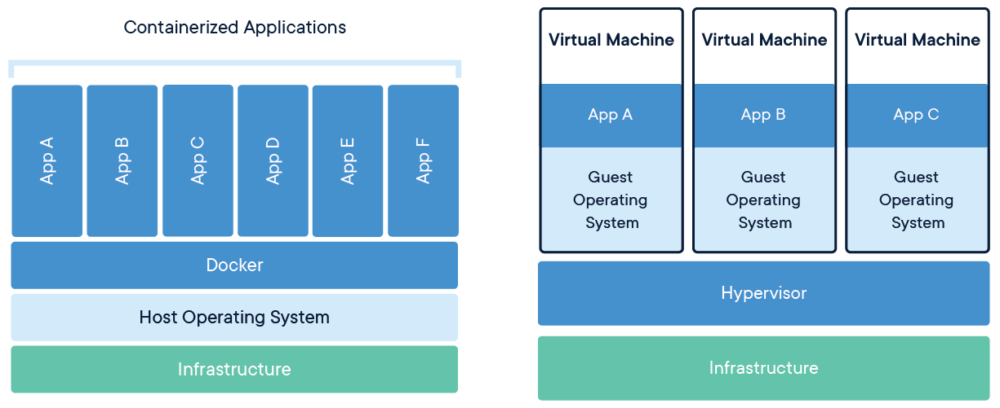

::: tip

:::

<!-- more -->

### 容器相关

### Docker

**Docker 属于 Linux 容器的一种封装，提供简单易用的容器使用接口**。它是目前最流行的 Linux 容器解决方案。Docker 轻巧快速。它为基于虚拟机管理程序的虚拟机提供了可行、经济、高效的替代方案，因此您可以利用更多的计算能力来实现业务目标。Docker 非常适合于高密度环境以及中小型部署，而您可以用更少的资源做更多的事情

### Dockerfile

Dockerfile 是拿来构建自定义镜像的，并没有直接生成容器。只是可以在运行镜像时运行容器而已，若是想使用这个镜像的话还需要使用docker run命令来运行这个镜像，从而生成运行一个容器

### docker-compose

docker-compose.yml是用来编排项目的，里面包含使用各种镜像创建的容器服务，使用的镜像可以是网络上的，也可以是根据使用Dockerfile文件来build生成的镜像，相当于是把上一步的这个工作给做了

docker-compose可以在单个服务器上创建多个容器，多个副本

### Docker Swarm

Docker Swarm 是 Docker 的集群管理工具。它将 Docker 主机池转变为单个虚拟 Docker 主机。 Docker Swarm 提供了标准的 Docker API，所有任何已经与 Docker 守护程序通信的工具都可以使用 Swarm 轻松地扩展到多个主机

docker swarm可以在多个服务器创建多个容器，多个副本，实现集群，负载均衡， 不过现在主要被Kubernetes替代

### Kubernetes

google基于自己的borg开发的容器编排工具，目前主流，能实现docker swarm能实现的功能，且其他功能更加强大

### Docker容器和传统虚拟机的区别

容器是在**操作系统层面**上实现虚拟化，直接复用本地主机的操作系统，而传统方式则是在**硬件层面**实现

容器

### 工具推荐：

**dive**

A tool for exploring a docker image, layer contents, and discovering ways to shrink the size of your Docker/OCI image.
https://github.com/wagoodman/dive

**ctop**

容器监控工具
https://github.com/bcicen/ctop

**lazydocker**

A simple terminal UI for both docker and docker-compose, written in Go with the gocui library.
https://github.com/jesseduffield/lazydocker