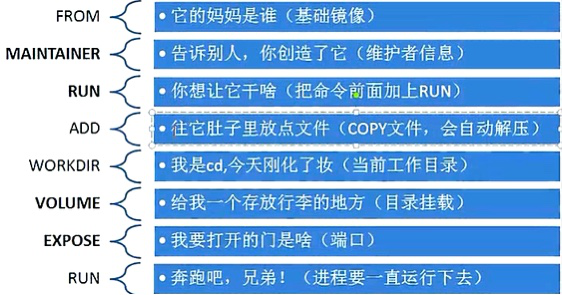

::: tip

**Dockerfile**是一个包含用于组合映像的命令的文本文档。可以使用在命令行中调用任何命令。 Docker通过读取`Dockerfile`中的指令自动生成映像。

:::

<!-- more -->

## 概要

**相关链接：**

[Docker 官网](https://www.docker.com/)

[Github Docker 源码](https://github.com/docker/docker-ce)

[Docker官网命令文档](https://docs.docker.com/engine/reference/commandline/cli/?spm=5176.8351553.0.0.4f441991dVcHxY)

[Docker中文文档](http://www.dockerinfo.net/document)

[Alpine](https://yeasy.gitbook.io/docker_practice/os/alpine)

[阿里云镜像容器](https://cr.console.aliyun.com/cn-hangzhou/instances)

## 基本结构

一般分为四部分，第一条指令必须是`FROM`。一个声明以`＃`字符开头则被视为注释。可以在Docker文件中使用`RUN`，`CMD`，`FROM`，`EXPOSE`，`ENV`等指令。

* 基础镜像信息
* 维护者信息
* 镜像操作指令
* 容器启动时执行指令

## 指令说明

| 指令           | 格式                                                         | 说明                                                         |
| -------------- | ------------------------------------------------------------ | ------------------------------------------------------------ |
| **FROM**       | `FROM <image>` <br><br>`FROM <image>:<tag>` <br><br/>`FROM <image> @ <digest>` | 指定基础镜像，必须为第一个命令，<br/>tag，digest为可选的，不写会拉取latest版本的基础镜像 |
| **MAINTAINER** | `MAINTAINER <name>` <br><br/>`MAINTAINER <email>`            | 维护者信息                                                   |
| **LABEL**      | `LABEL <key>=<value> <key>=<value> ...`                      | 用于为镜像添加元数据                                         |
| **ENV**        | `ENV <key> <value>`                                          | 设置环境变量                                                 |
| **RUN**        | `RUN <command>`<br><br/>`RUN ["executable", "param1", "param2"]` | 构建镜像时执行的命令                                         |
| **ADD**        | `ADD <src>... <dest>`<br><br>`ADD ["<src>",... "<dest>"] `   | 将本地文件添加到容器中，<br>tar类型文件会自动解压(网络压缩资源不会被解压)，<br>可以访问网络资源，类似wget<br>`ADD ["<src>",... "<dest>"] `用于支持包含空格的路径 |
| **COPY**       | `COPY <src>... <dest>`                                       | 功能类似ADD，但是是不会自动解压文件，也不能访问网络资源      |
| **CMD**        | `CMD ["executable","param1","param2"]`                       | 构建容器后调用，也就是在容器启动时才进行调用。               |
| **ENTRYPOINT** | `ENTRYPOINT ["executable", "param1", "param2"]`              | 配置容器，使其可执行化。配合CMD可省去"application"，只使用参数 |
| **EXPOSE**     | `EXPOSE <port> [<port>...]`                                  | 指定于外界交互的端口                                         |
| **VOLUME**     | `VOLUME ["/path/to/dir"]`                                    | 用于指定持久化目录                                           |
| **WORKDIR**    | `WORKDIR /path/to/workdir`                                   | 工作目录，类似于cd命令                                       |
| **USER**       | `USER user`<br/><br/>`USER user:group`<br/><br/>`USER uid`<br/><br/>`USER uid:gid`<br/><br/>`USER user:gid`<br/><br/>`USER uid:group` | 指定运行容器时的用户名或 UID，后续的 RUN 也会使用指定用户<br/>使用USER指定用户时，可以使用用户名、UID或GID，或是两者的组合<br/>当服务不需要管理员权限时，可以通过该命令指定运行用户，并且可以在之前创建所需要的用户 |
| **ARG**        | `ARG <name>[=<default value>]`                               | 用于指定传递给构建运行时的变量                               |
| **ONBUILD**    | `ONBUILD [INSTRUCTION]`                                      | 用于设置镜像触发器                                           |

## 指令示例

### FROM

```dockerfile
# 格式：
　　FROM <image>
　　FROM <image>:<tag>
　　FROM <image>@<digest>
# 示例：
　　FROM mysql:5.6
# 注：
　　# tag或digest是可选的，如果不使用这两个值时，会使用latest版本的基础镜像
```

### MAINTAINER

```dockerfile
# 格式：
    MAINTAINER <name>
# 示例：
    MAINTAINER Jasper Xu
    MAINTAINER sorex@163.com
    MAINTAINER Jasper Xu <sorex@163.com>
# 注：
	# maintainer已过时，通过label设置元数据
	# LABEL maintainer="loenzo"
```

### LABEL

```dockerfile
# 格式：
	LABEL <key>=<value> <key>=<value> <key>=<value> ...
# 示例：
	LABEL version="1.0" description="这是一个Web服务器" by="IT笔录"
# 注：
　　# 使用LABEL指定元数据时，一条LABEL指定可以指定一或多条元数据，指定多条元数据时不同元数据之间通过空格分隔。
　　# 推荐将所有的元数据通过一条LABEL指令指定，以免生成过多的中间镜像。
```

### ENV

```dockerfile
# 格式：
	# <key>之后的所有内容均会被视为其<value>的组成部分，因此，一次只能设置一个变量
    ENV <key> <value>  
    # 可以设置多个变量，每个变量为一个"<key>=<value>"的键值对，
    # 如果<key>中包含空格，可以使用\来进行转义，也可以通过""来进行标示；另外，反斜线也可以用于续行
    ENV <key>=<value> ...  
# 示例：
    ENV myName John Doe
    ENV myDog Rex The Dog
    ENV myCat=fluffy
```

### RUN

```dockerfile
# RUN用于在镜像容器中执行命令，其有以下两种命令执行方式：
# shell执行
# 格式：
    RUN <command>
# exec执行
# 格式：
    RUN ["executable", "param1", "param2"]
# 示例：
    RUN ["executable", "param1", "param2"]
    RUN apk update
    RUN ["/etc/execfile", "arg1", "arg1"]
# 注：　　
	# RUN指令创建的中间镜像会被缓存，并会在下次构建中使用。
	# 如果不想使用这些缓存镜像，可以在构建时指定--no-cache参数，如：docker build --no-cache
```

### ADD

```dockerfile
# 格式：
    ADD <src>... <dest>
    ADD ["<src>",... "<dest>"]  # 用于支持包含空格的路径
# 示例：
    ADD hom* /mydir/          # 添加所有以"hom"开头的文件
    ADD hom?.txt /mydir/      # ? 替代一个单字符,例如："home.txt"
    ADD test relativeDir/     # 添加 "test" 到 `WORKDIR`/relativeDir/
    ADD test /absoluteDir/    # 添加 "test" 到 /absoluteDir/
```

### COPY

```dockerfile
# 复制本地文件推荐使用COPY
# 格式：
    COPY <src>... <dest>
# 示例：
    COPY hom* /mydir/          # 添加所有以"hom"开头的文件
```

### CMD

```dockerfile
# 格式：
    CMD ["executable","param1","param2"] (执行可执行文件，优先)
    CMD ["param1","param2"] (设置了ENTRYPOINT，则直接调用ENTRYPOINT添加参数)
    CMD command param1 param2 (执行shell内部命令)
# 示例：
    CMD echo "This is a test." | wc -
    CMD ["/usr/bin/wc","--help"]
# 注： 　　
	# CMD不同于RUN，CMD用于指定在容器启动时所要执行的命令，而RUN用于指定镜像构建时所要执行的命令。
```

### ENTRYPOINT

```dockerfile
# 格式：
    ENTRYPOINT ["executable", "param1", "param2"] (可执行文件, 优先)
    ENTRYPOINT command param1 param2 (shell内部命令)
# 示例：
    FROM ubuntu
    ENTRYPOINT ["top", "-b"]
    CMD ["-c"]
# 注：　　　
	# ENTRYPOINT与CMD非常类似，不同的是通过docker run执行的命令不会覆盖ENTRYPOINT
	# 而docker run命令中指定的任何参数，都会被当做参数再次传递给ENTRYPOINT
	# Dockerfile中只允许有一个ENTRYPOINT命令，多指定时会覆盖前面的设置，而只执行最后的ENTRYPOINT指令
```

### EXPOSE

```dockerfile
# 格式：
    EXPOSE <port> [<port>...]
# 示例：
    EXPOSE 80 443
    EXPOSE 8080    
    EXPOSE 11211/tcp 11211/udp
# 注：　　
	# EXPOSE并不会让容器的端口访问到主机, 写再dockerfile里面可以让根据镜像创建容器的人指导需要暴露的端口
	# 要使其可访问，需要在docker run运行容器时通过-p来发布这些端口，或通过-P参数来发布EXPOSE导出的所有端口
```

### VOLUME

```dockerfile
# 格式：
    VOLUME ["/path/to/dir"]
# 示例：
    VOLUME ["/data"]
    VOLUME ["/var/www", "/var/log/apache2", "/etc/apache2"
# 注：　　
	# 一个卷可以存在于一个或多个容器的指定目录，该目录可以绕过联合文件系统，并具有以下功能：
	# 1 卷可以容器间共享和重用
	# 2 容器并不一定要和其它容器共享卷
	# 3 修改卷后会立即生效
	# 4 对卷的修改不会对镜像产生影响
	# 5 卷会一直存在，直到没有任何容器在使用它
```

### WORKDIR

```dockerfile
# 格式：
    WORKDIR /path/to/workdir
# 示例：
    WORKDIR /a  (这时工作目录为/a)
    WORKDIR b  (这时工作目录为/a/b)
    WORKDIR c  (这时工作目录为/a/b/c)
# 注：　　
	# 通过WORKDIR设置工作目录后，Dockerfile 中其后的命令RUN、CMD、ENTRYPOINT、ADD、COPY等命令都会在该目录下执行
	# 在使用docker run运行容器时，可以通过-w 参数覆盖构建时所设置的工作目录。
```

### USER

```dockerfile
# 格式:　　
	USER user　　
	USER user:group　　
	USER uid　　
	USER uid:gid　　
	USER user:gid　　
	USER uid:group
# 示例：    　　
	USER www
# 注：
　　# 使用USER指定用户后，Dockerfile中其后的命令RUN、CMD、ENTRYPOINT都将使用该用户
　　# 镜像构建完成后，通过docker run运行容器时，可以通过-u参数来覆盖所指定的用户。
```

### ARG

```dockerfile
# 格式：
    ARG <name>[=<default value>]
# 示例：
    ARG site
    ARG build_user=www
```

### ONBUILD

```dockerfile
# 格式：
　　ONBUILD [INSTRUCTION]
# 示例：
　　ONBUILD ADD . /app/src
　　ONBUILD RUN /usr/local/bin/python-build --dir /app/src
# 注：
　　# 当所构建的镜像被用做其它镜像的基础镜像，该镜像中的触发器将会被钥触发
```

## 通俗说明



## Dockerfile示例

```dockerfile
# This my first nginx Dockerfile
# Version 1.0

# Base images 基础镜像
FROM centos

#MAINTAINER 维护者信息
MAINTAINER tianfeiyu 

#ENV 设置环境变量
ENV PATH /usr/local/nginx/sbin:$PATH

#ADD  文件放在当前目录下，拷过去会自动解压
ADD nginx-1.8.0.tar.gz /usr/local/  
ADD epel-release-latest-7.noarch.rpm /usr/local/  

#RUN 执行以下命令 
RUN rpm -ivh /usr/local/epel-release-latest-7.noarch.rpm
RUN yum install -y wget lftp gcc gcc-c++ make openssl-devel pcre-devel pcre && yum clean all
RUN useradd -s /sbin/nologin -M www

#WORKDIR 相当于cd
WORKDIR /usr/local/nginx-1.8.0 

RUN ./configure --prefix=/usr/local/nginx --user=www --group=www --with-http_ssl_module --with-pcre && make && make install

RUN echo "daemon off;" >> /etc/nginx.conf

#EXPOSE 映射端口
EXPOSE 80

#CMD 运行以下命令
CMD ["nginx"]
```

::: details 其他示例

```dockerfile
# 基础镜像
FROM debian:buster-slim

# maintainer已过时，通过label设置元数据
LABEL maintainer="jiangliu"

# 指定工作目录
WORKDIR /usr/local

ENV LANG C.UTF-8
ENV JAVA_HOME /usr/local/jdk1.8.0_111
ENV PATH $JAVA_HOME/bin:$PATH

# 指定时区，针对基于Debian和CentOS的镜像，可以直接指定环境变量即可
ENV TZ Asia/Shanghai

ENV JAVA_OPTS ""
ENV JAVA_ARGS ""

# 其它镜像按此方法修改时区
# RUN ln -fs /usr/share/zoneinfo/${TZ} /etc/localtime && echo ${TZ} > /etc/timezone

# 更换源
RUN echo 'deb http://mirrors.aliyun.com/debian/ buster main non-free contrib\n \
    deb-src http://mirrors.aliyun.com/debian/ buster main non-free contrib\n \
    deb http://mirrors.aliyun.com/debian-security buster/updates main\n \
    deb-src http://mirrors.aliyun.com/debian-security buster/updates main\n \
    deb http://mirrors.aliyun.com/debian/ buster-updates main non-free contrib\n \
    deb-src http://mirrors.aliyun.com/debian/ buster-updates main non-free contrib\n \
    deb http://mirrors.aliyun.com/debian/ buster-backports main non-free contrib\n \
    deb-src http://mirrors.aliyun.com/debian/ buster-backports main non-free contrib\n' \
    > /etc/apt/sources.list 

RUN apt-get update

RUN apt-get install -y wget

# RUN wget -O jdk.tar.gz https://github.com/AdoptOpenJDK/openjdk8-upstream-binaries/releases/download/jdk8u265-b01/OpenJDK8U-jre_x64_linux_8u265b01.tar.gz \
# -- no-check-certificate

RUN wget -O jdk.tar.gz http://ftp.cqrd.x/software/RDTools/jdk/javase/8/jdk-8u111-linux-x64.tar.gz

RUN tar -xf jdk.tar.gz

RUN rm -fr jdk.tar.gz

# 复制文件到镜像中
COPY file-server-1.0-SNAPSHOT.jar /app.jar

# 容器启动执行入口
# java [options] -jar filename [args]
ENTRYPOINT java ${JAVA_OPTS} -jar /app.jar ${JAVA_ARGS}
# 声明容器提供服务的端口，方便配置映射
EXPOSE 8080

# 指定默认的参数
# CMD [""]
```

:::

::: details 整合run指令，优化后：

```dockerfile
# 基础镜像
FROM debian:buster-slim

# maintainer已过时，通过label设置元数据
LABEL maintainer="jiangliu"

# 指定工作目录
WORKDIR /usr/local

ENV LANG C.UTF-8
ENV JAVA_HOME /usr/local/jdk1.8.0_111
ENV PATH $JAVA_HOME/bin:$PATH

# 指定时区，针对基于Debian和CentOS的镜像，可以直接指定环境变量即可
ENV TZ Asia/Shanghai

# 其它镜像按此方法修改时区
# RUN ln -fs /usr/share/zoneinfo/${TZ} /etc/localtime && echo ${TZ} > /etc/timezone

# 合并所有的可执行脚本
RUN set -x \
    echo 'deb http://mirrors.aliyun.com/debian/ buster main non-free contrib\n \
    deb-src http://mirrors.aliyun.com/debian/ buster main non-free contrib\n \
    deb http://mirrors.aliyun.com/debian-security buster/updates main\n \
    deb-src http://mirrors.aliyun.com/debian-security buster/updates main\n \
    deb http://mirrors.aliyun.com/debian/ buster-updates main non-free contrib\n \
    deb-src http://mirrors.aliyun.com/debian/ buster-updates main non-free contrib\n \
    deb http://mirrors.aliyun.com/debian/ buster-backports main non-free contrib\n \
    deb-src http://mirrors.aliyun.com/debian/ buster-backports main non-free contrib\n'  > /etc/apt/sources.list \
    && apt-get update \
    && apt-get install -y wget \
    && wget -O jdk.tar.gz http://ftp.cqrd.x/software/RDTools/jdk/javase/8/jdk-8u111-linux-x64.tar.gz \
    && tar -xf jdk.tar.gz \
    && rm -fr jdk.tar.gz \
    && apt-get remove --purge --auto-remove -y wget \
    && rm -rf /var/lib/apt/lists/*
```

:::