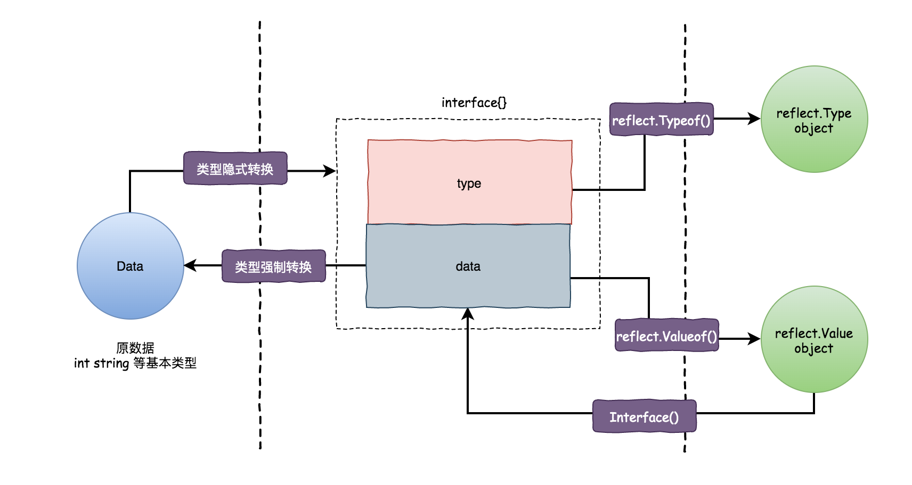

::: tip

:::

# 反射的基本概念

Go语言提供了一种机制在运行时更新和检查变量的值、调用变量的方法和变量支持的内在操作，但是在编译时并不知道这些变量的具体类型，这种机制被称为反射。反射也可以让我们将类型本身作为第一类的值类型处理。

反射是指在程序运行期对程序本身进行访问和修改的能力，程序在编译时变量被转换为内存地址，变量名不会被编译器写入到可执行部分，在运行程序时程序无法获取自身的信息。

支持反射的语言可以在程序编译期将变量的反射信息，如字段名称、类型信息、结构体信息等整合到可执行文件中，并给程序提供接口访问反射信息，这样就可以在程序运行期获取类型的反射信息，并且有能力修改它们。

## 反射两种类型：Type 和 Value

**真实世界，反射世界**

这里学习原作者的理解，将反射前环境称为 **真实世界**，而将反射后的环境称为 **反射世界**，比喻不严谨，但是便于理解，所以我这里也跟着这么学的

**反射类型**

go反射中有两种类型是反射的核心，学习`reflect`包，需要先学习，`reflect.Type`、`reflect.Value`

他们分别对应真实世界里的`type`和`value`

一个接口变量，分别由`type`和`data`一起组成的，在反射世界里，两者是分开存在，分别由`reflect.Type`、`reflect.Value`表现

::: details eflect.Type`是以接口的形式存在的，部分代码

```go
type Type interface {
    Align() int
    FieldAlign() int
    Method(int) Method
    MethodByName(string) (Method, bool)
    NumMethod() int
    Name() string
    PkgPath() string
    Size() uintptr
    String() string
    Kind() Kind
    Implements(u Type) bool
    AssignableTo(u Type) bool
    ConvertibleTo(u Type) bool
    Comparable() bool
    Bits() int
    ChanDir() ChanDir
    IsVariadic() bool
    Elem() Type
    Field(i int) StructField
    FieldByIndex(index []int) StructField
    FieldByName(name string) (StructField, bool)
    FieldByNameFunc(match func(string) bool) (StructField, bool)
    In(i int) Type
    Key() Type
    Len() int
    NumField() int
    NumIn() int
    NumOut() int
    Out(i int) Type
    common() *rtype
    uncommon() *uncommonType
}
```

:::

::: details  reflect.Value 是以一个结构体的形式存在

```go
type Value struct {
    typ *rtype
    ptr unsafe.Pointer
    flag
}
```

:::

::: details reflect.Value 接收的方法

```go
Addr
Bool
Bytes
runes
CanAddr
CanSet
Call
CallSlice
call
Cap
Close
Complex
Elem
Field
FieldByIndex
FieldByName
FieldByNameFunc
Float
Index
Int
CanInterface
Interface
InterfaceData
IsNil
IsValid
IsZero
Kind
Len
MapIndex
MapKeys
MapRange
Method
NumMethod
MethodByName
NumField
OverflowComplex
OverflowFloat
OverflowInt
OverflowUint
Pointer
Recv
recv
Send
send
Set
SetBool
SetBytes
setRunes
SetComplex
SetFloat
SetInt
SetLen
SetCap
SetMapIndex
SetUint
SetPointer
SetString
Slice
Slice3
String
TryRecv
TrySend
Type
Uint
UnsafeAddr
assignTo
Convert
```

:::

## 反射的三大定律

Go 语言里有个反射三定律，是你在学习反射时，很重要的参考：

* Reflection goes from interface value to reflection object；反射可以将接口类型变量 转换为“反射类型对象”；
* Reflection goes from reflection object to interface value；反射可以将 “反射类型对象”转换为 接口类型变量；
* To modify a reflection object, the value must be settable；如果要修改 “反射类型对象” 其类型必须是 可写的；

第一定律、第二定律图片详解，[来源](http://golang.iswbm.com/en/latest/c02/c02_07.html)



### 第一定律

反射可以将接口类型变量 转换为“反射类型对象”

```go
func reflectOne(age interface{}) {

	t := reflect.TypeOf(age)
	v := reflect.ValueOf(age)

	// 从接口变量到反射对象
	fmt.Printf("从接口变量到反射对象：Type对象的类型为 %T, value对象类型为 %T \n", t, v)

	// 从反射对象到接口变量
	i := v.Interface().(int)
	fmt.Printf("从反射对象到接口变量：新对象的类型为 %T 值为 %v \n", i, i)
}
// 原始接口变量的类型为 int，值为 25 
// 从接口变量到反射对象：Type对象的类型为 *reflect.rtype, value对象类型为 reflect.Value 
// 从接口变量到反射对象：Type对象的类型为 *reflect.rtype, value对象类型为 reflect.Value 
```

### 第二定律

反射可以将 “反射类型对象”转换为 接口类型变量

当然了，最后转换后的对象，静态类型为 `interface{}` ，如果要转成最初的原始类型，需要再类型断言转换一下，也就是`interface().(int)`里面传对应的类型，

这点没有看到，，我是否加`.(Cat)`返回结果一致

```go
func reflectTwo(cat Cat) {

	reflectTypeCat := reflect.TypeOf(cat)
	reflectValueCat := reflect.ValueOf(cat)
	fmt.Printf("从接口变量到反射对象：Type对象的类型为 %T, value对象类型为 %T \n", reflectTypeCat, reflectValueCat)

	originCat := reflectValueCat.Interface().(Cat)
	fmt.Printf("从反射对象到接口变量：新对象的类型为 %T 值为 %v \n", originCat, originCat)
}
// 从接口变量到反射对象：Type对象的类型为 *reflect.rtype, value对象类型为 reflect.Value 
// 从反射对象到接口变量：新对象的类型为 main.Cat 值为 {miao} 
```

### 第三定律

如果要修改 “反射类型对象” 其类型必须是 可写的

- 不是接收变量指针创建的反射对象，是不具备『**可写性**』的
- 是否具备『**可写性**』，可使用 `CanSet()` 来获取得知
- 对不具备『**可写性**』的对象进行修改，是没有意义的，也认为是不合法的，因此会报错

要让反射对象具备可写性，需要注意两点

1. 创建反射对象时传入变量的指针
2. 使用 `Elem()`函数返回指针指向的数据

```go
func reflectCanWriteFour(cat Cat) {
	v := reflect.ValueOf(cat)
	fmt.Println("cat 可写性：", v.CanSet())
	v1 := reflect.ValueOf(&cat.name)
	v2 := v1.Elem()
	fmt.Println("cat 可写性：", v2.CanSet())
	v2.SetString("dog")
	fmt.Println("通过反射对象进行更新后，真实世界里 name 变为：", v2)
}

// age 可写性为: false
// age 可写性为: true
// cat 可写性： false
// cat 可写性： true
// 通过反射对象进行更新后，真实世界里 name 变为： dog
```

## 反射的函数

### 获取类型

Type 对象 和 Value 对象都可以通过 Kind() 方法返回对应的接口变量的基础类型

```go
reflect.TypeOf(m).Kind()
```


# 练习源码

[Reflect](https://gitee.com/myMagicRain/go-study/tree/master/src/Reflect)