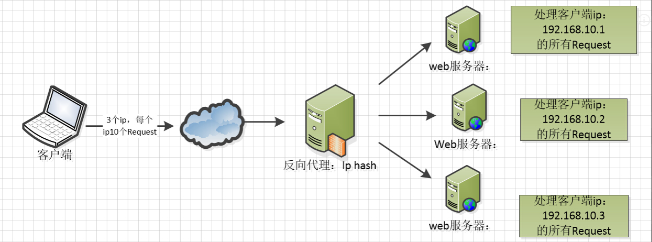

::: tip

nginx是一款自由的、开源的、高性能的HTTP服务器和反向代理服务器；同时也是一个IMAP、POP3、SMTP代理服务器；nginx可以作为一个HTTP服务器进行网站的发布处理，另外nginx可以作为反向代理进行负载均衡的实现。

:::

<!-- more -->

# 下载安装

* [官网下载](http://nginx.org/en/download.html)，解压安装，或者`yum`安装

```shell
# 进入解压目录

#一键安装需要依赖
yum -y install gcc zlib zlib-devel pcre-devel openssl openssl-devel

# 编译安装，依次执行，添加模块,根据需求可选
./configure --prefix=/usr/local/webserver/nginx --with-http_stub_status_module --with-http_ssl_module --with-pcre=/usr/local/src/pcre-8.35
make
make install

# 查看版本
nginx -v

# 防火墙开放80端口号
firewall-cmd --permanent --zone=public --add-port=80/tcp
# 重启防火墙	
firewall-cmd --reload
```

* 常用指令

```shell
nginx						# 启动nginx, 访问 http://服务器ip，看到ngnix欢迎页面即可
nginx -t					# 检查配置文件语法是否正确
nginx -s reload				# 重新载入配置文件
nginx -s reopen				# 重启 Nginx
nginx -s stop				# 停止 Nginx
nginx -s quit				# 正常停止 Nginx
```

# Nginx常用功能

## 参考文档

* [Nginx中文文档](https://www.nginx.cn/doc/index.html)

## 反向代理

反向代理图文说明，摘自**菜鸟教程**


* **左边：正向代理**

理解：正向代理可以用VPN来理解，访问外网，需要科学上网，通过VPN工具，自动选取为最有线路，比如香港、新加坡节点，通过它们去访问了 谷歌 等应用，谷歌他们看到的就是通过香港、新加坡动态代理过去的ip，并不是我们真实的ip

* **右边：反向代理**

理解：反向代理可以随便用一个电商例子理解，电商发展壮大，后台不可能一直是在一台服务器上部署单体应用，会不断的拆分升级，还会多部署一些服务器好负载均衡。问题就来了，这么多的后台应用服务器，用户又不知道服务器ip，怎么指导具体访问哪一台呢，这时候就需要 Ngnix了，用户访问 Nginx ，Nginx服务转发到对应的服务器就行了，这对于用于来说就是无感的，用户就访问量的应用的域名，然后得到了自己想要的结果

## 负载均衡

* weight轮询（默认）

  简单理解就是进来的请求，nginx按顺序轮流转发到后台服务器，确保每台服务器接收的请求数量均匀，不会导致单台服务器接收大量请求导致超时或服务器崩溃


* 加权轮询

  有些服务器的配置要高一些，如果和其他服务器接收一样数量的请求，未免有些资源浪费，所以，对服务器可以配置权重，权重越高，可接受的请求就越多


* ip hash

  客户调用某台服务器登陆了应用，在应用内调用其他业务，如果转发到了其他服务器，由于session不共享，会认为客户没有登陆而要求重新登陆，这样显然是不合理的，所以 每个请求按照发起客户端的ip的hash结果进行匹配，确保固定ip的客户端访问到同一台后台服务器




## 其他优点

* 支持高并发连接，tomcat大概支持500个，nginx支持50000个连接；
* 内存消耗低，开源免费，成本低廉，支持集群，配置简单，稳定性高，支持热部署
* 支持Rewrite重写，能够根据域名、URL的不同，将http请求分到不同的后端服务器群组
* 支持静态文件处理，降低网络开销等

# Nignx配置

## 配置文件基本模块说明

* `main`：用于进行nginx全局信息的配置
* `events`：用于nginx工作模式的配置
* `http`：用于进行http协议信息的一些配置
* `server`：用于进行服务器访问信息的配置
* `location`：用于进行访问路由的配置
* `upstream`：用于进行负载均衡的配置

```shell
main								# 全局配置

events {							# nginx工作模式配置
}

http {								# http设置
    ....    
    upstream name {					# 负载均衡配置
        ....
    }    

    server {						# 服务器主机配置，可多个
        ....
        location {					# 路由配置，可多个，支持正则
            ....
        }
    }

    server {
        location {
            ....
        }
    }
}
```

## main模块

**示例**

```shell
# user nobody nobody;
worker_processes 2;
# error_log logs/error.log
# error_log logs/error.log notice
# error_log logs/error.log info
# pid logs/nginx.pid
worker_rlimit_nofile 1024;
```

**说明**

* `user`：用来指定nginx worker进程运行用户以及用户组，默认nobody账号运行
* `worker_processes`：指定nginx要开启的子进程数量，运行过程中监控每个进程消耗内存(一般几M~几十M不等)根据实际情况进行调整，`通常数量是CPU内核数量的整数倍`
* `error_log`：定义错误日志文件的位置及输出级别【debug / info / notice / warn / error / crit】
* `pid`：用来指定进程id的存储文件的位置
* `worker_rlimit_nofile`：用于指定一个进程可以打开最多文件数量的描述

## events模块

**示例**

```shell
event {
    worker_connections 1024;
    multi_accept on;
    use epoll;
}
```

**说明**

- `worker_connections`：指定最大可以同时接收的连接数量，这里一定要注意，最大连接数量是和worker processes共同决定的。
- `multi_accept`：配置指定nginx在收到一个新连接通知后尽可能多的接受更多的连接
- `use epoll`：配置指定了线程轮询的方法，如果是linux2.6+，使用epoll，如果是BSD如Mac请使用Kqueue

## http模块

作为web服务器，http模块是nginx最核心的一个模块，配置项也是比较多的，项目中会设置到很多的实际业务场景，需要根据硬件信息进行适当的配置，常规情况下，使用默认配置即可！

**示例**

```shell
http {
    ##
    # 基础配置
    ##

    sendfile on;
    tcp_nopush on;
    tcp_nodelay on;
    keepalive_timeout 65;
    types_hash_max_size 2048;
    # server_tokens off;

    # server_names_hash_bucket_size 64;
    # server_name_in_redirect off;

    include /etc/nginx/mime.types;
    default_type application/octet-stream;

    ##
    # SSL证书配置
    ##

    ssl_protocols TLSv1 TLSv1.1 TLSv1.2; # Dropping SSLv3, ref: POODLE
    ssl_prefer_server_ciphers on;

    ##
    # 日志配置
    ##

    access_log /var/log/nginx/access.log;
    error_log /var/log/nginx/error.log;

    ##
    # Gzip 压缩配置
    ##

    gzip on;
    gzip_disable "msie6";

    # gzip_vary on;
    # gzip_proxied any;
    # gzip_comp_level 6;
    # gzip_buffers 16 8k;
    # gzip_http_version 1.1;
    # gzip_types text/plain text/css application/json application/javascript
 text/xml application/xml application/xml+rss text/javascript;

    ##
    # 虚拟主机配置
    ##

    include /etc/nginx/conf.d/*.conf;
    include /etc/nginx/sites-enabled/*;
}
```

**说明**

* 基础配置

```shell
sendfile on		# 配置on让sendfile发挥作用，将文件的回写过程交给数据缓冲去去完成，而不是放在应用中完成，这样的话在性能提升有有好处
tc_nopush on	# 让nginx在一个数据包中发送所有的头文件，而不是一个一个单独发
tcp_nodelay on	# 让nginx不要缓存数据，而是一段一段发送，如果数据的传输有实时性的要求的话可以配置它，发送完一小段数据就立刻能得到返回值，但是不要滥用哦

keepalive_timeout 10		# 给客户端分配连接超时时间，服务器会在这个时间过后关闭连接。一般设置时间较短，可以让nginx工作持续性更好
client_header_timeout 10	# 设置请求头的超时时间
client_body_timeout 10		# 设置请求体的超时时间
send_timeout 10				# 指定客户端响应超时时间，如果客户端两次操作间隔超过这个时间，服务器就会关闭这个链接

limit_conn_zone $binary_remote_addr zone=addr:5m	# 设置用于保存各种key的共享内存的参数，
limit_conn addr 100			# 给定的key设置最大连接数

server_tokens				# 虽然不会让nginx执行速度更快，但是可以在错误页面关闭nginx版本提示，对于网站安全性的提升有好处哦
include /etc/nginx/mime.types			# 指定在当前文件中包含另一个文件的指令
default_type application/octet-stream	# 指定默认处理的文件类型可以是二进制
type_hash_max_size 2048	# 混淆数据，影响三列冲突率，值越大消耗内存越多，散列key冲突率会降低，检索速度更快；值越小key，占用内存较少，冲突率越高，检索速度变慢
```

* 日志配置

```shell
access_log logs/access.log	# 设置存储访问记录的日志
error_log logs/error.log	# 设置存储记录错误发生的日志
```

* SSL证书加密

```shell
ssl_protocols	# 指令用于启动特定的加密协议，nginx在1.1.13和1.0.12版本后默认是ssl_protocols SSLv3 TLSv1 TLSv1.1 TLSv1.2，TLSv1.1与TLSv1.2要确保OpenSSL >= 1.0.1 ，SSLv3 现在还有很多地方在用但有不少被攻击的漏洞。
ssl prefer server ciphers	# 设置协商加密算法时，优先使用我们服务端的加密套件，而不是客户端浏览器的加密套件
```

* 压缩配置

```shell
gzip			# 是告诉nginx采用gzip压缩的形式发送数据。这将会减少我们发送的数据量。
gzip_disable	# 为指定的客户端禁用gzip功能。我们设置成IE6或者更低版本以使我们的方案能够广泛兼容。
gzip_static		# 告诉nginx在压缩资源之前，先查找是否有预先gzip处理过的资源。这要求你预先压缩你的文件（在这个例子中被注释掉了），从而允许你使用最高压缩比，这样nginx就不用再压缩这些文件了（想要更详尽的gzip_static的信息，请点击这里）。
gzip_proxied	# 允许或者禁止压缩基于请求和响应的响应流。我们设置为any，意味着将会压缩所有的请求。
gzip_min_length	# 设置对数据启用压缩的最少字节数。如果一个请求小于1000字节，我们最好不要压缩它，因为压缩这些小的数据会降低处理此请求的所有进程的速度。
gzip_comp_level	# 设置数据的压缩等级。这个等级可以是1-9之间的任意数值，9是最慢但是压缩比最大的。我们设置为4，这是一个比较折中的设置。
gzip_type		# 设置需要压缩的数据格式。上面例子中已经有一些了，你也可以再添加更多的格式。
```

* 文件缓存配置

```shell
open_file_cache				# 打开缓存的同时也指定了缓存最大数目，以及缓存的时间。我们可以设置一个相对高的最大时间，这样我们可以在它们不活动超过20秒后清除掉。
open_file_cache_valid		# 在open_file_cache中指定检测正确信息的间隔时间。
open_file_cache_min_uses	# 定义了open_file_cache中指令参数不活动时间期间里最小的文件数。
open_file_cache_errors		# 指定了当搜索一个文件时是否缓存错误信息，也包括再次给配置中添加文件。我们也包括了服务器模块，这些是在不同文件中定义的。如果你的服务器模块不在这些位置，你就得修改这一行来指定正确的位置。
```

## server模块

server模块配置是http模块中的一个子模块，用来定义一个虚拟访问主机，也就是一个虚拟服务器的配置信息

- `server`：一个虚拟主机的配置，一个http中可以配置多个server
- `server_name`：用力啊指定ip地址或者域名，多个配置之间用空格分隔
- `root`：表示整个server虚拟主机内的根目录，所有当前主机中web项目的根目录
- `index`：用户访问web网站时的全局首页
- `charset`：用于设置www/路径中配置的网页的默认编码格式
- `access_log`：用于指定该虚拟主机服务器中的访问记录日志存放路径
- `error_log`：用于指定该虚拟主机服务器中访问错误日志的存放路径

```shell
server {
    listen	80;
    server_name localhost    192.168.1.100;
    root		/nginx/www;
    index		index.php index.html index.html;
    charset		utf-8;
    access_log	logs/access.log;
    error_log	logs/error.log;
    ......
}
```

## location模块

location模块是nginx配置中出现最多的一个配置，主要用于配置路由访问信息

在路由访问信息配置中关联到反向代理、负载均衡等等各项功能，所以location模块也是一个非常重要的配置模块，配置反向代理，通过proxy_set配置让客户端访问透明化

```shell
location / {
    root	/nginx/www;
    index	index.php index.html index.htm;

    proxy_pass http://localhost:8888;
    proxy_set_header X-real-ip $remote_addr;
    proxy_set_header Host $http_host;
}
```

* `location /`：表示匹配访问根目录
* `root`：用于指定访问根目录时，访问虚拟主机的web目录
* `index`：在不指定访问具体资源时，默认展示的资源文件列表

常见的占位符配置

- `$remote_addr` 与 `$http_x_forwarded_for` ：用以记录客户端的ip地址；
- `$remote_user`： 用来记录客户端用户名称；
- `$time_local`  ：用来记录访问时间与时区；
- `$request` ：用来记录请求的url与http协议；
- `$status` ：用来记录请求状态；成功是200；
- `$body_bytes_s ent`： 记录发送给客户端文件主体内容大小；
- `$http_referer` ：用来记录从那个页面链接访问过来的；
- `$http_user_agent`： 记录客户端浏览器的相关信息；

## upstream模块

upstream模块主要负责负载均衡的配置，通过默认的轮询调度方式来分发请求到后端服务器

```shell
upstream name {
    ip_hash;
    server 192.168.1.100:8000;
    server 192.168.1.100:8001 down;
    server 192.168.1.100:8002 max_fails=3;
    server 192.168.1.100:8003 fail_timeout=20s;
    server 192.168.1.100:8004 max_fails=3 fail_timeout=20s;
}
```

- `name`：指localtion块中， proxy_pass http://name 自定义设置的名字
- `ip_hash`：指定请求调度算法，默认是weight权重轮询调度，可以指定
- `server host:port`：分发服务器的列表配置
- `-- down`：表示该主机暂停服务
- `-- max_fails`：表示失败最大次数，超过失败最大次数暂停服务
- `-- fail_timeout`：表示如果请求受理失败，暂停指定的时间之后重新发起请求


# nginx zuul gateway 区别

[参考](https://www.jianshu.com/p/8d82c6c2e5ee)：

* nginx 

  免费， 高性能，Nginx适合于服务器端负载均衡，功能更强大，因为Nginx整合一些脚本语言( Nginx + lua )

* zuul

  springCloud套件，适合微服务实现网关，采用 Ribbon + Eureka 来实现本地负载均衡.

* gateway

  gateway对比zuul多依赖了spring-webflux，在spring的支持下，功能更强大，内部实现了限流、负载均衡等，扩展性也更强，但同时也限制了仅适合于Spring Cloud套件，而zuul则可以扩展至其他微服务框架中，其内部没有实现限流、负载均衡等


