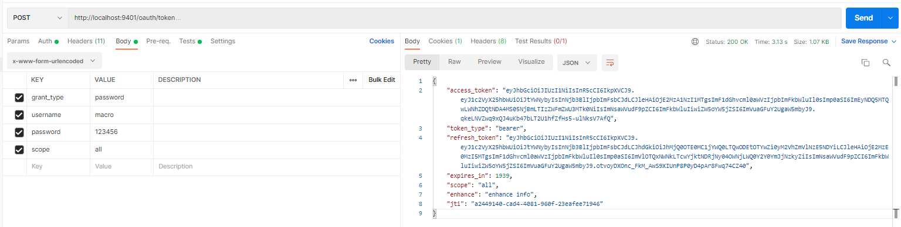
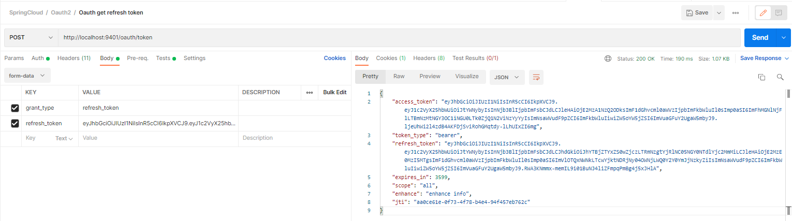

::: tip

Spring Cloud Security 为构建安全的SpringBoot应用提供了一系列解决方案，结合Oauth2还可以实现更多功能，比如使用JWT令牌存储信息，刷新令牌功能

:::
<!-- more -->

# 概念

## JWT

JWT是JSON WEB TOKEN的缩写，它是基于 RFC 7519 标准定义的一种可以安全传输的的JSON对象，由于使用了数字签名，所以是可信任和安全的

## JWT的组成

- JWT token的格式：header.payload.signature；

::: details header中用于存放签名的生成算法

```json
{
    "alg": "HS256",
    "typ": "JWT"
}
```

:::

::: details payload中用于存放数据，比如过期时间、用户名、用户所拥有的权限等

```json
{
    "exp": 1572682831,
    "user_name": "macro",
    "authorities": [
        "admin"
    ],
    "jti": "c1a0645a-28b5-4468-b4c7-9623131853af",
    "client_id": "admin",
    "scope": [
        "all"
    ]
}
```

:::

signature为以header和payload生成的签名，一旦header和payload被篡改，验证将失败

* JWT实例，jwt为一行，这里以.间隔分成三行，便于查看，可以在该[网站](https://jwt.io/)解析

```
eyJhbGciOiJIUzI1NiIsInR5cCI6IkpXVCJ9.
eyJleHAiOjE1NzI2ODI4MzEsInVzZXJfbmFtZSI6Im1hY3JvIiwiYXV0aG9yaXRpZXMiOlsiYWRtaW4iXSwianRpIjoiYzFhMDY0NWEtMjhiNS00NDY4LWI0YzctOTYyMzEzMTg1M2FmIiwiY2xpZW50X2lkIjoiYWRtaW4iLCJzY29wZSI6WyJhbGwiXX0.
x4i6sRN49R6JSjd5hd1Fr2DdEMBsYdC4KB6Uw1huXPg
```

# 创建Oauth2-jwt-server模块

* pom.xml

  该模块在Oauth2-server上延申，除了之前的依赖，还需要添加下列依赖

```xml
<!-- redis -->
<dependency>
    <groupId>org.springframework.boot</groupId>
    <artifactId>spring-boot-starter-data-redis</artifactId>
</dependency>
<!-- jwt工具 -->
<dependency>
    <groupId>io.jsonwebtoken</groupId>
    <artifactId>jjwt</artifactId>
    <version>0.9.0</version>
</dependency>
<!-- hutool工具 -->
<dependency>
    <groupId>cn.hutool</groupId>
    <artifactId>hutool-all</artifactId>
    <version>4.6.3</version>
</dependency>
```

* application.yaml

```yaml
server:
  port: 9401
spring:
  application:
    name: oauth2-jwt-service
  redis: #redis相关配置
    password: 123456 #有密码时设置
```

* 代码配置

  之前的示例，是将令牌存储在内存中，多个服务的时候会造成令牌无法使用，Spring security 有两种存储令牌的方式，JWT和Redis

::: details Redis存储配置

```java
@Configuration
public class RedisTokenStoreConfig {

    @Autowired
    private RedisConnectionFactory redisConnectionFactory;

    @Bean
    public TokenStore redisTokenStore (){
        return new RedisTokenStore(redisConnectionFactory);
    }
}
```

:::

::: details JWT存储配置

```java
@Configuration
public class JwtTokenStoreConfig {

//    @Bean
    public TokenStore jwtTokenStore() {
        return new JwtTokenStore(jwtAccessTokenConverter());
    }

    @Bean
    public JwtAccessTokenConverter jwtAccessTokenConverter() {
        JwtAccessTokenConverter accessTokenConverter = new JwtAccessTokenConverter();
        //配置JWT使用的秘钥
        accessTokenConverter.setSigningKey("test_key");
        return accessTokenConverter;
    }

    @Bean
    public JwtTokenEnhancer jwtTokenEnhancer() {
        return new JwtTokenEnhancer();
    }
}
```

:::

::: details 扩展JWT中存储的内容

更多的时候我们需要在 JWT 中还存储其他内容信息，这里扩展一个key为`enhance`，value为`enhance info`的数据

* 继承TokenEnhancer实现一个JWT内容增强器

```java
public class JwtTokenEnhancer implements TokenEnhancer {
    @Override
    public OAuth2AccessToken enhance(OAuth2AccessToken accessToken, OAuth2Authentication authentication) {
        Map<String, Object> info = new HashMap<>();
        info.put("enhance", "enhance info");
        ((DefaultOAuth2AccessToken) accessToken).setAdditionalInformation(info);
        return accessToken;
    }
}
```

- 创建一个JwtTokenEnhancer实例

```java
@Configuration
public class JwtTokenStoreConfig {

    //省略代码...

    @Bean
    public JwtTokenEnhancer jwtTokenEnhancer() {
        return new JwtTokenEnhancer();
    }
}
```

:::

::: details 认证服务器配置，选择不同的令牌储存方式

```java
@Configuration
@EnableAuthorizationServer
public class AuthorizationServerConfig extends AuthorizationServerConfigurerAdapter {

    @Autowired
    private PasswordEncoder passwordEncoder;

    @Autowired
    private AuthenticationManager authenticationManager;

    @Autowired
    private UserService userService;

    @Autowired
    @Qualifier("redisTokenStore")
//  @Qualifier("jwtTokenStore") 选择存储方式
    private TokenStore tokenStore;
    
    @Autowired
    private JwtAccessTokenConverter jwtAccessTokenConverter;
    @Autowired
    private JwtTokenEnhancer jwtTokenEnhancer;

    /**
     * 使用密码模式需要配置
     */
    @Override
    public void configure(AuthorizationServerEndpointsConfigurer endpoints) {
        TokenEnhancerChain enhancerChain = new TokenEnhancerChain();
        List<TokenEnhancer> delegates = new ArrayList<>();
        //配置JWT的内容增强器
        delegates.add(jwtTokenEnhancer);
        delegates.add(jwtAccessTokenConverter);
        enhancerChain.setTokenEnhancers(delegates);
        endpoints.authenticationManager(authenticationManager)
                .userDetailsService(userService)
                //配置令牌存储策略
                .tokenStore(tokenStore)
                .accessTokenConverter(jwtAccessTokenConverter)
                .tokenEnhancer(enhancerChain);
    }

    @Override
    public void configure(ClientDetailsServiceConfigurer clients) throws Exception {
        clients.inMemory()
                .withClient("admin")
                .secret(passwordEncoder.encode("admin123456"))
                .accessTokenValiditySeconds(3600)
                .refreshTokenValiditySeconds(864000)
//                .redirectUris("http://www.baidu.com")
                //单点登录时配置
                .redirectUris("http://localhost:9501/login")
                .autoApprove(true) //自动授权配置
                .scopes("all")
                .authorizedGrantTypes("authorization_code","password","refresh_token");
    }

    @Override
    public void configure(AuthorizationServerSecurityConfigurer security) {
        // 获取密钥需要身份认证，使用单点登录时必须配置
        security.tokenKeyAccess("isAuthenticated()");
    }
}
```

::: details 调用接口，使用 jwt 和 hutool 工具包解析JWT内容

```java
@RestController
@RequestMapping("/user")
public class UserController {

    @GetMapping("/getCurrentUser")
    public Object getCurrentUser(Authentication authentication, HttpServletRequest request) {
        System.out.println(authentication);
        String header = request.getHeader("Authorization");
        // 获取 JWT token Bearer后面的部分
        String token = StrUtil.subAfter(header, "Bearer ", false);
        return Jwts.parser()
            	// JWT 签名的密钥
                .setSigningKey("test_key".getBytes(StandardCharsets.UTF_8))
                .parseClaimsJws(token)
                .getBody();
    }
}
```

:::

# 验证：

* 获取令牌

  PostMan 发送 post请求 `http://localhost:9401/oauth/token`，使用密码方式

  Header：Basic Auth，输入用户名、密码

  Body：grant_type:password；username:macro；password:123456；scope:all



* 携带令牌，访问接口，redis可以查看token存储

  PostMan 发送 post请求 `http://localhost:9401/user/getCurrentUser`，Bearer Token 输入上面的 access_token

::: details 返回示例

```json
{
    "user_name": "macro",
    "scope": [
        "all"
    ],
    "exp": 1630572518,
    "authorities": [
        "admin"
    ],
    "jti": "a2449140-cad4-4081-960f-23eafee71946",
    "client_id": "admin",
    "enhance": "enhance info"
}
```

:::

* 刷新令牌

  Spring Cloud Security 中使用oauth2时，如果令牌失效了，可以使用刷新令牌通过`refresh_token`的授权模式再次获取`access_token`

  PostMan 发送 post请求 `http://localhost:9401/oauth/token`，

  Body：grant_type：refresh_token；refresh_token：XXX

