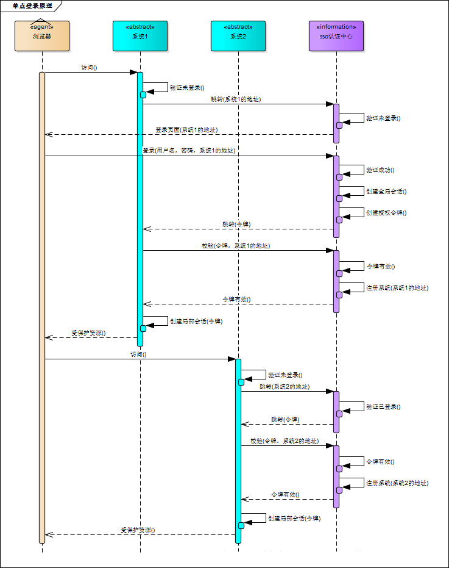
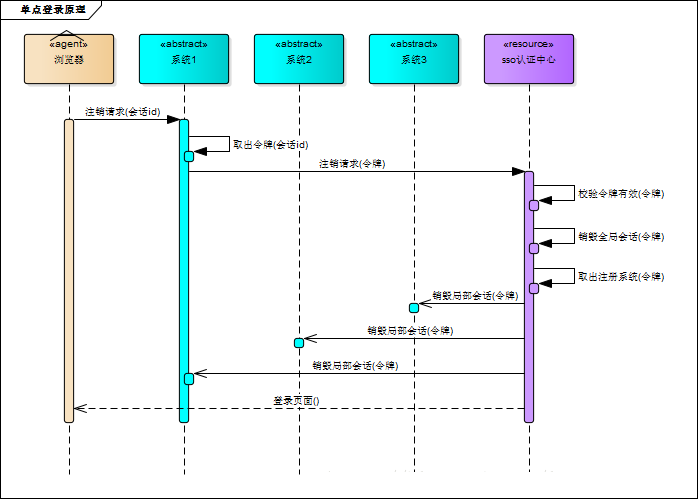
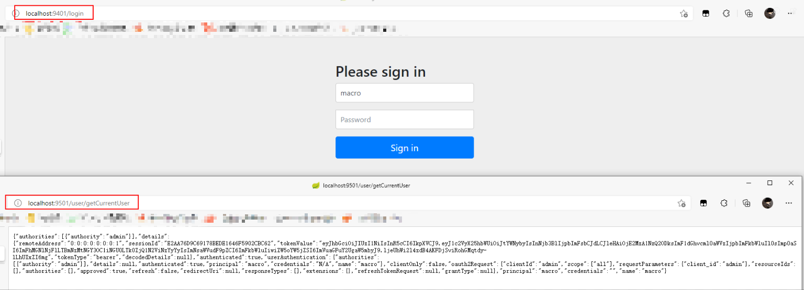
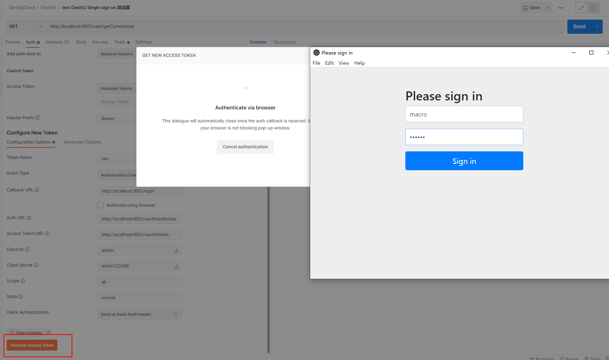
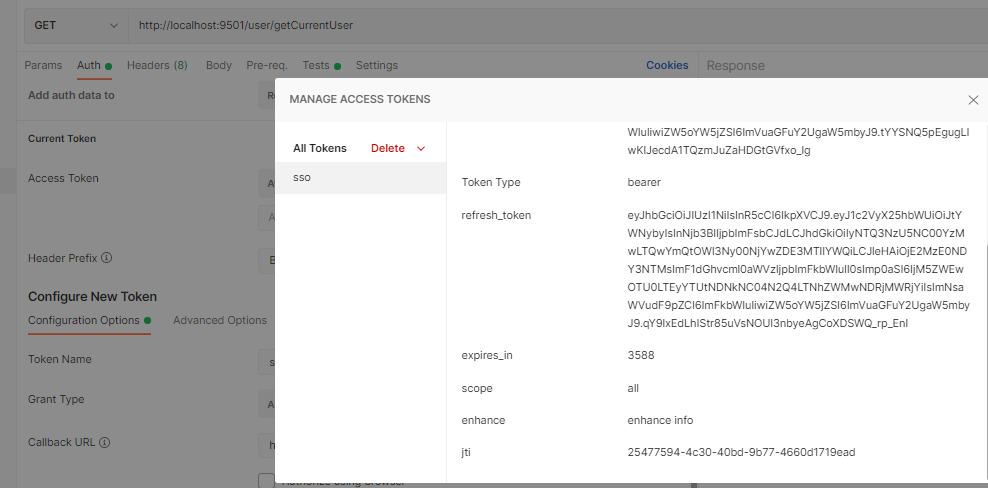
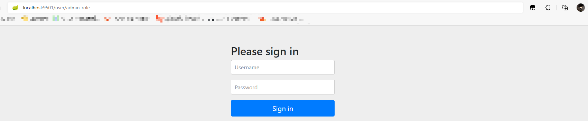
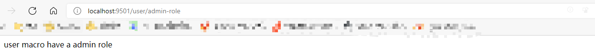
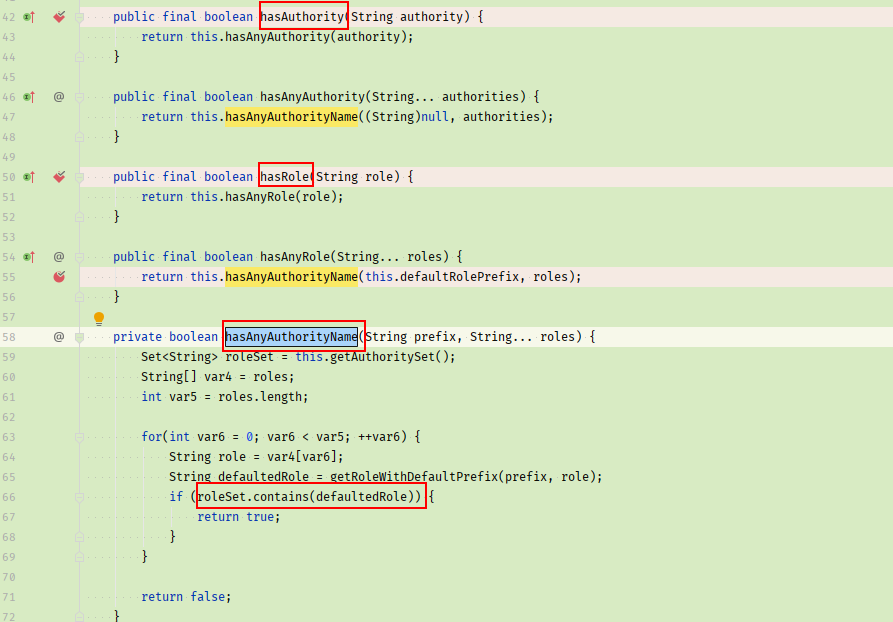

::: tip

Spring Cloud Security 为构建安全的SpringBoot应用提供了一系列解决方案，结合Oauth2可以实现单点登录功能

:::
<!-- more -->

# 概念

## 单点登陆

单点登录（Single Sign On）指的是当有多个系统需要登录时，用户只需登录一个系统，就可以访问其他需要登录的系统而无需登录

Spring Security：用于安全访问的，这里我们我们用来做访问权限控制

OAuth2：是用来允许用户授权第三方应用访问他在另一个服务器上的资源的一种协议，它不是用来做单点登录的，但我们可以利用它来实现单点登录。在本例实现SSO的过程中，受保护的资源就是用户的信息（包括，用户的基本信息，以及用户所具有的权限），而我们想要访问这这一资源就需要用户登录并授权，OAuth2服务端负责令牌的发放等操作，

JWT：这令牌的生成我们采用JWT，也就是说JWT是用来承载用户的Access_Token的

SSO：是一种点单登陆思想，或者说是一种解决方案，是抽象的，我们要做的就是按照它的这种思想去实现它

# 流程

* 单点登陆：登陆任何一个子系统，其他子系统可以直接进入



* 单点注销：注销任何一个子系统，其他子系统也会被注销



## 涉及参数

::: details Oauth2-client涉及参数详细说明

[客户端配置说明](https://andaily.com/spring-oauth-server/db_table_description.html)

`clientId`：（必须的）第三方用户的id（可理解为账号）。 

`clientSecret`：第三方应用和授权服务器之间的安全凭证(可理解为密码)

`scope`：指定客户端申请的权限范围,可选值包括read,write,trust;其实授权赋予第三方用户可以在资源服务器获取资源，第三方访问资源的一个权限，访问范围。

`resourceIds`：客户端所能访问的资源id集合

`authorizedGrantTypes`：此客户端可以使用的授权类型，默认为空。

可选值包括`authorization_code`,`password,refresh_token`,`implicit,client_credentials`

最常用的grant_type组合有: "`authorization_code,refresh_token`"(针对通过浏览器访问的客户端); "`password,refresh_token`"(针对移动设备的客户端)

`registeredRedirectUris`：客户端的重定向URI

`autoApproveScopes`：设置用户是否自动`Approval`操作, 默认值为 `false`, 可选值包括 `true`,`false`, `read`,`write`.

该字段只适用于`grant_type="authorization_code`的情况,当用户登录成功后,

若该值为`true`或支持的scope值,则会跳过用户Approve的页面, 直接授权.

`authorities`：指定客户端所拥有的Spring Security的权限值。

`accessTokenValiditySeconds`：设定客户端的`access_token`的有效时间值(单位:秒),可选, 若不设定值则使用默认的有效时间值(60 * 60 * 12, 12小时).

`refreshTokenValiditySeconds`：设定客户端的`refresh_token`的有效时间值(单位:秒),可选, 若不设定值则使用默认的有效时间值(60 * 60 * 24 * 30, 30天).

`additionalInformation`：这是一个预留的字段,在`Oauth`的流程中没有实际的使用,可选,但若设置值,必须是`JSON`格式的数据

`security.oauth2.client.client-id`：指定OAuth2 client ID.

`security.oauth2.client.client-secret`：指定OAuth2 client secret. 默认是一个随机的密码.

`security.oauth2.client.user-authorization-uri`：用户跳转去获取access token的URI（授权端）

`security.oauth2.client.access-token-uri`：指定获取access token的URI（令牌端）

`security.oauth2.resource.jwt.key-uri`：JWT token的URI

需要确保以上URL都是存在的，不然启动会报错

注：在客户端配置文件中指定`security.oauth2.client.registered-redirect-uri`客户端跳转URI不生效，需要在认证中心中指定

:::

::: details Oauth2获取token，刷新token流程

### 重点：

`/oauth/authorize`：验证 `/oauth/token`：获取token

 `/oauth/confirm_access`：用户授权

 `/oauth/error`：认证失败

 `/oauth/check_token`：资源服务器用来校验token

 `/oauth/token_key`：如果jwt模式则可以用此来从认证服务器获取公钥

 以上这些endpoint都在源码里的endpoint包里面。

#### OAuth2获取token的主要流程：

1.用户发起获取`token`的请求。

2.过滤器会验证`path`是否是认证的请求`/oauth/token`，如果为`false`，则直接返回没有后续操作。

3.过滤器通过`clientId`查询生成一个`Authentication`对象。

4.然后会通过`username`和生成的`Authentication`对象生成一个`UserDetails`对象，并检查用户是否存在。

5.以上全部通过会进入地址`/oauth/token`，即`TokenEndpoint`的`postAccessToken`方法中。

6.`postAccessToken`方法中会验证`Scope`，然后验证是否是`refreshToken`请求等。

7.之后调用AbstractTokenGranter中的grant方法。

8.`grant`方法中调用`AbstractUserDetailsAuthenticationProvider`的`authenticate`方法，通过`username`和`Authentication`对象来检索用户是否存在。

9.然后通过`DefaultTokenServices`类从`tokenStore`中获取`OAuth2AccessToken`对象。

10.然后将`OAuth2AccessToken`对象包装进响应流返回。

#### OAuth2刷新token的流程

刷新token（refresh token）的流程与获取token的流程只有⑨有所区别：

获取`token`调用的是`AbstractTokenGranter`中的`getAccessToken`方法，然后调用`tokenStore`中的`getAccessToken`方法获取`token`。

刷新`token`调用的是`RefreshTokenGranter`中的`getAccessToken`方法，然后使用`tokenStore`中的`refreshAccessToken`方法获取`token`。

:::

## 模块划分

* oauth2-client 作为客户端
* oauth2-jwt-server 作为认证服务器

当我们访问 oauth2-client 需要认证的接口，跳转到 oauth2-jwt-server 上登陆认证成功后，即可直接放 oauth2-client的接口了

# 创建oauth2-client

* pom.xml

::: details pom.xml 和 oauth2-jwt-client 保持一致即可

```xml
<dependency>
    <groupId>org.springframework.cloud</groupId>
    <artifactId>spring-cloud-starter-oauth2</artifactId>
</dependency>
<dependency>
    <groupId>org.springframework.cloud</groupId>
    <artifactId>spring-cloud-starter-security</artifactId>
</dependency>
<dependency>
    <groupId>org.springframework.boot</groupId>
    <artifactId>spring-boot-starter-web</artifactId>
</dependency>
<dependency>
    <groupId>io.jsonwebtoken</groupId>
    <artifactId>jjwt</artifactId>
    <version>0.9.0</version>
</dependency>
<dependency>
    <groupId>cn.hutool</groupId>
    <artifactId>hutool-all</artifactId>
    <version>4.6.3</version>
</dependency>
```

:::

* application.xml

```yaml
server:
  port: 9501
  servlet:
    session:
      cookie:
        name: OAUTH2-CLIENT-SESSIONID #防止Cookie冲突，冲突会导致登录验证不通过
oauth2-server-url: http://localhost:9401
spring:
  application:
    name: oauth2-client
security:
  oauth2: #与oauth2-server对应的配置
    client:
      client-id: admin
      client-secret: admin123456
      user-authorization-uri: ${oauth2-server-url}/oauth/authorize
      access-token-uri: ${oauth2-server-url}/oauth/token
    resource:
      jwt:
        key-uri: ${oauth2-server-url}/oauth/token_key
```

## 单点登陆

* 启用单点登陆功能

```java
@EnableOAuth2Sso
@SpringBootApplication
public class Oauth2ClientApplication {
    public static void main(String[] args) {
        SpringApplication.run(Oauth2ClientApplication.class, args);
    }
}
```

* 修改认证服务器配置

::: details 修改认证服务器配置为 oauth2-jwt-server

`.autoApprove(true)`  自动授权配置，是指接入第三方认证后需要点击确认的操作，自动授权配置省略了这一步，只要选择了第三方登陆，默认统一授权

```java
@Configuration
@EnableAuthorizationServer
public class AuthorizationServerConfig extends AuthorizationServerConfigurerAdapter {
    //以上省略一堆代码...
    @Override
    public void configure(ClientDetailsServiceConfigurer clients) throws Exception {
        clients.inMemory()
                .withClient("admin")
                .secret(passwordEncoder.encode("admin123456"))
                .accessTokenValiditySeconds(3600)
                .refreshTokenValiditySeconds(864000)
                .redirectUris("http://localhost:9501/login") //单点登录时配置
                .autoApprove(true) //自动授权配置
                .scopes("all")
                .authorizedGrantTypes("authorization_code","password","refresh_token");
    }

    @Override
    public void configure(AuthorizationServerSecurityConfigurer security) {
        security.tokenKeyAccess("isAuthenticated()"); // 获取密钥需要身份认证，使用单点登录时必须配置
    }
}
```

:::

## 验证

访问客户端接口`http://localhost:9501/user/getCurrentUser`

* 通过浏览器访问

  会跳转到 oauth1-jwt-server 的认证服务器，要求登陆用户名、密码确定授权，可查看浏览器url变化`http://localhost:9401/login`



* 通过PostMan 测试 Oauth2 的方式调用，填充下面的参数



* 登陆成功，返回token相关信息



* 最后使用该Token，可以看到请求的时候 Header中 添加了 Authorization Bearer token，token即是刚才获取的，我这里不知道为什么浏览器可以登陆成功，postman获取token后返回还是重定向到登陆界面，`待解决`，有成功的，下面回复下哦，感谢

## 增加权限、角色

* 添加配置开启基于方法的权限校验`EnableGlobalMethodSecurity(prePostEnabled = true)`

```java
@Configuration
@EnableGlobalMethodSecurity(prePostEnabled = true)
@Order(101)
public class SecurityConfig extends WebSecurityConfigurerAdapter {
}
```

::: details EnableGlobalMethodSecurity 注解、参数说明

当我们想要开启spring方法级安全时，只需要在任何 `@Configuration`实例上使用 `@EnableGlobalMethodSecurity` 注解就能达到此目的。

同时这个注解为我们提供了`prePostEnabled` 、`securedEnabled`和 `jsr250Enabled` 三种不同的机制来实现同一种功能：

| 注解                  | 说明                                                   | 备注                     |
| --------------------- | ------------------------------------------------------ | ------------------------ |
| prePostEnabled = true | 开启此类注解后，会解锁下面两个个注解，用于方法调用之上 |                          |
| @PreAuthorize         | 方法执行前进行验证                                     |                          |
| @PostAuthorize        | 方法执行后进行验证                                     | 适合验证带有返回值的权限 |

:::

* 在`UserController`中添加需要一些权限的接口作为测试验证

::: details 验证权限接口

```java
@RestController
@RequestMapping("/user")
public class UserController {

    @GetMapping("/write")
    @PreAuthorize("hasAuthority('write')")
    public String getWrite(Authentication authentication) {
        return "user " + authentication.getName() + " have a write authority";
    }

    @GetMapping("/read")
    @PreAuthorize("hasAuthority('read')")
    public String readDate(Authentication authentication) {
        return "user " + authentication.getName() + " have a read authority";
    }

    @GetMapping("/read-or-write")
    @PreAuthorize("hasAnyAuthority('read','write')")
    public String readWriteDate(Authentication authentication) {
        return "user " + authentication.getName() + " have a read or write authority";
    }

    @GetMapping("/admin-role")
    @PreAuthorize("hasRole('ROLE_ADMIN')")
    public String readAdmin(Authentication authentication) {
        return "user " + authentication.getName() + " have a admin role";
    }

    @GetMapping("/user-role")
    @PreAuthorize("hasRole('ROLE_USER')")
    public String readUser(Authentication authentication) {
        return "user " + authentication.getName() + " have a user role";
    }
}
```

:::

::: details PreAuthorize 注解参数说明

常用参数说明，[官方说明](https://docs.spring.io/spring-security/site/docs/4.0.1.RELEASE/reference/htmlsingle/#el-common-built-in)

| Expression                                                   | Description                                                  |
| ------------------------------------------------------------ | ------------------------------------------------------------ |
| `hasRole([role])`                                            | ‎如果当前本金具有指定角色，则返回。默认情况下，如果所提供的角色不是从"ROLE_"开始的，则会添加该角色。这可以通过修改打开进行自定义‎ .`true``defaultRolePrefix``DefaultWebSecurityExpressionHandler` |
| `hasAnyRole([role1,role2])`                                  | ‎返回‎`true` ‎如果当前委托人具有任何提供的角色（作为逗乐分离字符串列表给出）。默认情况下，如果所提供的角色不是从"ROLE_"开始的，则会添加该角色。这可以通过修改‎ `defaultRolePrefix` on `DefaultWebSecurityExpressionHandler`. |
| `hasAuthority([authority])`                                  | ‎如果当前委托人具有指定的权限，则返回。‎`true`                 |
| `hasAnyAuthority([authority1,authority2])`                   | ‎如果当前委托人具有任何提供的角色（作为逗乐分离字符串列表），则返回‎`true` |
| `principal`                                                  | ‎允许直接访问代表当前用户的主要对象‎                           |
| `authentication`                                             | ‎允许直接访问从‎`Authentication``SecurityContext`              |
| `permitAll`                                                  | ‎始终评估到‎`true`                                             |
| `denyAll`                                                    | ‎始终评估到‎`false`                                            |
| `isAnonymous()`                                              | ‎如果当前本金是匿名用户，则返回‎`true`                         |
| `isRememberMe()`                                             | ‎如果当前本金是记住-我用户，则返回‎`true`                      |
| `isAuthenticated()`                                          | ‎如果用户不是匿名的，则返回‎`true`                             |
| `isFullyAuthenticated()`                                     | ‎如果用户不是匿名用户或记住我用户，则返回‎`true`               |
| `hasPermission(Object target, Object permission)`            | ‎如果用户有权访问所提供的目标以获得给定的权限，则返回。例如‎`true``hasPermission(domainObject, 'read')` |
| `hasPermission(Object targetId, String targetType, Object permission)` | ‎如果用户有权访问所提供的目标以获得给定的权限，则返回。例如‎`true``hasPermission(1, 'com.example.domain.Message', 'read'` |

:::

* `oauth2-jwt-server `中`UserDetailsService`类修改权限，加入权限、角色划分

::: details 加入权限角色划分

```java
@Service
public class UserService implements UserDetailsService {
    private List<User> userList;
    @Autowired
    private PasswordEncoder passwordEncoder;

    @PostConstruct
    public void initData() {
        String password = passwordEncoder.encode("123456");
        userList = new ArrayList<>();
        userList.add(new User("macro", password, AuthorityUtils.commaSeparatedStringToAuthorityList("read,write,ROLE_ADMIN")));
        userList.add(new User("andy", password, AuthorityUtils.commaSeparatedStringToAuthorityList("read,ROLE_USER")));
        userList.add(new User("mark", password, AuthorityUtils.commaSeparatedStringToAuthorityList("read,ROLE_USER")));
    }

    @Override
    public UserDetails loadUserByUsername(String username) throws UsernameNotFoundException {
        List<User> findUserList = userList.stream().filter(user -> user.getUsername().equals(username)).collect(Collectors.toList());
        if (!CollectionUtils.isEmpty(findUserList)) {
            return findUserList.get(0);
        } else {
            throw new UsernameNotFoundException("用户名或密码错误");
        }
    }
}
```

:::

## 验证

参考：[SpringSecurity设置角色和权限的注意点](https://www.cnblogs.com/lori/p/10396302.html)

* macro 具有 admin 角色，read、write 权限

* andy、mark 具有 user 角色，只有 read 权限

* 访问`http://localhost:9501/user/admin-role`，分别 登陆 macro、andy 用户





* 其他可以尝试访问 controller 中验证相应角色、权限的接口

* 启动另外一个 `oauth2-client` 模拟多个子系统单点登陆，修改配置文件`application-client1.yml`，只改变端口为9502即可，注意，`oauth2-jwt-server`中，权限配置，需要配置多个回调地址

  ```java
  .redirectUris("http://localhost:9501/login","http://localhost:9502/login")
  ```

* 测试，访问`http://localhost:9501/user/admin-role`，分别 登陆 macro、andy 用户，登陆成功后，再访问`http://localhost:9502/user/admin-role`发现不再需要验证

## 注意：

* Controller 中我没有加`ROLE_`前缀，报错没有权限，加了就没问题了，但是看别人的使用，是不需要添加的，`待处理`

* 注解 `hasAuthority` 和 `hasRole` 查看源码

  发现 `hasAuthority` 和 `hasRole` 最终的判断逻辑都是 `hasAnyAuthorityName` 方法，检验逻辑也没有看到会凭借 `ROLE_`前缀的地方，`待了解`




* 通过浏览器访问，每次访问接口，跳转到到认证中心，认证通过后后续访问接口都是当前用户，因为只是简单权限校验，没有退出登陆，清除 Session、Cookie 等操作，所以需要手动清除以下：浏览器邮件检查，或者F12，下方选择网络，清除应用数据即可，后续访问接口则需要重新登陆认证，确认权限