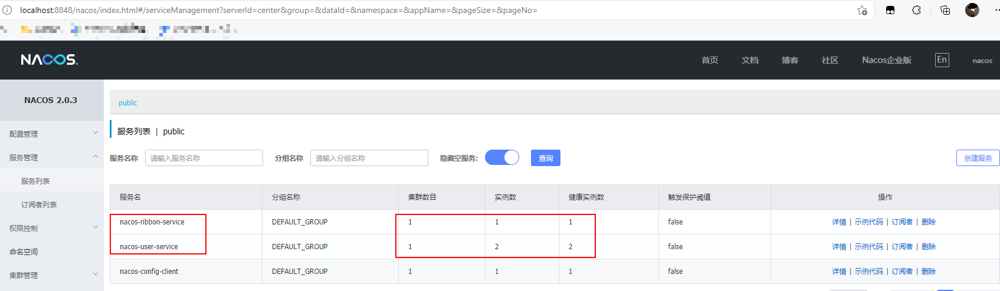
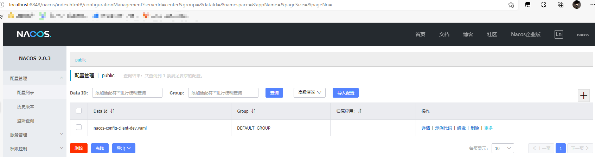

::: tip

Spring Cloud Alibaba 致力于提供微服务开发的一站式解决方案，Nacos 作为其核心组件之一，可以作为注册中心和配置中心使用。

:::
<!-- more -->

## Nacos

Nacos 致力于帮助您发现、配置和管理微服务。Nacos 提供了一组简单易用的特性集，帮助您快速实现动态服务发现、服务配置、服务元数据及流量管理。

特性：

- 服务发现和服务健康监测：支持基于DNS和基于RPC的服务发现，支持对服务的实时的健康检查，阻止向不健康的主机或服务实例发送请求；
- 动态配置服务：动态配置服务可以让您以中心化、外部化和动态化的方式管理所有环境的应用配置和服务配置；
- 动态 DNS 服务：动态 DNS 服务支持权重路由，让您更容易地实现中间层负载均衡、更灵活的路由策略、流量控制以及数据中心内网的简单DNS解析服务；
- 服务及其元数据管理：支持从微服务平台建设的视角管理数据中心的所有服务及元数据。

## 安装

* [下载Nacos](https://github.com/alibaba/nacos/releases)

* 配置`JAVA_HOME`环境变量，指定JDK安装目录
* 启动，解压安装包，直接运行bin目录下的`startup.cmd -m standalone`单机模式 即可，集群模式去除后面的参数即可（本地未成功集群模式）
* 访问，`http://localhost:8848/nacos`，默认账号密码都是`nacos`

## 注册服务到Nacos

使用`Spring Cloud Alibaba` 组件需要添加如下依赖配置

* `pom.xml`

```xml
<dependencyManagement>
    <dependencies>
        <dependency>
            <groupId>com.alibaba.cloud</groupId>
            <artifactId>spring-cloud-alibaba-dependencies</artifactId>
            <version>2.1.0.RELEASE</version>
            <type>pom</type>
            <scope>import</scope>
        </dependency>
    </dependencies>
</dependencyManagement>
```

* 添加 Nacos 注册发现依赖

```xml
<dependency>
    <groupId>com.alibaba.cloud</groupId>
    <artifactId>spring-cloud-starter-alibaba-nacos-discovery</artifactId>
</dependency>
```

创建`nacos-user-service`服务

* `application.yaml`

```yaml
server:
  port: 8206
spring:
  application:
    name: nacos-user-service
  cloud:
    nacos:
      discovery:
        server-addr: localhost:8848 #配置Nacos地址
management:
  endpoints:
    web:
      exposure:
        include: '*'
```

创建`nacos-ribbon-service`服务

* `appication.yaml`

```yaml
server:
  port: 8308
spring:
  application:
    name: nacos-ribbon-service
  cloud:
    nacos:
      discovery:
        server-addr: localhost:8848
service-url:
  nacos-user-service: http://nacos-user-service
```

启动两个`nacos-user-service`、端口分别是`8206、8207`，一个`nacos-ribbon-service`服务注册到Nacos注册中心，`nacos-config-client`是后面要用的，这里先不管



## 验证

postman通过调用Ribbon `http://localhost:8308/user/1`，调用 user-service 服务，自动实现负载均衡，查看 user-service 两个服务的控制台，可以看到日志交替打印

```shell
2021-09-07 10:07:58.376  INFO 3052 --- [nio-8206-exec-1] c.macro.cloud.controller.UserController  : 根据id获取用户信息，用户名称为：macro
```

## Nacos配置中心

Nacos可以作为统一的配置中心，可以动态配置服务，可以让您以中心化、外部化和动态化的方式管理所有环境的应用配置和服务配置

### 创建`nacos-config-client`模块

* `pom.xml`

```xml
<dependency>
    <groupId>com.alibaba.cloud</groupId>
    <artifactId>spring-cloud-starter-alibaba-nacos-config</artifactId>
</dependency>
<dependency>
    <groupId>com.alibaba.cloud</groupId>
    <artifactId>spring-cloud-starter-alibaba-nacos-discovery</artifactId>
</dependency>
```

* `application.xml`

```yaml
spring:
  profiles:
    active: dev
```

* `bootstrap.yaml`：主要是对Nacos的作为配置中心的功能进行配置

```yaml
server:
  port: 9101
spring:
  application:
    name: nacos-config-client
  cloud:
    nacos:
      discovery:
        server-addr: localhost:8848 #Nacos地址
      config:
        server-addr: localhost:8848 #Nacos地址
        file-extension: yaml #这里我们获取的yaml格式的配置
```

* 创建`ConfigClientController`，从Nacos配置中心中获取配置信息

```java
@RestController
@RefreshScope	// 动态刷新
public class ConfigClientController {

    @Value("${config.info}")
    private String configInfo;

    @GetMapping("/configInfo")
    public String getConfigInfo() {
        return configInfo;
    }
}
```

### 添加配置

位置：配置管理 -> 配置列表 -> 加号新建配置，根据自己配置文件选择格式，一般是`yaml`



Data ID 格式：

```properties
# 服务名-配置文件名.配置文件类型
# nacos-config-client-dev.yaml
${spring.application.name}-${spring.profiles.active}.${spring.cloud.nacos.config.file-extension}
```

添加配置文件

```yaml
config:
  info: "config info for dev"
```

- 启动nacos-config-client，调用接口查看配置信息：http://localhost:9101/configInfo

```xml
config info for dev
```

### 刷新配置

修改刚刚的配置，为`config info for dev refresh`，再次调用接口，可以发现配置文件更新成功，控制台可以看到配置文件变化

```shell
2021-09-07 10:12:06.178  INFO 12540 --- [-localhost_8848] trationDelegate$BeanPostProcessorChecker : Bean 'org.springframework.cloud.autoconfigure.ConfigurationPropertiesRebinderAutoConfiguration' of type [org.springframework.cloud.autoconfigure.ConfigurationPropertiesRebinderAutoConfiguration$$EnhancerBySpringCGLIB$$4b180360] is not eligible for getting processed by all BeanPostProcessors (for example: not eligible for auto-proxying)
2021-09-07 10:12:07.175  INFO 12540 --- [-localhost_8848] c.a.c.n.c.NacosPropertySourceBuilder     : Loading nacos data, dataId: 'nacos-config-client-dev.yaml', group: 'DEFAULT_GROUP'
2021-09-07 10:12:07.176  INFO 12540 --- [-localhost_8848] b.c.PropertySourceBootstrapConfiguration : Located property source: CompositePropertySource {name='NACOS', propertySources=[NacosPropertySource {name='nacos-config-client-dev.yaml'}, NacosPropertySource {name='nacos-config-client.yaml'}]}
2021-09-07 10:12:07.177  INFO 12540 --- [-localhost_8848] o.s.boot.SpringApplication               : The following profiles are active: dev
2021-09-07 10:12:07.185  INFO 12540 --- [-localhost_8848] o.s.boot.SpringApplication               : Started application in 2.161 seconds (JVM running for 74.633)
2021-09-07 10:12:07.204  INFO 12540 --- [-localhost_8848] o.s.c.e.event.RefreshEventListener       : Refresh keys changed: [config.info]
```

# 参考

[Nacos官方文档](https://nacos.io/zh-cn/docs/quick-start-spring-cloud.html)

# 使用模块

```shell
springcloud
├── nacos-config-client -- 用于演示nacos作为配置中心的nacos客户端
├── nacos-user-service -- 注册到nacos的提供User对象CRUD接口的服务，可以启多个服务，测试Ribbon负载均衡
└── nacos-ribbon-service -- 注册到nacos的ribbon服务调用测试服务
```

