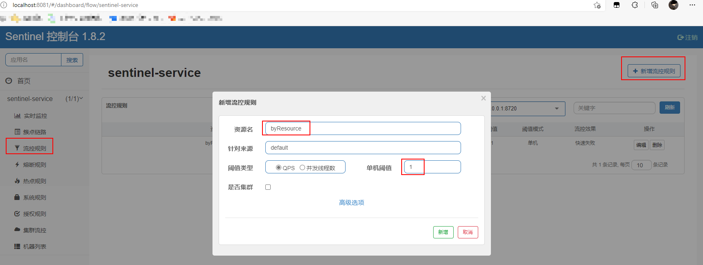
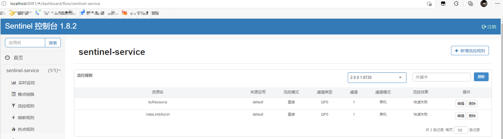
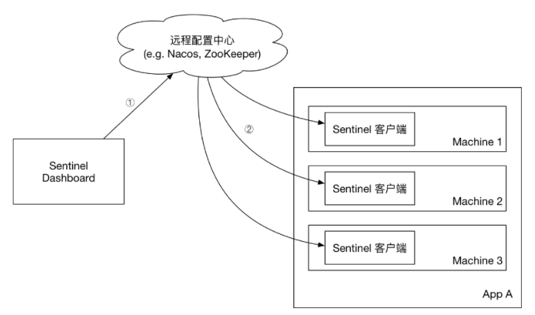
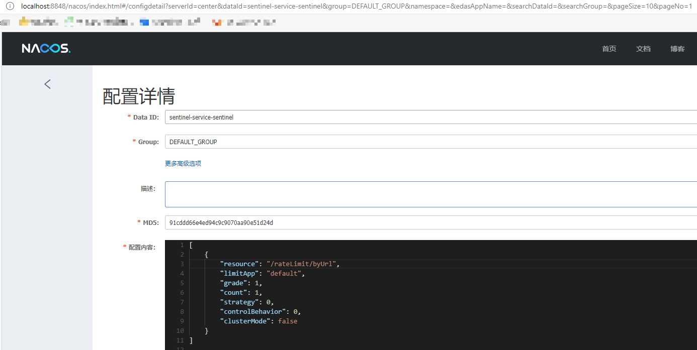

::: tip

Spring Cloud Alibaba 致力于提供微服务开发的一站式解决方案，Sentinel 作为其核心组件之一，具有熔断与限流等一系列服务保护功能。

:::
<!-- more -->

# Sentinel

随着微服务的流行，服务和服务之间的稳定性变得越来越重要。 Sentinel 以流量为切入点，从**流量控制、熔断降级、系统负载保护**等多个维度保护服务的稳定性。

Sentinel具有如下特性:

- 丰富的应用场景：承接了阿里巴巴近 10 年的双十一大促流量的核心场景，例如秒杀，可以实时熔断下游不可用应用；
- 完备的实时监控：同时提供实时的监控功能。可以在控制台中看到接入应用的单台机器秒级数据，甚至 500 台以下规模的集群的汇总运行情况；
- 广泛的开源生态：提供开箱即用的与其它开源框架/库的整合模块，例如与 Spring Cloud、Dubbo、gRPC 的整合；
- 完善的 SPI 扩展点：提供简单易用、完善的 SPI 扩展点。您可以通过实现扩展点，快速的定制逻辑。

# 降级、熔断、限流

系统访问量突然增加，比如秒杀活动；或者某个服务崩溃了，导致调用这个服务的接口迟迟没有响应，超时；这些体验给用户都是一直等待、超时肯定是不行的，一般都会有 **降级、熔断、限流** 三种方式，目的就是为了快速返回，避免因为各种原因让用户无线等待。

* 降级：服务压力增加，对一些非核心业务进行降级，比如双十一，退款系统降级，优先保证下单系统
* 熔断：微服务，A调B，B调C等常链路，中途B崩溃了，需要直接熔断，快速给用户失败的返回，而不是无限堆积请求，等待，造成雪崩
* 限流：限制单位时间内请求数量，超过的限制的请求直接快速返回失败的请求

# 安装并启动

Sentinel控制台是一个轻量级的控制台应用，它可用于实时查看单机资源监控及集群资源汇总，并提供了一系列的规则管理功能，如流控规则、降级规则、热点规则等

[官方下载](https://github.com/alibaba/Sentinel/releases)

启动：

```shell
java -jar sentinel-dashboard-1.8.2.jar
```

访问：http://localhost:8080，可以修改为其他端口启动` --server.port=8081`，默认账户密码是`sentinel`

# 创建`sentinel-service`模块

用于演示Sentinel的熔断与限流功能

* `pom.xml`：使用nacos作为注册中心，添加nacos依赖，

```xml
<dependency>
    <groupId>com.alibaba.cloud</groupId>
    <artifactId>spring-cloud-starter-alibaba-nacos-discovery</artifactId>
</dependency>
<dependency>
    <groupId>com.alibaba.cloud</groupId>
    <artifactId>spring-cloud-starter-alibaba-sentinel</artifactId>
</dependency>
```

* `application.yaml`：主要配置 nacos 和 sentinel 控制台地址

```yaml
server:
  port: 8401
spring:
  application:
    name: sentinel-service
  cloud:
    nacos:
      discovery:
        server-addr: localhost:8848 #配置Nacos地址
    sentinel:
      transport:
        dashboard: localhost:8080 #配置sentinel dashboard地址
        port: 8719
service-url:
  user-service: http://nacos-user-service
management:
  endpoints:
    web:
      exposure:
        include: '*'
```

# 限流

Sentinel Starter 默认为所有的 HTTP 服务提供了限流埋点，我们也可以通过使用`@SentinelResource`来自定义一些限流行为

::: 创建 RateLimitController 类

```java
@RestController
@RequestMapping("/rateLimit")
public class RateLimitController {
    /**
     * 按资源名称限流，需要指定限流处理逻辑
     */
    @GetMapping("/byResource")
    @SentinelResource(value = "byResource",blockHandler = "handleException")
    public CommonResult byResource() {
        return new CommonResult("按资源名称限流", 200);
    }

    /**
     * 按URL限流，有默认的限流处理逻辑
     */
    @GetMapping("/byUrl")
    @SentinelResource(value = "byUrl",blockHandler = "handleException")
    public CommonResult byUrl() {
        return new CommonResult("按url限流", 200);
    }

    public CommonResult handleException(BlockException exception){
        return new CommonResult(exception.getClass().getCanonicalName(),200);
    }
}
```

:::

## 根据资源限流

我们可以根据@SentinelResource注解中定义的value（资源名称）来进行限流操作，但是需要指定限流处理逻辑。

启动 Nacos 和 sentinel-service 模块

由于Sentinel采用的`懒加载规则`，需要我们先访问下接口，Sentinel控制台中才会有对应服务信息，我们先访问下该接口：http://localhost:8401/rateLimit/byResource

* 在Sentinel控制台配置流控规则，根据`@SentinelResource`注解的value值：



* 验证：快速访问 `http://localhost:8401/rateLimit/byResource`

```json
// 成功返回
{
    "data": null,
    "message": "按资源名称限流",
    "code": 200
}

// 限流返回
{
    "data": null,
    "message": "com.alibaba.csp.sentinel.slots.block.flow.FlowException",
    "code": 200
}
```

## 根据Url限流

除了上面的根据`@SentinelResource`主机的 value 值，我们还可以通过访问的URL来限流，会返回默认的限流处理信息

相比上面的根据资源限流，只需要把资源名改为对应的 url 即可，这里是 `/rateLimit/byUrl`



* 验证：快速访问 `http://localhost:8401/rateLimit/byUrl`

```json
// 成功访问
{
    "data": null,
    "message": "按url限流",
    "code": 200
}

// 限流
Blocked by Sentinel (flow limiting)
```

## 自定义限流

除了默认的 资源限流、url限流 两种方式，我们还可以根据自己的实际情况设置限流规则

- 创建 `CustomBlockHandler` 类用于自定义限流处理逻辑，注意方法要是`static`

```java
public class CustomBlockHandler {

    public static CommonResult handleException(BlockException exception){
        return new CommonResult("自定义限流信息",200);
    }
}
```

* 在`RateLimitController` 中使用自定义限流处理逻辑：

`@SentinelResource`注解中添加 `blockHandlerClass=自己创建自定义Handler类`

```java
@RestController
@RequestMapping("/rateLimit")
public class RateLimitController {

    @GetMapping("/customBlockHandler")
    @SentinelResource(value = "customBlockHandler", blockHandler = "handleException", blockHandlerClass = CustomBlockHandler.class)
    public CommonResult blockHandler() {
        return new CommonResult("限流成功", 200);
    }
}
```

* 验证：快速访问 `http://localhost:8401/rateLimit/customBlockHandler`

```json
// 成功返回
{
    "data": null,
    "message": "限流成功",
    "code": 200
}

// 自定义限流返回
{
    "data": null,
    "message": "自定义限流信息",
    "code": 200
}
```

# 熔断

`Sentinel` 支持对服务间调用进行保护，对故障应用进行熔断操作，这里我们使用`RestTemplate`来调用`nacos-user-service`服务所提供的接口来演示下该功能，对于使用RestTemplate调用的服务，如果发生故障，回直接熔断，快速返回失败

## @SentinelRestTemplate注解

* 使用`@SentinelRestTemplate`来包装下`RestTemplate`实例：

```java
@Configuration
public class RibbonConfig {

    @Bean
    @SentinelRestTemplate
    public RestTemplate restTemplate(){
        return new RestTemplate();
    }
}
```

* 添加`CircleBreakerController`类，定义对`nacos-user-service`提供接口的调用：

::: details 定义对 nacos-user-service 接口的调用

```java
@RestController
@RequestMapping("/breaker")
public class CircleBreakerController {

    private Logger LOGGER = LoggerFactory.getLogger(CircleBreakerController.class);
    @Autowired
    private RestTemplate restTemplate;
    @Value("${service-url.user-service}")
    private String userServiceUrl;

    @RequestMapping("/fallback/{id}")
    @SentinelResource(value = "fallback",fallback = "handleFallback")
    public CommonResult fallback(@PathVariable Long id) {
        return restTemplate.getForObject(userServiceUrl + "/user/{1}", CommonResult.class, id);
    }

    @RequestMapping("/fallbackException/{id}")
    @SentinelResource(value = "fallbackException",fallback = "handleFallback2", exceptionsToIgnore = {NullPointerException.class})
    public CommonResult fallbackException(@PathVariable Long id) {
        if (id == 1) {
            throw new IndexOutOfBoundsException();
        } else if (id == 2) {
            throw new NullPointerException();
        }
        return restTemplate.getForObject(userServiceUrl + "/user/{1}", CommonResult.class, id);
    }

    public CommonResult handleFallback(Long id) {
        User defaultUser = new User(-1L, "defaultUser", "123456");
        return new CommonResult<>(defaultUser,"服务降级返回",200);
    }

    public CommonResult handleFallback2(@PathVariable Long id, Throwable e) {
        LOGGER.error("handleFallback2 id:{},throwable class:{}", id, e.getClass());
        User defaultUser = new User(-2L, "defaultUser2", "123456");
        return new CommonResult<>(defaultUser,"服务降级返回",200);
    }
}
```

:::

* 验证：

访问 `http://localhost:8401/breaker/fallback/1` 成功返回，访问编号4，不存在，或者断开 `nacos-user-service`，返回失败信息

```json
{
    "data": {
        "id": -1,
        "username": "defaultUser",
        "password": "123456"
    },
    "message": "服务降级返回",
    "code": 200
}
```

访问 `http://localhost:8401/breaker/fallbackException/2`，代码中抛出一个 NullPointerException 异常，所以不会发生降级处理，其他的访问 1 或者 不存在的服务则会发生对应的异常，因为 `exceptionsToIgnore`参数中排除了该异常

```json
{
    "data": {
        "id": -2,
        "username": "defaultUser",
        "password": "123456"
    },
    "message": "服务降级返回",
    "code": 200
}

// 空指针不发生熔断降级
{
    "timestamp": "2021-09-09T05:42:14.105+0000",
    "status": 500,
    "error": "Internal Server Error",
    "message": "No message available",
    "path": "/breaker/fallbackException/2"
}
```

## @SentinelRestTemplate全局代理

前面可以发现，对于每个不通类型的请求，映射的每个 RequestMapping 请求方法都需要 @SentinelResource()，如果有自定义注解，势必会写更多的方法。其实 @SentinelRestTemplate注解也支持统一的降级熔断处理，

```java
@Configuration
public class RibbonConfig {

    @Bean
//    负载均衡
    @LoadBalanced
//    @SentinelRestTemplate 注解的限流(blockHandler, blockHandlerClass)和降级(fallback, fallbackClass)属性不强制填写
//    给所有调用 restTemplate 的方法都添加 限流、降级，原理是给 restTemplate 添加了自定义拦截器
//    CustomBlockHandler 公共处理 限流、降级的类，注意返回对象需要为原本方法要返回的对象（前端需要的对象）
    @SentinelRestTemplate(blockHandlerClass = CustomBlockHandler.class, blockHandler = "handleBlock",
            fallbackClass = CustomBlockHandler.class, fallback = "handleFallback"
    )
    public RestTemplate restTemplate() {
        return new RestTemplate();
    }
}
```

对应的自定义限流熔断方法

```java
public class CustomBlockHandler {

    //限流业务逻辑
    public static SentinelClientHttpResponse handleBlock(HttpRequest request,
                                           byte[] body, ClientHttpRequestExecution execution, BlockException ex) {
        return new SentinelClientHttpResponse("自定义限流信息");
    }

    //异常熔断降级业务逻辑
    public static SentinelClientHttpResponse handleFallback(HttpRequest request,
                                              byte[] body, ClientHttpRequestExecution execution, BlockException ex) {
        return new SentinelClientHttpResponse("自定义降级信息");
    }
}
```

注意：

* `@LoadBalanced`要添加，否则会报错`java.net.UnknownHostException: nacos-user-service`，[详细参考网友分析](https://www.jianshu.com/p/2c10bf7f26dd)，添加后有多个 `nacos-user-service`服务，可以自动实现负载均衡

* 全局的 @SentinelRestTemplate()，我这里没有生效，网上参考解决办法，**待处理**

  * SpringBoot SpringCloud SpringAlibaba 版本需要对应正确，[参考版本对应](https://hub.fastgit.org/alibaba/spring-cloud-alibaba/wiki/版本说明)，这个最直观

  * 配置中添加下面配置，并把 RestTemplate 移动到Main主启动类中，[参考](https://blog.csdn.net/liuhenghui5201/article/details/113839889)

    ```yaml
    # 开启或关闭@SentinelRestTemplate注解
    resttemplate:
      sentinel:
        enabled: true
    ```

# 整合Fegin

Sentinel也适配了Feign组件，我们使用Feign来进行服务间调用时，也可以使用它来进行熔断

* pom.xml

```xml
<dependency>
    <groupId>org.springframework.cloud</groupId>
    <artifactId>spring-cloud-starter-openfeign</artifactId>
</dependency>
```

* application.yaml

```yaml
feign:
  sentinel:
    enabled: true #打开sentinel对feign的支持
```

* 主启动类添加`@EnableFeignClients`启动`Feign`的功能
* 创建`UserService`接口用于对`nacos-user-service`服务的调用，对应的实现类，用于对降级进行具体实现处理

::: details 定义UserService 接口

```java
@FeignClient(value = "nacos-user-service",fallback = UserFallbackService.class)
public interface UserService {
    @PostMapping("/user/create")
    CommonResult create(@RequestBody User user);

    @GetMapping("/user/{id}")
    CommonResult<User> getUser(@PathVariable Long id);

    @GetMapping("/user/getByUsername")
    CommonResult<User> getByUsername(@RequestParam String username);

    @PostMapping("/user/update")
    CommonResult update(@RequestBody User user);

    @PostMapping("/user/delete/{id}")
    CommonResult delete(@PathVariable Long id);
}
```

:::

::: details UserService 实现类

```java
@Component
public class UserFallbackService implements UserService {
    @Override
    public CommonResult create(User user) {
        User defaultUser = new User(-1L, "defaultUser", "123456");
        return new CommonResult<>(defaultUser,"服务降级返回",200);
    }

    @Override
    public CommonResult<User> getUser(Long id) {
        User defaultUser = new User(-1L, "defaultUser", "123456");
        return new CommonResult<>(defaultUser,"服务降级返回",200);
    }

    @Override
    public CommonResult<User> getByUsername(String username) {
        User defaultUser = new User(-1L, "defaultUser", "123456");
        return new CommonResult<>(defaultUser,"服务降级返回",200);
    }

    @Override
    public CommonResult update(User user) {
        return new CommonResult("调用失败，服务被降级",500);
    }

    @Override
    public CommonResult delete(Long id) {
        return new CommonResult("调用失败，服务被降级",500);
    }
}
```

:::

::: 添加 UserFeignController 中使用 UserService 通过 Feign 调用 nacos-user-service 服务中的接口

```java
@RestController
@RequestMapping("/user")
public class UserFeignController {
    @Autowired
    private UserService userService;

    @GetMapping("/{id}")
    public CommonResult getUser(@PathVariable Long id) {
        return userService.getUser(id);
    }

    @GetMapping("/getByUsername")
    public CommonResult getByUsername(@RequestParam String username) {
        return userService.getByUsername(username);
    }

    @PostMapping("/create")
    public CommonResult create(@RequestBody User user) {
        return userService.create(user);
    }

    @PostMapping("/update")
    public CommonResult update(@RequestBody User user) {
        return userService.update(user);
    }

    @PostMapping("/delete/{id}")
    public CommonResult delete(@PathVariable Long id) {
        return userService.delete(id);
    }
}
```

:::

* 验证：调用`http://localhost:8401/user/4`，返回降级

```json
{
    "data": {
        "id": -1,
        "username": "defaultUser",
        "password": "123456"
    },
    "message": "服务降级返回",
    "code": 200
}
```

# 使用Nacos存储规则

可能大家实验的时候，因为修改配置，或者代码，重启了`sentinel-service`服务，重新调用接口，发现 限流、熔断规则失效了，查看 Sentinel 控制台，发现规则消失了。

默认情况下，当我们在Sentinel控制台中配置规则时，控制台推送规则方式是通过API将规则推送至客户端并直接更新到内存中。一旦我们重启应用，规则将消失。

下面我们介绍下如何将配置规则进行持久化，以存储到Nacos为例

## 原理

* 我们再 Nacos 配置中心创建 限流、熔断规则，配置中心将规则推送到 Sentinel 客户端
* Sentinel 控制台 也从配置中心获取配置信息



## 实现

* 添加依赖

```xml
<dependency>
    <groupId>com.alibaba.csp</groupId>
    <artifactId>sentinel-datasource-nacos</artifactId>
</dependency>
```

* `application.yaml`，添加Nacos数据源配置：

```yaml
spring:
  cloud:
    sentinel:
      datasource:
        ds1:
          nacos:
            server-addr: localhost:8848
            dataId: ${spring.application.name}-sentinel
            groupId: DEFAULT_GROUP
            data-type: json
            rule-type: flow
```

* 在 Nacos 中添加配置



相关参数解释：

- resource：资源名称；
- limitApp：来源应用；
- grade：阈值类型，0表示线程数，1表示QPS；
- count：单机阈值；
- strategy：流控模式，0表示直接，1表示关联，2表示链路；
- controlBehavior：流控效果，0表示快速失败，1表示Warm Up，2表示排队等待；
- clusterMode：是否集群。

返回 Sentinel 控制台可以发现 已经有一条限流规则了，且访问接口验证生效，重启 `sentinel-service` ，查看 sentinel 控制台，限流规则仍然存在