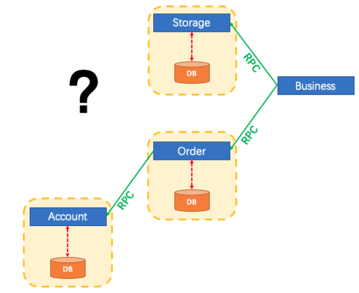
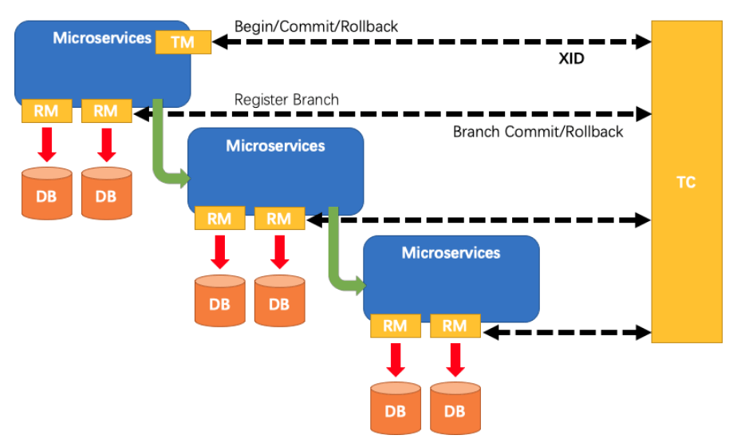

::: tip

Seata是Alibaba开源的一款分布式事务解决方案，致力于提供高性能和简单易用的分布式事务服务，[原作者学习文档](http://www.macrozheng.com/#/cloud/seata?id=使用seata彻底解决spring-cloud中的分布式事务问题！)

:::
<!-- more -->

## 分布式事务

以下概念，示例都已一个下订单的场景解释，用户下订单成功，商户库存减少，用户账户余额对应减少

### 单体应用

订单、库存，用户账号的数据都存储于一个数据库，此时数据库的一致性由本地事务来保证


### 微服务应用

随着业务需求的变化，单体应用被拆分成微服务应用，原来的三个模块被拆分成三个独立的应用，分别使用独立的数据源，业务操作需要调用三个服务来完成。此时每个服务内部的数据一致性由本地事务来保证，但是全局的数据一致性问题没法保证



在微服务架构中由于全局数据一致性没法保证产生的问题就是分布式事务问题。简单来说，一次业务操作需要操作多个数据源或需要进行远程调用，就会产生分布式事务问题

## Seata

Seata 是一款开源的分布式事务解决方案，致力于提供高性能和简单易用的分布式事务服务。Seata 将为用户提供了 AT、TCC、SAGA 和 XA 事务模式，为用户打造一站式的分布式解决方案

### 框架对比

从使用成本的角度来看，直接使用开源的分布式事务框架是比较容易上手的，所以寻找了比较流行的分布式事务框架seata(阿里开源组件)、Hmily（TCC模式）、 tcc-transaction（TCC模式）

|          | seata          | hmily | tcc-transaction |
| -------- | -------------- | ----- | --------------- |
| 文档     | 全             | 全    | 不全            |
| 支持模式 | AT/tcc/saga/XA | tcc   | tcc             |
| star     | 18.6k          | 3.4k  | 4.9k            |
对比了几款开源框架，阿里的开源框架seata使用人数最多，支持模式最全，文档也相对较多，所以选用seata进行了试用，下面记录下seata的使用步骤

### 原理

Seata中的三个角色

* **Transaction Coordinator (TC)**： 事务协调器，维护全局事务的运行状态，负责协调并驱动全局事务的提交或回滚。

（就是我们的seata-server服务端，用来保存全局事务，分支事务，全局锁等记录，然后会通知各个RM进行回滚或者提交.）

* **Transaction Manager (TM)**： 控制全局事务的边界，负责开启一个全局事务，并最终发起`全局提交`或`全局回滚`的决议。

（ 也是我们的一个微服务，但是该微服务是一个带头大哥，充当全局事务的发起者(决定了全局事务的开启，回滚，提交等)凡是我们的微服务中标注了`@GlobalTransactional `，那么该微服务就会被看成一个TM，同时也是一个RM。）(比如我们下订单，订单成功事务全局提交，失败，全局回滚)

* **Resource Manager (RM)**： 控制分支事务，负责分支注册、状态汇报，并接收事务协调器的指令，驱动分支（本地）事务的提交和回滚。

（可以理解为我们的一个个微服务，也叫事务的参与者）

一个典型的分布式事务过程

- TM 向 TC 申请开启一个全局事务，全局事务创建成功并生成一个全局唯一的 XID；
- XID 在微服务调用链路的上下文中传播；
- RM 向 TC 注册分支事务，将其纳入 XID 对应全局事务的管辖；
- TM 向 TC 发起针对 XID 的全局提交或回滚决议；
- TC 调度 XID 下管辖的全部分支事务完成提交或回滚请求。



## Seata搭建

### 准备

* seata-server 服务端[安装](https://github.com/seata/seata/releases) ，我这里选择的是 1.4.2 的版本

* 使用nacos注册中心，nacos使用看前面章节，使用的 2.0.3 版本
* [config.txt](https://github.com/seata/seata/blob/develop/script/config-center/config.txt)：seata的配置文件，包含选择注册中心，数据存储到哪里等等配置
* [nacos-config.sh](https://github.com/seata/seata/blob/develop/script/config-center/nacos/nacos-config.sh)：将`config.txt`配置上传到 nacos 配置中心
* [file.conf registry.conf](https://github.com/seata/seata/tree/develop/script/client/conf)：seata服务端 conf 目录下的两个配置
* [seat-server](https://github.com/seata/seata/blob/develop/script/server/db/mysql.sql)：seat-server 数据库，用于存放事务日志

### seata-server 注册步骤

* 初始化业务表

::: details 创建数据库 seat-account，并创建表 account 账户表

```sql
drop table if exists account;
CREATE TABLE `account` (
  `id` bigint(11) NOT NULL AUTO_INCREMENT COMMENT 'id',
  `user_id` bigint(11) DEFAULT NULL COMMENT '用户id',
  `total` decimal(10,0) DEFAULT NULL COMMENT '总额度',
  `used` decimal(10,0) DEFAULT NULL COMMENT '已用余额',
  `residue` decimal(10,0) DEFAULT '0' COMMENT '剩余可用额度',
  PRIMARY KEY (`id`)
) ENGINE=InnoDB AUTO_INCREMENT=2 DEFAULT CHARSET=utf8;

INSERT INTO `seat-account`.`account` (`id`, `user_id`, `total`, `used`, `residue`) VALUES ('1', '1', '1000', '0', '1000');
```

:::

::: details 创建数据库 seat-order, 并创建表 order 订单表

```sql
drop table if exists `seat-order`.order;
CREATE TABLE `order` (
  `id` bigint(11) NOT NULL AUTO_INCREMENT,
  `user_id` bigint(11) DEFAULT NULL COMMENT '用户id',
  `product_id` bigint(11) DEFAULT NULL COMMENT '产品id',
  `count` int(11) DEFAULT NULL COMMENT '数量',
  `money` decimal(11,0) DEFAULT NULL COMMENT '金额',
  PRIMARY KEY (`id`)
) ENGINE=InnoDB AUTO_INCREMENT=7 DEFAULT CHARSET=utf8;

ALTER TABLE `order` ADD COLUMN `status` int(1) DEFAULT NULL COMMENT '订单状态：0：创建中；1：已完结' AFTER `money` ;
```

:::

::: details 创建数据库 seat-storage，并创建表 storage  库存表

```sql
drop table if exists `seat-storage`.storage;
CREATE TABLE `storage` (
                           `id` bigint(11) NOT NULL AUTO_INCREMENT,
                           `product_id` bigint(11) DEFAULT NULL COMMENT '产品id',
                           `total` int(11) DEFAULT NULL COMMENT '总库存',
                           `used` int(11) DEFAULT NULL COMMENT '已用库存',
                           `residue` int(11) DEFAULT NULL COMMENT '剩余库存',
                           PRIMARY KEY (`id`)
) ENGINE=InnoDB AUTO_INCREMENT=2 DEFAULT CHARSET=utf8;

INSERT INTO `seat-storage`.`storage` (`id`, `product_id`, `total`, `used`, `residue`) VALUES ('1', '1', '100', '0', '100');
```

::: details 给以上三个数据库创建 undo_log 表 日志回滚记录表

```sql
-- 注意此处0.3.0+ 增加唯一索引 ux_undo_log
drop table if exists undo_log;
CREATE TABLE `undo_log` (
  `id` bigint(20) NOT NULL AUTO_INCREMENT,
  `branch_id` bigint(20) NOT NULL,
  `xid` varchar(100) NOT NULL,
  `context` varchar(128) NOT NULL,
  `rollback_info` longblob NOT NULL,
  `log_status` int(11) NOT NULL,
  `log_created` datetime NOT NULL,
  `log_modified` datetime NOT NULL,
  `ext` varchar(100) DEFAULT NULL,
  PRIMARY KEY (`id`),
  UNIQUE KEY `ux_undo_log` (`xid`,`branch_id`)
) ENGINE=InnoDB AUTO_INCREMENT=1 DEFAULT CHARSET=utf8;
```

:::

* 初始化存储事务数据库

::: details 创建 seat-server 数据库，并创建表 branch_table、global_table、lock_table

```sql
SET NAMES utf8mb4;
SET FOREIGN_KEY_CHECKS = 0;

-- ----------------------------
-- Table structure for branch_table
-- ----------------------------
DROP TABLE IF EXISTS `branch_table`;
CREATE TABLE `branch_table`  (
  `branch_id` bigint(20) NOT NULL,
  `xid` varchar(128) CHARACTER SET utf8mb4 COLLATE utf8mb4_general_ci NOT NULL,
  `transaction_id` bigint(20) NULL DEFAULT NULL,
  `resource_group_id` varchar(32) CHARACTER SET utf8mb4 COLLATE utf8mb4_general_ci NULL DEFAULT NULL,
  `resource_id` varchar(256) CHARACTER SET utf8mb4 COLLATE utf8mb4_general_ci NULL DEFAULT NULL,
  `lock_key` varchar(128) CHARACTER SET utf8mb4 COLLATE utf8mb4_general_ci NULL DEFAULT NULL,
  `branch_type` varchar(8) CHARACTER SET utf8mb4 COLLATE utf8mb4_general_ci NULL DEFAULT NULL,
  `status` tinyint(4) NULL DEFAULT NULL,
  `client_id` varchar(64) CHARACTER SET utf8mb4 COLLATE utf8mb4_general_ci NULL DEFAULT NULL,
  `application_data` varchar(2000) CHARACTER SET utf8mb4 COLLATE utf8mb4_general_ci NULL DEFAULT NULL,
  `gmt_create` datetime(0) NULL DEFAULT NULL,
  `gmt_modified` datetime(0) NULL DEFAULT NULL,
  PRIMARY KEY (`branch_id`) USING BTREE,
  INDEX `idx_xid`(`xid`) USING BTREE
) ENGINE = InnoDB CHARACTER SET = utf8mb4 COLLATE = utf8mb4_general_ci ROW_FORMAT = Dynamic;

-- ----------------------------
-- Records of branch_table
-- ----------------------------

-- ----------------------------
-- Table structure for global_table
-- ----------------------------
DROP TABLE IF EXISTS `global_table`;
CREATE TABLE `global_table`  (
  `xid` varchar(128) CHARACTER SET utf8mb4 COLLATE utf8mb4_general_ci NOT NULL,
  `transaction_id` bigint(20) NULL DEFAULT NULL,
  `status` tinyint(4) NOT NULL,
  `application_id` varchar(64) CHARACTER SET utf8mb4 COLLATE utf8mb4_general_ci NULL DEFAULT NULL,
  `transaction_service_group` varchar(64) CHARACTER SET utf8mb4 COLLATE utf8mb4_general_ci NULL DEFAULT NULL,
  `transaction_name` varchar(64) CHARACTER SET utf8mb4 COLLATE utf8mb4_general_ci NULL DEFAULT NULL,
  `timeout` int(11) NULL DEFAULT NULL,
  `begin_time` bigint(20) NULL DEFAULT NULL,
  `application_data` varchar(2000) CHARACTER SET utf8mb4 COLLATE utf8mb4_general_ci NULL DEFAULT NULL,
  `gmt_create` datetime(0) NULL DEFAULT NULL,
  `gmt_modified` datetime(0) NULL DEFAULT NULL,
  PRIMARY KEY (`xid`) USING BTREE,
  INDEX `idx_gmt_modified_status`(`gmt_modified`, `status`) USING BTREE,
  INDEX `idx_transaction_id`(`transaction_id`) USING BTREE
) ENGINE = InnoDB CHARACTER SET = utf8mb4 COLLATE = utf8mb4_general_ci ROW_FORMAT = Dynamic;

-- ----------------------------
-- Records of global_table
-- ----------------------------

-- ----------------------------
-- Table structure for lock_table
-- ----------------------------
DROP TABLE IF EXISTS `lock_table`;
CREATE TABLE `lock_table`  (
  `row_key` varchar(128) CHARACTER SET utf8mb4 COLLATE utf8mb4_general_ci NOT NULL,
  `xid` varchar(96) CHARACTER SET utf8mb4 COLLATE utf8mb4_general_ci NULL DEFAULT NULL,
  `transaction_id` mediumtext CHARACTER SET utf8mb4 COLLATE utf8mb4_general_ci NULL,
  `branch_id` mediumtext CHARACTER SET utf8mb4 COLLATE utf8mb4_general_ci NULL,
  `resource_id` varchar(256) CHARACTER SET utf8mb4 COLLATE utf8mb4_general_ci NULL DEFAULT NULL,
  `table_name` varchar(32) CHARACTER SET utf8mb4 COLLATE utf8mb4_general_ci NULL DEFAULT NULL,
  `pk` varchar(32) CHARACTER SET utf8mb4 COLLATE utf8mb4_general_ci NULL DEFAULT NULL,
  `gmt_create` datetime(0) NULL DEFAULT NULL,
  `gmt_modified` datetime(0) NULL DEFAULT NULL,
  PRIMARY KEY (`row_key`) USING BTREE
) ENGINE = InnoDB CHARACTER SET = utf8mb4 COLLATE = utf8mb4_general_ci ROW_FORMAT = Dynamic;

-- ----------------------------
-- Records of lock_table
-- ----------------------------

SET FOREIGN_KEY_CHECKS = 1;
```

:::

所有数据库，表结构


* 启动 nacos 服务，单独创建一个 `SEATA_GROUP` 的服务，默认是default，创建完成之后会生成一个 id，对应其他配置文件中的 namespace

* 修改 `file.conf` 配置，mysql 存储事务数据，它也支持其他数据库

::: details file.conf 简略配置，详细配置看前面下载的完整文件

```json
## transaction log store, only used in seata-server
store {
  ## store mode: file、db、redis 选用数据库 db
  mode = "db"
  ## database store property
  db {
    ## the implement of javax.sql.DataSource, such as DruidDataSource(druid)/BasicDataSource(dbcp)/HikariDataSource(hikari) etc.
    datasource = "dbcp"
    ## mysql/oracle/postgresql/h2/oceanbase etc.
    dbType = "mysql"
    driverClassName = "com.mysql.cj.jdbc.Driver"
    ## if using mysql to store the data, recommend add rewriteBatchedStatements=true in jdbc connection param
    url = "jdbc:mysql://127.0.0.1:3306/seat-server?rewriteBatchedStatements=true&serverTimezone=CST"
    user = "root"
    password = "password"
    minConn = 1
    maxConn = 3
    globalTable = "global_table"
    branchTable = "branch_table"
    lockTable = "lock_table"
    queryLimit = 100
    maxWait = 5000
  }

service {
  #vgroup->rgroup
  # 修改事务组名称为：fsp_tx_group，和客户端自定义的名称对应
  vgroup_mapping.fsp_tx_group = "SEATA_GROUP"
  #only support single node
  default.grouplist = "127.0.0.1:8091"
  #degrade current not support
  enableDegrade = false
  #disable
  disable = false
  #unit ms,s,m,h,d represents milliseconds, seconds, minutes, hours, days, default permanent
  max.commit.retry.timeout = "-1"
  max.rollback.retry.timeout = "-1"
  disableGlobalTransaction = false
}
```

:::

* 修改 `registry.conf` 指定注册配置中心为nacos 

::: details registry.conf 

```json
registry {
  # file 、nacos 、eureka、redis、zk、consul、etcd3、sofa
  type = "nacos"

  nacos {
    application = "seata-server"
    serverAddr = "127.0.0.1:8848"
    group = "SEATA_GROUP"
    namespace = "c542cd13-d257-4d71-8057-f2aa4049ada7"
    cluster = "default"
    username = "nacos"
    password = "nacos"
  }
}

config {
  # file、nacos 、apollo、zk、consul、etcd3
  type = "nacos"

  nacos {
    serverAddr = "127.0.0.1:8848"
    namespace = "c542cd13-d257-4d71-8057-f2aa4049ada7" # 对应 在注册中心 注册的 seata-server 的id
    group = "SEATA_GROUP" # 对应 在注册中心 注册的 seata-server 服务名
    username = "nacos"
    password = "nacos"
  }
}
```

::: 

* 修改 config.txt ，将配置文件导入注册中心

::: details config.txt 配置，都是用默认端口，一般指修改下面带注释的配置即可

``` properties
transport.type=TCP
transport.server=NIO
transport.heartbeat=true
transport.enableClientBatchSendRequest=true
transport.threadFactory.bossThreadPrefix=NettyBoss
transport.threadFactory.workerThreadPrefix=NettyServerNIOWorker
transport.threadFactory.serverExecutorThreadPrefix=NettyServerBizHandler
transport.threadFactory.shareBossWorker=false
transport.threadFactory.clientSelectorThreadPrefix=NettyClientSelector
transport.threadFactory.clientSelectorThreadSize=1
transport.threadFactory.clientWorkerThreadPrefix=NettyClientWorkerThread
transport.threadFactory.bossThreadSize=1
transport.threadFactory.workerThreadSize=default
transport.shutdown.wait=3
#service.vgroupMapping.自定定义的事务名可以是一个也可以多个模块对应自己的=default，要和配置文件保持一致，我这里是fsp_tx_group
#service.vgroupMapping.fsp_tx_group=default
service.default.grouplist=127.0.0.1:8091
service.enableDegrade=false
service.disableGlobalTransaction=false
client.rm.asyncCommitBufferLimit=10000
client.rm.lock.retryInterval=10
client.rm.lock.retryTimes=30
client.rm.lock.retryPolicyBranchRollbackOnConflict=true
client.rm.reportRetryCount=5
client.rm.tableMetaCheckEnable=false
client.rm.tableMetaCheckerInterval=60000
client.rm.sqlParserType=druid
client.rm.reportSuccessEnable=false
client.rm.sagaBranchRegisterEnable=false
client.rm.tccActionInterceptorOrder=-2147482648
client.tm.commitRetryCount=5
client.tm.rollbackRetryCount=5
client.tm.defaultGlobalTransactionTimeout=60000
client.tm.degradeCheck=false
client.tm.degradeCheckAllowTimes=10
client.tm.degradeCheckPeriod=2000
client.tm.interceptorOrder=-2147482648
#store.mode=db
store.lock.mode=file
store.session.mode=file
store.db.datasource=druid
#store.db.dbType=mysql
#store.db.driverClassName=com.mysql.cj.jdbc.Driver
#store.db.url=jdbc:mysql://127.0.0.1:3306/seat-server?useUnicode=true&characterEncoding=utf8&autoReconnect=true&allowMultiQueries=true&useSSL=false&serverTimezone=CST
#store.db.user=root
#store.db.password=password
store.db.minConn=5
store.db.maxConn=30
store.db.globalTable=global_table
store.db.branchTable=branch_table
store.db.distributedLockTable=distributed_lock
store.db.queryLimit=100
store.db.lockTable=lock_table
store.db.maxWait=5000
server.recovery.committingRetryPeriod=1000
server.recovery.asynCommittingRetryPeriod=1000
server.recovery.rollbackingRetryPeriod=1000
server.recovery.timeoutRetryPeriod=1000
server.maxCommitRetryTimeout=-1
server.maxRollbackRetryTimeout=-1
server.rollbackRetryTimeoutUnlockEnable=false
server.distributedLockExpireTime=10000
client.undo.dataValidation=true
client.undo.logSerialization=jackson
client.undo.onlyCareUpdateColumns=true
server.undo.logSaveDays=7
server.undo.logDeletePeriod=86400000
client.undo.logTable=undo_log
client.undo.compress.enable=true
client.undo.compress.type=zip
client.undo.compress.threshold=64k
log.exceptionRate=100
transport.serialization=seata
transport.compressor=none
metrics.enabled=false
metrics.registryType=compact
metrics.exporterList=prometheus
metrics.exporterPrometheusPort=9898
```

:::

* 将 config.txt 配置导入nacos 注册中心，参数对应前面的介绍，应该一眼清楚

```bash
sh nacos-config.sh -h 127.0.0.1 -p 8848 -g SEATA_GROUP -t c542cd13-d257-4d71-8057-f2aa4049ada7 -u nacos -w nacos
```

::: details 执行 nacos-config.sh 脚本

```
返回结果
=========================================================================
 Complete initialization parameters,  total-count:91 ,  failure-count:4
=========================================================================
 init nacos config fail.

报错的四个配置，
Set store.publicKey= failure						# 应该是存储的证书配置
Set store.redis.sentinel.masterName= failure		# 存储采用redis相关的配置，没有配置导致没有传上去，不影响使用，因为我们使用的是mysql，
Set store.redis.sentinel.sentinelHosts= failure		# 如果后面有变更需要重新传上去，或者直接在 nacos中直接手动添加配置
Set store.redis.password= failure

采用这种方式，好像上面的file.conf就没啥用了，感觉是通过 registry.conf 连接到 nacos, 使用里面的配置
```

::: 

* 启动 seata-server，可以发现成功注册，对应的配置列表


### 微服务注册步骤

启动 三个微服务 订单服务、库存服务、账户服务

* `pom.xml`，另外两个服务基本一致

::: details pom.xml 配置

```xml
<?xml version="1.0" encoding="UTF-8"?>
<project xmlns="http://maven.apache.org/POM/4.0.0" xmlns:xsi="http://www.w3.org/2001/XMLSchema-instance"
         xsi:schemaLocation="http://maven.apache.org/POM/4.0.0 https://maven.apache.org/xsd/maven-4.0.0.xsd">
    <modelVersion>4.0.0</modelVersion>
    <parent>
        <groupId>org.springframework.boot</groupId>
        <artifactId>spring-boot-starter-parent</artifactId>
        <version>2.1.7.RELEASE</version>
        <relativePath/> <!-- lookup parent from repository -->
    </parent>
    <groupId>com.macro.cloud</groupId>
    <artifactId>seata-account-service</artifactId>
    <version>0.0.1-SNAPSHOT</version>
    <name>seata-account-service</name>
    <description>Demo project for Spring Boot</description>

    <properties>
        <java.version>1.8</java.version>
        <spring-cloud.version>Greenwich.SR2</spring-cloud.version>
        <mysql-connector-java.version>8.0.21</mysql-connector-java.version>
        <mybatis-spring-boot-starter.version>2.0.0</mybatis-spring-boot-starter.version>
        <druid-spring-boot-starter.version>1.1.10</druid-spring-boot-starter.version>
        <lombok.version>1.18.8</lombok.version>
        <seata.version>1.4.2</seata.version>
    </properties>

    <dependencies>
        <!--nacos-->
        <dependency>
            <groupId>com.alibaba.cloud</groupId>
            <artifactId>spring-cloud-starter-alibaba-nacos-discovery</artifactId>
        </dependency>
        <!--seata-->
        <dependency>
            <groupId>com.alibaba.cloud</groupId>
            <artifactId>spring-cloud-starter-alibaba-seata</artifactId>
            <exclusions>
                <exclusion>
                    <artifactId>seata-all</artifactId>
                    <groupId>io.seata</groupId>
                </exclusion>
            </exclusions>
        </dependency>
        <dependency>
            <groupId>io.seata</groupId>
            <artifactId>seata-all</artifactId>
            <version>${seata.version}</version>
        </dependency>
        <!--feign-->
        <dependency>
            <groupId>org.springframework.cloud</groupId>
            <artifactId>spring-cloud-starter-openfeign</artifactId>
        </dependency>
        <dependency>
            <groupId>org.springframework.boot</groupId>
            <artifactId>spring-boot-starter-web</artifactId>
        </dependency>
        <dependency>
            <groupId>org.springframework.boot</groupId>
            <artifactId>spring-boot-starter-test</artifactId>
            <scope>test</scope>
        </dependency>
        <dependency>
            <groupId>org.mybatis.spring.boot</groupId>
            <artifactId>mybatis-spring-boot-starter</artifactId>
            <version>${mybatis-spring-boot-starter.version}</version>
        </dependency>
        <dependency>
            <groupId>mysql</groupId>
            <artifactId>mysql-connector-java</artifactId>
            <version>${mysql-connector-java.version}</version>
        </dependency>
        <dependency>
            <groupId>org.projectlombok</groupId>
            <artifactId>lombok</artifactId>
            <version>${lombok.version}</version>
        </dependency>

    </dependencies>

    <dependencyManagement>
        <dependencies>
            <dependency>
                <groupId>org.springframework.cloud</groupId>
                <artifactId>spring-cloud-dependencies</artifactId>
                <version>${spring-cloud.version}</version>
                <type>pom</type>
                <scope>import</scope>
            </dependency>
            <dependency>
                <groupId>com.alibaba.cloud</groupId>
                <artifactId>spring-cloud-alibaba-dependencies</artifactId>
                <version>2.1.0.RELEASE</version>
                <type>pom</type>
                <scope>import</scope>
            </dependency>
        </dependencies>
    </dependencyManagement>
</project>
```

:::

* `application.yml`，另外两个服务基本一致，只是对应服务名，端口需要修改

::: details seata相关配置暂未生效，使用的是 registry.conf

```yaml
server:
  port: 8182
spring:
  application:
    name: seata-account-service
  cloud:
    alibaba:
      seata:
        tx-service-group: fsp_tx_group
    nacos:
      discovery:
        server-addr: localhost:8848
  datasource:
    driver-class-name: com.mysql.cj.jdbc.Driver
    password: 813256
    url: jdbc:mysql://localhost:3306/seat-account?useUnicode=true&characterEncoding=utf8&autoReconnect=true&allowMultiQueries=true&useSSL=false&serverTimezone=CST
    username: root

seata:
  enabled: true
  application-id: ${spring.application.name}
  #事务群组（可以每个应用独立取名，也可以使用相同的名字），要与服务端nacos-config.txt中service.vgroup_mapping中存在,并且要保证多个群组情况下后缀名要保持一致-tx_group
  service:
    vgroup-mapping:
      fsp_tx_group: default

# registry 和 下面的 config 配置 应该是 1.0.0 版本后直接使用的配置，否则，还需要再对面resource 目录下添加 file.conf 和 registry.conf 两个配置
# 我使用的1.4.2版本不知道为啥没剩下，还是加了 file.conf 和 registry.conf 才启动起来的
  registry:
    type: nacos
    nacos:
      server-addr: ${spring.cloud.nacos.discovery.server-addr}
      username: nacos
      password: nacos
      #seata分组名称
      group: SEATA_GROUP
      #nacos命名空间ID
      namespace: c542cd13-d257-4d71-8057-f2aa4049ada7
      #seata服务名
      application: seata-server

  config:
    type: nacos
    nacos:
      server-addr: ${spring.cloud.nacos.discovery.server-addr}
      username: nacos
      password: nacos
      #seata分组名称
      group: SEATA_GROUP
      #nacos命名空间ID
      namespace: c542cd13-d257-4d71-8057-f2aa4049ada7

logging:
  level:
    io:
      seata: info
mybatis:
  mapperLocations: classpath:mapper/*.xml
```

:::

* `file.conf`、`registry.conf` 配置

::: details file.conf配置

```json
transport {
  # tcp udt unix-domain-socket
  type = "TCP"
  #NIO NATIVE
  server = "NIO"
  #enable heartbeat
  heartbeat = true
  #thread factory for netty
  thread-factory {
    boss-thread-prefix = "NettyBoss"
    worker-thread-prefix = "NettyServerNIOWorker"
    server-executor-thread-prefix = "NettyServerBizHandler"
    share-boss-worker = false
    client-selector-thread-prefix = "NettyClientSelector"
    client-selector-thread-size = 1
    client-worker-thread-prefix = "NettyClientWorkerThread"
    # netty boss thread size,will not be used for UDT
    boss-thread-size = 1
    #auto default pin or 8
    worker-thread-size = 8
  }
  shutdown {
    # when destroy server, wait seconds
    wait = 3
  }
  serialization = "seata"
  compressor = "none"
}

service {
  #vgroup->rgroup
  vgroup_mapping.fsp_tx_group = "default"
  #only support single node
  default.grouplist = "127.0.0.1:8091"
  #degrade current not support
  enableDegrade = false
  #disable
  disable = false
  #unit ms,s,m,h,d represents milliseconds, seconds, minutes, hours, days, default permanent
  max.commit.retry.timeout = "-1"
  max.rollback.retry.timeout = "-1"
  disableGlobalTransaction = false
}

client {
  async.commit.buffer.limit = 10000
  lock {
    retry.internal = 10
    retry.times = 30
  }
  report.retry.count = 5
  tm.commit.retry.count = 1
  tm.rollback.retry.count = 1
}

transaction {
  undo.data.validation = true
  undo.log.serialization = "jackson"
  undo.log.save.days = 7
  #schedule delete expired undo_log in milliseconds
  undo.log.delete.period = 86400000
  undo.log.table = "undo_log"
}

support {
  ## spring
  spring {
    # auto proxy the DataSource bean
    datasource.autoproxy = false
  }
}
```

:::

::: details registry.conf 配置，试过去除掉 file.conf 配置，依旧能成功启动，感觉是通过 registry.conf 读取 nacos 里面的配置

```json
registry {
  # file 、nacos 、eureka、redis、zk
  type = "nacos"

  nacos {
    application = "seata-server"
    serverAddr = "127.0.0.1:8848"
    group = "SEATA_GROUP"
    namespace = "c542cd13-d257-4d71-8057-f2aa4049ada7"
    cluster = "default"
    username = "nacos"
    password = "nacos"
  }
}

config {
  # file、nacos 、apollo、zk
  type = "nacos"

  nacos {
    serverAddr = "127.0.0.1:8848"
    group = "SEATA_GROUP"
    namespace = "c542cd13-d257-4d71-8057-f2aa4049ada7"
    username = "nacos"
    password = "nacos"
  }
}
```

:::

* 启动服务，服务注册成功


::: details 错误详细

```
# seata-server 启动报错：can not get cluster name in registry config，一般是上传的配置某个错误

# seata-client 启动报错: can not get cluster name in registry config 'service.vgroupMapping.fsp_tx_group', please make sure registry config correct，一般是yaml 或者 file.conf registry.conf 没有对应上

# 启动成功标识: register TM success，register success,
```

:::

## 验证

* 正常流程，调三次，对应的 下订单成功，库存对应减少，账户余额对应减少

`http://localhost:8180/order/create?userId=1&productId=1&count=10&money=100`


* 异常流程，

账户接口模拟超时，放开`seata-account-service`模块中 `try catch` 注释，去除 订单业务中 `@GlobalTransactional` 注解，模拟没下下成功订单，但是事务没有回退

调两个，对应的 下订单状态是没有成功的，库存对应减少了，但是账户余额也减少了，订单未成功，金额不应该扣除，事务应该回退


## 遇到的坑

* 初始原作者客户端使用seata依赖版本是 0.9.0，注册成功后，控制台一直报错`no available server to connect`

  百度查看都是`spring.cloud.alibaba.seata.fsp_tx_group=default`没有配置，事实上我配置了，因为我服务端版本 seata-server 版本是 1.4.2 ，不知道是不是版本没对应上导致的，选择直接升级版本为最新的

* 都是用最新版 1.4.2 过后，发现启动报错`Error creating bean with name 'globalTransactionScanner' defined in class path resource`

  `nested exception is io.seata.common.exception.NotSupportYetException: config type can not be null`，百度原因都是使用了 seata-starter的依赖又自定义配置了 `globalTransactionScanner` bean，我使用了 starter 依赖，但是没有自定义 bean，最后我重新加上 register.conf 配置，成功启动

  但是 seata 自 1.0.0 版本后，基于 微服务的工程里面可以不用再单独需求 `file.conf`和 `registry.conf`的，我加回来等同于yaml 关于 seata 的配置没有生效，暂未解决

* 细心的人应该能看出来，我验证中的第一次正常调用，调了三次，订单价格是300，实际我余额扣除了400，我不知道为啥出现这种情况，我数据库清空重来一次后，却又是正常的，无法理解


* 添加超时，去除事务注解，按道理应该事务回滚，那么每个数据库 数据 undo.log 应该记录东西的，我这貌似啥也没记录

* 其他踩坑参考[踩坑参考一](https://blog.csdn.net/u010634066/article/details/106739176/)
* 总的来说只是依葫芦画瓢给启动起来了， 好多都没搞懂....

## 项目参考

[SpringCloud](https://gitee.com/myMagicRain/quick-template/tree/master/SpringCloud)

```
springcloud
├── seata-order-service -- 整合了seata的订单服务
├── seata-storage-service -- 整合了seata的库存服务
└── seata-account-service -- 整合了seata的账户服务
```

## 学习参考

* [原作者](http://www.macrozheng.com/#/cloud/seata?id=使用seata彻底解决spring-cloud中的分布式事务问题！)
* [1.4.2 seata 搭建的案例](https://blog.csdn.net/weixin_43831049/article/details/117446071)