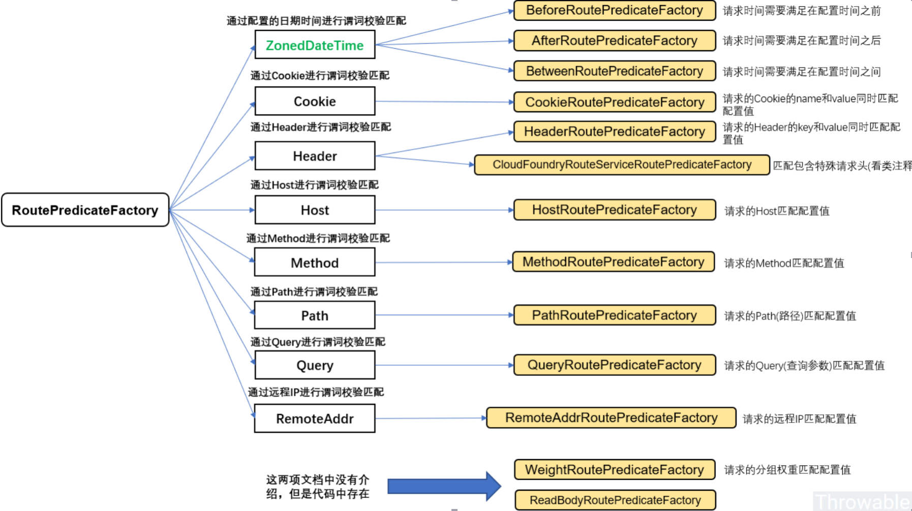

::: tip

**Spring Cloud Gateway** 是Spring官方基于Spring 5.0，Spring Boot 2.0和Project Reactor等技术开发的网关，Spring Cloud Gateway旨在为微服务架构提供一种简单而有效的统一的API路由管理方式。**Spring Cloud Gateway**作为**Spring Cloud**生态系中的网关，目标是替代**Zuul**，其不仅提供统一的路由方式，并且基于Filter链的方式提供了网关基本的功能，例如：过滤器、熔断、限流、重试、安全，监控/埋点，和限流等。

:::
<!-- more -->

## 相关特性

- 基于Spring Framework 5, Project Reactor 和 Spring Boot 2.0 进行构建；
- 动态路由：能够匹配任何请求属性；
- 可以对路由指定 Predicate（断言）和 Filter（过滤器）；
- 集成Hystrix的断路器功能；
- 集成 Spring Cloud 服务发现功能；
- 易于编写的 Predicate（断言）和 Filter（过滤器）；
- 请求限流功能；
- 支持路径重写。

## 相关概念

- **Route（路由**）：路由是构建网关的基本模块，它由**ID**，目标**URI**，一系列的断言和过滤器组成，如果断言为true则匹配该路由；
- **Predicate（断言）**：指的是Java 8 的 Function Predicate。 输入类型是Spring框架中的ServerWebExchange。 这使开发人员可以匹配HTTP请求中的所有内容，例如请求头或请求参数。如果请求与断言相匹配，则进行路由；
- **Filter（过滤器）**：分为两种类型的Filter，分别是**GatewayFileter**和**GlobalFileter**，使用过滤器，可以在请求被路由前后对请求进行修改

## 创建`api-gateway`模块

* 依赖

```xml
<dependency>
    <groupId>org.springframework.cloud</groupId>
    <artifactId>spring-cloud-starter-gateway</artifactId>
</dependency>
```

::: tip

**Gateway** 提供了两种不同的方式用于配置路由，一种是通过**yml**文件来配置，另一种是通过**Java Bean**来配置

:::

* 添加`application-yml`配置

```yaml
server:
  port: 9201
service-url:
  user-service: http://localhost:8201
spring:
  cloud:
    gateway:
      routes:
        - id: path_route #路由的ID
          uri: ${service-url.user-service}/user/{id} #匹配后路由地址
          predicates: # 断言，路径相匹配的进行路由
            - Path=/user/{id}
```

启动`eureka-server`，`user-service`和`api-gateway`服务，并调用该地址测试：`http://localhost:9201/user/1`，该请求被路由到了`http://localhost:8201/user/1`

* 使用`Java bean`配置

```java
@Configuration
public class GatewayConfig {

    @Bean
    public RouteLocator customRouteLocator(RouteLocatorBuilder builder) {
        return builder.routes()
                .route("path_route2", r -> r.path("/user/getByUsername")
                        .uri("http://localhost:8201/user/getByUsername"))
                .build();
    }
}
```

重启`api-gateway`服务，调用`http://localhost:9201/user/getByUsername?username=macro`，实际请求被路由到了`http://localhost:8201/user/getByUsername?username=macro`

## [Route Predicate 的使用](http://www.macrozheng.com/#/cloud/gateway?id=route-predicate-的使用)

**Spring Cloud Gateway**包括许多内置的**Route Predicate**工厂。 所有这些**Predicate**都与HTTP请求的不同属性匹配。 多个**Route Predicate**工厂可以进行组合。

**注意**：Predicate中提到的配置都在`application-predicate.yml`文件中进行修改，并用该配置启动`api-gateway`服务。

```yaml
spring:
  cloud:
    gateway:
      routes:
        - id: after_route
          uri: ${service-url.user-service}
          predicates:
            - After=2019-09-24T16:30:00+08:00[Asia/Shanghai]
            - Before=2019-09-24T16:30:00+08:00[Asia/Shanghai]
            - Between=2019-09-24T16:30:00+08:00[Asia/Shanghai], 2019-09-25T16:30:00+08:00[Asia/Shanghai]
            - Cookie=username,macro
            # curl http://localhost:9201/user/1 --cookie "username=macro" 才能成功匹配
            - Header=X-Request-Id, \d+
            # curl http://localhost:9201/user/1 -H "X-Request-Id:123" 才能成功匹配
            - Host=**.macrozheng.com
            # curl http://localhost:9201/user/1 -H "Host:www.macrozheng.com" 才能成功匹配
			- Method=GET
			# curl http://localhost:9201/user/1
			# - Method=POST
			# curl -X POST http://localhost:9201/user/1 才能成功匹配
			- Path=/user/{id}
			# curl http://localhost:9201/user/1 才能成功匹配
			- Query=username
			# curl http://localhost:9201/user/getByUsername?username=macro 才能成功匹配
			- RemoteAddr=192.168.1.1/24
			# curl http://localhost:9201/user/1 用户从192.168.1.1ip地址上发起请求才能成功匹配
```

| Route Predicate | 说明                                   | 配置                                                         |
| --------------- | -------------------------------------- | ------------------------------------------------------------ |
| **After**       | 在指定时间之后的请求会匹配该路由       | `- After=2019-09-24T16:30:00+08:00[Asia/Shanghai]`           |
| **Before**      | 在指定时间之前的请求会匹配该路由       | `- Before=2019-09-24T16:30:00+08:00[Asia/Shanghai]`          |
| **Between**     | 在指定时间区间内的请求会匹配该路由     | `- Between=2019-09-24T16:30:00+08:00[Asia/Shanghai]`, <br> `2019-09-25T16:30:00+08:00[Asia/Shanghai]` |
| **Cookie**      | 带有指定Cookie的请求会匹配该路由       | `- Cookie=username,macro`                                    |
| **Header**      | 带有指定请求头的请求会匹配该路由       | `- Header=X-Request-Id, \d+`                                 |
| **Host**        | 带有指定Host的请求会匹配该路由         | `- Host=**.macrozheng.com`                                   |
| **Methode**     | 发送指定方法的请求会匹配该路由         | `- Method=GET`                                               |
| **Path**        | 发送指定路径的请求会匹配该路由         | `- Path=/user/{id}`                                          |
| **Query**       | 带指定查询参数的请求可以匹配该路由     | `- Query=username`                                           |
| **RemoteAddr**  | 从指定远程地址发起的请求可以匹配该路由 | `- RemoteAddr=192.168.1.1/24`                                |
| **Weight**      | 使用权重来路由相应请求                 |                                                              |

以下表示有80%的请求会被路由到localhost:8201，20%会被路由到localhost:8202

```yaml
spring:
  cloud:
    gateway:
      routes:
      - id: weight_high
        uri: http://localhost:8201
        predicates:
        - Weight=group1, 8
      - id: weight_low
        uri: http://localhost:8202
        predicates:
        - Weight=group1, 2
```

#### 常用`Route Predicate Factory`



## [Route Filter 的使用](http://www.macrozheng.com/#/cloud/gateway?id=route-filter-的使用)

路由过滤器可用于**修改进入的HTTP请求和返回的HTTP响应**，路由过滤器只能指定路由进行使用。**Spring Cloud Gateway** 内置了多种路由过滤器，他们都由**GatewayFilter**的工厂类来产生，下面我们介绍下常用路由过滤器的用法。

```yaml
spring:
  cloud:
    gateway:
      routes:
      - id: prefix_path_route
        uri: http://localhost:8201
        predicates:
        - Method=GET
        filters:
        - PrefixPath=/user
        # curl http://localhost:8201/1 变成 curl http://localhost:8201/user/1
        - StripPrefix=2
        # curl http://localhost:9201/user-service/a/user/1  变成 curl http://localhost:9201/user-service/user/1
        - AddRequestParameter=username, macro
        # 等同于请求添加了参数curl http://localhost:8201/user/getByUsername?username=macro
```

| Route Filter            |                                      |                                         |
| ----------------------- | ------------------------------------ | --------------------------------------- |
| **AddRequestParameter** | 给请求添加参数的过滤器               | `- AddRequestParameter=username, macro` |
| **StripPrefix**         | 对指定数量的路径前缀进行去除的过滤器 | `- StripPrefix=2`                       |
| **PrefixPath**          | 对原有路径进行增加操作的过滤器       | `- PrefixPath=/user`                    |

### [Hystrix GatewayFilter](http://www.macrozheng.com/#/cloud/gateway?id=hystrix-gatewayfilter)

**Hystrix** 过滤器允许你将断路器功能添加到网关路由中，使你的服务免受级联故障的影响，并提供服务降级处理。

* 添加依赖

```xml
<dependency>
    <groupId>org.springframework.cloud</groupId>
    <artifactId>spring-cloud-starter-netflix-hystrix</artifactId>
</dependency>
```

* 然后添加相关服务降级的处理类

```java
@RestController
public class FallbackController {

    @GetMapping("/fallback")
    public Object fallback() {
        Map<String,Object> result = new HashMap<>();
        result.put("data",null);
        result.put("message","Get request fallback!");
        result.put("code",500);
        return result;
    }
}
```

* `application-yml`添加配置

```yaml
spring:
  cloud:
    gateway:
      routes:
        - id: hystrix_route
          uri: http://localhost:8201
          predicates:
            - Method=GET
          filters:
            - name: Hystrix
              args:
                name: fallbackcmd
                fallbackUri: forward:/fallback
```

* 验证

  关闭`user-service`后，调用`http://localhost:9201/user/1`返回服务降级处理信息

```json
{
    code: 500,
    data: null,
    message: "Get request fallback!",
}
```

### [RequestRateLimiter GatewayFilter](http://www.macrozheng.com/#/cloud/gateway?id=requestratelimiter-gatewayfilter)

**RequestRateLimiter** 过滤器可以用于限流，使用**RateLimiter**实现来确定是否允许当前请求继续进行，如果请求太大默认会返回**HTTP 429**太多请求状态

* 添加依赖

```xml
<dependency>
    <groupId>org.springframework.boot</groupId>
    <artifactId>spring-boot-starter-data-redis-reactive</artifactId>
</dependency>
```

* 添加限流策略的配置类

  这里有两种策略一种是**根据请求参数**中的username进行限流，另一种是**根据访问IP**进行限流

```java
@Configuration
public class RedisRateLimiterConfig {
    @Bean
    KeyResolver userKeyResolver() {
        return exchange -> Mono.just(exchange.getRequest().getQueryParams().getFirst("username"));
    }

    @Bean
    public KeyResolver ipKeyResolver() {
        return exchange -> Mono.just(exchange.getRequest().getRemoteAddress().getHostName());
    }
}
```

* 启动**Redis**，[下载地址](https://github.com/tporadowski/redis/releases)，解压到对应目录，启动指令

```shell
# 直接启动
redis-server.exe 

# 以配置文件启动，注册到服务，可避免后台挂起控制台
redis-server.exe --service-install redis.windows.conf

# redis.windows.conf 搜索requirepass foobared 添加下列配置，设置密码
requirepass 123456
```

* 添加`application-requestRateLimiter.yml`

```yaml
server:
  port: 9201
spring:
  redis:
    host: localhost
    password: 123456
    port: 6379
  cloud:
    gateway:
      routes:
        - id: requestratelimiter_route
          uri: http://localhost:8201
          filters:
            - name: RequestRateLimiter
              args:
                redis-rate-limiter.replenishRate: 1 #每秒允许处理的请求数量
                redis-rate-limiter.burstCapacity: 2 #每秒最大处理的请求数量
                key-resolver: "#{@ipKeyResolver}" #限流策略，对应策略的Bean
          predicates:
            - Method=GET
logging:
  level:
    org.springframework.cloud.gateway: debug
```

* 验证

多次快速调用`http://localhost:9201/user/1 `，每秒调用2次以上，页面报错HTTP 429

### [Retry GatewayFilter](http://www.macrozheng.com/#/cloud/gateway?id=retry-gatewayfilter)（未测试）

对路由请求进行重试的过滤器，可以根据路由请求返回的HTTP状态码来确定是否进行重试

* 修改配置文件

```yaml
spring:
  cloud:
    gateway:
      routes:
      - id: retry_route
        uri: http://localhost:8201
        predicates:
        - Method=GET
        filters:
        - name: Retry
          args:
            retries: 1 #需要进行重试的次数
            statuses: BAD_GATEWAY #返回哪个状态码需要进行重试，返回状态码为5XX进行重试
            backoff:
              firstBackoff: 10ms
              maxBackoff: 50ms
              factor: 2
              basedOnPreviousValue: false
```

当调用返回500时会进行重试，访问测试地址：`http://localhost:9201/user/111`，查看控制台日志，报错了两次，说明重试了一次

## [结合注册中心使用](http://www.macrozheng.com/#/cloud/gateway?id=结合注册中心使用)

注册到注册中心，使用默认的动态路由和过滤器

### 使用默认路由

* 添加依赖

```xml
<dependency>
    <groupId>org.springframework.cloud</groupId>
    <artifactId>spring-cloud-starter-netflix-eureka-client</artifactId>
</dependency>
```

* 添加`application-eureka.yml`配置文件：

```yaml
server:
  port: 9201
spring:
  application:
    name: api-gateway
  cloud:
    gateway:
      discovery:
        locator:
          enabled: true #开启从注册中心动态创建路由的功能
          lower-case-service-id: true #使用小写服务名，默认是大写
eureka:
  client:
    service-url:
      defaultZone: http://localhost:8001/eureka/
logging:
  level:
    org.springframework.cloud.gateway: debug
```

* 验证

使用`application-eureka.yml`配置文件启动api-gateway服务，访问`http://localhost:9201/user-service/user/1 `，可以路由到**user-service**的`http://localhost:8201/user/1 `

## 其他参考

[Gateway网关简介及使用](https://blog.csdn.net/rain_web/article/details/102469745)