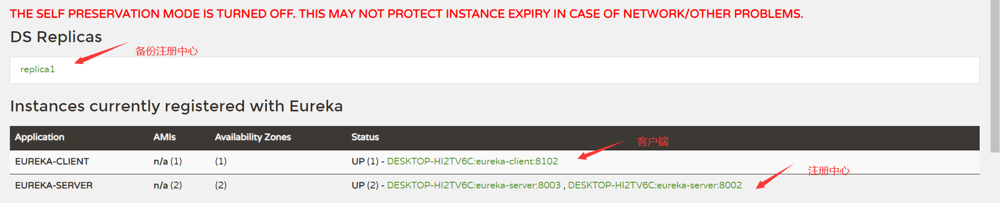

::: tip

Spring Cloud Netflix 是在  Netflix OSS 基础上的封装，里面包含有分布式系统中常用的核心组件：Eureka、Ribbon、Hystrix、Feign、Zuul

:::
<!-- more -->

## Spring Cloud Netflix

Netflix OSS 开源组件集成，包括Eureka、Hystrix、Ribbon、Feign、Zuul等核心组件。

- Eureka：服务治理组件，包括服务端的注册中心和客户端的服务发现机制；
- Ribbon：负载均衡的服务调用组件，具有多种负载均衡调用策略；
- Hystrix：服务容错组件，实现了断路器模式，为依赖服务的出错和延迟提供了容错能力；
- Feign：基于Ribbon和Hystrix的声明式服务调用组件；
- Zuul：API网关组件，对请求提供路由及过滤功能。

### [Spring Cloud Eureka：服务注册与发现](http://www.macrozheng.com/#/cloud/eureka?id=spring-cloud-eureka：服务注册与发现)

#### **Eureka**简介

微服务架构需要有一个注册中心，所有的微服务都会在注册中心注册自己的地址和端口信息，每个微服务都会定时从注册中心获取服务列表，同时汇报自己的运行情况，保证整个微服务的正常运行，Eureka就是实现这一套流程的组件。

#### **搭建注册中心**

* IDEA初始化一个SpringBoot应用，可以在创建的选择组件：`Spring Cloud Discovery -> Eureka Server`，或者创建后手动添加pom

```xml
<dependency>
    <groupId>org.springframework.cloud</groupId>
    <artifactId>spring-cloud-starter-netflix-eureka-server</artifactId>
</dependency>
```

* 启动类添加注解`@EnableEurekaServer`注解来启用Euerka注册中心功能

* `application.yml `添加Eureka注册中心的配置

```yaml
server:
  port: 8001 #指定运行端口
spring:
  application:
    name: eureka-server #指定服务名称
eureka:
  instance:
    hostname: localhost #指定主机地址
  client:
    fetch-registry: false #指定是否要从注册中心获取服务（注册中心不需要开启）
    register-with-eureka: false #指定是否要注册到注册中心（注册中心不需要开启）
  server:
    enable-self-preservation: false #关闭保护模式
```

#### **搭建客户端**

* 依赖

```xml
<dependency>
    <groupId>org.springframework.cloud</groupId>
    <artifactId>spring-cloud-starter-netflix-eureka-client</artifactId>
</dependency>
```

* 启动类添加注解`@EnableDiscoveryClient`来表明这是一个Eureka客户端

  **注意：**`@EnableEurekaClient`只适用于Eureka作为注册中心，`@EnableDiscoveryClient`可以是其他注册中心

* `application.yml`添加Eureka客户端基础配置

```yaml
server:
  port: 8101 #运行端口号
spring:
  application:
    name: eureka-client #服务名称
eureka:
  client:
    register-with-eureka: true #注册到Eureka的注册中心
    fetch-registry: true #获取注册实例列表
    service-url:
      defaultZone: http://localhost:8001/eureka/ #配置注册中心地址
      # defaultZone: http://replica1:8002/eureka/,http://replica2:8003/eureka/ 注册到多个配置中心
```

访问注册中心`http://localhost:8001`即可客户端成功注册

#### **搭建注册中心集群**

由于多个微服务都是注册到注册中心通过服务列表来相互调用，一旦注册中心宕机，会导致所有服务都出现问题，所以我们需要多个注册中心来保证服务正常运行

* 根据注册中心配置文件新增一个`application-replica1.yml`、`application-replica2.yml`配置文件，根据下面配置修改端口号，hostname（为了在注册中心里面好区分），注册中心的地址即可

  **注意**：注册中心地址使用的 `replica2`这样的域名，可以在hosts里面修改下文件

  ```properties
  127.0.0.1 replica2
  127.0.0.1 replica3
  ```

```yaml
server:
  port: 8002
# 另外一个注册中心的端口号
# port: 8003 
spring:
  application:
    name: eureka-server
eureka:
  instance:
    hostname: replica1
  client:
    serviceUrl:
      defaultZone: http://replica2:8003/eureka/ #注册到另一个Eureka注册中心
      # defaultZone: http://replica2:8002/eureka/ # 另外一个注册中心的地址
    fetch-registry: true
    register-with-eureka: true
```

访问任意一个注册中心即可看到成功注册的客户端和备份注册中心



#### **Eureka常用配置**

```yaml
eureka:
  client: #eureka客户端配置
    register-with-eureka: true #是否将自己注册到eureka服务端上去
    fetch-registry: true #是否获取eureka服务端上注册的服务列表
    service-url:
      defaultZone: http://localhost:8001/eureka/ # 指定注册中心地址
    enabled: true # 启用eureka客户端
    registry-fetch-interval-seconds: 30 #定义去eureka服务端获取服务列表的时间间隔
  instance: #eureka客户端实例配置
    lease-renewal-interval-in-seconds: 30 #定义服务多久去注册中心续约
    lease-expiration-duration-in-seconds: 90 #定义服务多久不去续约认为服务失效
    metadata-map:
      zone: jiangsu #所在区域
    hostname: localhost #服务主机名称
    prefer-ip-address: false #是否优先使用ip来作为主机名
  server: #eureka服务端配置
    enable-self-preservation: false #关闭eureka服务端的保护机制
```

### [Spring Cloud Ribbon：负载均衡的服务调用](http://www.macrozheng.com/#/cloud/ribbon?id=spring-cloud-ribbon：负载均衡的服务调用)

#### Ribbon简介

在微服务架构中， 我们服务一般都会部署多个，用户请求进来会调用哪一个就需要负载均衡平衡，当我们使用RestTemplate来调用其他服务时，Ribbon可以很方便的实现负载均衡功能。

**[RestTemplate简单使用](https://hjwu.gq/blogs/JavaNotes/RestTemplate.html)**

#### **创建user-service客户端模块**

供 **Ribbon** 提供服务使用，同时修改配置文件，启动 **user-service** 8020，8021两个端口，注册到注册中心8001中，user-service 中写一些常见的CURD接口即可

* `application.yml`配置

```yaml
server:
  port: 8201
spring:
  application:
    name: user-service
eureka:
  client:
    register-with-eureka: true
    fetch-registry: true
    service-url:
      defaultZone: http://localhost:8001/eureka/
```

#### **创建ribbon-service模块**

通过`ribbon-service` 服务的 **RestTemplate**直接调用 `user-service` 模块的接口即可

* 新增依赖

```xml
<dependency>
    <groupId>org.springframework.cloud</groupId>
    <artifactId>spring-cloud-starter-netflix-ribbon</artifactId>
</dependency>
```

* `application.yml`配置

```yaml
server:
  port: 8301
spring:
  application:
    name: ribbon-service
eureka:
  client:
    register-with-eureka: true
    fetch-registry: true
    service-url:
      defaultZone: http://localhost:8001/eureka/
service-url:
  user-service: http://user-service    # 对应注册中心中 user-server 服务的name地址
```

* 负载均衡使用，在创建`RestTemplate` bean基础上添加注解 `@LoadBalanced` 即可

```java
@Configuration
public class RibbonConfig {

    @Bean
    @LoadBalanced
    public RestTemplate restTemplate(){
        return new RestTemplate();
    }
}
```

* Ribbon **全局配置**与**指定服务配置**

```yaml
user-service: # 指定user-service 服务配置，全局配置去除这行即可，我实测全局配置未生效，不知道为啥
  ribbon:
    ConnectTimeout: 1000 #服务请求连接超时时间（毫秒）
    ReadTimeout: 3000 #服务请求处理超时时间（毫秒）
    OkToRetryOnAllOperations: true #对超时请求启用重试机制
    MaxAutoRetriesNextServer: 1 #切换重试实例的最大个数
    MaxAutoRetries: 1 # 切换实例后重试最大次数
    NFLoadBalancerRuleClassName: com.netflix.loadbalancer.RandomRule #修改负载均衡算法
```

::: details 修改负载均衡算法

| 参数 `com.netflix.loadbalancer.XXX` | 说明                                                         |
| ----------------------------------- | ------------------------------------------------------------ |
| `RandomRule`                        | 从提供服务的实例中以随机的方式                               |
| `RoundRobinRule`                    | 以线性轮询的方式，就是维护一个计数器，从提供服务的实例中按顺序选取，第一次选第一个，第二次选第二个，以此类推，到最后一个以后再从头来过； |
| `RetryRule`                         | 在RoundRobinRule的基础上添加重试机制，即在指定的重试时间内，反复使用线性轮询策略来选择可用实例； |
| `WeightedResponseTimeRule`          | 对RoundRobinRule的扩展，响应速度越快的实例选择权重越大，越容易被选择； |
| `BestAvailableRule`                 | 选择并发较小的实例                                           |
| `AvailabilityFilteringRule`         | 先过滤掉故障实例，再选择并发较小的实例                       |
| `ZoneAwareLoadBalancer`             | 采用双重过滤，同时过滤不是同一区域的实例和故障实例，选择并发较小的实例 |

::: 

* 通过创建bean进行全局配置

```java
@Bean
public IRule customRule(){
   return new RandomRule();  // 随机
}
```

启动注册中心`eureka-service`，启动`user-service`8020、8021，客户端，启动`ribbon-service`服务

调用`ribbon-service`服务能看到`user-service`两个端口的控制台交替打印即可，可以尝试其他负载均衡策略，查看控制台变化

### [Spring Cloud Hystrix：服务容错保护](http://www.macrozheng.com/#/cloud/hystrix?id=spring-cloud-hystrix：服务容错保护)

#### Hystrix简介

在微服务架构中，服务与服务之间通过远程调用的方式进行通信，一旦某个被调用的服务发生了故障，其依赖服务也会发生故障，此时就会发生故障的蔓延，最终导致系统瘫痪。Hystrix实现了断路器模式，当某个服务发生故障时，通过断路器的监控，给调用方返回一个错误响应，而不是长时间的等待，这样就不会使得调用方由于长时间得不到响应而占用线程，从而防止故障的蔓延。Hystrix具备**服务降级、服务熔断、线程隔离、请求缓存、请求合并及服务监控**等强大功能。

#### **创建一个hystrix-service模块**

* 依赖

```xml
<dependency>
    <groupId>org.springframework.cloud</groupId>
    <artifactId>spring-cloud-starter-netflix-eureka-client</artifactId>
</dependency>
<dependency>
    <groupId>org.springframework.cloud</groupId>
    <artifactId>spring-cloud-starter-netflix-hystrix</artifactId>
</dependency>
```

* `application.yml`配置

```yaml
server:
  port: 8401
spring:
  application:
    name: hystrix-service
eureka:
  client:
    register-with-eureka: true
    fetch-registry: true
    service-url:
      defaultZone: http://localhost:8001/eureka/
service-url:
  user-service: http://user-service
```

* 启动类添加注解`@EnableCircuitBreaker`开启断路器功能

#### 服务熔断、服务降级、服务限流

  微服务是完成一个单一的业务功能，这样做的好处是可以做到解耦，每个微服务可以独立演进。但是，一个应用可能会有多个微服务组成，微服务之间的数据交互通过远程过程调用完成。服务之间调用链路太长，相互调用，如果其中一个服务调用时间太长，或者不可用，大量请求堆积，占用系统资源，进而导致系统崩溃，所谓的"雪崩效应"

**服务熔断**：当检测到某个服务多次超时或相应时间太长，会对该服务降级处理，熔断该服务的调用，快速返回错误详细信息，避免长时间等待和资源占用，当检测到节点相应正常后，恢复调用

**服务降级**：从整体负荷考虑，服务分优先级，保证核心业务，暂时停止非核心业务

**服务限流**：限制并发请求量，超过阈值拒绝请求

整点秒杀活动，服务限流是指允许能负载的请求量进来，多余的请求拒绝；服务降级是整点秒杀时对用户注册等非核心的业务做降级处理；服务熔断是当秒杀活动访问太多导致超时，熔断该服务，并作降级处理，返回用户友好提示信息

* 服务降级演示

`UserHystrixController`添加用于测试服务降级的接口：

```java
@GetMapping("/testFallback/{id}")
public CommonResult testFallback(@PathVariable Long id) {
    return userService.getUser(id);
}
```

在UserService中添加调用方法与服务降级方法，方法上需要添加`@HystrixCommand`注解：

```java
@HystrixCommand(fallbackMethod = "getDefaultUser")
public CommonResult getUser(Long id) {
    return restTemplate.getForObject(userServiceUrl + "/user/{1}", CommonResult.class, id);
}

public CommonResult getDefaultUser(@PathVariable Long id) {
    User defaultUser = new User(-1L, "defaultUser", "123456");
    return new CommonResult<>(defaultUser);
}
```

#### **验证**

启动`eureka-server`、`user-service`、`hystrix-service`服务；

正常调用`http://localhost:8401/user/testFallback/1`返回

```json
{
	data: {
		id: 1,
		username: "macro",
		password: "123456",
	},
	message: "操作成功",
	code: 200,
}
```

关闭`user-service`服务，再次调用，服务降级，直接返回预设错误信息

```json
{
	data: {
		id: -1,
		username: "defaultUser",
		password: "123456",
	},
	message: "操作成功",
	code: 200,
}
```

**[Hystrix的请求缓存](http://www.macrozheng.com/#/cloud/hystrix?id=hystrix的请求缓存)**

**[Hystrix请求合并](http://www.macrozheng.com/#/cloud/hystrix?id=请求合并)**

**[Hystrix Dashboard：断路器执行监控](http://www.macrozheng.com/#/cloud/hystrix_dashboard?id=hystrix-dashboard：断路器执行监控)**

### [Spring Cloud OpenFeign：基于Ribbon和Hystrix的声明式服务调用](http://www.macrozheng.com/#/cloud/feign?id=spring-cloud-openfeign：基于ribbon和hystrix的声明式服务调用)

#### Feign简介

Feign是声明式的服务调用工具，我们只需创建一个接口并用注解的方式来配置它，就可以实现对某个服务接口的调用，简化了直接使用RestTemplate来调用服务接口的开发量。Feign具备可插拔的注解支持，同时支持Feign注解、JAX-RS注解及SpringMvc注解。当使用Feign时，Spring Cloud集成了Ribbon和Eureka以提供负载均衡的服务调用及基于Hystrix的服务容错保护功能。

#### 创建一个feign-service模块

* 依赖

```xml
<dependency>
    <groupId>org.springframework.cloud</groupId>
    <artifactId>spring-cloud-starter-openfeign</artifactId>
</dependency>
```

* `application.yml`配置

```yaml
server:
  port: 8701
spring:
  application:
    name: feign-service
eureka:
  client:
    register-with-eureka: true
    fetch-registry: true
    service-url:
      defaultZone: http://localhost:8001/eureka/
```

* 启动类上添加注解`@EnableFeignClients`启动**Feign**客户端功能

* **Feigin**客户端**user-service**服务的接口绑定

  创建一个`user-service`接口，内容基于`user-service`服务的**Controller**类修改为接口，保留**springmvc**的注解即可

```java
// value对应要连接的user-service服务，fallback对应的为user-service降级服务的实现类
@FeignClient(value = "user-service",fallback = UserFallbackService.class)
public interface UserService {
    @PostMapping("/user/create")
    CommonResult create(@RequestBody User user);

    @GetMapping("/user/{id}")
    CommonResult<User> getUser(@PathVariable Long id);
}
```

* 创建**降级服务**实现类

```java
@Component
public class UserFallbackService implements UserService {
    @Override
    public CommonResult create(User user) {
        User defaultUser = new User(-1L, "defaultUser", "123456");
        return new CommonResult<>(defaultUser);
    }

    @Override
    public CommonResult<User> getUser(Long id) {
        User defaultUser = new User(-1L, "defaultUser", "123456");
        return new CommonResult<>(defaultUser);
    }
}
```

* 开启日志，打印详细的http请求细节

::: details 日志等级

- **NONE**：默认的，不显示任何日志；
- **BASIC**：仅记录请求方法、URL、响应状态码及执行时间；
- **HEADERS**：除了BASIC中定义的信息之外，还有请求和响应的头信息；
- **FULL**：除了HEADERS中定义的信息之外，还有请求和响应的正文及元数据。

:::

```java
@Configuration
public class FeignConfig {
    @Bean
    Logger.Level feignLoggerLevel() {
        return Logger.Level.FULL;
    }
}
```

* **Feign**常用配置，**Feign**中可以直接使用**ribbon**，hystrix配置

```yaml
feign:
  hystrix:
    enabled: true #在Feign中开启Hystrix
  compression:
    request:
      enabled: false #是否对请求进行GZIP压缩
      mime-types: text/xml,application/xml,application/json #指定压缩的请求数据类型
      min-request-size: 2048 #超过该大小的请求会被压缩
    response:
      enabled: false #是否对响应进行GZIP压缩
logging:
  level: #修改日志级别
    com.macro.cloud.service.UserService: debug
```

#### 验证

启动`eureka-server`、`user-service`、`feign-service`服务；

访问`http://localhost:8701/user/1`，`user-service`两端口控制台正常交替打印

关闭两个所有的`user-service`服务，再次访问，返回为降级预设错误

```json
{
	data: {
		id: -1,
		username: "defaultUser",
		password: "123456",
	},
	message: "操作成功",
	code: 200,
}
```

### [Spring Cloud Zuul：API网关服务](http://www.macrozheng.com/#/cloud/zuul?id=spring-cloud-zuul：api网关服务)

#### Zuul简介

API网关为微服务架构中的服务提供了统一的访问入口，客户端通过API网关访问相关服务。API网关的定义类似于设计模式中的门面模式，它相当于整个微服务架构中的门面，所有客户端的访问都通过它来进行路由及过滤。它实现了**请求路由、负载均衡、校验过滤、服务容错、服务聚合**等功能。

#### 创建一个zuul-proxy模块

* 依赖

```xml
<dependency>
    <groupId>org.springframework.cloud</groupId>
    <artifactId>spring-cloud-starter-netflix-zuul</artifactId>
</dependency>
```

* `application.yml`配置

```yaml
server:
  port: 8801
spring:
  application:
    name: zuul-proxy
eureka: 	
  client:
    register-with-eureka: true
    fetch-registry: true
    service-url:
      defaultZone: http://localhost:8001/eureka/
```

* 启动类添加注解`EnableZuulProxy`启用Zuul的API网关功能
* 启动`eureka-server`，两个`user-service`，`feign-service`和`zuul-proxy`来演示Zuul的常用功能

* 配置路由规则：

```yaml
zuul:
  routes: #给服务配置路由
    user-service:
      path: /userService/**
    feign-service:
      path: /feignService/**
  ignored-services: user-service,feign-service  #关闭默认路由配置
```

验证接口，因为已经使用了feign，所以可以看到userService两个端口的控制台交替答应成功的日志记录，默认的路由规则就是注册到注册中心的服务名，也就是说访问userService，user-service都能成功调用user-service服务的接口，关闭默认路由后，默认的访问路径就失效了

访问`http://localhost:8801/userService/user/1`，`http://localhost:8801/user-service/user/1`都可以发现请求路由到了user-service上了；

访问`http://localhost:8801/feignService/user/1`，`http://localhost:8801/feign-service/user/1`都可以发现请求路由到了feign-service上了

* 配置路由访问前缀，访问接口底之前加上前缀路径即可

```yaml
zuul:
  prefix: /proxy #给网关路由添加前缀
```

验证：`http://localhost:8801/proxy/userService/user/1`

#### **查看路由信息**

* 依赖

```xml
<dependency>
    <groupId>org.springframework.boot</groupId>
    <artifactId>spring-boot-starter-actuator</artifactId>
</dependency>
```

* `application-yml`配置

```yaml
management:
  endpoints:
    web:
      exposure:
        include: 'routes'
```

* 测试

查看简单路由信息：`http://localhost:8801/actuator/routes/`

查看详细路由信息：`http://localhost:8801/actuator/routes/details`

#### **Header过滤及重定向添加Host(未测试)**

Zuul在请求路由时，默认会过滤掉一些敏感的头信息，以下配置可以防止路由时的Cookie及Authorization的丢失

```yaml
zuul:
  sensitive-headers: Cookie,Set-Cookie,Authorization  # 配置过滤敏感的请求头信息，设置为空就不会过滤
  add-host-header: true                               # 设置为true重定向是会添加host请求头
```

#### 过滤器

路由与过滤是Zuul的两大核心功能，路由功能负责将外部请求转发到具体的服务实例上去，是实现统一访问入口的基础，过滤功能负责对请求过程进行额外的处理，是请求校验过滤及服务聚合的基础

**Zuul中集中典型的过滤器类型**

| 过滤器    | 说明                                                         | 场景                                                 |
| --------- | ------------------------------------------------------------ | ---------------------------------------------------- |
| `pre`     | 在请求被路由到目标服务前执行，                               | 比如权限校验、打印日志等功能；                       |
| `routing` | 在请求被路由到目标服务时执行，这是使用Apache HttpClient或Netflix Ribbon构建和发送原始HTTP请求的地方； |                                                      |
| `post`    | 在请求被路由到目标服务后执行                                 | 比如给目标服务的响应添加头信息，收集统计数据等功能； |
| `error`   | 请求在其他阶段发生错误时执行                                 |                                                      |

**zuul过滤器生命周期**


**自定义过滤器**

添加下面自定义的过滤器，调用`http://localhost:8801/user-service/user/1`即可看到日志生效；

**仿照写了一个其他的过滤器，判断请求是否又accessToken或者其他参数的，没有生效，过滤器理解还不通透。**

::: details Prelog Filter

```java
package com.macro.cloud.filter;

import com.netflix.zuul.ZuulFilter;
import com.netflix.zuul.context.RequestContext;
import com.netflix.zuul.exception.ZuulException;
import org.slf4j.Logger;
import org.slf4j.LoggerFactory;
import org.springframework.stereotype.Component;

import javax.servlet.http.HttpServletRequest;

/**
 * Created by macro on 2019/9/9.
 */
@Component
public class PreLogFilter extends ZuulFilter {
    private final Logger LOGGER = LoggerFactory.getLogger(this.getClass());

    /**
     * 过滤器类型，有pre、route、post、error四种。
     */
    @Override
    public String filterType() {
        return "pre";
    }

    /**
     * 过滤器执行顺序，数值越小优先级越高。
     */
    @Override
    public int filterOrder() {
        return 1;
    }

    /**
     * 是否进行过滤，返回true会执行过滤。
     */
    @Override
    public boolean shouldFilter() {
        return true;
    }

    /**
     * 自定义的过滤器逻辑，当shouldFilter()返回true时会执行。
     */
    @Override
    public Object run() throws ZuulException {
        RequestContext requestContext = RequestContext.getCurrentContext();
        HttpServletRequest request = requestContext.getRequest();
        String host = request.getRemoteHost();
        String method = request.getMethod();
        String uri = request.getRequestURI();
        LOGGER.info("Remote host:{},method:{},uri:{}", host, method, uri);
        return null;
    }
}
```

:::

**禁用过滤器**

```yaml
zuul:
  PreLogFilter:       # 对应过滤器的名称
    pre:              # 对应过滤器的类型
      disable: true   # 是否禁用过滤器，默认为false
```

**核心过滤器**

::: details 核心过滤器

| 过滤器名称              | 过滤类型 | 优先级 | 过滤器的作用                                                 |
| ----------------------- | -------- | ------ | ------------------------------------------------------------ |
| ServletDetectionFilter  | pre      | -3     | 检测当前请求是通过DispatcherServlet处理运行的还是ZuulServlet运行处理的 |
| Servlet30WrapperFilter  | pre      | -2     | 对原始的HttpServletRequest进行包装                           |
| FormBodyWrapperFilter   | pre      | -1     | 将Content-Type为application/x-www-form-urlencoded或multipart/form-data的请求包装成FormBodyRequestWrapper对象 |
| DebugFilter             | route    | 1      | 根据zuul.debug.request的配置来决定是否打印debug日志          |
| PreDecorationFilter     | route    | 5      | 对当前请求进行预处理以便执行后续操作                         |
| RibbonRoutingFilter     | route    | 10     | 通过Ribbon和Hystrix来向服务实例发起请求，并将请求结果进行返回 |
| SimpleHostRoutingFilter | route    | 100    | 只对请求上下文中有routeHost参数的进行处理，直接使用HttpClient向routeHost对应的物理地址进行转发 |
| SendForwardFilter       | route    | 500    | 只对请求上下文中有forward.to参数的进行处理，进行本地跳转     |
| SendErrorFilter         | post     | 0      | 当其他过滤器内部发生异常时的会由它来进行处理，产生错误响应   |
| SendResponseFilter      | post     | 1000   | 利用请求上下文的响应信息来组织请求成功的响应内容             |

:::

#### Ribbon和Hystrix的支持

由于Zuul自动集成了Ribbon和Hystrix，所以Zuul天生就有负载均衡和服务容错能力，我们可以通过Ribbon和Hystrix的配置来配置Zuul中的相应功能，所以可以在配置文件中直接添加Ribbon，Hystrix的配置即可