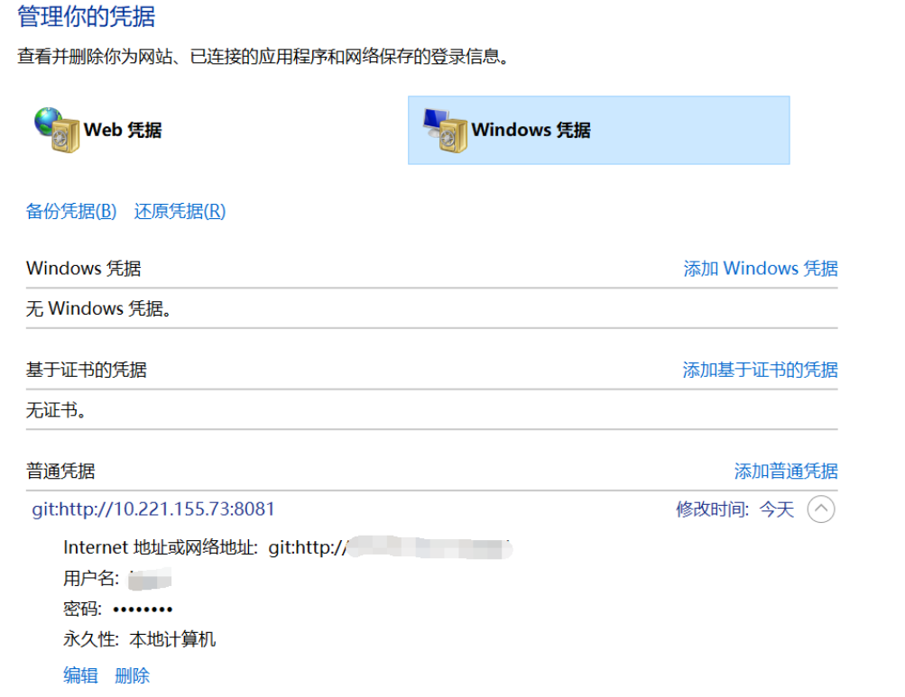

::: tip

Git的常规使用，命令汇总

:::

<!-- more -->

## Git常用指令

### 1. 查看并删除分支

白色为本地分支，红色为远端分支

```sh
git -branch -a
```

* 删除本地分支

```sh
git branch -D 分支名
```

* 删除远端分支

```sh
git push origin --delete 分支名 
```


## Git修改凭证

事例：使用`Tortoigit`提交文件时，因为没有权限，输入的凭证错误，导致提交失败，后续添加权限后，重复提交仍然失败。

原因：没有清楚之前错误的Git凭证

解决：到 `控制面板-用户帐户-凭据管理器`目录下修改凭证的`用户名`和`密码`

