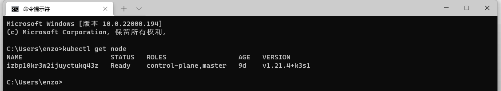
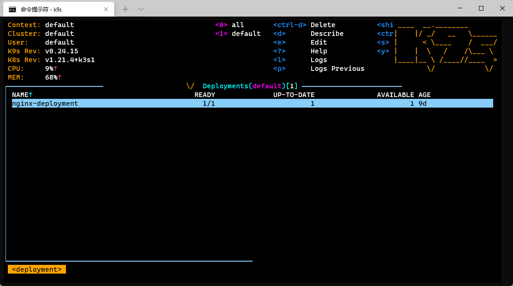

::: tip

**k3s**是rancher开源的一个Kubernetes发行版，从名字上就可以看出k3s相对k8s做了很多裁剪和优化，二进制程序不足50MB，占用资源更少，只需要512MB内存即可运行

:::

<!-- more -->

## 参考文档

* [K3S Rancher官网文档](https://docs.rancher.cn/docs/k3s/quick-start/_index)

* [轻量级Kubernetes k3s初探](https://zhuanlan.zhihu.com/p/125499493)

## K3s概述

k3s是史上最轻量级Kubernetes，相比K8S少了5，主要裁剪了下面这5个功能，如果想学习k8s，而又不想折腾k8s的繁琐安装部署，完全可以使用k3s代替k8s，k3s包含了k8s的所有基础功能，而k8s附加功能其实大多数情况也用不到

- 过时的功能和非默认功能
- Alpha功能
- 内置的云提供商插件
- 内置的存储驱动
- Docker

相比K8s的优化

- 使用内嵌轻量级数据库SQLite作为默认数据存储替代etcd，当然etcd仍然是支持的。
- 内置了local storage provider、service load balancer、helm controller、Traefik ingress controller，开箱即用。
- 所有Kubernetes控制平面组件如api-server、scheduler等封装成为一个精简二进制程序，控制平面只需要一个进程即可运行。
- 删除内置插件(比如cloudprovider插件和存储插件)。
- 减少外部依赖，操作系统只需要安装较新的内核以及支持cgroup即可，k3s安装包已经包含了containerd、Flannel、CoreDNS，非常方便地一键式安装，不需要额外安装Docker、Flannel等组件

K3s使用场景：

- Edge
- IoT
- CI
- ARM

## K3s安装

国内用户一键安装脚本

```shell
curl -sfL http://rancher-mirror.cnrancher.com/k3s/k3s-install.sh | INSTALL_K3S_MIRROR=cn sh -
```

- K3s 服务将被配置为在节点重启后或进程崩溃或被杀死时自动重启。
- 将安装其他实用程序，包括`kubectl`、`crictl`、`ctr`、`k3s-killall.sh` 和 `k3s-uninstall.sh`。
- 将kubeconfig文件写入到`/etc/rancher/k3s/k3s.yaml`，由 K3s 安装的 kubectl 将自动使用该文件

再其他节点安装K3s，并加入到集群中,

```shell
curl -sfL http://rancher-mirror.cnrancher.com/k3s/k3s-install.sh | INSTALL_K3S_MIRROR=cn K3S_URL=https://myserver:6443 K3S_TOKEN=mynodetoken sh -
```

设置`K3S_URL`参数会使 K3s 以 worker 模式运行。K3s agent 将在所提供的 URL 上向监听的 K3s 服务器注册。`K3S_TOKEN`使用的值存储在你的服务器节点上的`/var/lib/rancher/k3s/server/node-token`路径下。

**注意**

每台计算机必须具有唯一的主机名。如果您的计算机没有唯一的主机名，请传递`K3S_NODE_NAME`环境变量，并为每个节点提供一个有效且唯一的主机名。

k3s 默认使用 crictl 替代docker 管理容器，同一个公司出品，指令和docker基本保持一直，

## K9s

快捷管理kubenetes集群的运维软件，k3s同理

* [github地址](https://github.com/derailed/k9s/releases)
* [参考文档](https://www.cnblogs.com/zgshi/p/12681355.html)

下载对应版本的系统即可，以windows平台为例，下载下来，解压，把k9s.exe 加入系统环境变量即可。

* 登录服务器，下载k8s集群的yaml配置文件

```shell
# k3s 
/etc/rancher/k3s/k3s.yaml

# k8s
./kube/config

# 将文件下载到本地路径，创建环境变量配置
%KUBECTL_HOME%		k3s.yaml配置文件路径
```

* 下载kubectl指令文件

```shell
# 查看 kubectl.exe 最新版本
https://storage.googleapis.com/kubernetes-release/release/stable.txt

# 下载最新版本
https://storage.googleapis.com/kubernetes-release/release/v1.22.2/bin/windows/amd64/kubecti.exe

# 配置kubectl.exe 指定文件路径
%KUBECTL_HOME%		kubectl.exe 文件路径

# curl 工具下载 可选
https://curl.se/windows/
```

验证：



数据k9s即可进入k9s管理界面，根据快捷键，快速查看资源信息



## 其他

pc、ios平台可视化管理k8s集群 kubenav，根据软件描述，导入对应配置即可，k8s,k3s的配置文件上面有说，导入的时候改一下里面的127.0.0.1为自己服务器的ip地址即可

[参考文档](https://docs.kubenav.io/mobile/kubeconfig/)
