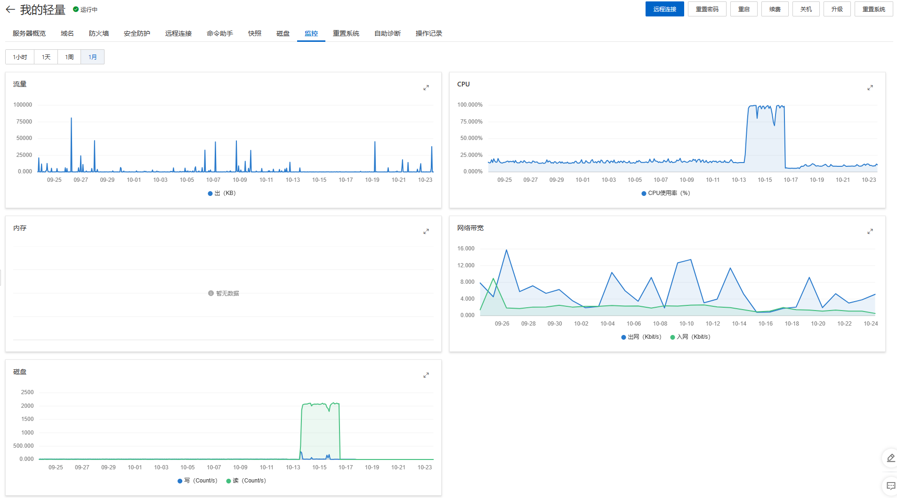

::: tip

因为个人像学习K8s相关云服务，k3s占用资源少，所以个人部署在阿里云服务器上，相关服务也都使用k3s大家，这里记录一些遇到的问题，没有能及时记录，所以很零散

:::

<!-- more -->

## 服务器崩了自动重启失败分享

环境

阿里云 轻量化服务器

### 版本

VERSION:
v1.25.5+k3s2 (de654222)

### 问题

10-13号到10-16号，服务器 CPU 占用激增到100%，磁盘读写增加，上面就部署了一些个人博客和一些练习项目，包含开源的一些三方chatGpt



发现问题是自己部署的chatGpt无法访问了，登陆服务器看看，结果服务器登陆不上，CPU占用太多，ssh请求都没法相应

### 问题排查

首先印象中自己近期是动服务器上面什么东西的，其次怀疑难道是部署的ChatGpt服务被恶意攻击了？（练习服务器，端口全开，防火墙默认的），看了下网络流量，那段时间没啥情况，最后也没排查出个啥

### 问题解决

首先得进服务器呗

1. 多尝试了几次，ssh确实没法登陆，也就意味着我没法重启k3s，把负载这些降下来；
2. 阿里云提供远程服务，尝试后同样无解；
3. 个人练习服务器没考虑这么多，快照备份也没做，无解；
4. 一键重启，尝试了，相应了很久，感觉起码有2小时，解决部分，能进服务器了

k3s 服务没有自动重启

1. 执行重启 `service k3s start`, 报错了，查看状态 `systemctl status k3s.service`

```bash
[root@iZbp10kr3w2ijuyctukq43Z file]# service k3s restart
Redirecting to /bin/systemctl restart k3s.service
Job for k3s.service failed because the control process exited with error code.
See "systemctl status k3s.service" and "journalctl -xe" for details.
[root@iZbp10kr3w2ijuyctukq43Z file]# systemctl status k3s.service
● k3s.service - Lightweight Kubernetes
   Loaded: loaded (/etc/systemd/system/k3s.service; enabled; vendor preset: disabled)
   Active: activating (auto-restart) (Result: exit-code) since Mon 2023-01-16 13:15:01 CST; 2s ago
     Docs: https://k3s.io
  Process: 37172 ExecStart=/usr/local/bin/k3s server (code=exited, status=1/FAILURE)
  Process: 37171 ExecStartPre=/sbin/modprobe overlay (code=exited, status=0/SUCCESS)
  Process: 37169 ExecStartPre=/sbin/modprobe br_netfilter (code=exited, status=0/SUCCESS)
  Process: 37166 ExecStartPre=/bin/sh -xc ! /usr/bin/systemctl is-enabled --quiet nm-cloud-setup.service (code=exited, status=0/SUCCESS)
 Main PID: 37172 (code=exited, status=1/FAILURE)

Jan 16 13:15:01 iZbp10kr3w2ijuyctukq43Z systemd[1]: Failed to start Lightweight Kubernetes.
[root@iZbp10kr3w2ijuyctukq43Z file]# journalctl -xe
Jan 16 13:15:06 iZbp10kr3w2ijuyctukq43Z k3s[37195]: time="2023-01-16T13:15:06+08:00" level=info msg="Kine available at unix://kine.sock"
Jan 16 13:15:06 iZbp10kr3w2ijuyctukq43Z k3s[37195]: time="2023-01-16T13:15:06+08:00" level=fatal msg="starting kubernetes: preparing server: failed to normalize token; m>
Jan 16 13:15:06 iZbp10kr3w2ijuyctukq43Z systemd[1]: k3s.service: Main process exited, code=exited, status=1/FAILURE
Jan 16 13:15:06 iZbp10kr3w2ijuyctukq43Z systemd[1]: k3s.service: Failed with result 'exit-code'.
-- Subject: Unit failed
-- Defined-By: systemd
-- Support: https://access.redhat.com/support
-- 
-- The unit k3s.service has entered the 'failed' state with result 'exit-code'.
Jan 16 13:15:06 iZbp10kr3w2ijuyctukq43Z systemd[1]: Failed to start Lightweight Kubernetes.
-- Subject: Unit k3s.service has failed
-- Defined-By: systemd
-- Support: https://access.redhat.com/support
-- 
-- Unit k3s.service has failed.
```

根据提示继续执行 "journalctl -xe" 查看详细情况

详细情况没有截图，因为没查到日志记录，没及时做备份，这个得后面注意了，找了下以前的，只有这句报错了 `starting kubernetes: preparing server: failed to normalize token; must be **in** format K10<CA-HASH>::<USERNAME>:<PASSWORD> **or** <PASSWORD>` ,大概意思是 `/var/lib/rancher/k3s/server/node-token` 这个下面令牌没东西了，正确的格式应该是上面这种，我cat了下，的确没有东西了，

尝试了重新注册生成，报错
尝试了重装，就是一条指令那种，好像会覆盖，记得以前执行过，还是报错

百度没找到对应错误

重新翻我的博客，找到了记录，上面的日志就是 今年 1月份的时候遇到的问题，没想到10月份再次遇到了，[当时的记录](https://loenzo.top/blogs/k8sNotes/K3s.html#%E9%97%AE%E9%A2%98 "当时的记录")，详细的参考链接现在已经不可访问了

### 解决

最终的解决方式很简单，就是把这个文件 `/var/lib/rancher/k3s/server/node-token`删除掉，再重启K3s服务就OK了

严重怀疑阿里云服务器有问题，但是我没有证据.....

### 回顾

每次遇到问题后，整个问题 `排查解决过程是有记录`的必要的，比如这次，要是没想起翻一下自己当时记录，估计只有把服务卸载了完整重装了，重启启动这些pod是个繁琐的工程了（主要是菜）


## 证书过期怎么解

### 环境

阿里云 轻量化服务器

### 版本

VERSION:
v1.25.5+k3s2 (de654222)

### 问题

多事之秋，在这个问题前 服务器崩了自动重启失败分享 , 也遇到了自己部署的服务没法访问的问题

### 排查

同样查看日志，查看状态 `systemctl status k3s.service` "journalctl -xe" 查看详细情况，报错如下：
`"Unable to authenticate the request" err="[x509: certificate has expired or is not yet valid: current time`，看提示就是啥认证、证书类问题，百度了下，k3s证书会过去，算了下时间，自己的部署时间确过了一年

查看证书对应时间 `for i in<span> </span>`ls /var/lib/rancher/k3s/server/tls/*.crt `; do echo $i; openssl x509 -enddate -noout -in $i; done`

### 解决

主要通过修改系统时间的方式让证书时间变长
1、关闭时间同步

```bash
timedatectl set-ntp no
```

2、查看k3s过期时间

```bash
for i in `ls /var/lib/rancher/k3s/server/tls/*.crt`; do echo $i; openssl x509 -enddate -noout -in $i; done
```

3、删除 secret k3s-serving

```bash
kubectl --insecure-skip-tls-verify -n kube-system delete secrets k3s-serving
```

4、删除系统中的文件dynamic-cert.json

```bash
rm -f /var/lib/rancher/k3s/server/tls/dynamic-cert.json
```

5、设置时间系统时间到 2050-01-01

```bash
date -s 20500101
```

6、重启k3s

```bash
sudo service k3s restart
```

7、查看过期时间

```bash
for i in `ls /var/lib/rancher/k3s/server/tls/*.crt`; do echo $i; openssl x509 -enddate -noout -in $i; done
```

8、打开时间同步

```bash
timedatectl set-ntp yes
```

重新 查看证书情况详情如下：

```bash
[root@iZbp10kr3w2ijuyctukq43Z ~]# for i in `ls /var/lib/rancher/k3s/server/tls/*.crt`; do echo $i; openssl x509 -enddate -noout -in $i; done
/var/lib/rancher/k3s/server/tls/client-admin.crt
notAfter=Dec 31 16:00:11 2050 GMT
/var/lib/rancher/k3s/server/tls/client-auth-proxy.crt
notAfter=Dec 31 16:00:11 2050 GMT
/var/lib/rancher/k3s/server/tls/client-ca.crt
notAfter=Sep 22 08:02:59 2031 GMT
/var/lib/rancher/k3s/server/tls/client-controller.crt
notAfter=Dec 31 16:00:11 2050 GMT
/var/lib/rancher/k3s/server/tls/client-k3s-cloud-controller.crt
notAfter=Dec 31 16:00:11 2050 GMT
/var/lib/rancher/k3s/server/tls/client-k3s-controller.crt
notAfter=Dec 31 16:00:11 2050 GMT
/var/lib/rancher/k3s/server/tls/client-kube-apiserver.crt
notAfter=Dec 31 16:00:11 2050 GMT
/var/lib/rancher/k3s/server/tls/client-kube-proxy.crt
notAfter=Dec 31 16:00:11 2050 GMT
/var/lib/rancher/k3s/server/tls/client-scheduler.crt
notAfter=Dec 31 16:00:11 2050 GMT
/var/lib/rancher/k3s/server/tls/request-header-ca.crt
notAfter=Sep 22 08:02:59 2031 GMT
/var/lib/rancher/k3s/server/tls/server-ca.crt
notAfter=Sep 22 08:02:59 2031 GMT
/var/lib/rancher/k3s/server/tls/serving-kube-apiserver.crt
notAfter=Dec 31 16:00:11 2050 GMT
[root@iZbp10kr3w2ijuyctukq43Z ~]# 
```

有两条是 在 2031年的，不过不影响，毕竟明年咱就不续期了（低价格续期就三年）....哈哈哈....

检查：重新检查各个服务是否正常

```bash
[root@iZbp10kr3w2ijuyctukq43Z ~]# kubectl get pod -n blog
NAME                            READY   STATUS    RESTARTS        AGE
dailycheckin-6f7c99c968-7nm7t   1/1     Running   1 (6d1h ago)    264d
blog-8698b4655-5576p            1/1     Running   18 (6d1h ago)   81d
blog-8698b4655-q2xmk            1/1     Running   23 (6d1h ago)   81d
[root@iZbp10kr3w2ijuyctukq43Z ~]# kubectl get pod -n pandora
NAME                       READY   STATUS    RESTARTS       AGE
pandora-6d9c5db8c6-9wcj9   1/1     Running   2 (6d1h ago)   73d
```

都是OK的，万事大吉....

当然啦，正规流程可不是这样的哈....
