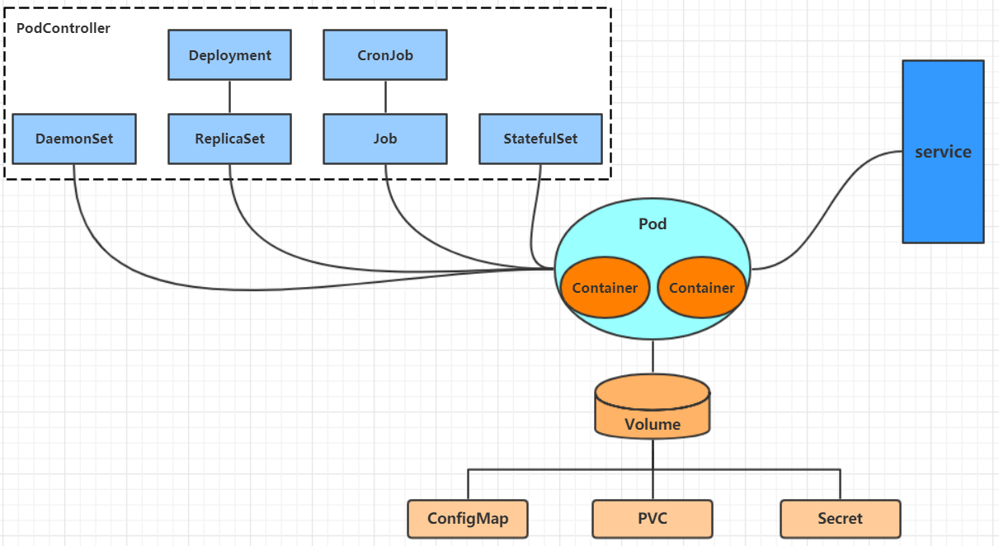
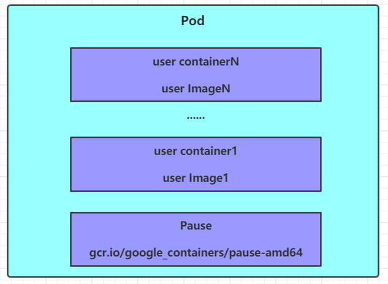

::: tip

本章主要学习K8s资源管理，简单的实战部署练习。根据[哔哩哔哩黑马视频](https://www.bilibili.com/video/BV1cK4y1L7Am?p=1)学习，学习来源于搬迁，部分文档有根据自己学习进行修改和补充，[文档学习资源](https://www.orchome.com/1786)

:::

<!-- more -->

# 第三章 资源管理

本章节主要介绍yaml语法和kubernetes的资源管理方式

## 资源管理介绍

在kubernetes中，所有的内容都抽象为资源，用户需要通过操作资源来管理kubernetes。

>​    kubernetes的本质上就是一个集群系统，用户可以在集群中部署各种服务，所谓的部署服务，其实就是在kubernetes集群中运行一个个的容器，并将指定的程序跑在容器中。
>
>​    kubernetes的最小管理单元是pod而不是容器，所以只能将容器放在`Pod`中，而kubernetes一般也不会直接管理Pod，而是通过`Pod控制器`来管理Pod的。
>
>​    Pod可以提供服务之后，就要考虑如何访问Pod中服务，kubernetes提供了`Service`资源实现这个功能。
>
>​    当然，如果Pod中程序的数据需要持久化，kubernetes还提供了各种`存储`系统。

>  学习kubernetes的核心，就是学习如何对集群上的`Pod、Pod控制器、Service、存储`等各种资源进行操作

## YAML语言介绍

​    YAML是一个类似 XML、JSON 的标记性语言。它强调以**数据**为中心，并不是以标识语言为重点。因而YAML本身的定义比较简单，号称"一种人性化的数据格式语言"。

~~~xml
<heima>
	<age>15</age>
    <address>Beijing</address>
</heima>
~~~

~~~yaml
heima:
  age: 15
  address: Beijing
~~~

YAML的语法比较简单，主要有下面几个：

- 大小写敏感
- 使用缩进表示层级关系
- 缩进不允许使用tab，只允许空格( 低版本限制 )
- 缩进的空格数不重要，只要相同层级的元素左对齐即可
- '#'表示注释

YAML支持以下几种数据类型：

- 纯量：单个的、不可再分的值
- 对象：键值对的集合，又称为映射（mapping）/ 哈希（hash） / 字典（dictionary）
- 数组：一组按次序排列的值，又称为序列（sequence） / 列表（list）

~~~yaml
# 纯量, 就是指的一个简单的值，字符串、布尔值、整数、浮点数、Null、时间、日期
# 1 布尔类型
c1: true (或者True)
# 2 整型
c2: 234
# 3 浮点型
c3: 3.14
# 4 null类型 
c4: ~  # 使用~表示null
# 5 日期类型
c5: 2018-02-17    # 日期必须使用ISO 8601格式，即yyyy-MM-dd
# 6 时间类型
c6: 2018-02-17T15:02:31+08:00  # 时间使用ISO 8601格式，时间和日期之间使用T连接，最后使用+代表时区
# 7 字符串类型
c7: heima     # 简单写法，直接写值 , 如果字符串中间有特殊字符，必须使用双引号或者单引号包裹 
c8: line1
    line2     # 字符串过多的情况可以拆成多行，每一行会被转化成一个空格
~~~

~~~yaml
# 对象
# 形式一(推荐):
heima:
  age: 15
  address: Beijing
# 形式二(了解):
heima: {age: 15,address: Beijing}
~~~

~~~yaml
# 数组
# 形式一(推荐):
address:
  - 顺义
  - 昌平	
# 形式二(了解):
address: [顺义,昌平]
~~~

> 小提示：
>
> ​	1  书写yaml切记`:` 后面要加一个空格
>
> ​	2  如果需要将多段yaml配置放在一个文件中，中间要使用`---`分隔
>
> ​    3 下面是一个yaml转json的网站，可以通过它验证yaml是否书写正确
>
> ​       https://www.json2yaml.com/convert-yaml-to-json

## 资源管理方式

- 命令式对象管理：直接使用命令去操作kubernetes资源

  `kubectl run nginx-pod --image=nginx:1.17.1 --port=80`

- 命令式对象配置：通过命令配置和配置文件去操作kubernetes资源

  `kubectl create/patch -f nginx-pod.yaml`

- 声明式对象配置：通过apply命令和配置文件去操作kubernetes资源

  `kubectl apply -f nginx-pod.yaml`

| 类型           | 操作对象 | 适用环境 | 优点           | 缺点                             |
| -------------- | -------- | -------- | -------------- | -------------------------------- |
| 命令式对象管理 | 对象     | 测试     | 简单           | 只能操作活动对象，无法审计、跟踪 |
| 命令式对象配置 | 文件     | 开发     | 可以审计、跟踪 | 项目大时，配置文件多，操作麻烦   |
| 声明式对象配置 | 目录     | 开发     | 支持目录操作   | 意外情况下难以调试               |

### 命令式对象管理

**kubectl命令**

​    kubectl是kubernetes集群的命令行工具，通过它能够对集群本身进行管理，并能够在集群上进行容器化应用的安装部署。kubectl命令的语法如下：

~~~md
kubectl [command] [type] [name] [flags]
~~~

**comand**：指定要对资源执行的操作，例如create、get、delete

**type**：指定资源类型，比如deployment、pod、service

**name**：指定资源的名称，名称大小写敏感

**flags**：指定额外的可选参数

~~~powershell
# 查看所有pod
kubectl get pod 

# 查看某个pod
kubectl get pod pod_name

# 查看某个pod,以yaml格式展示结果
kubectl get pod pod_name -o yaml
~~~

**资源类型**

kubernetes中所有的内容都抽象为资源，可以通过下面的命令进行查看:

~~~powershell
kubectl api-resources
~~~

经常使用的资源有下面这些：

<table>
	<tr>
	    <th>资源分类</th>
	    <th>资源名称</th>
		<th>缩写</th>
		<th>资源作用</th>
	</tr>
	<tr>
	    <td rowspan="2">集群级别资源</td>
        <td>nodes</td>
	    <td>no</td>
		<td>集群组成部分</td>
	</tr>
	<tr>
		<td>namespaces</td>
	    <td>ns</td>
		<td>隔离Pod</td>
	</tr>
	<tr>
		<td>pod资源</td>
	    <td>pods</td>
	    <td>po</td>
		<td>装载容器</td>
	</tr>
	<tr>
		<td rowspan="8">pod资源控制器</td>
	    <td>replicationcontrollers</td>
	    <td>rc</td>
		<td>控制pod资源</td>
	</tr>
	<tr>
	    <td>replicasets</td>
	    <td>rs</td>
		<td>控制pod资源</td>
	</tr>
	<tr>
	    <td>deployments</td>
	    <td>deploy</td>
		<td>控制pod资源</td>
	</tr>
	<tr>
	    <td>daemonsets</td>
	    <td>ds</td>
		<td>控制pod资源</td>
	</tr>
	<tr>
	    <td>jobs</td>
	    <td></td>
		<td>控制pod资源</td>
	</tr>	
	<tr>
	    <td>cronjobs</td>
	    <td>cj</td>
		<td>控制pod资源</td>
	</tr>	
	<tr>
	    <td>horizontalpodautoscalers</td>
	    <td>hpa</td>
		<td>控制pod资源</td>
	</tr>	
	<tr>
	    <td>statefulsets</td>
	    <td>sts</td>
		<td>控制pod资源</td>
	</tr>
	<tr>
		<td rowspan="2">服务发现资源</td>
	    <td>services</td>
	    <td>svc</td>
		<td>统一pod对外接口</td>
	</tr>
    <tr>
	    <td>ingress</td>
	    <td>ing</td>
		<td>统一pod对外接口</td>
	</tr>
	<tr>
		<td rowspan="3">存储资源</td>
	    <td>volumeattachments</td>
	    <td></td>
		<td>存储</td>
	</tr>
	<tr>
	    <td>persistentvolumes</td>
	    <td>pv</td>
		<td>存储</td>
	</tr>
	<tr>
	    <td>persistentvolumeclaims</td>
	    <td>pvc</td>
		<td>存储</td>
	</tr>
	<tr>
		<td rowspan="2">配置资源</td>
	    <td>configmaps</td>
	    <td>cm</td>
		<td>配置</td>
	</tr>
	<tr>
	    <td>secrets</td>
	    <td></td>
		<td>配置</td>
	</tr>
</table>

**操作**

kubernetes允许对资源进行多种操作，可以通过--help查看详细的操作命令

~~~powershell
kubectl --help
~~~

经常使用的操作有下面这些：

<table>
	<tr>
	    <th>命令分类</th>
	    <th>命令</th>
		<th>翻译</th>
		<th>命令作用</th>
	</tr>
	<tr>
	    <td rowspan="6">基本命令</td>
	    <td>create</td>
	    <td>创建</td>
		<td>创建一个资源</td>
	</tr>
	<tr>
		<td>edit</td>
	    <td>编辑</td>
		<td>编辑一个资源</td>
	</tr>
	<tr>
		<td>get</td>
	    <td>获取</td>
	    <td>获取一个资源</td>
	</tr>
   <tr>
		<td>patch</td>
	    <td>更新</td>
	    <td>更新一个资源</td>
	</tr>
	<tr>
	    <td>delete</td>
	    <td>删除</td>
		<td>删除一个资源</td>
	</tr>
	<tr>
	    <td>explain</td>
	    <td>解释</td>
		<td>展示资源文档</td>
	</tr>
	<tr>
	    <td rowspan="10">运行和调试</td>
	    <td>run</td>
	    <td>运行</td>
		<td>在集群中运行一个指定的镜像</td>
	</tr>
	<tr>
	    <td>expose</td>
	    <td>暴露</td>
		<td>暴露资源为Service</td>
	</tr>
	<tr>
	    <td>describe</td>
	    <td>描述</td>
		<td>显示资源内部信息</td>
	</tr>
	<tr>
	    <td>logs</td>
	    <td>日志</td>
		<td>输出容器在 pod 中的日志</td>
	</tr>	
	<tr>
	    <td>attach</td>
	    <td>缠绕</td>
		<td>进入运行中的容器</td>
	</tr>	
	<tr>
	    <td>exec</td>
	    <td>执行</td>
		<td>执行容器中的一个命令</td>
	</tr>	
	<tr>
	    <td>cp</td>
	    <td>复制</td>
		<td>在Pod内外复制文件</td>
	</tr>
		<tr>
		<td>rollout</td>
	    <td>首次展示</td>
		<td>管理资源的发布</td>
	</tr>
	<tr>
		<td>scale</td>
	    <td>规模</td>
		<td>扩(缩)容Pod的数量</td>
	</tr>
	<tr>
		<td>autoscale</td>
	    <td>自动调整</td>
		<td>自动调整Pod的数量</td>
	</tr>
	<tr>
		<td rowspan="2">高级命令</td>
	    <td>apply</td>
	    <td>rc</td>
		<td>通过文件对资源进行配置</td>
	</tr>
	<tr>
	    <td>label</td>
	    <td>标签</td>
		<td>更新资源上的标签</td>
	</tr>
	<tr>
		<td rowspan="2">其他命令</td>
	    <td>cluster-info</td>
	    <td>集群信息</td>
		<td>显示集群信息</td>
	</tr>
	<tr>
	    <td>version</td>
	    <td>版本</td>
		<td>显示当前Server和Client的版本</td>
	</tr>
</table>

下面以一个namespace / pod的创建和删除简单演示下命令的使用：

~~~powershell
# 创建一个namespace
[root@master ~]# kubectl create namespace dev
namespace/dev created

# 获取namespace
[root@master ~]# kubectl get ns
NAME              STATUS   AGE
default           Active   21h
dev               Active   21s
kube-node-lease   Active   21h
kube-public       Active   21h
kube-system       Active   21h

# 在此namespace下创建并运行一个nginx的Pod
[root@master ~]# kubectl run pod --image=nginx -n dev
kubectl run --generator=deployment/apps.v1 is DEPRECATED and will be removed in a future version. Use kubectl run --generator=run-pod/v1 or kubectl create instead.
deployment.apps/pod created

# 查看新创建的pod
[root@master ~]# kubectl get pod -n dev
NAME                   READY   STATUS    RESTARTS   AGE
pod-864f9875b9-pcw7x   1/1     Running   0          21s

# 删除指定的pod
[root@master ~]# kubectl delete pod pod-864f9875b9-pcw7x
pod "pod-864f9875b9-pcw7x" deleted

# 删除指定的namespace
[root@master ~]# kubectl delete ns dev
namespace "dev" deleted
~~~

###  命令式对象配置

命令式对象配置就是使用命令配合配置文件一起来操作kubernetes资源。

1） 创建一个nginxpod.yaml，内容如下：

~~~yaml
# 创建一个dev的namespace
apiVersion: v1
kind: Namespace
metadata:
  name: dev

---

# 在dev里面创建一个名叫nginxpod的pod，里面是一个nginx的容器
apiVersion: v1
kind: Pod
metadata:
  name: nginxpod
  namespace: dev
spec:
  containers:
  - name: nginx-containers
    image: nginx:1.17.1
~~~

2）执行create命令，创建资源：

~~~powershell
[root@master ~]# kubectl create -f nginxpod.yaml
namespace/dev created
pod/nginxpod created
~~~

此时发现创建了两个资源对象，分别是namespace和pod

3）执行get命令，查看资源：

~~~powershell
[root@master ~]#  kubectl get -f nginxpod.yaml
NAME            STATUS   AGE
namespace/dev   Active   18s

NAME            READY   STATUS    RESTARTS   AGE
pod/nginxpod    1/1     Running   0          17s
~~~

这样就显示了两个资源对象的信息

4）执行delete命令，删除资源：

~~~powershell
[root@master ~]# kubectl delete -f nginxpod.yaml
namespace "dev" deleted
pod "nginxpod" deleted
~~~

此时发现两个资源对象被删除了

~~~md
总结:
	命令式对象配置的方式操作资源，可以简单的认为：命令  +  yaml配置文件（里面是命令需要的各种参数）
~~~

###  声明式对象配置

声明式对象配置跟命令式对象配置很相似，但是它只有一个命令apply。

~~~powershell
# 首先执行一次kubectl apply -f yaml文件，发现创建了资源
[root@master ~]#  kubectl apply -f nginxpod.yaml
namespace/dev created
pod/nginxpod created

# 再次执行一次kubectl apply -f yaml文件，发现说资源没有变动
[root@master ~]#  kubectl apply -f nginxpod.yaml
namespace/dev unchanged
pod/nginxpod unchanged
~~~

~~~md
总结:
    其实声明式对象配置就是使用apply描述一个资源最终的状态（在yaml中定义状态）
	使用apply操作资源：
        如果资源不存在，就创建，相当于 kubectl create
		如果资源已存在，就更新，相当于 kubectl patch
~~~

> 扩展：kubectl可以在node节点上运行吗 ?

​    kubectl的运行是需要进行配置的，它的配置文件是\$HOME/.kube，如果想要在node节点运行此命令，需要将master上的.kube文件复制到node节点上，即在master节点上执行下面操作：

~~~powershell
scp  -r  HOME/.kube   node1: HOME/
~~~

> 使用推荐:  三种方式应该怎么用 ?

 创建/更新资源      使用声明式对象配置 kubectl apply -f  XXX.yaml

 删除资源              使用命令式对象配置 kubectl delete -f  XXX.yaml

 查询资源              使用命令式对象管理 kubectl get(describe) 资源名称

# 第四章 实战入门

本章节将介绍如何在kubernetes集群中部署一个nginx服务，并且能够对其进行访问。

## Namespace

​    Namespace是kubernetes系统中的一种非常重要资源，它的主要作用是用来实现**多套环境的资源隔离**或者**多租户的资源隔离**。

​    默认情况下，kubernetes集群中的所有的Pod都是可以相互访问的。但是在实际中，可能不想让两个Pod之间进行互相的访问，那此时就可以将两个Pod划分到不同的namespace下。kubernetes通过将集群内部的资源分配到不同的Namespace中，可以形成逻辑上的"组"，以方便不同的组的资源进行隔离使用和管理。

​    可以通过kubernetes的授权机制，将不同的namespace交给不同租户进行管理，这样就实现了多租户的资源隔离。此时还能结合kubernetes的资源配额机制，限定不同租户能占用的资源，例如CPU使用量、内存使用量等等，来实现租户可用资源的管理。

kubernetes在集群启动之后，会默认创建几个namespace

~~~powershell
[root@master ~]# kubectl  get namespace
NAME              STATUS   AGE
default           Active   45h     #  所有未指定Namespace的对象都会被分配在default命名空间
kube-node-lease   Active   45h     #  集群节点之间的心跳维护，v1.13开始引入
kube-public       Active   45h     #  此命名空间下的资源可以被所有人访问（包括未认证用户）
kube-system       Active   45h     #  所有由Kubernetes系统创建的资源都处于这个命名空间
~~~

下面来看namespace资源的具体操作：

**查看**

~~~powershell
# 1 查看所有的ns  命令：kubectl get ns
[root@master ~]# kubectl get ns
NAME              STATUS   AGE
default           Active   45h
kube-node-lease   Active   45h
kube-public       Active   45h     
kube-system       Active   45h     

# 2 查看指定的ns   命令：kubectl get ns ns名称
[root@master ~]# kubectl get ns default
NAME      STATUS   AGE
default   Active   45h

# 3 指定输出格式  命令：kubectl get ns ns名称  -o 格式参数
# kubernetes支持的格式有很多，比较常见的是wide、json、yaml
[root@master ~]# kubectl get ns default -o yaml
apiVersion: v1
kind: Namespace
metadata:
  creationTimestamp: "2020-04-05T04:44:16Z"
  name: default
  resourceVersion: "151"
  selfLink: /api/v1/namespaces/default
  uid: 7405f73a-e486-43d4-9db6-145f1409f090
spec:
  finalizers:
  - kubernetes
status:
  phase: Active
  
# 4 查看ns详情  命令：kubectl describe ns ns名称
[root@master ~]# kubectl describe ns default
Name:         default
Labels:       <none>
Annotations:  <none>
Status:       Active  # Active 命名空间正在使用中  Terminating 正在删除命名空间

# ResourceQuota 针对namespace做的资源限制
# LimitRange针对namespace中的每个组件做的资源限制
No resource quota.
No LimitRange resource.
~~~

**创建**

~~~powershell
# 创建namespace
[root@master ~]# kubectl create ns dev
namespace/dev created
~~~

**删除**

~~~powershell
# 删除namespace
[root@master ~]# kubectl delete ns dev
namespace "dev" deleted
~~~

**配置方式**

首先准备一个yaml文件：ns-dev.yaml

~~~yaml
apiVersion: v1
kind: Namespace
metadata:
  name: dev
~~~

然后就可以执行对应的创建和删除命令了：

​    创建：kubectl  create  -f  ns-dev.yaml

​    删除：kubectl  delete  -f  ns-dev.yaml

## Pod

Pod是kubernetes集群进行管理的最小单元，程序要运行必须部署在容器中，而容器必须存在于Pod中。

Pod可以认为是容器的封装，一个Pod中可以存在一个或者多个容器。

kubernetes在集群启动之后，集群中的各个组件也都是以Pod方式运行的。可以通过下面命令查看：

~~~powershell
[root@master ~]# kubectl get pod -n kube-system
NAMESPACE     NAME                             READY   STATUS    RESTARTS   AGE
kube-system   coredns-6955765f44-68g6v         1/1     Running   0          2d1h
kube-system   coredns-6955765f44-cs5r8         1/1     Running   0          2d1h
kube-system   etcd-master                      1/1     Running   0          2d1h
kube-system   kube-apiserver-master            1/1     Running   0          2d1h
kube-system   kube-controller-manager-master   1/1     Running   0          2d1h
kube-system   kube-flannel-ds-amd64-47r25      1/1     Running   0          2d1h
kube-system   kube-flannel-ds-amd64-ls5lh      1/1     Running   0          2d1h
kube-system   kube-proxy-685tk                 1/1     Running   0          2d1h
kube-system   kube-proxy-87spt                 1/1     Running   0          2d1h
kube-system   kube-scheduler-master            1/1     Running   0          2d1h
~~~

**创建并运行**

kubernetes没有提供单独运行Pod的命令，都是通过Pod控制器来实现的

~~~powershell
# 命令格式： kubectl run (pod控制器名称) [参数] 
# --image  指定Pod的镜像
# --port   指定端口
# --namespace  指定namespace
[root@master ~]# kubectl run nginx --image=nginx:1.17.1 --port=80 --namespace dev 
deployment.apps/nginx created
~~~

**查看pod信息**

~~~powershell
# 查看Pod基本信息
[root@master ~]# kubectl get pods -n dev
NAME                     READY   STATUS    RESTARTS   AGE
nginx-5ff7956ff6-fg2db   1/1     Running   0          43s

# 查看Pod的详细信息
[root@master ~]# kubectl describe pod nginx-5ff7956ff6-fg2db -n dev
Name:         nginx-5ff7956ff6-fg2db
Namespace:    dev
Priority:     0
Node:         node1/192.168.109.101
Start Time:   Wed, 08 Apr 2020 09:29:24 +0800
Labels:       pod-template-hash=5ff7956ff6
              run=nginx
Annotations:  <none>
Status:       Running
IP:           10.244.1.23
IPs:
  IP:           10.244.1.23
Controlled By:  ReplicaSet/nginx-5ff7956ff6
Containers:
  nginx:
    Container ID:   docker://4c62b8c0648d2512380f4ffa5da2c99d16e05634979973449c98e9b829f6253c
    Image:          nginx:1.17.1
    Image ID:       docker-pullable://nginx@sha256:485b610fefec7ff6c463ced9623314a04ed67e3945b9c08d7e53a47f6d108dc7
    Port:           80/TCP
    Host Port:      0/TCP
    State:          Running
      Started:      Wed, 08 Apr 2020 09:30:01 +0800
    Ready:          True
    Restart Count:  0
    Environment:    <none>
    Mounts:
      /var/run/secrets/kubernetes.io/serviceaccount from default-token-hwvvw (ro)
Conditions:
  Type              Status
  Initialized       True
  Ready             True
  ContainersReady   True
  PodScheduled      True
Volumes:
  default-token-hwvvw:
    Type:        Secret (a volume populated by a Secret)
    SecretName:  default-token-hwvvw
    Optional:    false
QoS Class:       BestEffort
Node-Selectors:  <none>
Tolerations:     node.kubernetes.io/not-ready:NoExecute for 300s
                 node.kubernetes.io/unreachable:NoExecute for 300s
Events:
  Type    Reason     Age        From               Message
  ----    ------     ----       ----               -------
  Normal  Scheduled  <unknown>  default-scheduler  Successfully assigned dev/nginx-5ff7956ff6-fg2db to node1
  Normal  Pulling    4m11s      kubelet, node1     Pulling image "nginx:1.17.1"
  Normal  Pulled     3m36s      kubelet, node1     Successfully pulled image "nginx:1.17.1"
  Normal  Created    3m36s      kubelet, node1     Created container nginx
  Normal  Started    3m36s      kubelet, node1     Started container nginx
~~~

**访问Pod**

~~~powershell
# 获取podIP
[root@master ~]# kubectl get pods -n dev -o wide
NAME                     READY   STATUS    RESTARTS   AGE    IP             NODE    ... 
nginx-5ff7956ff6-fg2db   1/1     Running   0          190s   10.244.1.23   node1   ...

#访问POD
[root@master ~]# curl http://10.244.1.23:80
<!DOCTYPE html>
<html>
<head>
	<title>Welcome to nginx!</title>
</head>
<body>
	
<em>Thank you for using nginx.</em>

</body>
</html>
~~~

**删除指定Pod**

~~~powershell
# 删除指定Pod
[root@master ~]# kubectl delete pod nginx-5ff7956ff6-fg2db -n dev
pod "nginx-5ff7956ff6-fg2db" deleted

# 此时，显示删除Pod成功，但是再查询，发现又新产生了一个 
[root@master ~]# kubectl get pods -n dev
NAME                     READY   STATUS    RESTARTS   AGE
nginx-5ff7956ff6-jj4ng   1/1     Running   0          21s

# 这是因为当前Pod是由Pod控制器创建的，控制器会监控Pod状况，一旦发现Pod死亡，会立即重建
# 此时要想删除Pod，必须删除Pod控制器

# 先来查询一下当前namespace下的Pod控制器
[root@master ~]# kubectl get deploy -n  dev
NAME    READY   UP-TO-DATE   AVAILABLE   AGE
nginx   1/1     1            1           9m7s

# 接下来，删除此PodPod控制器
[root@master ~]# kubectl delete deploy nginx -n dev
deployment.apps "nginx" deleted

# 稍等片刻，再查询Pod，发现Pod被删除了
[root@master ~]# kubectl get pods -n dev
No resources found in dev namespace.
~~~

**配置操作**

创建一个pod-nginx.yaml，内容如下：

~~~yaml
apiVersion: v1
kind: Pod
metadata:
  name: nginx
  namespace: dev
spec:
  containers:
  - image: nginx:1.17.1
    name: pod
    ports:
    - name: nginx-port
      containerPort: 80
      protocol: TCP
~~~

然后就可以执行对应的创建和删除命令了：

​    创建：kubectl  create  -f  pod-nginx.yaml

​    删除：kubectl  delete  -f  pod-nginx.yaml

## Label

Label是kubernetes系统中的一个重要概念。它的作用就是在资源上添加标识，用来对它们进行区分和选择。

Label的特点：

- 一个Label会以key/value键值对的形式附加到各种对象上，如Node、Pod、Service等等
- 一个资源对象可以定义任意数量的Label ，同一个Label也可以被添加到任意数量的资源对象上去
- Label通常在资源对象定义时确定，当然也可以在对象创建后动态添加或者删除

可以通过Label实现资源的多维度分组，以便灵活、方便地进行资源分配、调度、配置、部署等管理工作。

> 一些常用的Label 示例如下：
>
> - 版本标签："version":"release", "version":"stable"......
> - 环境标签："environment":"dev"，"environment":"test"，"environment":"pro"
> - 架构标签："tier":"frontend"，"tier":"backend"

标签定义完毕之后，还要考虑到标签的选择，这就要使用到Label Selector，即：

​    Label用于给某个资源对象定义标识

​    Label Selector用于查询和筛选拥有某些标签的资源对象

当前有两种Label Selector：

- 基于等式的Label Selector

  name = slave: 选择所有包含Label中key="name"且value="slave"的对象

  env != production: 选择所有包括Label中的key="env"且value不等于"production"的对象

- 基于集合的Label Selector

  name in (master, slave): 选择所有包含Label中的key="name"且value="master"或"slave"的对象

  name not in (frontend): 选择所有包含Label中的key="name"且value不等于"frontend"的对象

标签的选择条件可以使用多个，此时将多个Label Selector进行组合，使用逗号","进行分隔即可。例如：

​		name=slave，env!=production

​		name not in (frontend)，env!=production

**命令方式**

~~~powershell
# 为pod资源打标签
[root@master ~]# kubectl label pod nginx-pod version=1.0 -n dev
pod/nginx-pod labeled

# 为pod资源更新标签
[root@master ~]# kubectl label pod nginx-pod version=2.0 -n dev --overwrite
pod/nginx-pod labeled

# 查看标签
[root@master ~]# kubectl get pod nginx-pod  -n dev --show-labels
NAME        READY   STATUS    RESTARTS   AGE   LABELS
nginx-pod   1/1     Running   0          10m   version=2.0

# 筛选标签
[root@master ~]# kubectl get pod -n dev -l version=2.0  --show-labels
NAME        READY   STATUS    RESTARTS   AGE   LABELS
nginx-pod   1/1     Running   0          17m   version=2.0
[root@master ~]# kubectl get pod -n dev -l version!=2.0 --show-labels
No resources found in dev namespace.

#删除标签
[root@master ~]# kubectl label pod nginx-pod version- -n dev
pod/nginx-pod labeled
~~~

**配置方式**

~~~yaml
apiVersion: v1
kind: Pod
metadata:
  name: nginx
  namespace: dev
  labels:
    version: "3.0" 
    env: "test"
spec:
  containers:
  - image: nginx:1.17.1
    name: pod
    ports:
    - name: nginx-port
      containerPort: 80
      protocol: TCP
~~~

然后就可以执行对应的更新命令了：kubectl  apply  -f  pod-nginx.yaml

## Deployment

​    在kubernetes中，Pod是最小的控制单元，但是kubernetes很少直接控制Pod，一般都是通过Pod控制器来完成的。Pod控制器用于pod的管理，确保pod资源符合预期的状态，当pod的资源出现故障时，会尝试进行重启或重建pod。

​     在kubernetes中Pod控制器的种类有很多，本章节只介绍一种：Deployment。

**命令操作**

~~~powershell
# 命令格式: kubectl run deployment名称  [参数] 
# --image  指定pod的镜像
# --port   指定端口
# --replicas  指定创建pod数量
# --namespace  指定namespace
[root@master ~]# kubectl run nginx --image=nginx:1.17.1 --port=80 --replicas=3 -n dev
deployment.apps/nginx created

# 查看创建的Pod
[root@master ~]# kubectl get pods -n dev
NAME                     READY   STATUS    RESTARTS   AGE
nginx-5ff7956ff6-6k8cb   1/1     Running   0          19s
nginx-5ff7956ff6-jxfjt   1/1     Running   0          19s
nginx-5ff7956ff6-v6jqw   1/1     Running   0          19s

# 查看deployment的信息
[root@master ~]# kubectl get deploy -n dev
NAME    READY   UP-TO-DATE   AVAILABLE   AGE
nginx   3/3     3            3           2m42s

# UP-TO-DATE：成功升级的副本数量
# AVAILABLE：可用副本的数量
[root@master ~]# kubectl get deploy -n dev -o wide
NAME    READY UP-TO-DATE  AVAILABLE   AGE     CONTAINERS   IMAGES              SELECTOR
nginx   3/3     3         3           2m51s   nginx        nginx:1.17.1        run=nginx

# 查看deployment的详细信息
[root@master ~]# kubectl describe deploy nginx -n dev
Name:                   nginx
Namespace:              dev
CreationTimestamp:      Wed, 08 Apr 2020 11:14:14 +0800
Labels:                 run=nginx
Annotations:            deployment.kubernetes.io/revision: 1
Selector:               run=nginx
Replicas:               3 desired | 3 updated | 3 total | 3 available | 0 unavailable
StrategyType:           RollingUpdate
MinReadySeconds:        0
RollingUpdateStrategy:  25% max unavailable, 25% max surge
Pod Template:
  Labels:  run=nginx
  Containers:
   nginx:
    Image:        nginx:1.17.1
    Port:         80/TCP
    Host Port:    0/TCP
    Environment:  <none>
    Mounts:       <none>
  Volumes:        <none>
Conditions:
  Type           Status  Reason
  ----           ------  ------
  Available      True    MinimumReplicasAvailable
  Progressing    True    NewReplicaSetAvailable
OldReplicaSets:  <none>
NewReplicaSet:   nginx-5ff7956ff6 (3/3 replicas created)
Events:
  Type    Reason             Age    From                   Message
  ----    ------             ----   ----                   -------
  Normal  ScalingReplicaSet  5m43s  deployment-controller  Scaled up replicaset nginx-5ff7956ff6 to 3
  
# 删除 
[root@master ~]# kubectl delete deploy nginx -n dev
deployment.apps "nginx" deleted
~~~

**配置操作**

创建一个deploy-nginx.yaml，内容如下：

~~~yaml
apiVersion: apps/v1
kind: Deployment
metadata:
  name: nginx
  namespace: dev
spec:
  replicas: 3
  selector:
    matchLabels:
      run: nginx
  template:
    metadata:
      labels:
        run: nginx
    spec:
      containers:
      - image: nginx:1.17.1
        name: nginx
        ports:
        - containerPort: 80
          protocol: TCP
~~~

然后就可以执行对应的创建和删除命令了：

​    创建：kubectl  create  -f  deploy-nginx.yaml

​    删除：kubectl  delete  -f  deploy-nginx.yaml

##  Service

通过上节课的学习，已经能够利用Deployment来创建一组Pod来提供具有高可用性的服务。

虽然每个Pod都会分配一个单独的Pod IP，然而却存在如下两问题：

- Pod IP 会随着Pod的重建产生变化
- Pod IP 仅仅是集群内可见的虚拟IP，外部无法访问

这样对于访问这个服务带来了难度。因此，kubernetes设计了Service来解决这个问题。

Service可以看作是一组同类Pod**对外的访问接口**。借助Service，应用可以方便地实现服务发现和负载均衡。

**操作一：创建集群内部可访问的Service**

~~~powershell
# 暴露Service
[root@master ~]# kubectl expose deploy nginx --name=svc-nginx1 --type=ClusterIP --port=80 --target-port=80 -n dev
service/svc-nginx1 exposed

# 查看service
[root@master ~]# kubectl get svc svc-nginx -n dev -o wide
NAME         TYPE        CLUSTER-IP       EXTERNAL-IP   PORT(S)   AGE     SELECTOR
svc-nginx1   ClusterIP   10.109.179.231   <none>        80/TCP    3m51s   run=nginx

# 这里产生了一个CLUSTER-IP，这就是service的IP，在Service的生命周期中，这个地址是不会变动的
# 可以通过这个IP访问当前service对应的POD
[root@master ~]# curl 10.109.179.231:80
<!DOCTYPE html>
<html>
<head>
<title>Welcome to nginx!</title>
</head>
<body>
<h1>Welcome to nginx!</h1>
.......
</body>
</html>
~~~

**操作二：创建集群外部也可访问的Service**

~~~powershell
# 上面创建的Service的type类型为ClusterIP，这个ip地址只用集群内部可访问
# 如果需要创建外部也可以访问的Service，需要修改type为NodePort
[root@master ~]# kubectl expose deploy nginx --name=svc-nginx2 --type=NodePort --port=80 --target-port=80 -n dev
service/svc-nginx2 exposed

# 此时查看，会发现出现了NodePort类型的Service，而且有一对Port（80:31928/TC）
[root@master ~]# kubectl get svc  svc-nginx-1  -n dev -o wide
NAME          TYPE        CLUSTER-IP       EXTERNAL-IP   PORT(S)        AGE    SELECTOR
svc-nginx2    NodePort    10.100.94.0      <none>        80:31928/TCP   9s     run=nginx

# 接下来就可以通过集群外的主机访问 节点IP:31928访问服务了
# 例如在的电脑主机上通过浏览器访问下面的地址
http://192.168.109.100:31928/
~~~

**删除Service**

~~~powershell
[root@master ~]# kubectl delete svc svc-nginx-1 -n dev                                   
service "svc-nginx-1" deleted
~~~

**配置方式**

创建一个svc-nginx.yaml，内容如下：

~~~yaml
apiVersion: v1
kind: Service
metadata:
  name: svc-nginx
  namespace: dev
spec:
  clusterIP: 10.109.179.231
  ports:
  - port: 80
    protocol: TCP
    targetPort: 80
  selector:
    run: nginx
  type: ClusterIP
~~~

然后就可以执行对应的创建和删除命令了：

​    创建：kubectl  create  -f  svc-nginx.yaml

​    删除：kubectl  delete  -f  svc-nginx.yaml

> **小结**
>
> ​    至此，已经掌握了Namespace、Pod、Deployment、Service资源的基本操作，有了这些操作，就可以在kubernetes集群中实现一个服务的简单部署和访问了，但是如果想要更好的使用kubernetes，就需要深入学习这几种资源的细节和原理。

