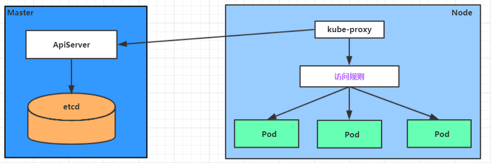
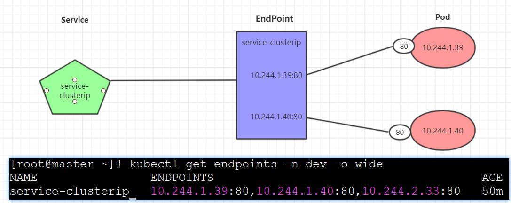
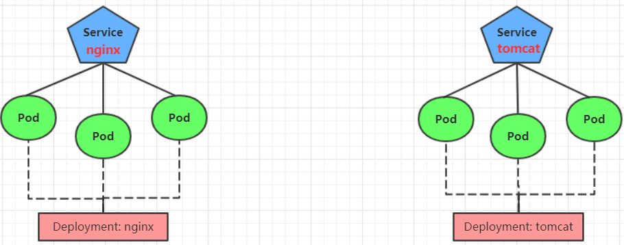

::: tip

本章主要学习K8s组件之一service，包含介绍，五种类型的service，ingress使用。根据[哔哩哔哩黑马视频](https://www.bilibili.com/video/BV1cK4y1L7Am?p=1)学习，学习来源于搬迁，部分文档有根据自己学习进行修改和补充，[文档学习资源](https://www.orchome.com/1786)

:::

<!-- more -->

# 第七章 Service详解

本章节主要介绍kubernetes的流量负载组件：Service和Ingress。

## Service介绍

​    在kubernetes中，pod是应用程序的载体，我们可以通过pod的ip来访问应用程序，但是pod的ip地址不是固定的，这也就意味着不方便直接采用pod的ip对服务进行访问。

​    为了解决这个问题，kubernetes提供了Service资源，Service会对提供同一个服务的多个pod进行聚合，并且提供一个统一的入口地址。通过访问Service的入口地址就能访问到后面的pod服务。


​    Service在很多情况下只是一个概念，真正起作用的其实是kube-proxy服务进程，每个Node节点上都运行着一个kube-proxy服务进程。当创建Service的时候会通过api-server向etcd写入创建的service的信息，而kube-proxy会基于监听的机制发现这种Service的变动，然后**它会将最新的Service信息转换成对应的访问规则**。



~~~powershell
# 10.97.97.97:80 是service提供的访问入口
# 当访问这个入口的时候，可以发现后面有三个pod的服务在等待调用，
# kube-proxy会基于rr（轮询）的策略，将请求分发到其中一个pod上去
# 这个规则会同时在集群内的所有节点上都生成，所以在任何一个节点上访问都可以。
[root@node1 ~]# ipvsadm -Ln
IP Virtual Server version 1.2.1 (size=4096)
Prot LocalAddress:Port Scheduler Flags
  -> RemoteAddress:Port           Forward Weight ActiveConn InActConn
TCP  10.97.97.97:80 rr
  -> 10.244.1.39:80               Masq    1      0          0
  -> 10.244.1.40:80               Masq    1      0          0
  -> 10.244.2.33:80               Masq    1      0          0
~~~

kube-proxy目前支持三种工作模式:

**userspace 模式**

​    userspace模式下，kube-proxy会为每一个Service创建一个监听端口，发向Cluster IP的请求被Iptables规则重定向到kube-proxy监听的端口上，kube-proxy根据LB算法选择一个提供服务的Pod并和其建立链接，以将请求转发到Pod上。
​    该模式下，kube-proxy充当了一个四层负责均衡器的角色。由于kube-proxy运行在userspace中，在进行转发处理时会增加内核和用户空间之间的数据拷贝，虽然比较稳定，但是效率比较低。


**iptables 模式**

​    iptables模式下，kube-proxy为service后端的每个Pod创建对应的iptables规则，直接将发向Cluster IP的请求重定向到一个Pod IP。
​    该模式下kube-proxy不承担四层负责均衡器的角色，只负责创建iptables规则。该模式的优点是较userspace模式效率更高，但不能提供灵活的LB策略，当后端Pod不可用时也无法进行重试。


**ipvs 模式**

​    ipvs模式和iptables类似，kube-proxy监控Pod的变化并创建相应的ipvs规则。ipvs相对iptables转发效率更高。除此以外，ipvs支持更多的LB算法。


~~~powershell
# 此模式必须安装ipvs内核模块，否则会降级为iptables
# 开启ipvs
[root@master ~]# kubectl edit cm kube-proxy -n kube-system
# 搜索mode，修改值为ipvs
[root@master ~]# kubectl delete pod -l k8s-app=kube-proxy -n kube-system
[root@node1 ~]# ipvsadm -Ln
IP Virtual Server version 1.2.1 (size=4096)
Prot LocalAddress:Port Scheduler Flags
  -> RemoteAddress:Port           Forward Weight ActiveConn InActConn
TCP  10.97.97.97:80 rr
  -> 10.244.1.39:80               Masq    1      0          0
  -> 10.244.1.40:80               Masq    1      0          0
  -> 10.244.2.33:80               Masq    1      0          0
~~~

## Service类型

Service的资源清单文件：

~~~yaml
kind: Service  # 资源类型
apiVersion: v1  # 资源版本
metadata: # 元数据
  name: service # 资源名称
  namespace: dev # 命名空间
spec: # 描述
  selector: # 标签选择器，用于确定当前service代理哪些pod
    app: nginx
  type: # Service类型，指定service的访问方式
  clusterIP:  # 虚拟服务的ip地址
  sessionAffinity: # session亲和性，支持ClientIP、None两个选项
  ports: # 端口信息
    - protocol: TCP 
      port: 3017  # service端口
      targetPort: 5003 # pod端口
      nodePort: 31122 # 主机端口
~~~

- ClusterIP：默认值，它是Kubernetes系统自动分配的虚拟IP，只能在集群内部访问
- NodePort：将Service通过指定的Node上的端口暴露给外部，通过此方法，就可以在集群外部访问服务
- LoadBalancer：使用外接负载均衡器完成到服务的负载分发，注意此模式需要外部云环境支持
- ExternalName： 把集群外部的服务引入集群内部，直接使用

## Service使用

### 实验环境准备

在使用service之前，首先利用Deployment创建出3个pod，注意要为pod设置`app=nginx-pod`的标签

创建deployment.yaml，内容如下：

~~~yaml
apiVersion: apps/v1
kind: Deployment      
metadata:
  name: pc-deployment
  namespace: dev
spec: 
  replicas: 3
  selector:
    matchLabels:
      app: nginx-pod
  template:
    metadata:
      labels:
        app: nginx-pod
    spec:
      containers:
      - name: nginx
        image: nginx:1.17.1
        ports:
        - containerPort: 80
~~~

~~~powershell
[root@master ~]# kubectl create -f deployment.yaml
deployment.apps/pc-deployment created

# 查看pod详情
[root@master ~]# kubectl get pods -n dev -o wide --show-labels
NAME                             READY   STATUS     IP            NODE     LABELS
pc-deployment-66cb59b984-8p84h   1/1     Running    10.244.1.40   node1    app=nginx-pod
pc-deployment-66cb59b984-vx8vx   1/1     Running    10.244.2.33   node2    app=nginx-pod
pc-deployment-66cb59b984-wnncx   1/1     Running    10.244.1.39   node1    app=nginx-pod

# 为了方便后面的测试，修改下三台nginx的index.html页面（三台修改的IP地址不一致）
# kubectl exec -it pc-deployment-66cb59b984-8p84h -n dev /bin/sh
# echo "10.244.1.40" > /usr/share/nginx/html/index.html

#修改完毕之后，访问测试
[root@master ~]# curl 10.244.1.40
10.244.1.40
[root@master ~]# curl 10.244.2.33
10.244.2.33
[root@master ~]# curl 10.244.1.39
10.244.1.39
~~~

### ClusterIP类型的Service

创建service-clusterip.yaml文件

~~~yaml
apiVersion: v1
kind: Service
metadata:
  name: service-clusterip
  namespace: dev
spec:
  selector:
    app: nginx-pod
  clusterIP: 10.97.97.97 # service的ip地址，如果不写，默认会生成一个
  type: ClusterIP
  ports:
  - port: 80  # Service端口       
    targetPort: 80 # pod端口
~~~

~~~powershell
# 创建service
[root@master ~]# kubectl create -f service-clusterip.yaml
service/service-clusterip created

# 查看service
[root@master ~]# kubectl get svc -n dev -o wide
NAME                TYPE        CLUSTER-IP    EXTERNAL-IP   PORT(S)   AGE   SELECTOR
service-clusterip   ClusterIP   10.97.97.97   <none>        80/TCP    13s   app=nginx-pod

# 查看service的详细信息
# 在这里有一个Endpoints列表，里面就是当前service可以负载到的服务入口
[root@master ~]# kubectl describe svc service-clusterip -n dev
Name:              service-clusterip
Namespace:         dev
Labels:            <none>
Annotations:       <none>
Selector:          app=nginx-pod
Type:              ClusterIP
IP:                10.97.97.97
Port:              <unset>  80/TCP
TargetPort:        80/TCP
Endpoints:         10.244.1.39:80,10.244.1.40:80,10.244.2.33:80
Session Affinity:  None
Events:            <none>

# 查看ipvs的映射规则
[root@master ~]# ipvsadm -Ln
TCP  10.97.97.97:80 rr
  -> 10.244.1.39:80               Masq    1      0          0
  -> 10.244.1.40:80               Masq    1      0          0
  -> 10.244.2.33:80               Masq    1      0          0

# 访问10.97.97.97:80观察效果
[root@master ~]# curl 10.97.97.97:80
10.244.2.33
~~~

**Endpoint**

​    Endpoint是kubernetes中的一个资源对象，存储在etcd中，用来记录一个service对应的所有pod的访问地址，它是根据service配置文件中selector描述产生的。

​    一个Service由一组Pod组成，这些Pod通过Endpoints暴露出来，**Endpoints是实现实际服务的端点集合**。换句话说，service和pod之间的联系是通过endpoints实现的。



**负载分发策略**

对Service的访问被分发到了后端的Pod上去，目前kubernetes提供了两种负载分发策略：

- 如果不定义，默认使用kube-proxy的策略，比如随机、轮询

- 基于客户端地址的会话保持模式，即来自同一个客户端发起的所有请求都会转发到固定的一个Pod上

  此模式可以使在spec中添加`sessionAffinity:ClientIP`选项

~~~powershell
# 查看ipvs的映射规则【rr 轮询】
[root@master ~]# ipvsadm -Ln
TCP  10.97.97.97:80 rr
  -> 10.244.1.39:80               Masq    1      0          0
  -> 10.244.1.40:80               Masq    1      0          0
  -> 10.244.2.33:80               Masq    1      0          0

# 循环访问测试
[root@master ~]# while true;do curl 10.97.97.97:80; sleep 5; done;
10.244.1.40
10.244.1.39
10.244.2.33
10.244.1.40
10.244.1.39
10.244.2.33

# 修改分发策略----sessionAffinity:ClientIP

# 查看ipvs规则【persistent 代表持久】
[root@master ~]# ipvsadm -Ln
TCP  10.97.97.97:80 rr persistent 10800
  -> 10.244.1.39:80               Masq    1      0          0
  -> 10.244.1.40:80               Masq    1      0          0
  -> 10.244.2.33:80               Masq    1      0          0

# 循环访问测试
[root@master ~]# while true;do curl 10.97.97.97; sleep 5; done;
10.244.2.33
10.244.2.33
10.244.2.33
  
# 删除service
[root@master ~]# kubectl delete -f service-clusterip.yaml
service "service-clusterip" deleted
~~~

### HeadLiness类型的Service

​    在某些场景中，开发人员可能不想使用Service提供的负载均衡功能，而希望自己来控制负载均衡策略，针对这种情况，kubernetes提供了HeadLiness  Service，这类Service不会分配Cluster IP，如果想要访问service，只能通过service的域名进行查询。

创建service-headliness.yaml

~~~yaml
apiVersion: v1
kind: Service
metadata:
  name: service-headliness
  namespace: dev
spec:
  selector:
    app: nginx-pod
  clusterIP: None # 将clusterIP设置为None，即可创建headliness Service
  type: ClusterIP
  ports:
  - port: 80    
    targetPort: 80
~~~

~~~powershell
# 创建service
[root@master ~]# kubectl create -f service-headliness.yaml
service/service-headliness created

# 获取service， 发现CLUSTER-IP未分配
[root@master ~]# kubectl get svc service-headliness -n dev -o wide
NAME                 TYPE        CLUSTER-IP   EXTERNAL-IP   PORT(S)   AGE   SELECTOR
service-headliness   ClusterIP   None         <none>        80/TCP    11s   app=nginx-pod

# 查看service详情
[root@master ~]# kubectl describe svc service-headliness  -n dev
Name:              service-headliness
Namespace:         dev
Labels:            <none>
Annotations:       <none>
Selector:          app=nginx-pod
Type:              ClusterIP
IP:                None
Port:              <unset>  80/TCP
TargetPort:        80/TCP
Endpoints:         10.244.1.39:80,10.244.1.40:80,10.244.2.33:80
Session Affinity:  None
Events:            <none>

# 查看域名的解析情况
[root@master ~]# kubectl exec -it pc-deployment-66cb59b984-8p84h -n dev /bin/sh
/ # cat /etc/resolv.conf
nameserver 10.96.0.10
search dev.svc.cluster.local svc.cluster.local cluster.local

[root@master ~]# dig @10.96.0.10 service-headliness.dev.svc.cluster.local
service-headliness.dev.svc.cluster.local. 30 IN A 10.244.1.40
service-headliness.dev.svc.cluster.local. 30 IN A 10.244.1.39
service-headliness.dev.svc.cluster.local. 30 IN A 10.244.2.33
~~~

### NodePort类型的Service

​    在之前的样例中，创建的Service的ip地址只有集群内部才可以访问，如果希望将Service暴露给集群外部使用，那么就要使用到另外一种类型的Service，称为NodePort类型。NodePort的工作原理其实就是**将service的端口映射到Node的一个端口上**，然后就可以通过`NodeIp:NodePort`来访问service了。


创建service-nodeport.yaml

~~~yaml
apiVersion: v1
kind: Service
metadata:
  name: service-nodeport
  namespace: dev
spec:
  selector:
    app: nginx-pod
  type: NodePort # service类型
  ports:
  - port: 80
    nodePort: 30002 # 指定绑定的node的端口(默认的取值范围是：30000-32767), 如果不指定，会默认分配
    targetPort: 80
~~~

~~~powershell
# 创建service
[root@master ~]# kubectl create -f service-nodeport.yaml
service/service-nodeport created

# 查看service
[root@master ~]# kubectl get svc -n dev -o wide
NAME               TYPE       CLUSTER-IP      EXTERNAL-IP   PORT(S)       SELECTOR
service-nodeport   NodePort   10.105.64.191   <none>        80:30002/TCP  app=nginx-pod

# 接下来可以通过电脑主机的浏览器去访问集群中任意一个nodeip的30002端口，即可访问到pod
~~~

### LoadBalancer类型的Service

​    LoadBalancer和NodePort很相似，目的都是向外部暴露一个端口，区别在于LoadBalancer会在集群的外部再来做一个负载均衡设备，而这个设备需要外部环境支持的，外部服务发送到这个设备上的请求，会被设备负载之后转发到集群中。


### ExternalName类型的Service

​     ExternalName类型的Service用于引入集群外部的服务，它通过`externalName`属性指定外部一个服务的地址，然后在集群内部访问此service就可以访问到外部的服务了。


~~~yaml
apiVersion: v1
kind: Service
metadata:
  name: service-externalname
  namespace: dev
spec:
  type: ExternalName # service类型
  externalName: www.baidu.com  #改成ip地址也可以
~~~

~~~powershell
# 创建service
[root@master ~]# kubectl  create -f service-externalname.yaml
service/service-externalname created

# 域名解析
[root@master ~]# dig @10.96.0.10 service-externalname.dev.svc.cluster.local
service-externalname.dev.svc.cluster.local. 30 IN CNAME www.baidu.com.
www.baidu.com.          30      IN      CNAME   www.a.shifen.com.
www.a.shifen.com.       30      IN      A       39.156.66.18
www.a.shifen.com.       30      IN      A       39.156.66.14
~~~

## Ingress介绍

​     在前面课程中已经提到，Service对集群之外暴露服务的主要方式有两种：NotePort和LoadBalancer，但是这两种方式，都有一定的缺点：

- NodePort方式的缺点是会占用很多集群机器的端口，那么当集群服务变多的时候，这个缺点就愈发明显
- LB方式的缺点是每个service需要一个LB，浪费、麻烦，并且需要kubernetes之外设备的支持

​    基于这种现状，kubernetes提供了Ingress资源对象，Ingress只需要一个NodePort或者一个LB就可以满足暴露多个Service的需求。工作机制大致如下图表示：


​    实际上，Ingress相当于一个7层的负载均衡器，是kubernetes对反向代理的一个抽象，它的工作原理类似于Nginx，可以理解成在**Ingress里建立诸多映射规则，Ingress Controller通过监听这些配置规则并转化成Nginx的反向代理配置 , 然后对外部提供服务**。在这里有两个核心概念：

- ingress：kubernetes中的一个对象，作用是定义请求如何转发到service的规则
- ingress controller：具体实现反向代理及负载均衡的程序，对ingress定义的规则进行解析，根据配置的规则来实现请求转发，实现方式有很多，比如Nginx, Contour, Haproxy等等

Ingress（以Nginx为例）的工作原理如下：

1. 用户编写Ingress规则，说明哪个域名对应kubernetes集群中的哪个Service
2. Ingress控制器动态感知Ingress服务规则的变化，然后生成一段对应的Nginx反向代理配置
3. Ingress控制器会将生成的Nginx配置写入到一个运行着的Nginx服务中，并动态更新
4. 到此为止，其实真正在工作的就是一个Nginx了，内部配置了用户定义的请求转发规则


## Ingress使用

### 环境准备

**搭建ingress环境**

~~~powershell
# 创建文件夹
[root@master ~]# mkdir ingress-controller
[root@master ~]# cd ingress-controller/

# 获取ingress-nginx，本次案例使用的是0.30版本
[root@master ingress-controller]# wget https://raw.githubusercontent.com/kubernetes/ingress-nginx/nginx-0.30.0/deploy/static/mandatory.yaml
[root@master ingress-controller]# wget https://raw.githubusercontent.com/kubernetes/ingress-nginx/nginx-0.30.0/deploy/static/provider/baremetal/service-nodeport.yaml

# 修改mandatory.yaml文件中的仓库
# 修改quay.io/kubernetes-ingress-controller/nginx-ingress-controller:0.30.0
# 为quay-mirror.qiniu.com/kubernetes-ingress-controller/nginx-ingress-controller:0.30.0
# 创建ingress-nginx
[root@master ingress-controller]# kubectl apply -f ./

# 查看ingress-nginx
[root@master ingress-controller]# kubectl get pod -n ingress-nginx
NAME                                           READY   STATUS    RESTARTS   AGE
pod/nginx-ingress-controller-fbf967dd5-4qpbp   1/1     Running   0          12h

# 查看service
[root@master ingress-controller]# kubectl get svc -n ingress-nginx
NAME            TYPE       CLUSTER-IP     EXTERNAL-IP   PORT(S)                      AGE
ingress-nginx   NodePort   10.98.75.163   <none>        80:32240/TCP,443:31335/TCP   11h
~~~

**准备service和pod**

为了后面的实验比较方便，创建如下图所示的模型



创建tomcat-nginx.yaml

~~~yaml
apiVersion: apps/v1
kind: Deployment
metadata:
  name: nginx-deployment
  namespace: dev
spec:
  replicas: 3
  selector:
    matchLabels:
      app: nginx-pod
  template:
    metadata:
      labels:
        app: nginx-pod
    spec:
      containers:
      - name: nginx
        image: nginx:1.17.1
        ports:
        - containerPort: 80

---

apiVersion: apps/v1
kind: Deployment
metadata:
  name: tomcat-deployment
  namespace: dev
spec:
  replicas: 3
  selector:
    matchLabels:
      app: tomcat-pod
  template:
    metadata:
      labels:
        app: tomcat-pod
    spec:
      containers:
      - name: tomcat
        image: tomcat:8.5-jre10-slim
        ports:
        - containerPort: 8080

---

apiVersion: v1
kind: Service
metadata:
  name: nginx-service
  namespace: dev
spec:
  selector:
    app: nginx-pod
  clusterIP: None
  type: ClusterIP
  ports:
  - port: 80
    targetPort: 80

---

apiVersion: v1
kind: Service
metadata:
  name: tomcat-service
  namespace: dev
spec:
  selector:
    app: tomcat-pod
  clusterIP: None
  type: ClusterIP
  ports:
  - port: 8080
    targetPort: 8080
~~~

~~~powershell
# 创建
[root@master ~]# kubectl create -f tomcat-nginx.yaml

# 查看
[root@master ~]# kubectl get svc -n dev
NAME             TYPE        CLUSTER-IP   EXTERNAL-IP   PORT(S)    AGE
nginx-service    ClusterIP   None         <none>        80/TCP     48s
tomcat-service   ClusterIP   None         <none>        8080/TCP   48s
~~~

### Http代理

创建ingress-http.yaml

~~~yaml
apiVersion: extensions/v1beta1
kind: Ingress
metadata:
  name: ingress-http
  namespace: dev
spec:
  rules:
  - host: nginx.itheima.com
    http:
      paths:
      - path: /
        backend:
          serviceName: nginx-service
          servicePort: 80
  - host: tomcat.itheima.com
    http:
      paths:
      - path: /
        backend:
          serviceName: tomcat-service
          servicePort: 8080
~~~

~~~powershell
# 创建
[root@master ~]# kubectl create -f ingress-http.yaml
ingress.extensions/ingress-http created

# 查看
[root@master ~]# kubectl get ing ingress-http -n dev
NAME           HOSTS                                  ADDRESS   PORTS   AGE
ingress-http   nginx.itheima.com,tomcat.itheima.com             80      22s

# 查看详情
[root@master ~]# kubectl describe ing ingress-http  -n dev
...
Rules:
Host                Path  Backends
----                ----  --------
nginx.itheima.com   / nginx-service:80 (10.244.1.96:80,10.244.1.97:80,10.244.2.112:80)
tomcat.itheima.com  / tomcat-service:8080(10.244.1.94:8080,10.244.1.95:8080,10.244.2.111:8080)
...

# 接下来,在本地电脑上配置host文件,解析上面的两个域名到192.168.109.100(master)上
# 然后,就可以分别访问tomcat.itheima.com:32240  和  nginx.itheima.com:32240 查看效果了
~~~

### Https代理

创建证书

~~~powershell
# 生成证书
openssl req -x509 -sha256 -nodes -days 365 -newkey rsa:2048 -keyout tls.key -out tls.crt -subj "/C=CN/ST=BJ/L=BJ/O=nginx/CN=itheima.com"

# 创建密钥
kubectl create secret tls tls-secret --key tls.key --cert tls.crt
~~~

创建ingress-https.yaml

~~~yaml
apiVersion: extensions/v1beta1
kind: Ingress
metadata:
  name: ingress-https
  namespace: dev
spec:
  tls:
    - hosts:
      - nginx.itheima.com
      - tomcat.itheima.com
      secretName: tls-secret # 指定秘钥
  rules:
  - host: nginx.itheima.com
    http:
      paths:
      - path: /
        backend:
          serviceName: nginx-service
          servicePort: 80
  - host: tomcat.itheima.com
    http:
      paths:
      - path: /
        backend:
          serviceName: tomcat-service
          servicePort: 8080
~~~

~~~powershell
# 创建
[root@master ~]# kubectl create -f ingress-https.yaml
ingress.extensions/ingress-https created

# 查看
[root@master ~]# kubectl get ing ingress-https -n dev
NAME            HOSTS                                  ADDRESS         PORTS     AGE
ingress-https   nginx.itheima.com,tomcat.itheima.com   10.104.184.38   80, 443   2m42s

# 查看详情
[root@master ~]# kubectl describe ing ingress-https -n dev
...
TLS:
  tls-secret terminates nginx.itheima.com,tomcat.itheima.com
Rules:
Host              Path Backends
----              ---- --------
nginx.itheima.com  /  nginx-service:80 (10.244.1.97:80,10.244.1.98:80,10.244.2.119:80)
tomcat.itheima.com /  tomcat-service:8080(10.244.1.99:8080,10.244.2.117:8080,10.244.2.120:8080)
...

# 下面可以通过浏览器访问https://nginx.itheima.com:31335 和 https://tomcat.itheima.com:31335来查看了
~~~

## Ingress升级

以下是自己大家集群时候选择k8s 1.23.5 版本，原教程 ingress.yaml 不在支持，格式有变化，且 ingress-controller 也需要对应版本的

`ingress-controller.yaml` 环境准备：[官方yaml：此处选用1.23 ](https://github.com/kubernetes/ingress-nginx/blob/main/deploy/static/provider/baremetal/1.23/deploy.yaml)

```shell
# 下载yaml, 查找到下面内容，当前是1.2.1 后续可以能会更新版本，找到对应位置即可
registry.k8s.io/ingress-nginx/controller:v1.2.1@sha256:5516d103a9c2ecc4f026efbd4b40662ce22dc1f824fb129ed121460aaa5c47f8
registry.k8s.io/ingress-nginx/kube-webhook-certgen:v1.1.1@sha256:64d8c73dca984af206adf9d6d7e46aa550362b1d7a01f3a0a91b20cc67868660

# 直接无法拉取，改为从aliyun拉取即可
registry.cn-hangzhou.aliyuncs.com/google_containers/nginx-ingress-controller:v1.2.1
registry.cn-hangzhou.aliyuncs.com/google_containers/kube-webhook-certgen:v1.1.1

# 使用自己私有仓库的，可以先拉取aliyun的，再修改名字推送到私有仓库即可
```

### 环境部署可能遇到的报错处理：

### 问题1：

如果 `ingress-nginx-admission-create` 和 `ingress-nginx-admission-patch` 部署失败，

报错：`Neither *--kubeconfig nor --master was specified.  Using the inClusterConfig.  This might not work.*`

解决：在 `ingress-controller.yaml` 中`Ingress-nginx-admission-create`和`Ingress-nginx-admission-patch的Job`资源下的`spec.template.spec`中添加如下`hostNetwork: true`，重新部署

### 问题2 

如果 `ingress-nginx-controller-64555cc568-gmdrn` 未启动成功，查看日志

报错：`MountVolume.SetUp failed for volume "webhook-cert" : secret "ingress-nginx-admission" not found`

解决：

```shell
# 执行指令  kubectl get secrets -n ingress-nginx
NAME                                  TYPE                                  DATA   AGE
default-token-55rlz                   kubernetes.io/service-account-token   3      3m37s
ingress-nginx-admission-token-b6675   kubernetes.io/service-account-token   3      3m37s
ingress-nginx-token-sn54b             kubernetes.io/service-account-token   3      3m37s

# 搜索 ingress-controller.yaml，secretName，将 ingress-nginx-admission 后面新增-token-b6675，对应刚查出来的，再重新 apply 即可
```

### 问题3 

编写 `ingress-http.yaml` apply 失败

报错：`error when creating "ingress.yaml": Internal error occurred: failed calling webhook "validate.nginx.ingress.kubernetes.io": failed to call webhook: Post "https://ingress-nginx-controller-admission.ingress-nginx.svc:443/networking/v1/ingresses?timeout=10s": remote error: tls: internal error`

解决：

```shell
# 依次执行命令，再重新apply即可
kubectl get validatingwebhookconfigurations ingress-nginx-admission
kubectl delete -A ValidatingWebhookConfiguration ingress-nginx-admission
```

### 问题4

启动成功，自定义域名无法访问，查看日志

报错：`Default backend:  default-http-backend:80 (<error: endpoints "default-http-backend" not found>)`

说明：`需要指定当nginx无法转发到指定服务时，转发到默认的服务，需要单独创建一个`

解决：创建一个`default-http-backend.yaml`，用于无法匹配域名时转发到该默认服务，其他教程没遇到该问题，我找到有这样的解决方案，并生效了，后面再看

## yaml参考

::: details ingress-controller.yaml

```yaml
apiVersion: v1
kind: Namespace
metadata:
  labels:
    app.kubernetes.io/instance: ingress-nginx
    app.kubernetes.io/name: ingress-nginx
  name: ingress-nginx
---
apiVersion: v1
automountServiceAccountToken: true
kind: ServiceAccount
metadata:
  labels:
    app.kubernetes.io/component: controller
    app.kubernetes.io/instance: ingress-nginx
    app.kubernetes.io/name: ingress-nginx
    app.kubernetes.io/part-of: ingress-nginx
    app.kubernetes.io/version: 1.2.1
  name: ingress-nginx
  namespace: ingress-nginx
---
apiVersion: v1
kind: ServiceAccount
metadata:
  labels:
    app.kubernetes.io/component: admission-webhook
    app.kubernetes.io/instance: ingress-nginx
    app.kubernetes.io/name: ingress-nginx
    app.kubernetes.io/part-of: ingress-nginx
    app.kubernetes.io/version: 1.2.1
  name: ingress-nginx-admission
  namespace: ingress-nginx
---
apiVersion: rbac.authorization.k8s.io/v1
kind: Role
metadata:
  labels:
    app.kubernetes.io/component: controller
    app.kubernetes.io/instance: ingress-nginx
    app.kubernetes.io/name: ingress-nginx
    app.kubernetes.io/part-of: ingress-nginx
    app.kubernetes.io/version: 1.2.1
  name: ingress-nginx
  namespace: ingress-nginx
rules:
  - apiGroups:
      - ""
    resources:
      - namespaces
    verbs:
      - get
  - apiGroups:
      - ""
    resources:
      - configmaps
      - pods
      - secrets
      - endpoints
    verbs:
      - get
      - list
      - watch
  - apiGroups:
      - ""
    resources:
      - services
    verbs:
      - get
      - list
      - watch
  - apiGroups:
      - networking.k8s.io
    resources:
      - ingresses
    verbs:
      - get
      - list
      - watch
  - apiGroups:
      - networking.k8s.io
    resources:
      - ingresses/status
    verbs:
      - update
  - apiGroups:
      - networking.k8s.io
    resources:
      - ingressclasses
    verbs:
      - get
      - list
      - watch
  - apiGroups:
      - ""
    resourceNames:
      - ingress-controller-leader
    resources:
      - configmaps
    verbs:
      - get
      - update
  - apiGroups:
      - ""
    resources:
      - configmaps
    verbs:
      - create
  - apiGroups:
      - ""
    resources:
      - events
    verbs:
      - create
      - patch
---
apiVersion: rbac.authorization.k8s.io/v1
kind: Role
metadata:
  labels:
    app.kubernetes.io/component: admission-webhook
    app.kubernetes.io/instance: ingress-nginx
    app.kubernetes.io/name: ingress-nginx
    app.kubernetes.io/part-of: ingress-nginx
    app.kubernetes.io/version: 1.2.1
  name: ingress-nginx-admission
  namespace: ingress-nginx
rules:
  - apiGroups:
      - ""
    resources:
      - secrets
    verbs:
      - get
      - create
---
apiVersion: rbac.authorization.k8s.io/v1
kind: ClusterRole
metadata:
  labels:
    app.kubernetes.io/instance: ingress-nginx
    app.kubernetes.io/name: ingress-nginx
    app.kubernetes.io/part-of: ingress-nginx
    app.kubernetes.io/version: 1.2.1
  name: ingress-nginx
rules:
  - apiGroups:
      - ""
    resources:
      - configmaps
      - endpoints
      - nodes
      - pods
      - secrets
      - namespaces
    verbs:
      - list
      - watch
  - apiGroups:
      - ""
    resources:
      - nodes
    verbs:
      - get
  - apiGroups:
      - ""
    resources:
      - services
    verbs:
      - get
      - list
      - watch
  - apiGroups:
      - networking.k8s.io
    resources:
      - ingresses
    verbs:
      - get
      - list
      - watch
  - apiGroups:
      - ""
    resources:
      - events
    verbs:
      - create
      - patch
  - apiGroups:
      - networking.k8s.io
    resources:
      - ingresses/status
    verbs:
      - update
  - apiGroups:
      - networking.k8s.io
    resources:
      - ingressclasses
    verbs:
      - get
      - list
      - watch
---
apiVersion: rbac.authorization.k8s.io/v1
kind: ClusterRole
metadata:
  labels:
    app.kubernetes.io/component: admission-webhook
    app.kubernetes.io/instance: ingress-nginx
    app.kubernetes.io/name: ingress-nginx
    app.kubernetes.io/part-of: ingress-nginx
    app.kubernetes.io/version: 1.2.1
  name: ingress-nginx-admission
rules:
  - apiGroups:
      - admissionregistration.k8s.io
    resources:
      - validatingwebhookconfigurations
    verbs:
      - get
      - update
---
apiVersion: rbac.authorization.k8s.io/v1
kind: RoleBinding
metadata:
  labels:
    app.kubernetes.io/component: controller
    app.kubernetes.io/instance: ingress-nginx
    app.kubernetes.io/name: ingress-nginx
    app.kubernetes.io/part-of: ingress-nginx
    app.kubernetes.io/version: 1.2.1
  name: ingress-nginx
  namespace: ingress-nginx
roleRef:
  apiGroup: rbac.authorization.k8s.io
  kind: Role
  name: ingress-nginx
subjects:
  - kind: ServiceAccount
    name: ingress-nginx
    namespace: ingress-nginx
---
apiVersion: rbac.authorization.k8s.io/v1
kind: RoleBinding
metadata:
  labels:
    app.kubernetes.io/component: admission-webhook
    app.kubernetes.io/instance: ingress-nginx
    app.kubernetes.io/name: ingress-nginx
    app.kubernetes.io/part-of: ingress-nginx
    app.kubernetes.io/version: 1.2.1
  name: ingress-nginx-admission
  namespace: ingress-nginx
roleRef:
  apiGroup: rbac.authorization.k8s.io
  kind: Role
  name: ingress-nginx-admission
subjects:
  - kind: ServiceAccount
    name: ingress-nginx-admission
    namespace: ingress-nginx
---
apiVersion: rbac.authorization.k8s.io/v1
kind: ClusterRoleBinding
metadata:
  labels:
    app.kubernetes.io/instance: ingress-nginx
    app.kubernetes.io/name: ingress-nginx
    app.kubernetes.io/part-of: ingress-nginx
    app.kubernetes.io/version: 1.2.1
  name: ingress-nginx
roleRef:
  apiGroup: rbac.authorization.k8s.io
  kind: ClusterRole
  name: ingress-nginx
subjects:
  - kind: ServiceAccount
    name: ingress-nginx
    namespace: ingress-nginx
---
apiVersion: rbac.authorization.k8s.io/v1
kind: ClusterRoleBinding
metadata:
  labels:
    app.kubernetes.io/component: admission-webhook
    app.kubernetes.io/instance: ingress-nginx
    app.kubernetes.io/name: ingress-nginx
    app.kubernetes.io/part-of: ingress-nginx
    app.kubernetes.io/version: 1.2.1
  name: ingress-nginx-admission
roleRef:
  apiGroup: rbac.authorization.k8s.io
  kind: ClusterRole
  name: ingress-nginx-admission
subjects:
  - kind: ServiceAccount
    name: ingress-nginx-admission
    namespace: ingress-nginx
---
apiVersion: v1
data:
  allow-snippet-annotations: "true"
kind: ConfigMap
metadata:
  labels:
    app.kubernetes.io/component: controller
    app.kubernetes.io/instance: ingress-nginx
    app.kubernetes.io/name: ingress-nginx
    app.kubernetes.io/part-of: ingress-nginx
    app.kubernetes.io/version: 1.2.1
  name: ingress-nginx-controller
  namespace: ingress-nginx
---
apiVersion: v1
kind: Service
metadata:
  labels:
    app.kubernetes.io/component: controller
    app.kubernetes.io/instance: ingress-nginx
    app.kubernetes.io/name: ingress-nginx
    app.kubernetes.io/part-of: ingress-nginx
    app.kubernetes.io/version: 1.2.1
  name: ingress-nginx-controller
  namespace: ingress-nginx
spec:
  ipFamilies:
    - IPv4
  ipFamilyPolicy: SingleStack
  ports:
    - appProtocol: http
      name: http
      port: 80
      protocol: TCP
      targetPort: http
    - appProtocol: https
      name: https
      port: 443
      protocol: TCP
      targetPort: https
  selector:
    app.kubernetes.io/component: controller
    app.kubernetes.io/instance: ingress-nginx
    app.kubernetes.io/name: ingress-nginx
  type: NodePort
---
apiVersion: v1
kind: Service
metadata:
  labels:
    app.kubernetes.io/component: controller
    app.kubernetes.io/instance: ingress-nginx
    app.kubernetes.io/name: ingress-nginx
    app.kubernetes.io/part-of: ingress-nginx
    app.kubernetes.io/version: 1.2.1
  name: ingress-nginx-controller-admission
  namespace: ingress-nginx
spec:
  ports:
    - appProtocol: https
      name: https-webhook
      port: 443
      targetPort: webhook
  selector:
    app.kubernetes.io/component: controller
    app.kubernetes.io/instance: ingress-nginx
    app.kubernetes.io/name: ingress-nginx
  type: ClusterIP
---
apiVersion: apps/v1
kind: Deployment
metadata:
  labels:
    app.kubernetes.io/component: controller
    app.kubernetes.io/instance: ingress-nginx
    app.kubernetes.io/name: ingress-nginx
    app.kubernetes.io/part-of: ingress-nginx
    app.kubernetes.io/version: 1.2.1
  name: ingress-nginx-controller
  namespace: ingress-nginx
spec:
  minReadySeconds: 0
  revisionHistoryLimit: 10
  selector:
    matchLabels:
      app.kubernetes.io/component: controller
      app.kubernetes.io/instance: ingress-nginx
      app.kubernetes.io/name: ingress-nginx
  template:
    metadata:
      labels:
        app.kubernetes.io/component: controller
        app.kubernetes.io/instance: ingress-nginx
        app.kubernetes.io/name: ingress-nginx
    spec:
      containers:
        - args:
            - /nginx-ingress-controller
            - --election-id=ingress-controller-leader
            - --controller-class=k8s.io/ingress-nginx
            - --ingress-class=nginx
            - --configmap=$(POD_NAMESPACE)/ingress-nginx-controller
            - --validating-webhook=:8443
            - --validating-webhook-certificate=/usr/local/certificates/cert
            - --validating-webhook-key=/usr/local/certificates/key
          env:
            - name: POD_NAME
              valueFrom:
                fieldRef:
                  fieldPath: metadata.name
            - name: POD_NAMESPACE
              valueFrom:
                fieldRef:
                  fieldPath: metadata.namespace
            - name: LD_PRELOAD
              value: /usr/local/lib/libmimalloc.so
          image: harbor.killer.com/mall/nginx-ingress-controller:v1.2.1
          imagePullPolicy: IfNotPresent
          lifecycle:
            preStop:
              exec:
                command:
                  - /wait-shutdown
          livenessProbe:
            failureThreshold: 5
            httpGet:
              path: /healthz
              port: 10254
              scheme: HTTP
            initialDelaySeconds: 10
            periodSeconds: 10
            successThreshold: 1
            timeoutSeconds: 1
          name: controller
          ports:
            - containerPort: 80
              name: http
              protocol: TCP
            - containerPort: 443
              name: https
              protocol: TCP
            - containerPort: 8443
              name: webhook
              protocol: TCP
          readinessProbe:
            failureThreshold: 3
            httpGet:
              path: /healthz
              port: 10254
              scheme: HTTP
            initialDelaySeconds: 10
            periodSeconds: 10
            successThreshold: 1
            timeoutSeconds: 1
          resources:
            requests:
              cpu: 100m
              memory: 90Mi
          securityContext:
            allowPrivilegeEscalation: true
            capabilities:
              add:
                - NET_BIND_SERVICE
              drop:
                - ALL
            runAsUser: 101
          volumeMounts:
            - mountPath: /usr/local/certificates/
              name: webhook-cert
              readOnly: true
      dnsPolicy: ClusterFirst
      nodeSelector:
        kubernetes.io/os: linux
      serviceAccountName: ingress-nginx
      terminationGracePeriodSeconds: 300
      volumes:
        - name: webhook-cert
          secret:
            secretName: ingress-nginx-admission
---
apiVersion: batch/v1
kind: Job
metadata:
  labels:
    app.kubernetes.io/component: admission-webhook
    app.kubernetes.io/instance: ingress-nginx
    app.kubernetes.io/name: ingress-nginx
    app.kubernetes.io/part-of: ingress-nginx
    app.kubernetes.io/version: 1.2.1
  name: ingress-nginx-admission-create
  namespace: ingress-nginx
spec:
  template:
    metadata:
      labels:
        app.kubernetes.io/component: admission-webhook
        app.kubernetes.io/instance: ingress-nginx
        app.kubernetes.io/name: ingress-nginx
        app.kubernetes.io/part-of: ingress-nginx
        app.kubernetes.io/version: 1.2.1
      name: ingress-nginx-admission-create
    spec:
      containers:
        - args:
            - create
            - --host=ingress-nginx-controller-admission,ingress-nginx-controller-admission.$(POD_NAMESPACE).svc
            - --namespace=$(POD_NAMESPACE)
            - --secret-name=ingress-nginx-admission
          env:
            - name: POD_NAMESPACE
              valueFrom:
                fieldRef:
                  fieldPath: metadata.namespace
          image: harbor.killer.com/mall/kube-webhook-certgen:v1.1.1
          imagePullPolicy: IfNotPresent
          name: create
          securityContext:
            allowPrivilegeEscalation: false
      nodeSelector:
        kubernetes.io/os: linux
      restartPolicy: OnFailure
      securityContext:
        fsGroup: 2000
        runAsNonRoot: true
        runAsUser: 2000
      serviceAccountName: ingress-nginx-admission
---
apiVersion: batch/v1
kind: Job
metadata:
  labels:
    app.kubernetes.io/component: admission-webhook
    app.kubernetes.io/instance: ingress-nginx
    app.kubernetes.io/name: ingress-nginx
    app.kubernetes.io/part-of: ingress-nginx
    app.kubernetes.io/version: 1.2.1
  name: ingress-nginx-admission-patch
  namespace: ingress-nginx
spec:
  template:
    metadata:
      labels:
        app.kubernetes.io/component: admission-webhook
        app.kubernetes.io/instance: ingress-nginx
        app.kubernetes.io/name: ingress-nginx
        app.kubernetes.io/part-of: ingress-nginx
        app.kubernetes.io/version: 1.2.1
      name: ingress-nginx-admission-patch
    spec:
      containers:
        - args:
            - patch
            - --webhook-name=ingress-nginx-admission
            - --namespace=$(POD_NAMESPACE)
            - --patch-mutating=false
            - --secret-name=ingress-nginx-admission
            - --patch-failure-policy=Fail
          env:
            - name: POD_NAMESPACE
              valueFrom:
                fieldRef:
                  fieldPath: metadata.namespace
          image: harbor.killer.com/mall/kube-webhook-certgen:v1.1.1
          imagePullPolicy: IfNotPresent
          name: patch
          securityContext:
            allowPrivilegeEscalation: false
      nodeSelector:
        kubernetes.io/os: linux
      restartPolicy: OnFailure
      securityContext:
        fsGroup: 2000
        runAsNonRoot: true
        runAsUser: 2000
      serviceAccountName: ingress-nginx-admission
---
apiVersion: networking.k8s.io/v1
kind: IngressClass
metadata:
  labels:
    app.kubernetes.io/component: controller
    app.kubernetes.io/instance: ingress-nginx
    app.kubernetes.io/name: ingress-nginx
    app.kubernetes.io/part-of: ingress-nginx
    app.kubernetes.io/version: 1.2.1
  name: nginx
spec:
  controller: k8s.io/ingress-nginx
---
apiVersion: admissionregistration.k8s.io/v1
kind: ValidatingWebhookConfiguration
metadata:
  labels:
    app.kubernetes.io/component: admission-webhook
    app.kubernetes.io/instance: ingress-nginx
    app.kubernetes.io/name: ingress-nginx
    app.kubernetes.io/part-of: ingress-nginx
    app.kubernetes.io/version: 1.2.1
  name: ingress-nginx-admission
webhooks:
  - admissionReviewVersions:
      - v1
    clientConfig:
      service:
        name: ingress-nginx-controller-admission
        namespace: ingress-nginx
        path: /networking/v1/ingresses
    failurePolicy: Fail
    matchPolicy: Equivalent
    name: validate.nginx.ingress.kubernetes.io
    rules:
      - apiGroups:
          - networking.k8s.io
        apiVersions:
          - v1
        operations:
          - CREATE
          - UPDATE
        resources:
          - ingresses
    sideEffects: None12312
```

:::

::: details default-http-backend.yaml

```yaml
#定义一个 default-http-backend 当没有被Ingress规定的请求 负载给 它
apiVersion: apps/v1
kind: Deployment
metadata:
  name: default-http-backend
  namespace: mall
  labels:
    app: default-http-backend
spec:
  replicas: 1
  selector:
    matchLabels:
      app: default-http-backend
  template:
    metadata:
      labels:
        app: default-http-backend
    spec:
      terminationGracePeriodSeconds: 60
      containers:
        - name: default-http-backend

          image: harbor.killer.com/mall/defaultbackend:1.4
#          livenessProbe:
#            httpGet:
#              path: /healthz
#              port: 8080
#              scheme: HTTP
#            initialDelaySeconds: 30
#            timeoutSeconds: 5
          ports:
            - containerPort: 8080
          resources:
            limits:
              cpu: 10m
              memory: 20Mi
            requests:
              cpu: 10m
              memory: 20Mi
---

apiVersion: v1
kind: Service
metadata:
  name: default-http-backend
  namespace: mall
  labels:
    app: default-http-backend
spec:
  ports:
    - port: 80
      targetPort: 8080
  selector:
    app: default-http-backend
```

:::

::: details ingress-http.yaml

```yaml
apiVersion: networking.k8s.io/v1
kind: Ingress
metadata:
  name: ingress-http
  annotations:
    nginx.ingress.kubernetes.io/ssl-redirect: "false"
    nginx.ingress.kubernetes.io/cors-allow-headers: >-
      DNT,X-CustomHeader,Keep-Alive,User-Agent,X-Requested-With,If-Modified-Since,Cache-Control,Content-Type,Authorization
    nginx.ingress.kubernetes.io/cors-allow-methods: 'PUT, GET, POST, OPTIONS'
    nginx.ingress.kubernetes.io/cors-allow-origin: '*'
    nginx.ingress.kubernetes.io/enable-cors: 'true'
  namespace: mall
spec:
  defaultBackend:
    service:
      name: default-http-backend #！！！ 指定 默认的backend服务
      port:
        number: 80
  ingressClassName: nginx
  rules:
    - host: admin.mall.com
      http:
        paths:
          - pathType: Prefix
            path: /
            backend:
              service: #规定Ingress后端的Service
                name: mall-admin-service      #后端Service的名称
                port:
                  number: 8080      #后端Service监听的端口
    - host: auth.mall.com
      http:
        paths:
          - pathType: Prefix
            path: /
            backend:
              service:
                name: mall-auth-service
                port:
                  number: 8401
    - host: gateway.mall.com
      http:
        paths:
          - pathType: Prefix
            path: /
            backend:
              service:
                name: mall-gateway-service
                port:
                  number: 8201
    - host: monitor.mall.com
      http:
        paths:
          - pathType: Prefix
            path: /
            backend:
              service:
                name: mall-monitor-service
                port:
                  number: 8101
    - host: portal.mall.com
      http:
        paths:
          - pathType: Prefix
            path: /
            backend:
              service:
                name: mall-portal-service
                port:
                  number: 8085
    - host: search.mall.com
      http:
        paths:
          - pathType: Prefix
            path: /
            backend:
              service:
                name: mall-search-service
                port:
                  number: 8081
```

:::

::: details ingress-https.yaml

```yaml
apiVersion: networking.k8s.io/v1
kind: Ingress
metadata:
  name: ingress-https
  annotations:
    ingress.kubernetes.io/ssl-redirect: "False"
  namespace: mall
spec:
  defaultBackend:
    service:
      name: default-http-backend #！！！ 指定 默认的backend服务
      port:
        number: 80
  tls:
    - hosts:
      - admin.mall.com
      - auth.mall.com
      - gateway.mall.com
      - monitor.mall.com
      - portal.mall.com
      - search.mall.com
      secretName: tls-secret # 指定秘钥
  ingressClassName: nginx
  rules:
    - host: admin.mall.com
      http:
        paths:
          - pathType: Prefix
            path: /
            backend:
              service: #规定Ingress后端的Service
                name: mall-admin-service      #后端Service的名称
                port:
                  number: 8080      #后端Service监听的端口
    - host: auth.mall.com
      http:
        paths:
          - pathType: Prefix
            path: /
            backend:
              service:
                name: mall-auth-service
                port:
                  number: 8401
    - host: gateway.mall.com
      http:
        paths:
          - pathType: Prefix
            path: /
            backend:
              service:
                name: mall-gateway-service
                port:
                  number: 8201
    - host: monitor.mall.com
      http:
        paths:
          - pathType: Prefix
            path: /
            backend:
              service:
                name: mall-monitor-service
                port:
                  number: 8101
    - host: portal.mall.com
      http:
        paths:
          - pathType: Prefix
            path: /
            backend:
              service:
                name: mall-portal-service
                port:
                  number: 8085
    - host: search.mall.com
      http:
        paths:
          - pathType: Prefix
            path: /
            backend:
              service:
                name: mall-search-service
                port:
                  number: 8081
```

:::

[其他学习文档参考](https://www.yisu.com/zixun/692193.html)


