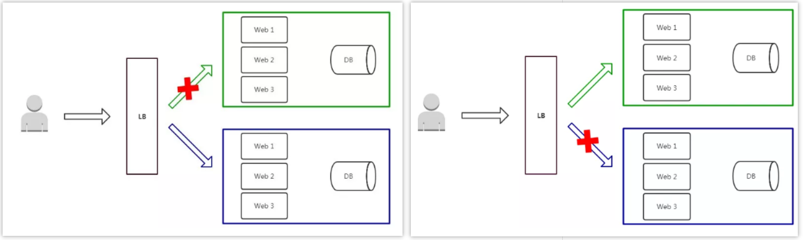

::: tip

业务上线部署，应用程序升级面临最大挑战是新旧业务切换，将软件从测试的最后阶段带到生产环境，同时要保证系统不间断提供服务。长期以来，业务升级渐渐形成了几个发布策略：`蓝绿发布、灰度发布和滚动发布`，目的是尽可能避免因发布导致的流量丢失或服务不可用问题。[参考一](https://www.cnblogs.com/nulige/articles/10929182.html)、[参考二](https://www.jianshu.com/p/5ad1fe9ce448)

:::

<!-- more -->

### 蓝绿发布

Blue/Green Deployment

项目逻辑上分为AB组，在项目系统时，首先把A组从负载均衡中摘除，进行新版本的部署。B组仍然继续提供服务。

当A组升级完毕，负载均衡重新接入A组，再把B组从负载列表中摘除，进行新版本的部署。A组重新提供服务。

最后，B组也升级完成，负载均衡重新接入B组，此时，AB组版本都已经升级完成，并且都对外提供服务。

**特点：**

- 如果出问题，影响范围较大；
- 发布策略简单；
- 用户无感知，平滑过渡；
- 升级/回滚速度快。

**缺点：**

- 需要准备正常业务使用资源的两倍以上服务器，防止升级期间单组无法承载业务突发；
- 短时间内浪费一定资源成本；
- 基础设施无改动，增大升级稳定性。

### 灰度发布 | 金丝雀发布

Canary Deployment

灰度发布只升级部分服务，即让一部分用户继续用老版本，一部分用户开始用新版本，如果用户对新版本没什么意见，那么逐步扩大范围，把所有用户都迁移到新版本上面来。

**特点：**

- 保证整体系统稳定性，在初始灰度的时候就可以发现、调整问题，影响范围可控；
- 新功能逐步评估性能，稳定性和健康状况，如果出问题影响范围很小，相对用户体验也少；
- 用户无感知，平滑过渡。

**缺点：**

- 自动化要求高

**部署过程：**

- 从LB摘掉灰度服务器，升级成功后再加入LB；
- 少量用户流量到新版本；
- 如果灰度服务器测试成功，升级剩余服务器。

金丝雀发布

### 滚动发布

Rolling Update Deployment

金丝雀|灰度发布的优化

- 红色：正在更新的实例
- 蓝色：更新完成并加入集群的实例
- 绿色：正在运行的实例

**特点：**

- 用户无感知，平滑过渡；
- 节约资源。

**特点：**

* 部署时间慢，取决于每阶段更新时间；
* 发布策略较复杂；
* 无法确定OK的环境，不易回滚。

### 