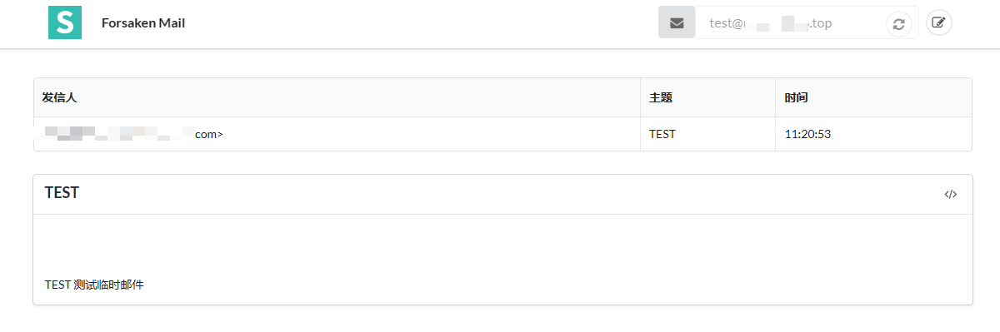

::: tip

如题，临时邮箱，主要用于访问一些网站，查看详细信息需要注册账号，注册自己真实的账号就可能后期被推送一些广告信息，临时邮箱应运而生，临时邮箱用于注册账号，邮箱验证，只能接收不能发送

:::

​	其实在国内来说，作用不是特别大了；
​	现在注册账号基本都要手机号，或者给你了邮箱注册选项，填完后发现还是需要绑定手机号，更有些论坛博客等，想查看完整页面信息，还需要扫码关注公众号，回复XXX后才能观看。虽然理解网站运营也是需要成本的，知识付费也是应该鼓励的，但是吧，隐私这东西.....
​	总归来着，有些还是不需要，所以这个临时邮件还是值得搭建一个

## 项目

* [forsaken-mail](https://github.com/denghongcai/forsaken-mail)
* [二开版本](https://github.com/rev1si0n/another-tmp-mailbox/) (为什么看这个，因为第一个弄了很久没弄好....)

## 成功运行前提

* 安装服务器能放行25端口
* 有个自己的域名（总不能安装好后都用ip:port访问吧）

## 安装

### 命令行安装

```shell
# 项目克隆后
npm install && npm start
```

### docker安装

```shell
# 项目克隆后执行下面指令，或者直接 docker pull 拉取，中心仓库有该镜像
docker build -t denghongcai/forsaken-mail .
docker run --name forsaken-mail -d -p 25:25 -p 3000:3000 denghongcai/forsaken-mail
```

### K3S安装

```yaml
# forsaken-mail
apiVersion: apps/v1
kind: Deployment
metadata:
  name: forsaken-mail
  namespace: pandora
spec:
  replicas: 1
  selector:
    matchLabels:
      app: forsaken-mail
  template:
    metadata:
      labels:
        app: forsaken-mail
    spec:
      hostNetwork: true   # 不添加这个，端口25没能监听上(就是没加这个，导致一致没生效)
      containers:
        - name: forsaken-mail
	  ## 这个只是找了个能拉取镜像的网络环境拉去了镜像，然后打了tag推送到自己阿里云仓库了
          image: registry.cn-hangzhou.aliyuncs.com/aliyun-docker-rep/tmpmail:20230110  
          ports:
            - containerPort: 3000
            - containerPort: 25
          volumeMounts:
            - name: forsaken-mail-log
              mountPath: /data
      volumes:
        - hostPath:
            path: /data/forsaken-mail
            type: ""
          name: forsaken-mail-log
---

apiVersion: v1
kind: Service
metadata:
  name: forsaken-mail-service
  namespace: pandora
spec:
  selector:
    app: forsaken-mail
  ports:
  - name: web-port
    protocol: TCP
    port: 80
    targetPort: 3000
  - name: smtp-port
    protocol: TCP
    port: 25
    targetPort: 25
---
apiVersion: traefik.containo.us/v1alpha1
kind: IngressRoute
metadata:
  name: forsaken-mail-ingress-https-route
  namespace: pandora
spec:
  entryPoints:
    - websecure   ## 使用https方式
  routes:
    - match: Host(`mail.example.com`) && PathPrefix(`/`)
      kind: Rule
      services:
        - name: forsaken-mail-service
          port: 80
  tls:
    secretName: xx-xx-tls   ## https 配置证书

---
apiVersion: traefik.containo.us/v1alpha1
kind: IngressRoute
metadata:
  name: forsaken-mail-ingress-http-route
  namespace: pandora
spec:
  entryPoints:
    - web
  routes:
    - match: Host(`mail.example.com`) && PathPrefix(`/`)
      kind: Rule
      services:
        - name: forsaken-mail-service
          port: 80
      # 自动http转https
      middlewares:
        - name: redirect-https
```

## 运行检查

#### 运行

部署完程后，ip:3000 或 自己的域名即可访问页面

#### 检查

查看25端口是否正常监听

```shell
netstat -tulpn | grep 25

tcp        0      0 0.0.0.0:25              0.0.0.0:*               LISTEN      554139/node  
```

### 域名解析配置

| 主机记录 | 记录类型 | 记录值           | TTL    | 备注                                                        |
| -------- | -------- | ---------------- | ------ | ----------------------------------------------------------- |
| @        | MX       | mail.example.com | 10分钟 | 为访问的web页面域名，我这里是二级域名，自己是一级就一级即可 |
| @        | A        | 123.123.123.123  | 10分钟 | 自己域名对应的IP，也就是服务器IP                            |

#### 在线检查SMTP是否生效

[在线检查SMTP是否生效](http://mxtoolbox.com/diagnostic.aspx)，显示为下面结果即OK了

|        | Test                        | Result                                       |
| ------ | --------------------------- | -------------------------------------------- |
| [ x ]  | SMTP Reverse DNS Resolution | Reverse DNS Resolution - No PTR Record found |
| [ x ]  | SMTP Open Relay             | May be an open relay.                        |
| [ √ ] | SMTP TLS                    | OK - Supports TLS.                           |
| [ √ ] | SMTP Connection Time        | 0.799 seconds - Good on Connection time      |
| [ √ ] | SMTP Transaction Time       | 2.040 seconds - Good on Transaction Time     |

Session Transcript:

```
Connecting to 121.43.227.5

220 iZbp10kr3w2ijuyctukq43Z ESMTP Mailin Smtp Server [562 ms]
EHLO keeper-us-east-1d.mxtoolbox.com
250-iZbp10kr3w2ijuyctukq43Z Nice to meet you, keeper-us-east-1d.mxtoolbox.com
250-PIPELINING
250-8BITMIME
250-SMTPUTF8
250 STARTTLS [343 ms]
MAIL FROM:<supertool@mxtoolboxsmtpdiag.com>
250 Accepted [341 ms]
RCPT TO:<test@mxtoolboxsmtpdiag.com>
250 Accepted [348 ms]

LookupServer 2815ms
```

最后试着发一封邮件给生成的临时邮箱，能正常收到即OK

小TIP：右上角编辑按钮能手动设置临时邮箱前缀，避免自动生成的太复杂，



